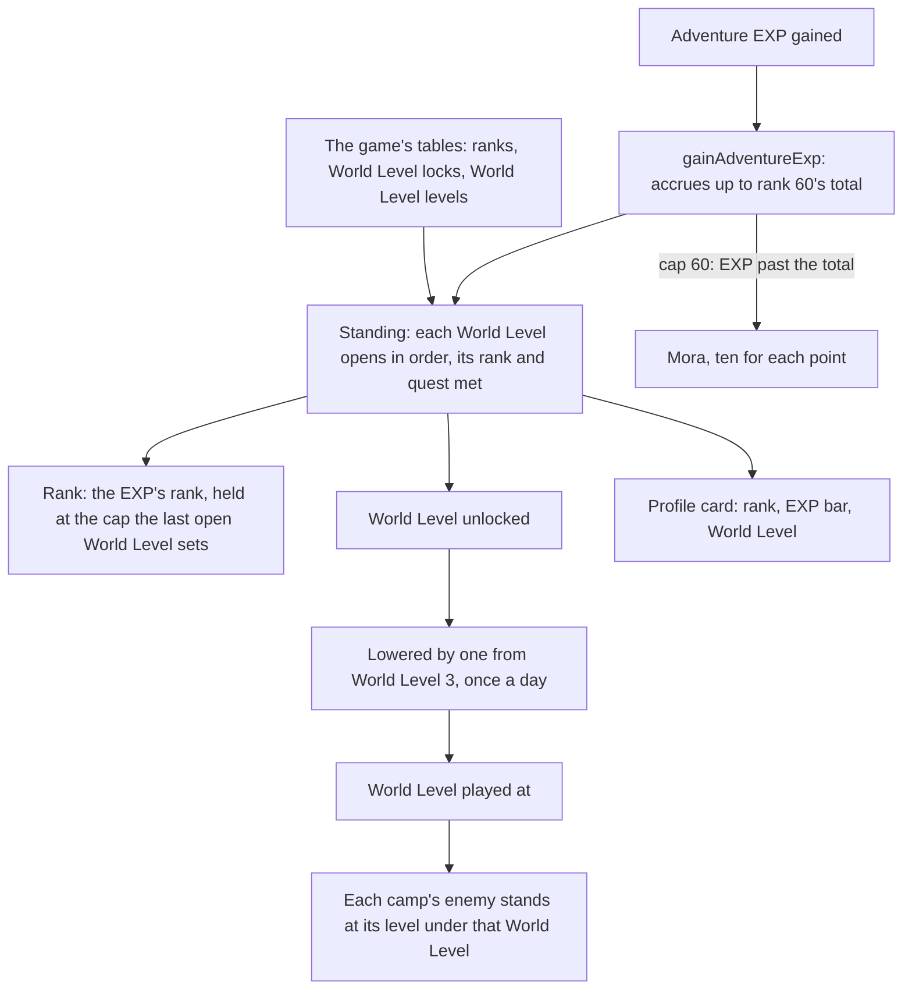

# Adventure Rank

The player's rank on the game's table, the World Level that follows it, and the enemies raised by that World Level. Adventure EXP accrues toward rank 60's total even while an ascension quest holds the rank lower, the rank catches up the moment that quest is done, and EXP past rank 60 is paid in Mora. The rank, its EXP and the World Level are pure services in `genshin-world` over the game's tables, which `genshin:assets rank` publishes from the dump to the [hosted game data](/docs/genshin/hosted-game-data). The world reads them as it opens (`readAdventureRankTables`), and each rule takes them as an argument. The session holds the EXP live from the save: a statue's first unlock adds its transport point's Adventure EXP, and the other sources add theirs as their pages land. Until a main quest is completed, the World Level stays at 0.

## How it works

## The rank and its holds

A rank is reached at the Adventure EXP of every rank below it: rank 1 at none, rank 2 at 375, rank 25 at 46,400 and rank 60 at 1,880,200 (`computeAdventureExpAtRank`). The World Levels open in order, each needing the rank the one before it capped and, where the lock table names one, its main quest done. An open World Level's cap is the rank the player may reach:

| World Level | Opens at | Needs                       | Rank capped at |
| :---------- | :------- | :-------------------------- | :------------- |
| 0           | rank 1   | none                        | 20             |
| 1           | rank 20  | none                        | 25             |
| 2           | rank 25  | Ascension quest 1           | 30             |
| 3           | rank 30  | none                        | 35             |
| 4           | rank 35  | Ascension quest 2           | 40             |
| 5           | rank 40  | none                        | 45             |
| 6           | rank 45  | Ascension quest 3           | 50             |
| 7           | rank 50  | Ascension quest 4           | 55             |
| 8           | rank 55  | none                        | 60             |
| 9           | rank 58  | World Level Ascension quest | 60             |

The rank is the EXP's own, held at the cap of the last World Level open. So a player whose quest is not done stays at 25, 35, 45 or 50, and their EXP keeps accruing toward rank 60's total; once the quest is done the rank rises to whatever the EXP reaches under the new cap (`computeAdventureRankStanding`).

## EXP past the total and past rank 60

`gainAdventureExp` adds EXP up to rank 60's total, 1,880,200. Where the cap is below 60, EXP past that total is not gained, as the game does while a quest holds the rank. Once the cap is 60, EXP past the total is paid in Mora at ten for each point, the wiki's 1:10 ratio, returned as `moraPaid` for the wallet to take.

## Lowering the World Level

From World Level 3 the player may lower it by one, and restore it by one (`toggleWorldLevelLowering`). Either change waits 24 hours after the last, so a lowering cannot be undone at once and a restore cannot be lowered again at once. The World Level played at is the unlocked one less that single step (`computeWorldLevel`).

The game has no tooltip on the World Level: the info icon beside it on the profile card opens the World Level dialog on a click (`Menu/WorldLevelDialog`), over the menu dimmed behind it. The dialog shows the game's own help text for the World Level by its text id, its headings and numbers in the colours its tags give them (`splitGameTextColors`), opened at its end where the change is told, and under it the button that lowers the World Level by one, or restores it once lowered, through `toggleWorldLevel`. The button is drawn only while the World Level can be changed at all, and waits while the last change's cooldown runs (`computeWorldLevelCooldown`), read against the server's clock. The cross closes the dialog back to the menu, focus returning to the icon. How it is measured against the game is the [screens](/docs/genshin/screens) page's.

## Enemies at a World Level

A camp's enemy stands at its camp level under World Level 0. From World Level 1 it stands at that World Level's monster level, which `WorldLevelExcelConfigData` gives from 26 at World Level 1 to 100 at World Level 9, plus its camp level less `SPAWN_LEVEL_REFERENCE` (`computeSpawnLevel`). A camp at level 1 therefore stands at 9 at World Level 1. The reference is provisional: the wiki's enemy level ranges put each World Level's lowest enemy 14 to 17 under its monster level, which a camp at level 1 or 2 gives, and the enemies' name plates at World Levels 1, 5 and 9 measure it on the Recordings owed list. Changing the World Level clears the camps and spawns them anew, so every enemy stands at the level the new World Level sets.

## Notes

- Only enemies are raised so far. Bosses, ley line outcrops and the World Level's rewards wait on their own pages.
- `useWorldAdventureRank` holds the player's Adventure EXP live, started from the save and read back through the save sync, so a gain moves the rank, the World Level and the bar at once. A gain past rank 60 is paid in Mora. The Paimon menu's profile card shows the rank, the World Level and the EXP's bar toward the next rank, read from that standing; the bar fills from the EXP, full at rank 60 and at a rank held by a quest. The World Level dialog's button lowers it by one from World Level 3 or restores it, through `toggleWorldLevel`; the adjustment is the save's `worldLevelAdjustment` slice, so the 24 hour wait survives a reload.
- The rank's rewards are not read yet. Katheryne, who hands them out, is not yet placed in Mondstadt's region data.

## Decisions

- **The dialog's title is `UI_WORLDLEVEL_TITLE`,** the World Level's own interface title, the word the card's row already shows. Several text ids read "World Level" exactly, and nothing on screen tells them apart.
- **The help text opens at its end.** Both public recordings show the dialog at its last lines, the scroll thumb at the track's foot, from the first frame it is open, so the body is laid out from its end as a column in reverse, which a later change of font or language keeps at the end too.
- **The button changes the World Level at once.** The game first opens a Change World Level prompt over the dialog, showing the World Level now and lowered, what the change does and, during a cooldown, the time left; the 2024 recording shows it from about 8.5 seconds. That prompt is not built (the roadmap's World), so the button toggles the `worldLevelAdjustment` slice itself, and is held while the cooldown runs rather than opening a prompt to say so.
- **The dialog stays open after a change,** its button turned to Revert World Level and held through the cooldown. Neither recording shows whether the game closes it.
- **The restoring button's arrow is the lowering's turned over,** provisionally, since no recording shows the restoring button.
- **The card's values stand right-aligned beside the info disc,** 17 units left of it at a cap height of 19, as the current client draws them. The menu's reference still is the 1.3 build's, its values redacted, so the move costs its score a few hundredths of a percent.

## Key files

| File                                                                                | Its role                                                             |
| :---------------------------------------------------------------------------------- | :------------------------------------------------------------------- |
| `scripts/src/services/genshinAssets/adventureRank/buildAdventureRankTables.ts`      | builds the rank, lock and World Level records from the dump          |
| `packages/genshin-world/src/services/adventureRank/readAdventureRankTables.ts`      | the rank, lock and World Level tables, read as the world opens       |
| `packages/genshin-world/src/models/adventureRank/AdventureRankTables.ts`            | each rank's EXP, each World Level's lock and its monster level       |
| `packages/genshin-world/src/services/adventureRank/constants.ts`                    | the constants the rules read                                         |
| `packages/genshin-world/src/composables/useWorldAdventureRank.ts`                   | the live EXP, its standing and the gain a source adds                |
| `packages/genshin-world/src/services/adventureRank/computeAdventureRankStanding.ts` | the rank, its cap and the World Level from EXP and quests            |
| `packages/genshin-world/src/services/adventureRank/gainAdventureExp.ts`             | the EXP gain, its cap and the Mora past rank 60                      |
| `packages/genshin-world/src/services/adventureRank/toggleWorldLevelLowering.ts`     | the lowering and its 24 hour cooldown                                |
| `packages/genshin-world/src/services/adventureRank/computeAdventureRankProgress.ts` | the EXP's share of the bar toward the next rank                      |
| `packages/genshin-world/src/services/adventureRank/computeSpawnLevel.ts`            | a camp's enemy level at a World Level                                |
| `packages/genshin-world/src/services/adventureRank/computeWorldLevelCooldown.ts`    | the time left before the World Level can be changed again            |
| `packages/genshin-world/src/components/Menu/WorldLevelDialog/Index.vue`             | the World Level dialog: the game's help text and the lowering button |
| `packages/genshin-world/src/components/Menu/Paimon/Index.vue`                       | the profile card's rank, EXP bar, World Level and its info icon      |
| `packages/genshin-world/src/composables/useWorldAdventureRank.ts`                   | the session's live EXP, the World Level it plays at and its toggle   |
| `packages/genshin-world/src/services/enemy/createEnemy.ts`                          | spawns an enemy at its World Level's level                           |
| `packages/genshin-world/src/components/World/Enemies/Index.vue`                     | spawns the camps, and respawns them when the World Level changes     |
| `packages/genshin-world/src/components/World/Session/Index.vue`                     | the World Level the world plays at, handed down to its enemies       |

## Sources

- [Adventure Rank](https://genshin-impact.fandom.com/wiki/Adventure_Rank), Genshin Impact Wiki: the World Level and Ascension table (each World Level's rank range and its enemy level range), the holds at 25, 35, 45 and 50 with EXP accruing toward rank 60's total, the 1:10 Mora conversion past rank 60, and lowering the World Level from World Level 3 once in 24 hours.
- [AnimeGameData](https://github.com/DimbreathBot/AnimeGameData), the community's per-patch dump: `PlayerLevelExcelConfigData`, `PlayerLevelLockExcelConfigData` and `WorldLevelExcelConfigData`, the tables the rank is read from. The dump at its revision lacked the three; they were taken from the same repository's files, which matched the dump's own tables byte for byte.
- World Level tutorials recorded on the English PC client, [2024](https://www.youtube.com/watch?v=P13s7kSmVOE) and [2025](https://www.youtube.com/watch?v=ZGsragloQxU): the dialog the info icon opens on a click, open at the end of its help text, and the Change World Level prompt its button opens.
