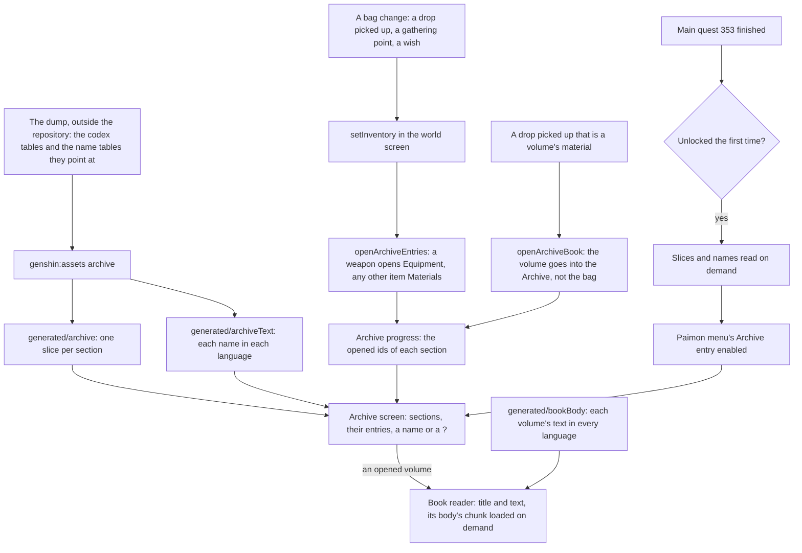

# Archive

The Archive is the game's record of what a player has met. It is seven sections, each one a codex table of the game: Equipment, Living Beings, Tutorials, Geography, Travel Log, Books and Materials. An entry is locked until its thing is first met, so the Archive is the player's journey written down. The world reads the codex tables into its own slices, opens an entry when a bag's item is first held, and lists every section on its screen with the names of what is open and a "?" for what is not.

## How it works

## The sections

The `genshin:assets archive` writer reads each section's codex table from the dump, names each entry by the game's English text, and keeps only the entries whose name the English text holds. Each section is written compact as its own slice, and the names of every kept entry go into the world's own chunk per language, as the [achievements](/docs/genshin/achievements) do.

| Section       | Codex table                                                               | Named by                                                               | Opened by                                                                                               |
| :------------ | :------------------------------------------------------------------------ | :--------------------------------------------------------------------- | :------------------------------------------------------------------------------------------------------ |
| Equipment     | `WeaponCodexExcelConfigData`, then `ReliquaryCodexExcelConfigData` by set | the weapon's row; a set's equip affix                                  | a weapon, when it is in the bag                                                                         |
| Living Beings | `AnimalCodexExcelConfigData`, animal and monster rows                     | `AnimalDescribeExcelConfigData`, then `MonsterDescribeExcelConfigData` | a monster's first defeat opens its entry and counts its kills; an animal waits on the wildlife's strike |
| Tutorials     | `PushTipsCodexExcelConfigData`, tutorial rows                             | `PushTipsConfigData`'s title                                           | not yet: no tip is shown                                                                                |
| Geography     | `ViewCodexExcelConfigData`                                                | the view's own row                                                     | not yet: no viewpoint is taken in                                                                       |
| Travel Log    | `QuestCodexExcelConfigData`                                               | the parent main quest's title                                          | a main quest's finish opens its entry, by the quest id each entry names                                 |
| Books         | `BooksCodexExcelConfigData`, joined to `DocumentExcelConfigData`          | the book's material                                                    | a volume picked up, which goes into the Archive and not the bag; a read volume opens in the reader      |
| Materials     | `MaterialCodexExcelConfigData`                                            | the material's row                                                     | any bag item that is not equipment, by its item id                                                      |

The codex's own order is kept: each section's entries are sorted by the table's sort order, and the Equipment section lists its weapons before its sets. A codex row the game has left out is not kept.

## Opening entries

`openArchiveEntries` takes the progress and the bag's items and returns the progress with every item's entry opened. A weapon opens its Equipment entry by its id, a material opens its Materials entry by the same id, and an artifact opens none (see Notes). An entry already open stays open, and the progress given is not changed. The world screen's `setInventory` is the one way the bag changes, so a drop picked up, a gathering point taken and a wish's weapon all open their entries through it.

A defeated enemy opens its Living Beings entry and counts one more kill under it (`openArchiveEntry`, `countArchiveDefeat`). Each enemy kind carries its codex entry's id as `archiveEntryId`, so the count is kept by the entry, and the Living Beings entry shows it as "×N" once open.

## Books

A volume's entry is its codex row, and its body is the readable text its document names. `BooksCodexExcelConfigData` joins to the material's name, to `DocumentExcelConfigData`'s quest text id for the body, and to `LocalizationExcelConfigData`'s readable file for each language; `toBookCandidates` keeps a row only when all of them resolve. `genshin:assets archive` writes two things: the Books slice, each volume with its `materialId` and `bodyId`, and one chunk per body under `generated/bookBody` holding its text in all fifteen languages, with `services/archive/BookBodyLoaderMap.ts` importing a chunk on demand. Only the chunk of the volume open is downloaded.

The wiki's rule is that a collected volume goes straight into the Archive rather than the bag, so `pickUpWorldDrop` opens the volume's entry through `openArchiveBook` and drops the item. The volume's entry is opened by its id, and the reader opens from the Books tab: the title and the body in the reader's language, on one page, through the `GameScreen` pattern of `components/Archive/BookReader`.

## The unlock

The Archive opens once its quest is done, the Archon Quest Unexpected Power, main quest 353 in the dump. The Paimon menu's Archive entry is enabled only once that quest's completion is known to the world, so its slices and names are read the first time it unlocks, not with the world. A main quest finished on the [quests](/docs/genshin/quests) page is what would complete it, but the world carries only quests 351 and 352, so the Archive stays locked until quest 353 is carried.

## The screen

`components/Archive/Screen` lists the seven sections down the left, each with how many of its entries are open over how many it has, and the selected section's entries on the right in the codex's order. Q and E step between the sections as the quest and achievement tabs do. An entry reads its name once open, and a "?" until then. The section titles are the game's own, its manual text ids for each codex tab.

## Notes

- **A monster is named by its description.** A monster row's own name hash resolves to no text in any language; its name sits under the monster description table, which the dump lacks and which is fetched from AnimeGameData beside the others.
- **Only the world's enemies are counted.** A monster the world places opens and counts its entry. The living beings of the wildlife are not struck yet, so their entries stay locked.
- **An artifact set never opens yet.** A bag artifact carries no set id, so "every piece held" cannot be counted, and the Equipment section lists the sets as locked for good until the bag keeps the set with each artifact.
- **A tutorial is named by its push tip's title.** The push tips codex joins the push tips table, which the dump lacks and which is fetched from AnimeGameData; only the tutorial kind is written, not the monsters' tips.
- **Entries show a name only.** Descriptions and the pictures of viewpoints wait for their own pages, since they are not part of the names chunk.
- **A book's body is not a text map entry.** The readable text lives in AnimeGameData's `Readable/` folder, one file a volume a language, named by the localization table; the dump keeps the readable folder beside its tables, fetched and never committed. Its volumes are the codex rows that resolve to a body in all fifteen languages, 285 of them.
- **A volume picked up before the Archive opens is not kept yet.** The books' index is read with the Archive's slices, once the unlock fires. No world drop is a volume's material yet, so nothing is lost today; a book drop needs the index loaded with the world.
- **The reader's layout is provisional.** No recording or wiki screenshot of the English client's book reader was found on the wiki's Book page or the Archive page, so the reader takes the Handbook's book proportions until the `book-reader.mkv` recording the roadmap owes is measured from.
- **The unlock quest is the wiki's.** The Archive waits on Unexpected Power as the Archive's wiki page describes, and the dump's main quest table names that quest under id 353.

## Parity

The Archive screen has no parity measure yet. Its places follow the achievements' grid rather than the English client's, and its look waits on the `archive-screen.mkv` recording the roadmap still owes.

## Key files

| File                                                                      | Role                                                                             |
| :------------------------------------------------------------------------ | :------------------------------------------------------------------------------- |
| `packages/genshin-world/src/models/archive/ArchiveSection.ts`             | The seven sections, each the game's own codex table                              |
| `packages/genshin-world/src/models/archive/ArchiveEntry.ts`               | One entry with its table id and its name's text id, with its schema              |
| `packages/genshin-world/src/models/archive/ArchiveProgress.ts`            | The opened ids of each section                                                   |
| `packages/genshin-world/src/services/archive/openArchiveEntries.ts`       | Opens the entries of a bag's items                                               |
| `packages/genshin-world/src/services/archive/readArchiveEntries.ts`       | The slices of every section, imported on demand and checked                      |
| `packages/genshin-world/src/services/archive/ArchiveTextLoaderMap.ts`     | The names in each language, imported on demand                                   |
| `packages/genshin-world/src/services/archive/constants.ts`                | The main quest the Archive opens after                                           |
| `packages/genshin-world/src/components/Archive/Screen/Index.vue`          | The Archive screen the Paimon menu opens                                         |
| `packages/genshin-world/src/components/World/Screen/Index.vue`            | `setInventory`, the unlock and the names' load, and the screen's slot            |
| `scripts/src/services/genshinAssets/archive/writeArchive.ts`              | The writer: each section's entries into its slice                                |
| `scripts/src/services/genshinAssets/archive/toArchiveEntries.ts`          | A candidate kept only when its name is in the English text, in the codex's order |
| `scripts/src/services/genshinAssets/archive/readLivingBeingCandidates.ts` | The animal rows and their names                                                  |
| `scripts/src/services/genshinAssets/archive/writeArchiveText.ts`          | Every entry's name in every language                                             |
| `scripts/src/services/genshinText/writeTextChunks.ts`                     | The one writer of a per-language chunk, shared with the achievements' text       |
| `scripts/src/services/genshinAssets/archive/readTutorialCandidates.ts`    | The tutorial push tips, each named by its title                                  |
| `packages/genshin-world/src/models/archive/ArchiveKills.ts`               | The defeats of each Living Being, by its entry's id                              |
| `packages/genshin-world/src/services/archive/countArchiveDefeat.ts`       | One more defeat counted under a Living Being's entry                             |
| `packages/genshin-world/src/services/archive/openArchiveEntry.ts`         | One entry of a section opened, idempotently                                      |
| `packages/genshin-world/src/services/archive/openArchiveBook.ts`          | A picked up volume's material opens its Books entry                              |
| `packages/genshin-world/src/services/archive/BookBodyLoaderMap.ts`        | Each volume's body chunk, imported on demand                                     |
| `packages/genshin-world/src/components/Archive/BookReader/Index.vue`      | The reader: a volume's title and its text on one page                            |
| `scripts/src/services/genshinAssets/archive/toBookCandidates.ts`          | The codex rows joined to their material's name and their document's body         |
| `scripts/src/services/genshinAssets/archive/writeBookBodies.ts`           | Each volume's body in every language, one chunk a body and the loader map        |

## Sources

- [Archive](https://genshin-impact.fandom.com/wiki/Archive), Genshin Impact Wiki: the Archive's unlock after Unexpected Power, its sections, and entries opened when first obtained or defeated.
- [AnimeGameData](https://github.com/DimbreathBot/AnimeGameData), the community's per-patch dump: the weapon, reliquary, animal, animal describe, books, material, view, quest and push tip codex tables, and the weapon, material, equip affix, reliquary set and main quest tables their names come from; the monster describe and push tips tables, which the dump lacks and which are fetched beside it; and the document and localization tables and the `Readable/` folder, which the books' bodies are read from and which are fetched beside it.
