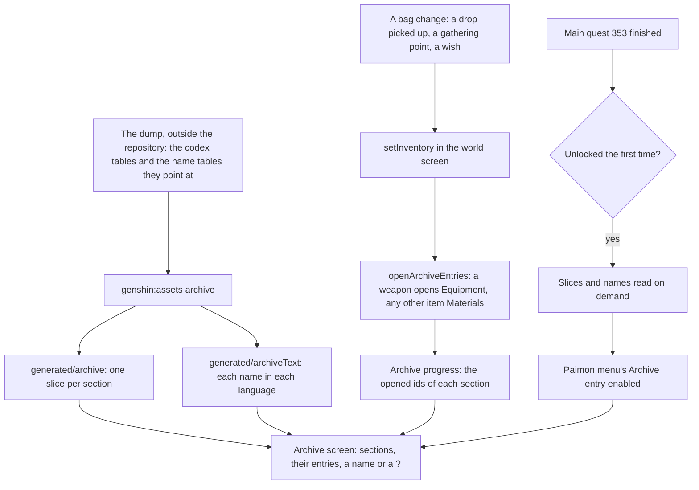

# Archive

The Archive is the game's record of what a player has met. It is seven sections, each one a codex table of the game: Equipment, Living Beings, Tutorials, Geography, Travel Log, Books and Materials. An entry is locked until its thing is first met, so the Archive is the player's journey written down. The world reads the codex tables into its own slices, opens an entry when a bag's item is first held, and lists every section on its screen with the names of what is open and a "?" for what is not.

## How it works

## The sections

The `genshin:assets archive` writer reads each section's codex table from the dump, names each entry by the game's English text, and keeps only the entries whose name the English text holds. Each section is written compact as its own slice, and the names of every kept entry go into the world's own chunk per language, as the [achievements](/docs/genshin/achievements) do.

| Section       | Codex table                                                               | Named by                                  | Opened by                                          |
| :------------ | :------------------------------------------------------------------------ | :---------------------------------------- | :------------------------------------------------- |
| Equipment     | `WeaponCodexExcelConfigData`, then `ReliquaryCodexExcelConfigData` by set | the weapon's row; a set's equip affix     | a weapon, when it is in the bag                    |
| Living Beings | `AnimalCodexExcelConfigData`, animal rows only                            | `AnimalDescribeExcelConfigData`           | not yet: no animal is struck (see Notes)           |
| Tutorials     | "PushTipsCodexExcelConfigData"                                            | nothing in the dump, so it holds no entry | not built                                          |
| Geography     | `ViewCodexExcelConfigData`                                                | the view's own row                        | not yet: no viewpoint is taken in                  |
| Travel Log    | `QuestCodexExcelConfigData`                                               | the parent main quest's title             | not yet: no quest finish is counted into it        |
| Books         | `BooksCodexExcelConfigData`                                               | the book's material                       | not yet: no book is read                           |
| Materials     | `MaterialCodexExcelConfigData`                                            | the material's row                        | any bag item that is not equipment, by its item id |

The codex's own order is kept: each section's entries are sorted by the table's sort order, and the Equipment section lists its weapons before its sets. A codex row the game has left out is not kept.

## Opening entries

`openArchiveEntries` takes the progress and the bag's items and returns the progress with every item's entry opened. A weapon opens its Equipment entry by its id, a material opens its Materials entry by the same id, and an artifact opens none (see Notes). An entry already open stays open, and the progress given is not changed. The world screen's `setInventory` is the one way the bag changes, so a drop picked up, a gathering point taken and a wish's weapon all open their entries through it.

## The unlock

The Archive opens once its quest is done, the Archon Quest Unexpected Power, main quest 353 in the dump. The Paimon menu's Archive entry is enabled only once that quest's completion is known to the world, so its slices and names are read the first time it unlocks, not with the world. Nothing completes a main quest yet, so the entry stays disabled until the quest page feeds the world its completions.

## The screen

`components/Archive/Screen` lists the seven sections down the left, each with how many of its entries are open over how many it has, and the selected section's entries on the right in the codex's order. Q and E step between the sections as the quest and achievement tabs do. An entry reads its name once open, and a "?" until then. The section titles are the game's own, its manual text ids for each codex tab.

## Notes

- **The monsters have no name in the dump.** Each monster row's name hash resolves to no text in any language, so the Living Beings section lists the animals only, and a defeated monster has no entry to count. A monster's name needs another source before its entries and its kill counts can be built.
- **An artifact set never opens yet.** A bag artifact carries no set id, so "every piece held" cannot be counted, and the Equipment section lists the sets as locked for good until the bag keeps the set with each artifact.
- **Tutorials hold no entries.** The push tips carry no name in the dump, so the section is written empty and the screen shows none.
- **Entries show a name only.** Descriptions and the pictures of viewpoints wait for their own pages, since they are not part of the names chunk.
- **The unlock quest is the wiki's.** The Archive waits on Unexpected Power as the Archive's wiki page describes, and the dump's main quest table names that quest under id 353.

## Parity

The Archive screen has no parity measure yet. Its places follow the achievements' grid rather than the English client's, and its look waits on the `archive-screen.mkv` recording the roadmap still owes.

## Key files

| File                                                                      | Role                                                                             |
| :------------------------------------------------------------------------ | :------------------------------------------------------------------------------- |
| `packages/genshin-world/src/models/archive/ArchiveSection.ts`             | The seven sections, each the game's own codex table                              |
| `packages/genshin-world/src/models/archive/ArchiveEntry.ts`               | One entry with its table id and its name's text id, with its schema              |
| `packages/genshin-world/src/models/archive/ArchiveProgress.ts`            | The opened ids of each section                                                   |
| `packages/genshin-world/src/services/archive/openArchiveEntries.ts`       | Opens the entries of a bag's items                                               |
| `packages/genshin-world/src/services/archive/readArchiveEntries.ts`       | The slices of every section, imported on demand and checked                      |
| `packages/genshin-world/src/services/archive/ArchiveTextLoaderMap.ts`     | The names in each language, imported on demand                                   |
| `packages/genshin-world/src/services/archive/constants.ts`                | The main quest the Archive opens after                                           |
| `packages/genshin-world/src/components/Archive/Screen/Index.vue`          | The Archive screen the Paimon menu opens                                         |
| `packages/genshin-world/src/components/World/Screen/Index.vue`            | `setInventory`, the unlock and the names' load, and the screen's slot            |
| `scripts/src/services/genshinAssets/archive/writeArchive.ts`              | The writer: each section's entries into its slice                                |
| `scripts/src/services/genshinAssets/archive/toArchiveEntries.ts`          | A candidate kept only when its name is in the English text, in the codex's order |
| `scripts/src/services/genshinAssets/archive/readLivingBeingCandidates.ts` | The animal rows and their names                                                  |
| `scripts/src/services/genshinAssets/archive/writeArchiveText.ts`          | Every entry's name in every language                                             |
| `scripts/src/services/genshinText/writeTextChunks.ts`                     | The one writer of a per-language chunk, shared with the achievements' text       |

## Sources

- [Archive](https://genshin-impact.fandom.com/wiki/Archive), Genshin Impact Wiki: the Archive's unlock after Unexpected Power, its sections, and entries opened when first obtained or defeated.
- [AnimeGameData](https://github.com/DimbreathBot/AnimeGameData), the community's per-patch dump: the weapon, reliquary, animal, animal describe, books, material, view, quest and push tip codex tables, and the weapon, material, equip affix, reliquary set and main quest tables their names come from.
