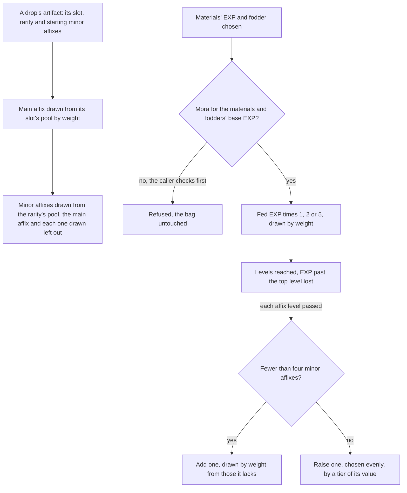

# Artifact enhancement

An artifact's attributes were already summed by [character attributes](/docs/genshin/character-attributes): its main affix at its rarity and level, its minor affixes and its set's unconditional bonuses. This page is how an artifact comes to have them. A drop is rolled by the game's pools, an enhancement feeds it EXP and Mora, and a lock keeps a piece from being fed away. The four-piece bonuses that wait on combat are not here yet: each is a module as its set is carried, over the [character kits](/docs/proposals/genshin/character-kits).

## How it works

## The rules

- **A new artifact's main affix is drawn from its slot's pool.** The table gives each slot the attributes it may be, the circlet's flat ATK and HP among them, and the wiki's weights decide which of them roll: an attribute with no weight is never drawn. A Plume of Death is always flat ATK, and a Sands of Eon is one of its five percentages.
- **Its minor affixes are drawn from the rarity's pool.** Each draw takes an attribute the artifact does not hold yet and is not its main affix, by weight, so a Plume may roll ATK% but never flat ATK. A minor affix's value is one of its tiers, every tier as likely as the next.
- **A drop's starting minor affixes come from the drop.** The game's reliquary table gives each piece a variant for each starting count, and the drop that gives the piece chooses the variant. This page takes the count as its input and does not choose it.
- **Enhancing costs a Mora a point, and the fodder's share costs none.** The Mora is the materials' EXP and each fodder's base EXP. A fodder gives its rarity's base EXP and 80% of what it was levelled with, rounded down, and that recovered share is free. `getEnhancementMoraCost` gives the Mora and the caller refuses the enhancement when the wallet holds less, leaving the bag as it was.
- **The EXP is multiplied by a bonus drawn on each enhancement.** One time in a hundred it is multiplied by five, nine times in a hundred by two, and otherwise it stands. The draw comes from the world's seeded random source.
- **Levels follow the table's costs, and EXP past the top is lost.** A level's cost is the table's EXP for it, the artifact levels as far as its total EXP reaches, and EXP beyond its highest level is wasted.
- **Every fourth level adds or raises a minor affix.** At each affix level it passes, an artifact holding fewer than four minor affixes gains one from the rarity's pool, by weight from those it lacks. One holding four raises one of them, chosen evenly, by a tier of its value.
- **A locked artifact is never fodder.** A fodder's lock is refused by `getFodderEnhancement`, and an artifact worn by a character is not a bag entry, so the bag's fodder list never holds one.

## Where the tables come from

`pnpm -C scripts genshin:assets stats` writes three of the tables this page reads from the dump the [game text](/docs/genshin/game-text) is read from, each checked against the world's schema as it is written:

- `artifactRarities.json`: per rarity, its highest level (the reliquary table's highest row less one), its base EXP as fodder, each level's cost from `ReliquaryLevelExcelConfigData`, the levels a minor affix is due at, and the minor affix groups of its standard minor affix depot from `ReliquaryAffixExcelConfigData`, each group's tiers sorted lowest first.
- `artifactMainAffixPools.json`: per slot, the attributes of its standard main affix depot in `ReliquaryMainPropExcelConfigData`.
- `artifactExpMaterials.json`: each item whose use adds artifact EXP, with the EXP one adds, from `MaterialExcelConfigData`.

The weights are not in the tables. They are the [wiki's](https://genshin-impact.fandom.com/wiki/Artifact/Distribution) distribution, kept as constants beside the functions that draw by them, marked provisional where the source could not be checked.

## Key files

| File                                                                     | Role                                                              |
| :----------------------------------------------------------------------- | :---------------------------------------------------------------- |
| `packages/genshin-world/src/models/artifact/Artifact.ts`                 | Gains its EXP and its lock                                        |
| `packages/genshin-world/src/models/artifact/ArtifactRarityData.ts`       | A rarity's levels, costs, fodder base, affix levels and groups    |
| `packages/genshin-world/src/models/artifact/ArtifactMainAffixPool.ts`    | A slot's main affix pool                                          |
| `packages/genshin-world/src/models/artifact/ArtifactExpMaterial.ts`      | An item's EXP                                                     |
| `packages/genshin-world/src/services/artifact/constants.ts`              | The recovery rate, the EXP bonus and the provisional weights      |
| `packages/genshin-world/src/services/artifact/rollArtifact.ts`           | A drop's artifact: main affix and minor affixes                   |
| `packages/genshin-world/src/services/artifact/enhanceArtifact.ts`        | Feeding EXP, the bonus, levels and the affix levels passed        |
| `packages/genshin-world/src/services/artifact/enhanceMinorAffixes.ts`    | The minor affix added or raised at an affix level                 |
| `packages/genshin-world/src/services/artifact/getFodderEnhancement.ts`   | A fodder's EXP and Mora, refusing a locked artifact               |
| `packages/genshin-world/src/services/artifact/getEnhancementMoraCost.ts` | The Mora an enhancement costs                                     |
| `packages/genshin-world/src/services/shared/drawWeightedValue.ts`        | One draw in proportion to weights, from a seeded random source    |
| `scripts/src/services/genshinAssets/stats/getArtifactRarityDatas.ts`     | Writes the rarity tables from the reliquary, level and affix rows |
| `scripts/src/services/genshinAssets/stats/getArtifactMainAffixPools.ts`  | Writes the main affix pools                                       |
| `scripts/src/services/genshinAssets/stats/getArtifactExpMaterials.ts`    | Writes the EXP items                                              |

## Notes

- **The weights are provisional.** The Goblet's main weights are the wiki's 3.0 table as a search summary quoted it. The Sands', Circlet's and minor affixes' weights are recalled from the wiki's distribution and not yet checked against it, since the wiki pages could not be read from this build. Each awaits that check, and none is measured from the game.
- **A drop's starting count is the drop's.** A piece's variant row says how many minor affixes it starts with, and the drop tables that choose a variant are the domains', bosses' and chests' pages.
- **Mora is charged before the bonus.** The Mora counts the EXP the player feeds, so a bonus of five multiplies the EXP the artifact gains by five, not the Mora it costs.

## Sources

- [AnimeGameData](https://github.com/DimbreathBot/AnimeGameData), the community's per-patch dump: `ReliquaryExcelConfigData`, `ReliquaryMainPropExcelConfigData`, `ReliquaryAffixExcelConfigData`, `ReliquaryLevelExcelConfigData` and `MaterialExcelConfigData`, the tables this page reads.
- [Artifact](https://genshin-impact.fandom.com/wiki/Artifact), Genshin Impact Wiki: a main affix and up to four minor affixes, enhancing with Artifact EXP and Mora, and the next tier every fourth level.
- [Artifact: Distribution](https://genshin-impact.fandom.com/wiki/Artifact/Distribution), Genshin Impact Wiki: the weighted main and starting minor affixes, the pool without the main affix and those drawn, and values drawn evenly.
- [Artifact EXP](https://genshin-impact.fandom.com/wiki/Artifact_EXP), Genshin Impact Wiki: a Mora a point, a fodder's base plus 80% of its own, and the bonus of two or five times.
