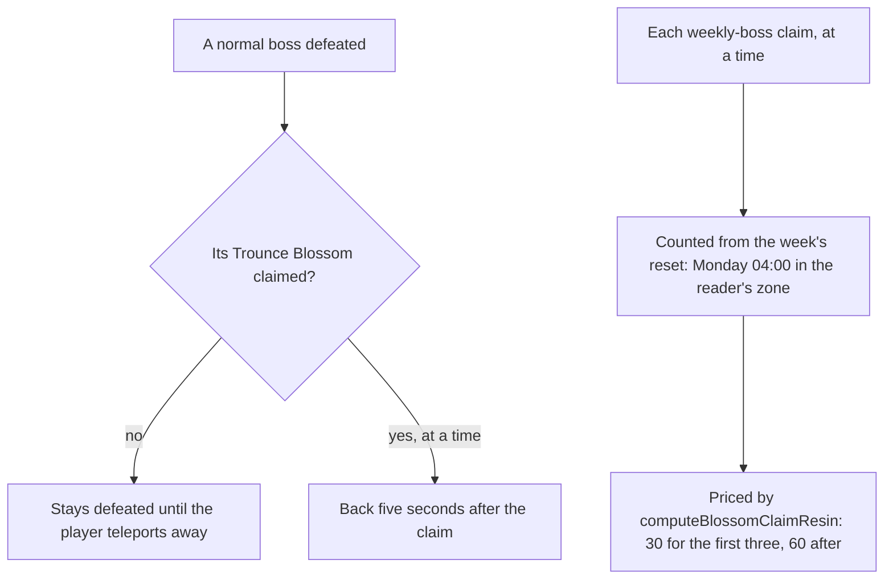

# Bosses

Bosses are the enemies whose reward is claimed rather than dropped, so their rules are a service of their own rather than the enemies' drops. Two rules are built as pure services in `genshin-world`: when a normal boss comes back after its Trounce Blossom's claim, and where a week's weekly-boss claims are counted from. The world does not call them yet, so the [enemies](/docs/genshin/enemies) still bring a boss back at once and the claim's price, built on the [Original Resin](/docs/genshin/original-resin) page, has no claim to price yet. The rules are the [proposal](/docs/proposals/genshin/bosses)'s, read off the wiki.

## How it works

## Decisions

- **An unclaimed boss has no respawn time.** `computeBossRespawnTime` returns undefined for a boss with no claim, since it stays defeated until the player teleports away, which the world will take as the claim's absence.
- **A claimed boss is back five seconds later.** `BOSS_RESPAWN_AFTER_CLAIM_DURATION` is the wiki's figure, and a claim at any time brings the boss back that many seconds after it.
- **The week resets on Monday at the daily reset's hour.** `computeWeeklyResetTime` finds the most recent Monday at 04:00 at or before the moment read, in that moment's own time zone, sharing `DAILY_RESET_TIME` with the enemies' reset so the hour is kept in one place. A moment before that week's reset belongs to the week before.
- **A claim at the reset counts toward the new week.** `countWeeklyBossClaims` counts a claim made at or after the reset and no later than the moment read, so the claim at exactly 04:00 Monday is this week's first and a claim after the moment is not yet counted.
- **One count across every weekly boss.** `countWeeklyBossClaims` counts the claims of all weekly bosses together, since the cheap price is for the first three claims in the week, whichever boss they are for.

## Scope and order

**Built:** the respawn rule after a claim and the weekly reset and count, as pure services with tests.

**Not built yet:**

- **The Trounce Blossom's offer and its claim.** Its F prompt, the claim's resin spent, the boss's respawn on the claim, and the blossom's drawing wait on the enemies' defeat map and the interaction prompts. The world does not yet keep a claim time for a defeated boss.
- **The boss's rewards.** The Adventure EXP, Mora and Companionship EXP, its ascension material and its artifacts by World Level are not read: the dump's blossom tables hold no normal boss's row, so the reward table has to be fetched before the claim can give anything.
- **Each boss's moves**, its phases and shields, and the poise and immunities that come with them.
- **The weekly bosses' domains**, their quests and Andrius in the open world, and the once-a-week gate per boss.
- **The handbook's quick challenge and first-clear rewards.**

## Key files

| File                                                                   | Role                                                                         |
| :--------------------------------------------------------------------- | :--------------------------------------------------------------------------- |
| `packages/genshin-world/src/services/bosses/constants.ts`              | The five-second respawn after a claim, and the weekly reset's weekday        |
| `packages/genshin-world/src/services/bosses/computeBossRespawnTime.ts` | A claimed boss's time back, and none while it is unclaimed                   |
| `packages/genshin-world/src/services/bosses/computeWeeklyResetTime.ts` | The Monday 04:00 reset at or before a moment, in the moment's zone           |
| `packages/genshin-world/src/services/bosses/countWeeklyBossClaims.ts`  | The claims made since the week's reset, the count that prices the next claim |
| `packages/genshin-world/src/services/enemy/computeEnemyRespawnTime.ts` | Still brings a boss back at once until the claim is wired to the defeat map  |

## Sources

- [Normal Bosses](https://genshin-impact.fandom.com/wiki/Normal_Bosses), Genshin Impact Wiki: the Trounce Blossom's claim, and the respawn five seconds after a claim or only on teleporting away.
- [Weekly Bosses](https://genshin-impact.fandom.com/wiki/Weekly_Bosses), Genshin Impact Wiki: the weekly claims and their prices.
- [Domains](https://genshin-impact.fandom.com/wiki/Domains), Genshin Impact Wiki: a weekly reward once a week, 30 resin for the first three and 60 after, refreshed at the weekly reset.
- [Daily Reset](https://genshin-impact.fandom.com/wiki/Daily_Reset), Genshin Impact Wiki: the weekly reset on Monday at 04:00.
