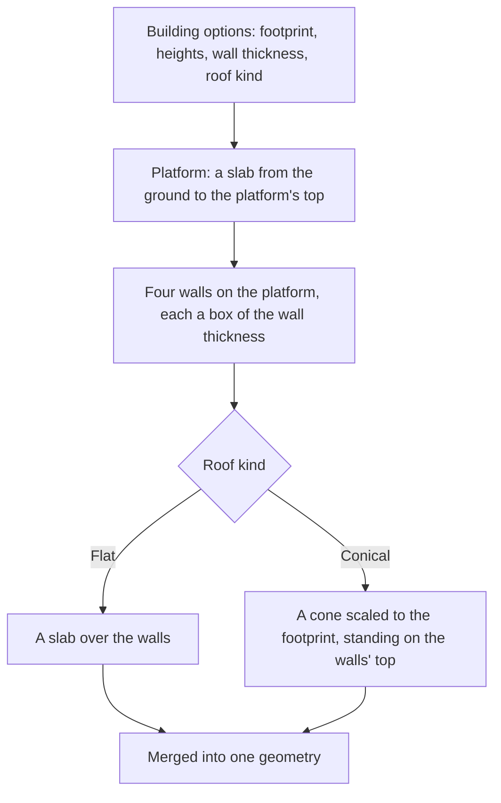

# Buildings

A region's settlements are built from a small set of pieces that repeat, so the kit builds a building from its dimensions rather than from a stored mesh. One building is a platform the walls stand on, four walls and a roof, each given in metres from the ground. Its geometry is one mesh, so a building is one draw for its material.

## How it works

- **The pieces are boxes, and the walls are the boxes' inner ring.** The platform spans the whole footprint. Each wall is a box along one edge, the two long walls running the full width and the two short walls fitting between them, so the four boxes meet at the corners without overlapping (`createBoxesGeometry`).
- **A flat roof is one more box** over the walls, its thickness its roof height.
- **A conical roof is a cone scaled to the footprint.** A unit cone is stretched to half the footprint's width and depth, so its base lies over the walls' outside edge on any rectangle, not only a square. Its apex stands the roof height above the walls.
- **The result is merged** into one geometry, the parts freed once merged (`mergeGeometryParts`).

The building is centred on the origin and stands on it, so a caller places it on the ground with its position.

## Key files

| File                                                                    | Role                                                              |
| :---------------------------------------------------------------------- | :---------------------------------------------------------------- |
| `packages/genshin-engine/src/kits/architecture/createBuildingGeometry.ts` | Builds a building's platform, walls and roof as one geometry     |
| `packages/genshin-engine/src/models/kits/architecture/BuildingOptions.ts` | The dimensions a building is built from, in metres               |
| `packages/genshin-engine/src/models/kits/architecture/RoofKind.ts`      | The roof a building is capped with: flat or conical              |
| `packages/genshin-engine/src/kits/architecture/createBoxesGeometry.ts`  | The box builder the walls and platform are made from             |
