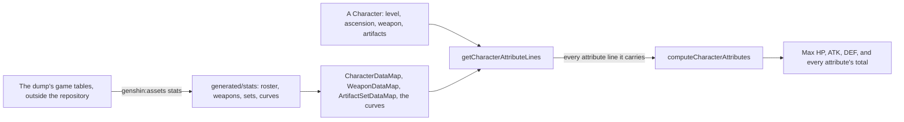

# Character attributes

Every number the character screen's Attributes tab shows is computed the way the game computes it, from the game's own tables. A character's Max HP, for one, is its base HP grown along a curve to its level, plus what its ascension phase adds, raised by every HP percentage it carries, plus every flat HP. `genshin-world` holds the tables as data and the sum as a pure function.

## How it works

### The tables

- **The data keeps the game's shapes.** A `CharacterData` is a character of the roster by the game's id: its element, its weapon type, its rarity, its region, its body, the weapon it comes with, the attributes that grow with its level, its ascension phases and the attributes every level of it starts with (5% CRIT Rate, 50% CRIT DMG and 100% Energy Recharge). A `WeaponData` is a weapon's growth and phases, an `ArtifactSetData` a set's bonus at each piece count, and an `ArtifactMainAffixCurve` what a main affix gives at a rarity and each level from +0.
- **Every name is the game's own.** `Attribute`, `BodyType`, `WeaponType`, `ArtifactSlot` and `Element` take the game's own ids as their values (`FIGHT_PROP_BASE_HP`, `BODY_GIRL`, `EQUIP_BRACER`, `Fire`), so a table parses straight into them, and the game's own name for each attribute is filed under the same id in its text ([game text](/docs/genshin/game-text)).
- **A character's region is the catalogue's.** The game files a character under an association, a nation's or another; the region is the [world map](/docs/genshin/world-map)'s region the association names, the Fatui counted as Snezhnaya's as the wiki counts them, and none for the Traveler's, a visitor's or any other. The Traveler has no element until they resonate with a statue, as the game's own tables leave their default skills without one.
- **Written by one command, checked as they load.** `pnpm -C scripts genshin:assets stats` reads the tables from the dump the [game text](/docs/genshin/game-text) is read from, keeps the curves the roster and the weapons name, and writes them as JSON under `packages/genshin-world/src/generated/stats/`, each checked against the world's schema as it is written and again as the world's code loads it. A property no attribute names is left out and printed.

### A character's attributes

- **A base grows along its curve, and its phase adds to it.** `getGrownAttributeLines` gives a character or a weapon at a level and a phase: each growing attribute's value at level 1 times its curve's multiplier at the level, and every attribute the phase adds, the earlier phases' included. A phase holds the levels from the cap before it to its own, the first from level 1, as the game ascends at a cap: a level outside its phase is refused.
- **Every line is summed.** `getCharacterAttributeLines` gives everything a `Character` carries: its own grown lines and starting lines, its weapon's grown lines, each artifact's main affix at its rarity and level and its minor affixes, and the bonuses of its sets (`getArtifactSetAttributeLines`, every bonus a set's worn pieces reach, so four pieces earn the two and the four piece bonus both).
- **Three are built from a base.** `computeCharacterAttributes` sums the lines by attribute, then Max HP, ATK and DEF are each the base times one plus its percentage, plus its flat. A weapon's base ATK is a line of the base like the character's own, so an ATK percentage raises both.

A new character is `createCharacter`: level 1 in its first phase, with the weapon it comes with at the weapon's level 1, and no artifacts.

## Key files

| File                                                                           | Role                                                             |
| :----------------------------------------------------------------------------- | :--------------------------------------------------------------- |
| `packages/genshin-world/src/models/character/Attribute.ts`                     | Every attribute summed, by the game's own id                     |
| `packages/genshin-world/src/models/character/CharacterData.ts`                 | A character of the roster as the tables hold it                  |
| `packages/genshin-world/src/models/character/Character.ts`                     | A character the player has: level, phase, weapon and artifacts   |
| `packages/genshin-world/src/services/character/getGrownAttributeLines.ts`      | A base grown along its curve, and its phase's lines              |
| `packages/genshin-world/src/services/character/getCharacterAttributeLines.ts`  | Every line a character carries                                   |
| `packages/genshin-world/src/services/character/computeCharacterAttributes.ts`  | The lines summed, and Max HP, ATK and DEF built from their bases |
| `packages/genshin-world/src/services/artifact/getArtifactSetAttributeLines.ts` | The bonuses a set's worn pieces reach                            |
| `packages/genshin-world/src/services/character/createCharacter.ts`             | A character as the game gives one                                |
| `scripts/src/services/genshinAssets/stats/writeStatTables.ts`                  | The tables read from the dump and written into the world         |

## Notes

- **Only the Traveler and the Dull Blade are in the tables yet.** They were written by hand from the dump in the run's own shapes, and the run that writes the whole roster, every weapon and every set waits in the [roadmap](/docs/genshin/roadmap)'s compute queue. The Traveler at level 90 already gives the wiki's 10,874.91 Max HP and 682.52 DEF, which the run is held to.
- **A set's bonus is only its attributes.** A bonus that waits on a condition, a 4-piece's effect in combat, adds no line; it is the set's description, and [combat](/docs/genshin/combat)'s to apply.

## Sources

- [AnimeGameData](https://gitlab.com/Dimbreath/AnimeGameData), a dump of the game's tables the community makes each patch: `AvatarExcelConfigData`, `AvatarCurveExcelConfigData`, `AvatarPromoteExcelConfigData`, `AvatarSkillDepotExcelConfigData`, `AvatarSkillExcelConfigData`, `FetterInfoExcelConfigData`, `WeaponExcelConfigData`, `WeaponCurveExcelConfigData`, `WeaponPromoteExcelConfigData`, `ReliquaryLevelExcelConfigData`, `ReliquarySetExcelConfigData` and `EquipAffixExcelConfigData`, the tables the run reads.
- [Character](https://genshin-impact.fandom.com/wiki/Character), Genshin Impact Wiki: the ascension phases, their level caps and the bonus attribute from the second.
- [Traveler](https://genshin-impact.fandom.com/wiki/Traveler), Genshin Impact Wiki: the Traveler's base HP, ATK and DEF at each level and phase, which the tables reproduce.
- [Attributes](https://genshin-impact.fandom.com/wiki/Attributes), Genshin Impact Wiki: the basic and advanced attributes and the damage bonuses.
- [Artifact](https://genshin-impact.fandom.com/wiki/Artifact), Genshin Impact Wiki: five pieces, a main affix and up to four minor affixes each.
