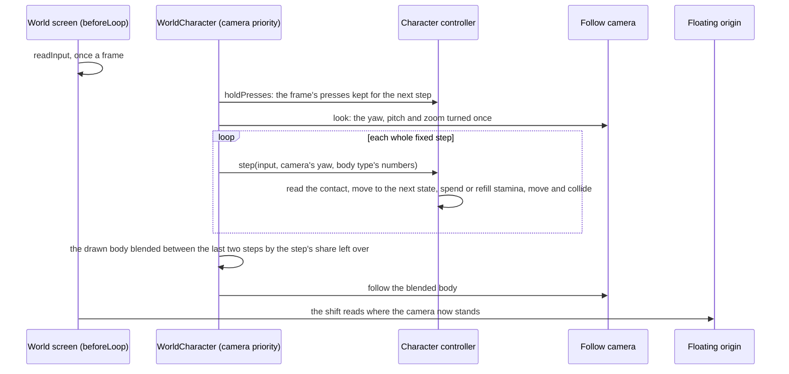
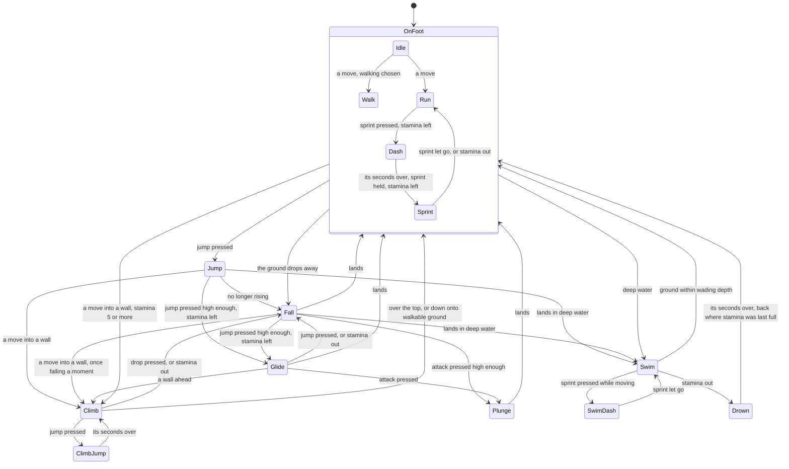

# Character controller

The world is walked, as the game's is. A body stands where the character does, and the player moves it through the game's movement states with the game's keys: it walks, runs, sprints and dashes on the ground, jumps and falls, opens a glider high enough up and plunges from it, climbs any surface too steep to walk, and swims in deep water. The states that take effort spend one stamina pool, and running out of it stops them as the game does. The [follow camera](/docs/genshin/follow-camera) stands behind the body.

The mechanism is `genshin-engine`'s `locomotion` module, which knows no place and no character: `createCharacterController` moves a capsule against a ground query and the landmark collider (`collision`), and `computeLocomotionState` and `createStamina` hold the rules. The world's `WorldCharacter` wires it to Windrise's ground and to the party's character on the field, whose body type gives the body its numbers.

## A frame and its steps

- **Fixed steps, a press kept until one reads it.** The body moves in steps of a sixtieth of a second, so a run covers the same ground at any frame rate. A frame's presses (jump, dash, drop, attack, the walk switch) are held by the controller until the next step reads them, so a press in a frame that runs no step, on a display faster than the step, is never lost; the step that reads them lets them go.
- **The move is relative to the camera.** `W` moves along the camera's yaw over the ground and `A` and `D` across it, as the game's controls bind them ([controls](/docs/genshin/controls)). On a wall `W` climbs up and `A` and `D` climb across, whatever the camera faces.
- **The body moves in the world's own coordinates.** It reads the terrain's height function directly, so the [floating origin](/docs/genshin/terrain) never has to move it: what is drawn on it is placed in the world group, which the origin offsets, at the body's place, and the camera is placed in the scene's coordinates by the origin. Its frame callback runs at `CAMERA_FRAME_PRIORITY`, ahead of the origin's shift whatever order it mounts in.

## The states

`computeLocomotionState` is these gates as a pure function of the body's phase (its state and the seconds it has been in it), the step's input, what the world says of the body and the stamina left. What the world says is a `LocomotionContact`: whether the body stands on walkable ground, still rises from a jump, is high enough above the ground to open its glider or plunge, is in water deeper than it wades, and faces a surface too steep to walk. A dash, a climb's jump and drowning last their own seconds. A fall catches a wall only once it has fallen a moment, so a drop is not caught at once by the move still pushing into the wall. Walking is the left Control's switch, or a stick pushed only part way, as a light push walks in the game.

## The body

The body is a kinematic capsule, moved by queries rather than a physics solver, since the game drives its movement directly and nothing in the world is a stack of falling boxes.

- **On foot** it follows the terrain up and down anything within its step, and stops at a rise steeper than it can walk, which it then faces as a wall. A drop past its step leaves it in the air.
- **In the air** it falls under gravity, steered at the speed it left the ground at. A jump leaves at the speed that reaches its jump's height. Landing on ground too steep to stand on slides it down.
- **On a wall** it moves in the wall's plane. A terrain cliff holds it to the terrain's own surface, read through the height function; a landmark's wall holds it by pressing it into the wall each step, so the push back out reports the wall again. Past a wall's top the body falls onto what stands above, or climbs over onto walkable ground.
- **In water** it floats with its feet its wading depth under the surface, and stands once the ground rises to meet them.

After each move the capsule is pushed out of the landmarks it overlaps. A push mostly upward stands it on a landmark's floor, one mostly sideways holds it against a wall it may climb, and one downward stops a jump under a ceiling.

## The landmarks

`createLandmarkCollider` holds each landmark's triangles in an octree, three's own from its examples, built once as the landmark arrives in the frame of the group the landmarks stand in, which is the world's own coordinates; the floating origin moves the group without moving that frame. `WorldLandmarks` gives the collider its group once the scene holds the meshes and again whenever the regions in reach change, and the collider builds what is new and lets go of what has gone. Everything a landmark draws collides, its crown's leaves too. A query tests only the landmarks whose bounds it reaches, and allocates nothing until something touches: the capsule's push and the [follow camera](/docs/genshin/follow-camera)'s sphere cast along its arm.

## Stamina

One pool, shared by the party, starts at 100 and refills at 25 a second once a second and a half passes with no action that costs it, as the game's wiki gives it. A dash costs 18 as it starts, a sprint 18 a second, a climb's jump 25, and a swim's dash 2 to start and 10.2 a second while it moves. A swim costs 4 a stroke, one as it starts and one each stroke on, whether the body moves or treads water. A glide costs 3 a second, the wiki's approximation, and a climb a provisional amount a second while the body moves on the wall, which the wiki leaves unknown; a climb needs 5 to start. The pool refills on foot and in the air outside the glider, and never on a wall, in water or under the glider.

Running out stops what costs: a sprint drops to a run, a climb lets go and falls, a glide closes, and a swim drowns. A drowned body comes back where its stamina was last full on foot, refilled, as the game returns its party. The pool's most stays at 100, since the world has no Statues of The Seven to offer at.

## The numbers

Every speed, height and threshold is a body type's, since how far a character sprints and jumps differs by its body. `BodyTypeLocomotionMap` holds one `Locomotion` for each of the game's body types, and `getCharacterLocomotion` reads the party's character on the field into its body type's. Until a type is measured it moves by `PROVISIONAL_LOCOMOTION`; a measured type takes its own entry and never lends it to another. The measures are owed by the most exact source the game has for each:

- **The game's own clips** for the speeds: `pnpm -C scripts genshin:assets locomotion <body>` exports a body type's walk, run, sprint, dash, jump, climb, climb jump, swim, swim dash, drowning and glide clips from the asset index and reads each one's root motion, its seconds, the ground it covers and its rise beside the average speed it records. The medium female body, the Traveler's whom the world plays, is read: its walk, run and sprint, its dash, its climb and climb jump, its swim and swim dash and its drowning are its own clips' root motion, each speed within a fraction of a percent of the average its clip records. Its glide's clip holds its root still and its jump's falls through the clip, so neither moves the body, and both are read off recordings.
- **Recordings** for what no clip holds: the jump's height and gravity, the glide's sink, the plunge, the step, the steepest walkable slope, the wading depth, the glider's height, the capsule, the glide's and the climb's costs, and how each stop looks.

## Decisions

- **A kinematic capsule on queries, no physics engine.** The game's movement is kinematic: the controller asks the world where the body may go and slides it along what it meets. A rigid-body engine's solver would fight the movement the game's feel depends on, and nothing in the world is a stack of falling boxes.
- **The game's states, and each of its distinct moves a state of its own.** A dash, a climb's jump and a swim's dash move and cost apart from what they start from, so each is a state, and the plunge is the fall the attack starts; the plunge's attack is combat's.
- **The landmarks collide through three's own octree**, from its examples, rather than a bounding volume hierarchy taken on as a dependency: its capsule and sphere tests are what the body and the camera need, and the package already depends on three.
- **The medium female body first.** The world plays the Traveler, whose body it is, so the first body type measured is the one walked.
- **Swimming strokes cost while treading water.** The wiki gives a stroke's cost and not whether a still body strokes; treading is charged as stroking until a recording of the meter in still water says otherwise.

## Key files

| File                                                                            | Its role                                                                     |
| :------------------------------------------------------------------------------ | :--------------------------------------------------------------------------- |
| `packages/genshin-engine/src/locomotion/createCharacterController.ts`           | the body: contact, state, stamina, motion and collision, a step at a time    |
| `packages/genshin-engine/src/locomotion/computeLocomotionState.ts`              | the states' gates, a pure function                                           |
| `packages/genshin-engine/src/locomotion/createStamina.ts`                       | the pool: what each state costs, and when it refills                         |
| `packages/genshin-engine/src/locomotion/constants.ts`                           | the pool's numbers and the body's own thresholds                             |
| `packages/genshin-engine/src/collision/createLandmarkCollider.ts`               | each landmark's octree, the capsule's push and the sphere's cast             |
| `packages/genshin-engine/src/simulation/createFixedStepLoop.ts`                 | the steps, and the share of a step a frame has come into                     |
| `packages/genshin-world/src/components/World/Character/Index.vue`               | the wiring: steps, the drawn body's blend, the follow camera, a jump's place |
| `packages/genshin-world/src/components/World/CharacterPlaceholder/Index.vue`    | the body's capsule, drawn where no character's model is                      |
| `packages/genshin-world/src/services/world/locomotion/BodyTypeLocomotionMap.ts` | each body type's numbers                                                     |
| `packages/genshin-world/src/services/world/locomotion/constants.ts`             | the provisional numbers every unmeasured type moves by                       |
| `packages/genshin-world/src/components/World/Landmarks/Index.vue`               | gives the collider the landmarks as they arrive                              |
| `scripts/src/services/genshinAssets/locomotion/readLocomotionClips.ts`          | a body type's clips exported and read for their root motion                  |

## Notes

- **A jump from the map places the body**, standing it on the ground at the jump's point facing its yaw, with the follow camera level behind it, and makes that point where a drowning brings it back to until its stamina is next full on foot.
- **A party switch changes the body type the next step moves by** and the model drawn on the body, never the body's place or its stamina, which the party shares.
- **Left Control with `W` held is the browser's close-tab shortcut.** The walk switch is the game's key, so it is pressed apart from a held move ([controls](/docs/genshin/controls)).

## Sources

- [Stamina](https://genshin-impact.fandom.com/wiki/Stamina), Genshin Impact Wiki: the shared pool of 100, its refill of 25 a second after 1.5 seconds, each action's cost, the climb's unknown and its 5 to start.
- [Sprinting](https://genshin-impact.fandom.com/wiki/Sprint), Genshin Impact Wiki: a dash on the press and a sprint on the hold, and the distance differing by model type.
- [Climbing](https://genshin-impact.fandom.com/wiki/Climbing), Genshin Impact Wiki: any surface short of upside down, the climb jump, and the fall when stamina runs out.
- [Gliding](https://genshin-impact.fandom.com/wiki/Gliding), Genshin Impact Wiki: the glider opened by a jump in mid-air high enough, closed by another, and a plunge from it.
- [Swimming](https://genshin-impact.fandom.com/wiki/Swimming), Genshin Impact Wiki: deep water's threshold varying with the character's height.
- [Fallen Character](https://genshin-impact.fandom.com/wiki/Fallen_Character), Genshin Impact Wiki: drowning when stamina runs out in water, and the return where stamina was last full.
- [Controls](https://genshin-impact.fandom.com/wiki/Controls), Genshin Impact Wiki: the walk switch, the sprint, the jump and the drop on a PC and a pad.
- [Octree](https://threejs.org/docs/#examples/en/math/Octree), three.js: the octree and its capsule and sphere tests the landmark collider runs on.
- [Fix your timestep!](https://gafferongames.com/post/fix_your_timestep/), Glenn Fiedler: the state drawn blended between the last two steps by the accumulator's remainder.
- [KinematicCharacterController](https://rapier.rs/javascript3d/classes/KinematicCharacterController.html), Rapier: a kinematic controller that hits and slides against obstacles, confirming that the movement the game needs is queries and sliding rather than a rigid-body solve; weighed and not taken.
