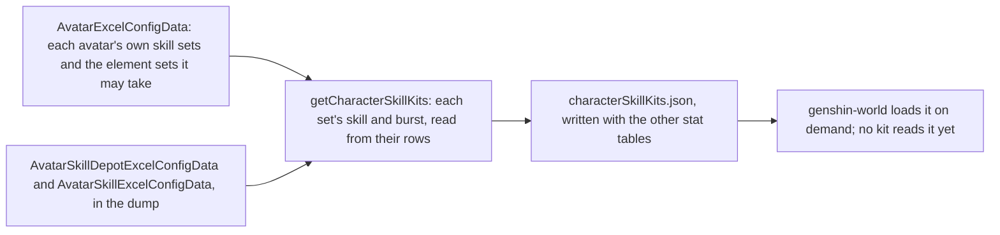
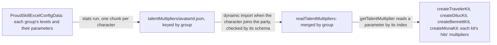

# Character kits

A character's combat kit is its skills, cooldowns, costs and talent multipliers, and the game keeps those in its tables by the character's skill sets. What is built is the table side: each playable character's skill sets, written beside the stat tables by the stats run, and the targeting that turns an action to its enemy. The Traveler's first kit reads its multipliers from the same tables and sits in its own module, as Diluc's, Bennett's and Mona's do, and a character with no module of its own fights with the Traveler's kit until one is written. The kits' hits are [combat](/docs/genshin/combat)'s, and the kit's action state machine is documented there too.

## Skill sets

A character has one skill set in its own form, and a set for each element form its element may take, the one a statue's element picks. A set holds a skill, the character's elemental skill, and a burst, its energy skill, each read from the skill table by its id. The skill has a cooldown and its charges, the burst a cooldown, an energy cost and the element it deals, the element its energy is named as.

- **A set with neither a skill nor a burst is left out.** A character none of whose sets has either is left out too. One of the Traveler's element sets, 705, holds neither in this dump, so the dump gives the Traveler no form for it.
- **A burst's element is the one its energy names, when it names one of the seven.** A burst that costs no element has none. Which set a Traveler's kit reads is for the element a statue gives, which is not built yet.
- **The Traveler's Anemo set** holds a skill of 5 seconds, one charge, and a burst of 15 seconds for 60 energy. `createTravelerKit` writes the same numbers beside its hits rather than reading them from this table, which no kit reads yet.
- **The table is written by** `pnpm -C scripts genshin:assets stats`, the same run as the characters, weapons and artifacts. Each character is checked against the world's schema as it is written.

## Talent multipliers

The stats run writes each playable character's combat talent multipliers into a chunk of its own, `talentMultipliers/<avatarId>.json`, keyed by the talent's proud skill group. A level keeps its parameters (`paramList`) up to the last one that is not zero, so a read past that point is zero. The labels, the text id naming each parameter (`paramDescList`), go apart into `talentLabels/<avatarId>.json`, which the talents screen loads when it opens and the combat table never carries.

`TalentMultiplierLoaderMap` is keyed by avatar id and imports a chunk on demand. `readTalentMultipliers` checks each chunk against its schema and merges it by group, and `getTalentMultiplier` reads a parameter from the merged table by its index. The world loads the deployed team's multipliers as it starts and again whenever the team changes, and a kit is built from the loaded table, so the world's entry carries none of them. The one static import this replaced was 1.4 MB of it.

## Targeting

An action turns the body to the enemy it targets as it starts. That is the living enemy inside the action's targeting area scoring highest, where an enemy's score is 0.7 times its nearness to the body within the area's radius, plus 0.3 times its nearness to straight ahead, the angle from the body's facing over a half-turn. An enemy more than 2 metres above or below the body scores a fifth of that. Enemies outside the area, and the dead, are not targeted. The view, current-target and priority coefficients are not built.

## The Traveler's kit

`createTravelerKit`, in the Traveler's character module, built from the loaded table, is the first kit, at talent level 1. Its hitmarks and seconds are gcsim v2.47.2's frames, and the plunges' poise is gcsim's pyro plunge's. gcsim sets no poise on the Anemo skill or burst, so both hit with none. Its strikes' poise is not in that file, so each is provisional, as are the charged attack's and the plunge collision's.

Its multipliers are read from the Anemo form's proud skill groups, 731 for the attacks, 732 for Palm Vortex and 739 for Gust Surge. Those agree with the wiki's values to two decimal places. The charged attack's second hit is 731's 0.7224, where the male form's group 730 gives 0.60716, so the kit reads 731 for it.

A hit can name its own element, which strikes the enemy as that element whatever the character's own is. The Traveler's hits name none, so they deal the element of the Traveler's form, which is none until a statue gives one.

## Character modules

Each character with a module has one file under `services/kit/characters/`, exporting a factory that builds its kit from the loaded multipliers, as `createTravelerKit` does. `CharacterIdCreateKitMap` keys them by avatar id, the world builds a character's kit once its chunk has arrived, and a character with none fights with the Traveler's kit.

- **Diluc** (`createDilucKit`, avatar 10000016): four strikes, a charged attack, a collision and two plunges, Searing Onslaught's three presses, and Dawn's slashing hit with its phoenix's ticks and explosion. Its multipliers are read from proud skill groups 1631, 1632 and 1639, and match the wiki's Tempered Sword and gcsim's level-1 values to two decimal places. Dawn's infusion, its phoenix and the A4 passive are built, as the shared effects below.
- **Amber** (`createAmberKit`, avatar 10000021): five arrows, a fully charged aimed shot, a collision and two plunges, Explosive Puppet's Baron Bunny and Fiery Rain. Its multipliers are read from proud skill groups 2131, 2132 and 2139, and match the wiki's Sharpshooter, Explosive Puppet and Fiery Rain values to two decimal places. Baron Bunny is a taunt, built as the shared effects below, and Fiery Rain is a summon of eighteen arrows, with Ascension 1's CRIT Rate and AoE.
- **Kaeya** (`createKaeyaKit`, avatar 10000015): five strikes, a charged attack, a collision and two plunges, Frostgnaw with its A1 heal, and Glacial Waltz's thirteen icicles. Its multipliers are read from proud skill groups 1531, 1532 and 1539, and match the wiki's Ceremonial Bladework, Frostgnaw and Glacial Waltz values to two decimal places. Glacial Waltz's icicles are a summon, built as the shared effects above.
- **Lisa** (`createLisaKit`, avatar 10000006): four strikes, a charged attack, a collision and two plunges, Violet Arc's press and its hold, released by itself at 4 seconds, and Lightning Rose's thirty discharges. Its multipliers are read from proud skill groups 431, 432 and 439, and match the wiki's Lightning Touch, Violet Arc and Lightning Rose values to two decimal places. Lightning Rose is a summon, built as the shared effects above.
- **Noelle** (`createNoelleKit`, avatar 10000034): four strikes, a charged attack, a collision and two plunges, Breastplate's press and Sweeping Time's two slashes. Her multipliers are read from proud skill groups 3431, 3432 and 3439, and match the wiki's Favonius Bladework - Maid, Breastplate and Sweeping Time values to two decimal places. Breastplate's shield, its heal, and its constellations I Got Your Back and To Be Cleaned, and Sweeping Time's converted Geo attacks and ATK bonus are built, as the shared effects below.
- **Mona** (`createMonaKit`, avatar 10000041): four strikes, a charged attack, a collision and two plunges, all Hydro catalyst hits, Mirror Reflection of Doom and Stellaris Phantasm's bubble. Its multipliers are read from proud skill groups 4131, 4132 and 4139, and match the wiki's Ripple of Fate, Mirror Reflection of Doom and Stellaris Phantasm values to two decimal places. Mirror Reflection is a summon, built as the shared effects below; the bubble, its explosion and its Omen are built. A1's phantom and A4's Hydro bonus are built too.
- **Bennett** (`createBennettKit`, avatar 10000032): five strikes, a charged attack, a collision and two plunges, Passion Overload's press and its two Charge Levels, and Fantastic Voyage's damage. Its multipliers are read from proud skill groups 3231, 3232 and 3239, and match the wiki's Strike of Fortune, Passion Overload and Fantastic Voyage values to two decimal places. Fantastic Voyage's field, its heal, its ATK bonus and its constellations 1 and 6 are built, as the shared effects below, and A1's and A4's cooldown cuts, and A4's no-launch of the Level 2 hold, are built with them. Its self infusion is left.
- **Kamisato Ayaka** (`createAyakaKit`, avatar 10000002): five strikes, the fourth of three hits, a charged attack of three hits, a collision and two plunges, Kamisato Art: Hyouka, Kamisato Art: Soumetsu's storm and Kamisato Art: Senho's Cryo infusion. Her multipliers are read from proud skill groups 231, 232 and 239, and match the wiki's Kamisato Art: Kabuki, Hyouka and Soumetsu values to two decimal places. Soumetsu's storm is a summon of nineteen cuts and a bloom, built as the shared effects below, with Blizzard Blade Seki no To's two smaller storms from two constellations, and Senho's infusion is built on the kit's sprint hook. Senho's Cryo application and its movement, A1's and A4's effects and her other constellations are not built.
- **Jean** (`createJeanKit`, avatar 10000003): five strikes, a charged attack, a collision and two plunges, Gale Blade's press and its hold, and Dandelion Breeze's blast. Her multipliers are read from proud skill groups 331, 332 and 339, and match the wiki's Favonius Bladework, Gale Blade and Dandelion Breeze values to two decimal places; the skill's cooldown and longest hold and the burst's cooldown and cost are read from the same groups. Dandelion Breeze's field, its activation heal and regeneration, and its entering and exiting damage are built as the shared effects below, with A1's party heal on her strikes, A4's energy back and Spiraling Tempest's DMG bonus on a held Gale Blade from one constellation. The activation heal's off-field members, the field's Anemo on the character, Gale Blade's pull and its hold's stamina, and her other constellations are not built.
- **Barbara** (`createBarbaraKit`, avatar 10000014): four strikes, a charged attack, a collision and two plunges, all Hydro catalyst hits, Let the Show Begin♪'s two droplets and its Melody Loop, and Shining Miracle♪'s heal. Her multipliers are read from proud skill groups 1431, 1432 and 1439, and match the wiki's Whisper of Water, Let the Show Begin♪ and Shining Miracle♪ values to two decimal places; the loop's heals and duration, the skill's cooldown, and the burst's heal, cooldown and cost are read from the same groups. The droplets are a summon, and the Melody Loop and the burst's heal are fields with no edge, built as the shared effects below, with the loop's party heal on her strikes and charged attack, and Vitality Burst's cooldown cut and Hydro DMG Bonus from two constellations. The burst's heal on the off-field members, the loop's Wet, her passives and her other constellations are not built.
- **Razor** (`createRazorKit`, avatar 10000020): four strikes, a charged attack, a collision and two plunges, Claw and Thunder's press and its hold, and Lightning Fang's blast. His multipliers are read from proud skill groups 2031, 2032 and 2039, and match the wiki's Steel Fang, Claw and Thunder and Lightning Fang values to two decimal places; an Electro Sigil's Energy Recharge, energy and seconds, the press's and the hold's cooldowns, and the Soul Companion's share, the Electro RES bonus, the Wolf Within's seconds and the burst's cooldown and cost are read from the same groups. The press's Electro Sigils and their clearing into energy by the hold and the burst, and Lightning Fang's Wolf Within with its Soul Companion beside each strike and its Electro RES, are built over the shared effects, with Awakening's cooldown cut and reset from Ascension 1 and Lupus Fulguris's lightning from six constellations. The Wolf Within's ATK SPD, its disabled charged attack and its energy back as Razor leaves the field, Hunger, his other constellations and his Hexerei kit are not built.

## Shared effects

Each effect is on the party, in the list a `KitEffectState` holds, so a switch leaves it running, and a drown or a jump clears it. Each one is ticked each step.

- **Damage** is a hit: its talent multiplier, its gauge of an element, and the element it names when it is not its character's own. A hit with no internal cooldown applies its whole gauge, and one under a cooldown shares it through it.
- **Infusion** makes the character's normal attacks, charged attack and plunges deal its element at the gauge the hit gives it, 1U for a strike and 0U for a collision. It is refreshed by a second one of its kind on the same character, not stacked.
- **Buff** adds a stat bonus to the character's pricing for its seconds: a flat ATK adds to its attack and any other bonus to its attribute total. It is refreshed by one of its attribute from the same source on the same character, not stacked: a source names the effect that gives it, so two effects on one attribute run side by side, as Sprawling Greenery's two Elemental Mastery buffs do.
- **Heal** is `healPartyMember`: a share of a standing member's max HP, never above all of it. A downed member stays down, as only a revive brings one back.
- **Energy** is the party's `gainPartyEnergy`, which an enemy's drop already calls.
- **Field** is a circle placed where its character casts, for its seconds, with a tick on a schedule. Each tick runs while the body stands inside it, reading the character on the field and the team, and a tick's own buffs and infusions start at their full seconds.
- **Summon** is an entity cast where its character stands, which lands its own hits on the seconds their hitmarks fall at, for its seconds. It is priced by the combatant that cast it, as it stood then, and its hits land from its own body, not the character's. A summon may travel: its body moves forward at its speed from its start on its clock, and its hits are reached from where it is then. A summon whose seconds end on its last hitmark lives `SUMMON_LINGER_SECONDS` past it, so the step that lands its last hit still has it on the field however its clock and its seconds left round.
- **Dawn's phoenix** is a travelling summon launched at the slash's hitmark, a metre ahead of the body and moving 14 metres a second. It strikes eight ticks, every 0.2 seconds from its launch, and explodes 1.7 seconds on, 24.8 metres out.
- **A shield** is set on the team by the character that casts it, for the seconds left of it, and is recast over the one that character already holds. It takes the damage the character on the field takes, whichever character cast it: an enemy's strike is taken by every live shield at once, each absorbing the full damage through the combat's `absorbShieldDamage` at the struck character's shield strength, and the character loses the least any of them passes on. The wiki gives the rule in its own words: "when the active character takes damage, damage is dealt to shield health first", and "When a character has more than one shield, the damage dealt by an enemy will affect every active shield simultaneously" ([Shield](https://genshin-impact.fandom.com/wiki/Shield)). A shield is dropped once its health is spent. A shield with an explosion goes off as it ends, whether its seconds run out, its health is spent or it is recast over.
- **A taunt** is an entity placed where its character cast it, with health, which draws the enemies' strikes while it stands. It explodes once, from its body and priced by the combatant that cast it, when its seconds run out or its health is gone. An enemy within its aggro range strikes it instead of the character, and each strike is taken from its health by `damageKitTaunt`.
- **A bubble** is held on one enemy by a hit that casts it, for its seconds. A hit with poise damage bursts it, as its seconds running out do: the Omen goes on the enemy from the burst, and the explosion lands on that enemy alone, from where it stands, priced by the combatant that cast it. A hit that casts a bubble holds the enemy in one, and never restarts the one it holds, since each cast's bubble bursts on its own.

## Decisions

- **A kit's action carries its start.** A kit action may name an `onStart` that adds its effects, given the body and the character's combatant, so a module writes what its burst or skill sets going without the framework knowing which.
- **A character's ascension phase is on its combatant.** A passive reads `combatant.ascension` against the phase its table names, so the Diluc A4 gate is `ascension >= 4`.
- **A character's constellations are on its combatant as a count.** The save holds `constellationCount` on each character, and the world copies it onto the combatant beside its ascension phase. A constellation reads `combatant.constellationCount` against the level it needs, so Breastplate's C1 gate is `constellationCount >= 1` and its C4 gate `constellationCount >= 4`, each read as the effect is cast. Bennett's C1 and C6 read it alike, on `constellationCount >= 1` and `constellationCount >= 6`.
- **A gcsim call says what it puts on the character.** "ApplySelfInfusion" puts an elemental aura on the character, not a weapon infusion; only "AddWeaponInfuse" is one, and the kit's `infusion` effect is that. A branch on `c.Base.Cons >= N` is constellation N, so the kit gates it on `constellationCount >= N`. The Bennett fix is the evidence: its field infused the character at every constellation, having read the self infusion as a weapon infusion, with the Cons 6 branch left ungated.
- **Searing Onslaught's cooldown starts on its first press.** The second and third presses are a chain: each is pressed within four seconds of the one before, and a press inside that window plays its follow-up whatever the cooldown, which the first press set at 10 seconds. The third press closes the chain, and a window that lapses ends it. gcsim sets the cooldown on the first use, and the wiki's lapse path ends a chain with the cooldown already running, so the cooldown always starts on the first press.
- **Dawn's phoenix is priced by the same ICD as its slash.** Its ticks and explosion are 2U of Pyro each under the Elemental Burst internal cooldown, and carry the slash's 100 poise, as gcsim's copy of the attack does. Their area is a circle to the far corner of gcsim's box, provisional until areas hold boxes. gcsim places tick _i_ at 1 + 2.8*i* metres; the phoenix's own clock puts it 2.8 metres further, which the kit follows.
- **The charged attack's timing is provisional.** gcsim does not model it and the wiki's talent page gives no frames, so its slashes land at half a second and a second, and it ends at a second and a fifth. Its damage is the wiki's cyclic 68.8% and final 124.7%, and its poise the wiki's 60 and 120.
- **Its stamina drains a second as it plays.** The table's 40 a second is drained each step of the charge, so its 1.2 seconds cost 48 in all, and the charge starts with any stamina. The game holds the charge up to 5 seconds and stops it when the stamina runs out, which the kit does not model.
- **Boxes are circles.** An area holds a fan or a circle, so a box is priced as the circle to its farthest corner, provisional until areas hold boxes.
- **Poise is the wiki's where gcsim gives none.** gcsim sets no poise on Diluc's skill, burst or collision; the wiki's advanced properties give 120, 100 and 35.
- **A collision infused at 0U still deals the element.** A hit's element no longer needs a gauge, so the collision's Pyro damage lands with no aura, as the wiki's table gives it.
- **Diluc's A1 and the phase-0 passive are not built.** gcsim models no combat effect for either.
- **A field's tick reads the character on the field.** Fantastic Voyage's heal and ATK bonus go to the character standing in the circle, not to each member of the team, as gcsim applies them.
- **Fantastic Voyage infuses only at constellation 6.** Its tick infuses nobody below 6. Grand Expectation at 1 lifts the ATK bonus's HP threshold to any HP above zero and adds 20% of Bennett's base ATK to it, so a character under 70% of its HP gets the bonus. At 6, the bonus's branch also gives the character on the field a 15% Pyro DMG Bonus whatever it wields, and Pyro on its weapon if it wields a sword, claymore or polearm, for the buffs' 2.1 seconds, from the wiki's [Fire Ventures With Me](https://genshin-impact.fandom.com/wiki/Fire_Ventures_With_Me) and gcsim's burst.go, which give the same wielders. The wielder is read from the character table by `getCharacterWeaponType`, as the combatant does not carry it yet, and the table is already in the package's bundle.
- **Bennett's self infusion is left.** "ApplySelfInfusion" puts a 1U Pyro aura on the character on the field each tick, [gcsim v2.47.2](https://github.com/genshinsim/gcsim/blob/v2.47.2/internal/characters/bennett/burst.go) (MIT), an elemental aura and not a weapon infusion. A party member holds no elemental state in this package, only an enemy does, so there is nothing to hold the aura, and it is not built. The wiki's Fire Ventures With Me page says the C6 infusion and bonus also apply when the field heals a character under 70%, where gcsim applies them on the ATK bonus alone; the kit follows gcsim, and the two differ on that case.
- **Bennett's heal ignores Healing Bonus.** The heal is the table's flat HP plus its share of Bennett's max HP, unscaled.
- **Mona's strikes are priced round her body.** gcsim centres them on the primary target, which an area does not hold yet. Her plunges' reach is provisional, as gcsim has no plunge file for her.
- **Mona's A1 phantom is cast from a sprint.** `onSprint` spends each 2 seconds of the sprint on a phantom, cast where Mona stands, which explodes at its end for half of Mirror Reflection's explosion. The wiki's check for an opponent within 15 metres is not made: with none in the phantom's 5-metre explosion it deals nothing, so the check changes no damage.
- **Mona's A4 is a passive bonus read as a hit is priced.** `getPassiveBonuses` adds 20% of her Energy Recharge to her Hydro DMG Bonus in `getBuffedCombatant`, for every hit she prices, her summons' included.
- **Stellaris Phantasm's Omen runs from the burst.** Each enemy its cast strikes is held in a bubble for the burst group's first value, 8 seconds. A hit with poise damage bursts the bubble, as its seconds running out do, and the Omen goes on from then: 4 seconds from the burst group's index 3, and the 42% DMG bonus from index 9, which raises the damage of every hit on the enemy. The wiki's exception, that a Frozen enemy takes no poise damage and keeps its bubble, is not modelled, as the enemies' poise does not model it for any hit.
- **Stellaris Phantasm's explosion is single-target.** A burst deals 2U of Hydro with the wiki's 200 poise, at the explosion's multiplier from the burst group's index 1, 442.4% at level 1. A strike with a `target` lands on that one enemy rather than each the area reaches, so the explosion is never spread to a neighbour. It lands on the step after the burst, as a taunt's does, and the Omen does not wait for it.
- **Amber's fully charged aimed shot is the bow's charged attack.** Only the fully charged shot deals Pyro, under a charged attack internal cooldown, so the unlit Aimed Shot and its weak-point hits are not built. A bow's aimed shot (`isAimed`) turns the body to the camera's yaw while the aim binding, `R` on a keyboard, is held, and to its enemy by the wiki's score otherwise. The kit's hits are drawn from the turned body, so the shot lands along the aim.
- **Fiery Rain's arrows are priced at twice the burst radius.** Each arrow lands at random within a radius of 2 round the burst's centre and is itself a circle of that radius, so a summon's arrow is priced at 4 round the body. Ascension 1, Every Arrow Finds Its Target, adds 10% CRIT Rate, priced on the summon's combatant, and widens the radius by 30%.
- **Baron Bunny lands where Amber stands.** The wiki's throw, 1.4 metres ahead and the hold's distance, is not built, so it is priced round Amber's body. Its HP is 41.36% of Amber's Max HP, from the table.
- **Amber's A4 is left.** Its ATK bonus after a weak-point hit has no weak spot to strike: the enemies here have none, so there is no hit for the bonus to follow.
- **Kaeya's groups are 1531, 1532 and 1539, not the talent table's 2531 and 2539.** The table names 2531 for his strikes and 2539 for his icicle, and their level-1 values, 46.6% for the first strike and 54.3% for the icicle, agree with neither the wiki nor gcsim. The 15xx groups carry the wiki's numbers, so the kit reads those; the stats run's choice of group for him is the thing to fix.
- **Frostgnaw's cooldown is the wiki's 6 seconds.** The skill table gives 21 seconds for his skill, which is not its cooldown; the proud skill group 1532 holds the 6, as gcsim's 360 frames do. Frostgnaw's damage against Water, its 4U gauge, is not built. A1's heal is built as a hit's `healAttackShare`: each enemy Frostgnaw strikes heals Kaeya by 15% of his ATK, read as the hit is priced and not scaled by Healing Bonus.
- **Glacial Waltz's activation knockback is not built.** Its 400 poise has no damage and gcsim gives no area for it, so the icicles alone are built.
- **Kaeya's reaches are priced with their offsets.** gcsim centres his strikes, charge and plunges a metre or so ahead of the body, so each reach is its offset plus its radius, or a box's far corner, until an area holds an offset.
- **Lightning Rose's activation deals no damage.** The wiki gives it 0U and 10 poise and no multiplier, so the activation is a poise-only hit. gcsim gives it a multiplier of 0.1 that the table does not, so it is left out.
- **Violet Arc's press cooldown is the wiki's 1 second, and its hold's is the table's 16.** The hold plays on its release, as Passion Overload's Charge Levels do, once it has been held 1.9 seconds, the wiki's time to charge in full. That 1.9 is provisional, as no table gives the hold's minimum, and the roadmap's Recordings owed list holds `lisa-violet-arc-hold.mkv` to measure it.
- **Conductive is a status that stacks on the enemy, and gcsim gives its stacks no duration.** Each press hit applies a stack, up to three, and Lisa's charged attacks apply one from A1 (`lisa/asc.go`); her normal attacks do not apply it. Stacks are an `EnemyStatus` with `stacks` and `maxStacks`, which a stacking status adds to rather than restarts, and they never expire.
- **Violet Arc's hold reads the stacks on each enemy it strikes.** A `stackedHit` sets the hold's multiplier and poise for each enemy by its Conductive stacks, 320% to 487% and poise 150 to 300 from the wiki, and consumes the stacks. The hold reaches 10.2 metres, gcsim's 10 metres with each enemy's 0.2 circle.
- **Violet Arc's hold is released by itself at 4 seconds.** A kit's `elementalSkillMaximumHeldSeconds` caps the seconds a skill is held at its maximum, and the skill is released there, once: the hold level its seconds reach at that moment starts, and holding on past it starts nothing again. The wiki's Violet Arc page gives the maximum of 4 seconds.
- **A charged attack after a strike skips its windup.** gcsim skips 14 frames of the charge's windup after a normal attack, so the hit lands at 56 frames here, and at 70 from rest, which the kit does not start.
- **Breastplate's shield is set from Noelle's DEF.** It holds 160% of her DEF plus 769 for 12 seconds, and is recast over the one she holds. From four constellations, To Be Cleaned explodes it for 400% of her ATK of Geo as it ends, 2U under the Elemental Skill internal cooldown with 100 poise. The explosion is priced by Noelle as she stood when she cast the shield, and lands on the ground where the character on the field stands, since the shield protects whoever is on the field. The recast ends the shield it replaces, so that one's explosion goes off too. The wiki gives the explosion no area, so it reaches as far as the shield does.
- **Breastplate's heal rolls on her attacks while the shield stands.** Her normal and charged attacks' hits and her press carry the roll at 50% (the wiki's level-1 chance), which I Got Your Back makes certain while Sweeping Time's Geo infusion is up, from one constellation, and a hit rolls on each enemy it strikes until one passes. A pass heals every party member by 21.28% of Noelle's DEF plus 102.7, each as a share of its own Max HP. The roll reads the world's one seeded random source, which the world screen holds and every combat roll draws on, the strikes' CRIT rolls included, so a session's rolls repeat. Plunges do not roll, as gcsim's do not.
- **Sweeping Time converts her normal attacks to their own poise.** An infusion that converts its attacks (`isConverted`) gives each normal attack hit its converted poise, 132.25, 122.82, 143.865 and 189.75 from the wiki. Her charged attack, collision and plunges have the same poise converted as normal, so they are unchanged. The Geo infusion and the ATK bonus of 40% of her DEF are built, for 15 seconds past an 80-frame start.
- **Noelle's charged attack is one cycle of its spin and its final slash.** A held spin's cycles are not built, so the charged attack hits once and then once more.
- **A skill with holds starts on its release.** A kit's `elementalSkillHolds` are ordered by their minimum seconds, and a release plays the highest level its held seconds reach, else the press, on that level's cooldown. The press therefore starts when the key is let go, as the game's Charge Levels do, rather than on the press.
- **Passion Overload's Charge Levels' thresholds are provisional.** The hold that reaches Level 1 is 0.5 seconds and Level 2's is 1 second, and no table or wiki page gives them, so the roadmap's Recordings owed list holds `bennett-charge-levels.mkv` to measure them. The hold's hits and explosion, their multipliers and poise, and the cooldowns of 7.5 and 10 seconds are the wiki's and gcsim's.
- **A cooldown multiplier is read as a skill's cooldown starts.** `getSkillCooldownMultiplier` takes the step's context, the body, the combatant and the team's effects, and each skill's cooldown is multiplied by it when the skill starts. Bennett's A1 cuts every Passion Overload by 20%, and A4 halves it while Bennett stands in a field he cast, which a field's `characterId` names. The deployed team's Impetuous Winds multiplies a skill's cooldown by a further 0.95 after the kit's own, in `startNextKitAction`, so the two compose.
- **Fearnaught's no-launch is the Level 2 hold's shorter animation.** Inside Fantastic Voyage's field at Ascension 4, the Level 2 hold plays gcsim's 175 frames in place of 343, with the same two hits and explosion, all of which land before it ends. The wiki's Fearnaught page gives the effect, and gcsim the animation. Bennett's launch is not modelled, so only the animation changes.
- **Bennett's hold boxes are circles.** The 3 by 3 box of the hold's second hit is priced as the circle to its far corner, 2.12 metres, as the other boxes are.
- **An enemy's strike takes the team's shields through the combat shield, all at once.** `absorbKitShield` gives the strike's damage to every live shield, each priced by `absorbShieldDamage` with the struck character's shield strength, the rule the combat page gives, so the Geo shield's 150% and the shield strength are the combat's. The character takes the least overflow among them as damage to HP, so a shield that holds the whole strike leaves none. The kit keeps no second absorption arithmetic.
- **An enemy strikes the nearest live taunt within its aggro range.** `selectEnemyTaunt` picks, for each enemy on each step, the nearest taunt within `ENEMY_AGGRO_RANGE` of the enemy, and a taunt with no seconds or no health left is not picked. The taunt takes the damage the strike would deal the active character, as the kit gives a taunt no defence of its own.
- **An enemy's statuses add to the damage of each hit on it.** An enemy carries statuses for their seconds, stepped with the enemy. A hit's `enemyStatus` gives it to each enemy it strikes before the hit's damage is taken, restarting a status of its id, each status's `damageTakenBonus` adds to the damage bonus the hit reads, and its `resistanceReduction` lowers the enemy's resistance to each element it names, as Enduring Rock's Geo RES does.
- **The team's effects are the world screen's.** The screen holds one `KitEffectState`, the character on the field steps it, and the enemies and their strikes read its list. A write reassigns the list rather than changing it, as the stepping and the adding do, and the character emits `clearKitEffects` on a drown, a jump and its unmount, which the screen answers by emptying the list, so a shield or taunt does not outlive a drown, a jump or the character's unmount. A switch clears nothing, so a shield another character cast stands while someone else is on the field.
- **Ayaka's reaches are priced with their offsets, and her fifth strike round her body.** gcsim centres her first, second and fourth strikes and her plunges ahead of the body, so each reach is its offset plus its radius, and her third strike's 60-degree fan, centred half a metre behind, reaches 2.3 metres. Her fifth strike is a circle of 0.8 metres gcsim centres on the primary target, which an area does not hold, so it is priced round her body, as Mona's strikes are.
- **Ayaka's charged attack reaches every enemy within 5 metres.** gcsim and the wiki lock it on an enemy within 5 metres and strike each enemy within 4 metres of that one, so it is priced as the 5-metre circle round her body, which is provisional until an area holds a target. The wiki's 0.5-second internal cooldown for it is priced under the standard one, the only group a kit's hit is priced under.
- **Soumetsu's storm stands where Ayaka cast it.** The wiki's storm moves forward until it meets an enemy, and gcsim centres it on the primary target, and neither gives its speed, so the storm is a summon standing at the cast, its cuts reaching 3.3 metres and its bloom 5. Blizzard Blade Seki no To's two smaller storms stand with it, each at a fifth of its multipliers, reaching 1.8 and 3 metres, as gcsim places them. All three are provisional until a recording measures the storm's path.
- **Senho's infusion runs from the sprint.** The kit's `onSprint` restarts a 5-second Cryo infusion on each step of the sprint, so it runs out 5 seconds after the sprint ends, as the game gives it on her reappearing. An attack ends the sprint in the game, so the infusion over the sprint itself changes no hit. Senho's Cryo application as she reappears is not built, since the hook runs on each step of the sprint and nothing marks where the sprint ends, and A4, which restores 10 Stamina and gives an 18% Cryo DMG Bonus when that application hits, waits on it. Senho's own movement, its fog, its stamina of 10 to start and 15 a second and its crossing of water, is the controller's and is not built.
- **Ayaka's A1 and her other constellations are not built.** A1's 30% DMG bonus for her normal and charged attacks has nowhere to go: a buff adds to an element's DMG Bonus, which Hyouka and Soumetsu read too, and a hit carries no bonus of its own. C6's charged attack bonus waits for the same reason, C1's cooldown cut on a Cryo hit and C4's DEF reduction have no hook in a hit, and C3 and C5 raise talent levels, which the [talents](/docs/proposals/genshin/talents) page holds.
- **Jean's reaches are priced with their offsets, and Gale Blade's box to its far corner.** gcsim centres her first, fourth and fifth strikes and her charged attack's 160-degree fan ahead of the body, so each reach is its offset plus its radius, and her second and third strikes' fans of 150 and 30 degrees behind it, so each reaches its radius less the offset, 1.7 and 1.8 metres. gcsim's rectangle spawns on its near edge, so Gale Blade's box, 4 wide and 4.1 long from the body, is priced as the circle to its far corner, 4.56 metres.
- **Jean's plunges are provisional.** gcsim has no plunge file for her and no table gives their frames, so each lands as its action starts and ends at 0.4 seconds, and reaches 1, 3 and 5 metres, as Mona's do. Their poise and blunt are the wiki's Favonius Bladework.
- **Gale Blade starts on its release, and its hold plays the same blast.** gcsim lands the blast 21 frames past the hold, so a hold level from 1 second, and the press under it, start on the release, and the hold is released by itself at the skill group's 5 seconds. The hold's pull and its 20 stamina a second are not built: no enemy is moved by a kit, and a kit drains stamina only while an action plays, not while its skill is held.
- **Spiraling Tempest is an Anemo DMG Bonus for the held blast.** From one constellation, a Gale Blade held a second or more plays a variant that adds 40% to Jean's Anemo DMG Bonus for its 46 frames, the hit it lands within, as gcsim adds its 40% to the blast's DMG bonus. A hit carries no bonus of its own, so any other Anemo hit of Jean's landing in those frames, such as her field's, takes it too. Its faster pull is not built.
- **Dandelion Breeze's field ticks every second from 40 frames, and its first tick is the activation.** gcsim heals at 40 frames and regenerates the character on the field every 60 frames from 100 to 640, ten times, as the wiki's notes give, so the field's tick 0 is the activation heal of 251.2% of Jean's ATK plus 1540 and ticks 1 to 10 the regeneration of 25.12% plus 154, each to the character on the field. Neither reads Healing Bonus, as Bennett's does not. The field and its damage live a tenth of a second past 640 frames, so the step that runs the last tick still has them.
- **The activation heal reaches only the character on the field.** The wiki heals every party member, but a field's tick reads the character on the field alone, and a member's heal is a share of its own Max HP, which only its combatant holds. Carrying the team's combatants into a tick changes `stepKitEffects`'s context for every kit's tests, so the off-field members' share is left until it does. The field's Anemo on the character in it is not built either, as a character holds no aura.
- **The field's entering and exiting damage strike every enemy inside it as it opens and as it ends.** The wiki's notes give one instance of each to all enemies within the field when it is created and when it dissipates, at 78.4% and 2U of Anemo with 50 poise, so a summon standing at the cast lands them at 40 and 640 frames, reaching the field's 6 metres. An enemy walking in or out between is not struck, as gcsim does not track one either.
- **Let the Wind Lead gives its energy at the activation.** From Ascension 4 the field's tick 0 adds a fifth of the burst's 80 energy, 16, to Jean, up to its cost; gcsim adds it a frame later, at 41.
- **A party heal may roll without a shield.** Wind Companion, from Ascension 1, is the party heal of each of Jean's strikes, unshielded: a 50% roll heals every member by 15% of her ATK, read through `healKitParty` with an ATK share beside its DEF share. A strike rolls on each enemy it reaches until one heal passes, as Breastplate's does; the wiki's note gives each enemy its own heal, and gcsim rolls once a strike.
- **Jean's other constellations are not built.** People's Aegis's ATK SPD and Movement SPD have no attribute here, When the West Wind Arises and Outbursting Gust raise talent levels, which the [talents](/docs/proposals/genshin/talents) page holds, Lands of Dandelion's Anemo RES cut has no enemy status to carry it, as a status adds DMG taken only, and Lion's Fang's DMG reduction has no hook in an enemy's strike.
- **The Melody Loop is a field with no edge.** It rings the character on the field wherever it moves, so its circle is unbounded and each tick reaches the character on the field: the regeneration of 4% of Barbara's Max HP plus 385 at level 1, at 3 frames as the loop starts and every 5 seconds after. The loop lasts the group's 15 seconds and gcsim's extra frame, so its fourth heal, 15 seconds after the first, still falls within it, the four the wiki's notes count. Shining Miracle♪'s heal of 17.6% of her Max HP plus 1694 is an unbounded field too, ticking once at 77 frames. Neither reads Healing Bonus, as Bennett's and Jean's do not.
- **A party heal may scale with its striker's Max HP.** The loop's heal on each hit is `healKitParty`'s, with a Max HP share beside its ATK and DEF shares: 0.75% of Barbara's Max HP plus 72 to each member at level 1, and four times that from her charged attack, unshielded. It is certain while a field of hers that ticks on the loop's 5 seconds stands and never otherwise, so her burst's single-tick field does not open it. A strike heals once whatever number of enemies it reaches, as gcsim's does.
- **Shining Miracle♪ heals only the character on the field.** The wiki heals every party member, but a field's tick reaches the character on the field alone, as Jean's activation heal does, and while the burst plays that is Barbara herself. The off-field members' heal waits on a tick carrying the team's combatants.
- **Barbara's strikes count under the Normal Attack internal cooldown.** The wiki tags them "Barbara Hydro DMG", which no other hit of hers carries, and a cooldown is keyed by character and tag, so a tag of her own would count the same hits. Her charged attack and plunges are under none, as the wiki gives.
- **Barbara's charged attack follows a strike.** gcsim skips 14 frames of its windup after a normal attack, so it lands at 41 frames and ends at 75, as Lisa's does. Its circle of 3 metres round a point 5 metres ahead is priced as the 8-metre circle round her body, and her strikes round her body, as Mona's are.
- **Vitality Burst's Hydro DMG Bonus skips Barbara.** From two constellations, the loop's first tick gives every other member of the deployed team a 15% Hydro DMG Bonus for the loop's seconds, and her skill's cooldown is multiplied by 0.85 through `getSkillCooldownMultiplier`. The wiki's constellation page gives the bonus to "your active character"; gcsim gives it to each member but Barbara, which the kit follows, so an off-field member's summon reads it too.
- **Barbara's passives and her other constellations are not built.** Glorious Season's 12% stamina cut has no hook, as the charged attack's stamina is spent as its action starts and the sprint's by the controller, neither reading a multiplier. Encore's extension waits on a gained particle reaching the team's effects, which none does. Gleeful Songs' energy every 10 seconds has no clock that runs while she stands in the party, Attentiveness Be My Power's energy per enemy struck has no hook in a hit, and Dedicating Everything to You's revive has none to call, as a downed member stays down. Star of Tomorrow and The Purest Companionship raise talent levels, which the [talents](/docs/proposals/genshin/talents) page holds. The loop's Wet is left too: a party member holds no aura, and the ring's Hydro on each enemy it touches every 1.5 seconds follows the body, where a summon stands where it is cast or travels ahead.
- **Razor's Electro Sigils are one Energy Recharge buff.** Each press gives a sigil as it starts, up to three, as a buff of the skill group's 20% Energy Recharge a sigil, restarted at its 18 seconds, and the count is read back off the buff. The hold at its hit, 55 frames, and the burst at 7 frames clear them, each sigil giving Razor the group's 5 energy up to his burst's cost, through a field with no edge that ticks once. The wiki and gcsim give a sigil on striking an opponent, but no hit writes the team's effects as it strikes, so the press gives it struck or not. A drop's energy reads the combatant's own Energy Recharge, not its buffs, so the sigils raise no drop's energy yet.
- **Claw and Thunder's hold is reached at half a second, provisionally.** No table or wiki page gives the seconds a press must be held to become the hold, so it is Bennett's first Charge Level's 0.5 until the roadmap's Recordings owed list's `razor-claw-and-thunder.mkv` measures it. The hold plays on its release, its hit and animation gcsim's 55 and 103 frames counted from there. The press's wider fan and later frames during Lightning Fang are not built, so the press and the hold play their frames outside it throughout.
- **The Wolf Within is a field that ends as Razor leaves the field.** It stands from Lightning Fang's hit at 32 frames for the burst group's 15 seconds. Its first tick, at the hit, gives Razor the group's 80% Electro RES as a buff, which marks the Wolf Within standing, and resets his skill's cooldown from Ascension 1, as Awakening and gcsim's burst give it. A tick on every step after ends the field and the buff once another character is on the field, as the wiki's "These effects end when Razor leaves the battlefield" and gcsim's swap give it. An enemy's strike is physical here, so the RES changes no damage yet.
- **The Soul Companion is cast by each strike while the Wolf Within stands.** A strike's start casts a summon that lands 1U of Electro at the burst group's 24% of the strike's multiplier a frame past the strike's hit, reaching gcsim's circle or box beside each strike with the wiki's poise. gcsim casts it from the strike's hit, so here it lands on whichever enemies its own reach holds, even when the strike misses or is cut short. It is priced under the Elemental Burst internal cooldown: the wiki tags it "Elemental Burst Extra", and no other hit of his carries a burst tag.
- **Lupus Fulguris's recharge is its lightning's summon.** From six constellations, a strike while none of his lightning stands casts one, 100% of his ATK as 1U of Electro with the wiki's 69 poise a frame past the strike, which stands until 10 seconds past the strike's hit, so the first strike after it releases the next. Outside the Wolf Within it gives Razor a sigil as it is cast, struck or not, as the press's is. Its reach is the strike's own, since gcsim centres its 1.5-metre circle on the enemy struck, which an area does not hold. A drown or a jump clears it with the team's effects, which charges the claymore again.
- **Razor's charged attack is provisional, as Diluc's is.** gcsim does not model it and the wiki gives no frames, so its slashes land at half a second and a second, it ends at a second and a fifth, and the table's 40 stamina a second drains as it plays. Its damage is the wiki's cyclic 62.5% and final 113%, and its poise the wiki's 60 and 120.
- **Razor's areas are priced with their offsets.** gcsim centres his strikes, his Soul Companion's hits, the press's 240-degree fan and his plunges a metre or so ahead of the body, so each reach is its offset plus its radius, and the second strike's and its companion's boxes reach their far corners.
- **Razor's passives, his other constellations and his Hexerei kit are not built.** The Wolf Within's ATK SPD has no attribute here, its disabled charged attack no hook, as a charged attack starts without reading the team's effects, and its Electro on Razor no place to sit, as a party member holds no aura; its interruption resistance and Electro-Charged immunity have nothing to act on either. Its energy back as Razor leaves the field, up to 10, is not built, as no source gives how the seconds left turn into energy. Hunger's Energy Recharge below half energy has no hook, as a passive bonus reads the combatant alone, which holds no energy, and a drop's energy reads no bonus. Wolvensprint's sprint stamina is not combat. Wolf's Instinct waits on a particle pickup reaching the team's effects, Suppression's CRIT Rate on a hit reading its enemy's HP, and Bite's DEF cut on an enemy status carrying DEF. Soul Companion and Sharpened Claws raise talent levels, which the [talents](/docs/proposals/genshin/talents) page holds. His Hexerei kit, its Surge of Lightning, its Soul Companion's added 70% of his ATK and its Lupus Fulguris's three sigils and CRIT, waits on the Hexerei team bonus, which nothing here holds; gcsim turns it on by default, and the kit follows the standard kit.

## Key files

| File                                                                      | Role                                                                                                                              |
| :------------------------------------------------------------------------ | :-------------------------------------------------------------------------------------------------------------------------------- |
| `packages/genshin-world/src/models/character/SkillDepot.ts`               | A skill set: its skill's cooldown and charges, its burst's cooldown, cost and element                                             |
| `packages/genshin-world/src/models/character/CharacterSkillKit.ts`        | A playable character's skill sets by its id                                                                                       |
| `scripts/src/services/genshinAssets/stats/getCharacterSkillKits.ts`       | Every playable character's skill sets, from the dump's tables                                                                     |
| `scripts/src/services/genshinAssets/stats/toSkillDepot.ts`                | One skill set, from its depot row and the skill rows                                                                              |
| `scripts/src/services/genshinAssets/stats/toTalentTables.ts`              | Each character's talent groups: their levels, parameters and labels, apart                                                        |
| `scripts/src/services/genshinAssets/stats/writeTalentTables.ts`           | Each character's chunk and the loader map the world imports them through                                                          |
| `packages/genshin-world/src/generated/stats/characterSkillKits.json`      | The written table the app loads on demand                                                                                         |
| `packages/genshin-world/src/generated/talentMultipliers/`                 | Each character's multipliers per level, loaded on demand as the character joins                                                   |
| `packages/genshin-world/src/services/kit/readTalentMultipliers.ts`        | The loaded characters' multipliers, checked and merged by proud skill group                                                       |
| `packages/genshin-world/src/services/kit/getTalentMultiplier.ts`          | A talent's parameter at a level, by its index                                                                                     |
| `packages/genshin-world/src/services/kit/selectAttackTarget.ts`           | The targeting score an action turns the body to                                                                                   |
| `packages/genshin-world/src/services/kit/characters/travelerKit.ts`       | `createTravelerKit`, the Traveler's Anemo kit over the loaded multipliers                                                         |
| `packages/genshin-world/src/services/kit/characters/bennettKit.ts`        | `createBennettKit`, Bennett's kit with Passion Overload's Charge Levels and Fantastic Voyage's field                              |
| `packages/genshin-world/src/services/character/getCharacterWeaponType.ts` | The kind of weapon a roster character wields, read off the character table                                                        |
| `packages/genshin-world/src/models/kit/KitSkillHold.ts`                   | A skill's hold level: its action, cooldown and the seconds held to reach it                                                       |
| `packages/genshin-world/src/models/kit/KitStepContext.ts`                 | What a step reads beyond its input: the body, the combatant and the team's effects                                                |
| `packages/genshin-world/src/models/enemy/EnemyStatus.ts`                  | An enemy's status: its id, the seconds left of it, the DMG taken it adds to each hit and the RES it takes off                     |
| `packages/genshin-world/src/services/enemy/addEnemyStatus.ts`             | Gives an enemy a status, restarting the one it already holds of its id                                                            |
| `packages/genshin-world/src/services/kit/effects/stepKitField.ts`         | A field's schedule, run on each step, ticking while the body stands in it                                                         |
| `packages/genshin-world/src/services/kit/characters/monaKit.ts`           | `createMonaKit`, Mona's kit with Mirror Reflection's summon, the bubble and its Omen, A1's phantom and A4's bonus                 |
| `packages/genshin-world/src/services/kit/characters/amberKit.ts`          | `createAmberKit`, Amber's kit with Baron Bunny's taunt and Fiery Rain's summon                                                    |
| `packages/genshin-world/src/services/kit/effects/stepKitTaunt.ts`         | A taunt's explosion, once its seconds or its health run out                                                                       |
| `packages/genshin-world/src/services/kit/selectEnemyTaunt.ts`             | The nearest live taunt in an enemy's aggro range, which it strikes                                                                |
| `packages/genshin-world/src/services/kit/characters/kaeyaKit.ts`          | `createKaeyaKit`, Kaeya's kit with Glacial Waltz's icicles                                                                        |
| `packages/genshin-world/src/services/kit/characters/lisaKit.ts`           | `createLisaKit`, Lisa's kit with Violet Arc's hold and Conductive stacks, and Lightning Rose's discharges                         |
| `packages/genshin-world/src/services/kit/readKitStackedHit.ts`            | A stacked hit's multiplier and poise by the stacks on an enemy, which the hit consumes                                            |
| `packages/genshin-world/src/models/kit/KitStackedHit.ts`                  | A hit whose multiplier and poise are set by the stacks of a status on the enemy it strikes                                        |
| `packages/genshin-world/src/services/kit/characters/noelleKit.ts`         | `createNoelleKit`, Noelle's kit with Breastplate's shield, heal and constellations, and Sweeping Time's buffs and converted poise |
| `packages/genshin-world/src/services/kit/characters/ayakaKit.ts`          | `createAyakaKit`, Ayaka's kit with Soumetsu's storms and Senho's infusion                                                         |
| `packages/genshin-world/src/services/kit/characters/jeanKit.ts`           | `createJeanKit`, Jean's kit with Gale Blade's hold, Dandelion Breeze's field and damage, and A1's party heal                      |
| `packages/genshin-world/src/services/kit/characters/barbaraKit.ts`        | `createBarbaraKit`, Barbara's kit with the droplets, the Melody Loop's field and party heal, and Shining Miracle♪'s heal          |
| `packages/genshin-world/src/services/kit/characters/razorKit.ts`          | `createRazorKit`, Razor's kit with the Electro Sigils, the Wolf Within and its Soul Companion, and Lupus Fulguris's lightning     |
| `packages/genshin-world/src/services/kit/effects/absorbKitShield.ts`      | Every live shield on the team takes an enemy's strike through the combat's absorption                                             |
| `packages/genshin-world/src/services/kit/effects/stepKitSummon.ts`        | A summon's clock, landing the hits whose hitmarks fall within each step                                                           |
| `packages/genshin-world/src/services/kit/characters/dilucKit.ts`          | `createDilucKit`, Diluc's kit with Searing Onslaught's chain, Dawn's infusion and phoenix                                         |
| `packages/genshin-world/src/models/kit/KitSkillChain.ts`                  | A skill's follow-up presses and the window each press leaves open                                                                 |
| `packages/genshin-world/src/services/kit/CharacterIdCreateKitMap.ts`      | Each built character's kit factory by avatar id, read by the roster                                                               |
| `packages/genshin-world/src/services/kit/effects/healKitStriker.ts`       | Heals the character that struck an enemy by a hit's share of its ATK, per enemy struck                                            |
| `packages/genshin-world/src/models/kit/KitEffectState.ts`                 | The team's effects, held on one owner so each write reassigns the list                                                            |
| `packages/genshin-world/src/services/kit/effects/addKitEffect.ts`         | Adds an effect, refreshing one of its kind on the same character from the same source                                             |
| `packages/genshin-world/src/services/kit/effects/stepKitEffects.ts`       | Runs the effects' seconds down and drops those that run out                                                                       |
| `packages/genshin-world/src/services/kit/effects/getKitInfusion.ts`       | The infusion on a character's normal attacks, charged attack and plunges, if one is on it                                         |
| `packages/genshin-world/src/models/kit/KitBubble.ts`                      | A bubble holding an enemy: its seconds, its explosion and its Omen, until it bursts                                               |
| `packages/genshin-world/src/services/kit/effects/strikeKitBubble.ts`      | A hit's bubble: a poise hit bursts the enemy's, and a casting hit holds the enemy in one                                          |
| `packages/genshin-world/src/services/kit/effects/stepKitBubble.ts`        | A bubble's clock: its burst, and the explosion on its enemy alone                                                                 |
| `packages/genshin-world/src/services/kit/effects/stepKitShield.ts`        | A shield's explosion, from the body on the field, once its seconds run out or its health is spent                                 |
| `packages/genshin-world/src/services/kit/effects/healKitParty.ts`         | Rolls a hit's party heal under a shield or unshielded, healing each member by a flat HP and ATK, DEF and Max HP shares            |
| `packages/genshin-world/src/models/kit/KitPartyHeal.ts`                   | A hit's party heal: its chance, ATK, DEF and Max HP shares, flat HP and whether it needs a shield                                 |
| `packages/genshin-world/src/services/kit/effects/infuseKitHits.ts`        | Infuses a step's landed hits from the kit's normal attacks, charged attack and plunges                                            |
| `packages/genshin-world/src/services/kit/effects/getBuffedCombatant.ts`   | The combatant with its buffs added to the pricing                                                                                 |
| `packages/genshin-world/src/services/kit/constants.ts`                    | The targeting weights, the kit's shared timing constants and the radius of a field with no edge                                   |
| `packages/genshin-world/src/services/party/healPartyMember.ts`            | Heals a standing member up to all its HP                                                                                          |

## Sources

- [gcsim v2.47.2](https://github.com/genshinsim/gcsim/tree/v2.47.2/internal/characters/traveler/common), MIT: the Traveler's anemo attack, skill and burst frames, and the plunges' poise in its pyro plunge file.
- [Tempered Sword](https://genshin-impact.fandom.com/wiki/Tempered_Sword), Genshin Impact Wiki: Diluc's advanced properties (gauge, internal cooldown, poise, blunt) and the charged attack's and plunges' values.
- [Searing Onslaught](https://genshin-impact.fandom.com/wiki/Searing_Onslaught), [Dawn](https://genshin-impact.fandom.com/wiki/Dawn) and [Elemental Gauge Theory: Character Data](https://genshin-impact.fandom.com/wiki/Elemental_Gauge_Theory/Character_Data), Genshin Impact Wiki: the skill's and burst's gauges and poise, and the infused collision's 0U.
- [gcsim v2.47.2](https://github.com/genshinsim/gcsim/tree/v2.47.2/internal/characters/diluc), MIT: Diluc's strikes', skill's, burst's and plunges' hitmarks, cancel frames and areas, and the burst's infusion and A4.
- [Strike of Fortune](https://genshin-impact.fandom.com/wiki/Strike_of_Fortune), [Passion Overload](https://genshin-impact.fandom.com/wiki/Passion_Overload) and [Fantastic Voyage](https://genshin-impact.fandom.com/wiki/Fantastic_Voyage), Genshin Impact Wiki: Bennett's advanced properties, gauges, poise and the field's heal and ATK bonus.
- [gcsim v2.47.2](https://github.com/genshinsim/gcsim/tree/v2.47.2/internal/characters/bennett), MIT: Bennett's hitmarks, cancel frames, areas and the field's ticks.
- [Ripple of Fate](https://genshin-impact.fandom.com/wiki/Ripple_of_Fate), [Mirror Reflection of Doom](https://genshin-impact.fandom.com/wiki/Mirror_Reflection_of_Doom) and [Stellaris Phantasm](https://genshin-impact.fandom.com/wiki/Stellaris_Phantasm), Genshin Impact Wiki: Mona's advanced properties, gauges, poise and the phantom's values.
- [gcsim v2.47.2](https://github.com/genshinsim/gcsim/tree/v2.47.2/internal/characters/mona), MIT: Mona's strikes', charged attack's and skill's hitmarks, cancel frames and areas, and the phantom's ticks and explosion.
- [Sharpshooter](https://genshin-impact.fandom.com/wiki/Sharpshooter), [Explosive Puppet](https://genshin-impact.fandom.com/wiki/Explosive_Puppet) and [Fiery Rain](https://genshin-impact.fandom.com/wiki/Fiery_Rain), Genshin Impact Wiki: Amber's arrows' and shots' poise and gauges, the bunny's explosion, and Fiery Rain's arrows.
- [gcsim v2.47.2](https://github.com/genshinsim/gcsim/tree/v2.47.2/internal/characters/amber), MIT: Amber's arrows', aimed shot's, skill's and burst's hitmarks, cancel frames and areas, and the bunny's explosion.
- [Ceremonial Bladework](https://genshin-impact.fandom.com/wiki/Ceremonial_Bladework), [Frostgnaw](https://genshin-impact.fandom.com/wiki/Frostgnaw) and [Glacial Waltz](https://genshin-impact.fandom.com/wiki/Glacial_Waltz), Genshin Impact Wiki: Kaeya's strikes', charged attack's and plunges' poise, Frostgnaw's gauge and poise, and Glacial Waltz's icicle damage, gauge and poise.
- [gcsim v2.47.2](https://github.com/genshinsim/gcsim/tree/v2.47.2/internal/characters/kaeya), MIT: Kaeya's strikes', charge's, skill's and burst's hitmarks, cancel frames and areas, and the icicles' ticks.
- [Fearnaught](https://genshin-impact.fandom.com/wiki/Fearnaught), [I Got Your Back](https://genshin-impact.fandom.com/wiki/I_Got_Your_Back) and [To Be Cleaned](https://genshin-impact.fandom.com/wiki/To_Be_Cleaned), Genshin Impact Wiki: Bennett's A4, and Noelle's C1 and C4, as the kit gates them.
- [Grand Expectation](https://genshin-impact.fandom.com/wiki/Grand_Expectation) and [Fire Ventures With Me](https://genshin-impact.fandom.com/wiki/Fire_Ventures_With_Me), Genshin Impact Wiki: Bennett's C1 and C6, and the C6 page's note on which wielders the bonus and the infusion reach, and when they apply.
- [Lightning Touch](https://genshin-impact.fandom.com/wiki/Lightning_Touch), [Violet Arc](https://genshin-impact.fandom.com/wiki/Violet_Arc) and [Lightning Rose](https://genshin-impact.fandom.com/wiki/Lightning_Rose), Genshin Impact Wiki: Lisa's strikes', charged attack's and plunges' gauges and poise, Violet Arc's press gauge, poise and cooldown, and Lightning Rose's activation and discharge.
- [gcsim v2.47.2](https://github.com/genshinsim/gcsim/tree/v2.47.2/internal/characters/lisa), MIT: Lisa's strikes', charge's, skill's and burst's hitmarks, cancel frames and areas, and Lightning Rose's discharges.
- [Favonius Bladework - Maid](https://genshin-impact.fandom.com/wiki/Favonius_Bladework_-_Maid), [Breastplate](https://genshin-impact.fandom.com/wiki/Breastplate) and [Sweeping Time](https://genshin-impact.fandom.com/wiki/Sweeping_Time), Genshin Impact Wiki: Noelle's strikes', charged attack's and plunges' poise, Breastplate's gauge, poise and shield, and Sweeping Time's damage, poise and infusion.
- [gcsim v2.47.2](https://github.com/genshinsim/gcsim/tree/v2.47.2/internal/characters/noelle), MIT: Noelle's strikes', charge's, skill's and burst's hitmarks, cancel frames and areas, the shield's size and duration, and Sweeping Time's buff length.
- [Kamisato Art: Kabuki](https://genshin-impact.fandom.com/wiki/Kamisato_Art:_Kabuki), [Kamisato Art: Hyouka](https://genshin-impact.fandom.com/wiki/Kamisato_Art:_Hyouka), [Kamisato Art: Soumetsu](https://genshin-impact.fandom.com/wiki/Kamisato_Art:_Soumetsu) and [Kamisato Art: Senho](https://genshin-impact.fandom.com/wiki/Kamisato_Art:_Senho), Genshin Impact Wiki: Ayaka's strikes', charged attack's and plunges' gauges and poise, the charged attack's lock-on, Hyouka's and the storm's gauges, internal cooldowns and poise, the storm's path, and Senho's infusion, Cryo application and stamina.
- [Amatsumi Kunitsumi Sanctification](https://genshin-impact.fandom.com/wiki/Amatsumi_Kunitsumi_Sanctification), [Kanten Senmyou Blessing](https://genshin-impact.fandom.com/wiki/Kanten_Senmyou_Blessing) and [Blizzard Blade Seki no To](https://genshin-impact.fandom.com/wiki/Blizzard_Blade_Seki_no_To), Genshin Impact Wiki: Ayaka's A1 and A4, and the second constellation's smaller storms, their share and their gauges and poise.
- [gcsim v2.47.2](https://github.com/genshinsim/gcsim/tree/v2.47.2/internal/characters/ayaka), MIT: Ayaka's strikes', charge's, plunges', skill's and burst's hitmarks, cancel frames and areas, the storm's cuts and bloom, the smaller storms' areas, and Senho's infusion.
- [AnimeGameData](https://github.com/DimbreathBot/AnimeGameData), the community's per-patch dump: the avatar, skill depot and skill tables the table is read from, and the proud skill table the multipliers are read from.
- [Shield](https://genshin-impact.fandom.com/wiki/Shield), Genshin Impact Wiki: the active character's damage is taken by its shields first, every active shield takes an enemy's strike at once, and absorption is scaled by the active character's Shield Strength.
- [Favonius Bladework](https://genshin-impact.fandom.com/wiki/Favonius_Bladework), [Gale Blade](https://genshin-impact.fandom.com/wiki/Gale_Blade) and [Dandelion Breeze](https://genshin-impact.fandom.com/wiki/Dandelion_Breeze), Genshin Impact Wiki: Jean's strikes', charged attack's and plunges' gauges, internal cooldowns and poise, Gale Blade's gauge, poise, stamina and longest hold, and the burst's and the field's gauges and poise, the field's 10 seconds and 10 regenerations, and its entering and exiting damage on every enemy inside it.
- [Wind Companion](https://genshin-impact.fandom.com/wiki/Wind_Companion), [Let the Wind Lead](https://genshin-impact.fandom.com/wiki/Let_the_Wind_Lead), [Spiraling Tempest](https://genshin-impact.fandom.com/wiki/Spiraling_Tempest), [People's Aegis](https://genshin-impact.fandom.com/wiki/People%27s_Aegis), [Lands of Dandelion](https://genshin-impact.fandom.com/wiki/Lands_of_Dandelion) and [Lion's Fang, Fair Protector of Mondstadt](https://genshin-impact.fandom.com/wiki/Lion%27s_Fang,_Fair_Protector_of_Mondstadt), Genshin Impact Wiki: Jean's A1 heal and its per-enemy rolls, A4's 16 energy, and her constellations, as the kit gates or leaves them.
- [gcsim v2.47.2](https://github.com/genshinsim/gcsim/tree/v2.47.2/internal/characters/jean), MIT: Jean's strikes', charge's, skill's and burst's hitmarks, cancel frames and areas, the field's heal and damage frames, A1's roll, A4's energy and C1's DMG bonus; and gcsim's [rectangle](https://github.com/genshinsim/gcsim/blob/v2.47.2/pkg/core/info/rectangle.go), spawned on its near edge, which Gale Blade's box is.
- [Whisper of Water](https://genshin-impact.fandom.com/wiki/Whisper_of_Water), [Let the Show Begin♪](https://genshin-impact.fandom.com/wiki/Let_the_Show_Begin%E2%99%AA) and [Shining Miracle♪](https://genshin-impact.fandom.com/wiki/Shining_Miracle%E2%99%AA), Genshin Impact Wiki: Barbara's strikes', charged attack's and plunges' gauges, internal cooldown tags and poise, the droplets' gauge, internal cooldown and poise, the Melody Loop's heals, its four regenerations and its Wet, and the burst's heal on every party member.
- [Glorious Season](https://genshin-impact.fandom.com/wiki/Glorious_Season), [Encore](https://genshin-impact.fandom.com/wiki/Encore), [Gleeful Songs](https://genshin-impact.fandom.com/wiki/Gleeful_Songs), [Vitality Burst](https://genshin-impact.fandom.com/wiki/Vitality_Burst), [Attentiveness Be My Power](https://genshin-impact.fandom.com/wiki/Attentiveness_Be_My_Power) and [Dedicating Everything to You](https://genshin-impact.fandom.com/wiki/Dedicating_Everything_to_You), Genshin Impact Wiki: Barbara's passives and constellations, as the kit gates or leaves them.
- [gcsim v2.47.2](https://github.com/genshinsim/gcsim/tree/v2.47.2/internal/characters/barbara), MIT: Barbara's strikes', charge's, plunges', skill's and burst's hitmarks, cancel frames and areas, the Melody Loop's start, ticks and extra frame, the strikes' heal once a strike, and Vitality Burst's bonus and cooldown.
- [Steel Fang](https://genshin-impact.fandom.com/wiki/Steel_Fang), [Claw and Thunder](https://genshin-impact.fandom.com/wiki/Claw_and_Thunder) and [Lightning Fang](https://genshin-impact.fandom.com/wiki/Lightning_Fang), Genshin Impact Wiki: Razor's strikes', charged attack's and plunges' gauges, internal cooldown tags and poise, the press's and the hold's gauges and poise and the Electro Sigils, and the burst's and the Soul Companion's gauges, tags and poise, the Wolf Within's effects, their end as Razor leaves the field and the energy back.
- [Awakening](https://genshin-impact.fandom.com/wiki/Awakening), [Hunger](https://genshin-impact.fandom.com/wiki/Hunger), [Wolvensprint](https://genshin-impact.fandom.com/wiki/Wolvensprint), [Wolf's Instinct](https://genshin-impact.fandom.com/wiki/Wolf%27s_Instinct), [Suppression](https://genshin-impact.fandom.com/wiki/Suppression), [Bite](https://genshin-impact.fandom.com/wiki/Bite), [Lupus Fulguris](https://genshin-impact.fandom.com/wiki/Lupus_Fulguris) and [Team Bonus](https://genshin-impact.fandom.com/wiki/Team_Bonus), Genshin Impact Wiki: Razor's passives and constellations, as the kit gates or leaves them, the lightning's gauge and poise, and the Hexerei team bonus his Hexerei kit needs.
- [gcsim v2.47.2](https://github.com/genshinsim/gcsim/tree/v2.47.2/internal/characters/razor), MIT: Razor's strikes', plunges', skill's and burst's hitmarks, cancel frames and areas, the charged attack's areas, the sigils' clearing frames, the Soul Companion's frame and reach, the burst's end on a swap, Awakening's cut and reset, Lupus Fulguris's recharge and reach, and the Hexerei kit it turns on by default.
