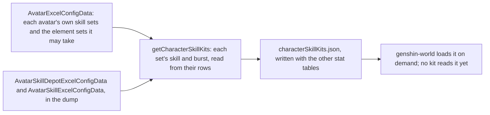
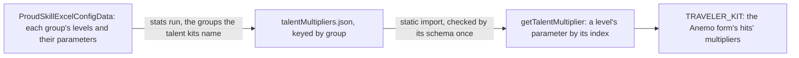

# Character kits

A character's combat kit is its skills, cooldowns, costs and talent multipliers, and the game keeps those in its tables by the character's skill sets. What is built is the table side: each playable character's skill sets, written beside the stat tables by the stats run, and the targeting that turns an action to its enemy. The Traveler's first kit reads its multipliers from the same tables and sits in its own module, and every other character still fights with it until its own module is written. The kits' hits are [combat](/docs/genshin/combat)'s, and the kit's action state machine is documented there too.

## Skill sets

A character has one skill set in its own form, and a set for each element form its element may take, the one a statue's element picks. A set holds a skill, the character's elemental skill, and a burst, its energy skill, each read from the skill table by its id. The skill has a cooldown and its charges, the burst a cooldown, an energy cost and the element it deals, the element its energy is named as.

- **A set with neither a skill nor a burst is left out.** A character none of whose sets has either is left out too. One of the Traveler's element sets, 705, holds neither in this dump, so the dump gives the Traveler no form for it.
- **A burst's element is the one its energy names, when it names one of the seven.** A burst that costs no element has none. Which set a Traveler's kit reads is for the element a statue gives, which is not built yet.
- **The Traveler's Anemo set** holds a skill of 5 seconds, one charge, and a burst of 15 seconds for 60 energy, which are the numbers `TRAVELER_KIT` reads beside its hits.
- **The table is written by** `pnpm -C scripts genshin:assets stats`, the same run as the characters, weapons and artifacts. Each character is checked against the world's schema as it is written.

## Talent multipliers

Each combat talent's multipliers are written per level by the same run, into `talentMultipliers.json`, keyed by the talent's proud skill group. A level keeps its parameters (`paramList`) up to the last one that is not zero, each with the text id labelling it (`paramDescList`), so a read past that point is zero. The table is loaded synchronously by `getTalentMultiplier`, which reads a parameter by its index. It holds the groups the talent kits name, 352 of them, and a level past 10 is the constellation's.

## Targeting

An action turns the body to the enemy it targets as it starts. That is the living enemy inside the action's targeting area scoring highest, where an enemy's score is 0.7 times its nearness to the body within the area's radius, plus 0.3 times its nearness to straight ahead, the angle from the body's facing over a half-turn. An enemy more than 2 metres above or below the body scores a fifth of that. Enemies outside the area, and the dead, are not targeted. The view, current-target and priority coefficients are not built.

## The Traveler's kit

`TRAVELER_KIT`, in the Traveler's character module, is the first kit, at talent level 1. Its hitmarks and seconds are gcsim v2.47.2's frames, and the plunges' poise is gcsim's pyro plunge's. gcsim sets no poise on the Anemo skill or burst, so both hit with none. Its strikes' poise is not in that file, so each is provisional, as are the charged attack's and the plunge collision's.

Its multipliers are read from the Anemo form's proud skill groups, 731 for the attacks, 732 for Palm Vortex and 739 for Gust Surge. Those agree with the wiki's values to two decimal places. The charged attack's second hit is 731's 0.7224, where the male form's group 730 gives 0.60716, so the kit reads 731 for it.

A hit can name its own element, which strikes the enemy as that element whatever the character's own is. The Traveler's hits name none, so they deal the element of the Traveler's form, which is none until a statue gives one.

## Character modules

Each character with a module has one file under `services/kit/characters/`, exporting its kit shaped like `TRAVELER_KIT`. `CharacterIdKitMap` keys them by avatar id, and a character with none fights with the Traveler's kit.

- **Diluc** (`DILUC_KIT`, avatar 10000016): four strikes, a charged attack, a collision and two plunges, Searing Onslaught's first press, and Dawn's slashing hit. Its multipliers are read from proud skill groups 1631, 1632 and 1639, and match the wiki's Tempered Sword and gcsim's level-1 values to two decimal places. Dawn's infusion and the A4 passive are built, as the shared effects below.
- **Mona** (`MONA_KIT`, avatar 10000041): four strikes, a charged attack, a collision and two plunges, all Hydro catalyst hits, Mirror Reflection of Doom and Stellaris Phantasm's bubble. Its multipliers are read from proud skill groups 4131 and 4132, and match the wiki's Ripple of Fate and Mirror Reflection of Doom values to two decimal places. Mirror Reflection is a summon, built as the shared effects below; the bubble's Hydro is built, its explosion is not.
- **Bennett** (`BENNETT_KIT`, avatar 10000032): five strikes, a charged attack, a collision and two plunges, Passion Overload's press, and Fantastic Voyage's damage. Its multipliers are read from proud skill groups 3231, 3232 and 3239, and match the wiki's Strike of Fortune, Passion Overload and Fantastic Voyage values to two decimal places. Fantastic Voyage's field, its heal, its ATK bonus and its self infusion are built, as the shared effects below.

## Shared effects

Each effect is on the party, in a list the character component holds, so a switch leaves it running, and a drown or a jump clears it. Each one is ticked each step.

- **Damage** is a hit: its talent multiplier, its gauge of an element, and the element it names when it is not its character's own. A hit with no internal cooldown applies its whole gauge, and one under a cooldown shares it through it.
- **Infusion** makes the character's normal attacks, charged attack and plunges deal its element at the gauge the hit gives it, 1U for a strike and 0U for a collision. It is refreshed by a second one of its kind on the same character, not stacked.
- **Buff** adds a stat bonus to the character's pricing for its seconds: a flat ATK adds to its attack and any other bonus to its attribute total. It is refreshed the same way.
- **Heal** is `healPartyMember`: a share of a standing member's max HP, never above all of it. A downed member stays down, as only a revive brings one back.
- **Energy** is the party's `gainPartyEnergy`, which an enemy's drop already calls.
- **Field** is a circle placed where its character casts, for its seconds, with a tick on a schedule. Each tick runs while the body stands inside it, reading the character on the field and the team, and a tick's own buffs and infusions start at their full seconds.
- **Summon** is an entity cast where its character stands, which lands its own hits on the seconds their hitmarks fall at, for its seconds. It is priced by the combatant that cast it, as it stood then, and its hits land from its own body, not the character's.
- **Dawn's damage-over-time and explosion** are not built. They move with a box a fixed summon does not hold.

## Decisions

- **A kit's action carries its start.** A kit action may name an `onStart` that adds its effects, given the body and the character's combatant, so a module writes what its burst or skill sets going without the framework knowing which.
- **A character's ascension phase is on its combatant.** A passive reads `combatant.ascension` against the phase its table names, so the Diluc A4 gate is `ascension >= 4`.
- **Searing Onslaught's presses share one action.** The first press is the kit's skill. The second and third presses, and the four-second window that holds them, are not built, so the skill is one press at its cooldown.
- **Dawn's slash is the burst's only hit.** Its damage-over-time and explosion land later from a moving box, which a summon would hold; they wait on the summons above.
- **The charged attack's timing is provisional.** gcsim does not model it and the wiki's talent page gives no frames, so its slashes land at half a second and a second, and it ends at a second and a fifth. Its damage is the wiki's cyclic 68.8% and final 124.7%, and its poise the wiki's 60 and 120.
- **Its stamina is one cost.** The wiki's charged attack drains 40 stamina a second for up to 5 seconds. The kit charges 40 once, since a drain is not built.
- **Boxes are circles.** An area holds a fan or a circle, so a box is priced as the circle to its farthest corner, provisional until areas hold boxes.
- **Poise is the wiki's where gcsim gives none.** gcsim sets no poise on Diluc's skill, burst or collision; the wiki's advanced properties give 120, 100 and 35.
- **A collision infused at 0U still deals the element.** A hit's element no longer needs a gauge, so the collision's Pyro damage lands with no aura, as the wiki's table gives it.
- **Diluc's A1 and the phase-0 passive are not built.** gcsim models no combat effect for either.
- **A field's tick reads the character on the field.** Fantastic Voyage's heal and ATK bonus go to the character standing in the circle, not to each member of the team, as gcsim applies them.
- **Bennett's heal ignores Healing Bonus.** The heal is the table's flat HP plus its share of Bennett's max HP, unscaled.
- **Mona's strikes are priced round her body.** gcsim centres them on the primary target, which an area does not hold yet. Her plunges' reach is provisional, as gcsim has no plunge file for her.
- **Mona's A1 and A4 are not built.** A1 casts a phantom from her dash, which the kit does not hold. A4 raises her Hydro bonus by 20% of her Energy Recharge, a standing bonus with no hook to read it yet.
- **Stellaris Phantasm's explosion is not built.** Its damage, the Omen it leaves and the damage bonus wait on the enemy's statuses, so the bubble applies its Hydro and no damage.
- **Bennett's A1 and A4 are not built.** Both cut Passion Overload's cooldown, which the kit holds as one value, and A4 also stops a level-2 hold from launching Bennett. Passion Overload's hold levels are not built either.

## Key files

| File                                                                    | Role                                                                                   |
| :---------------------------------------------------------------------- | :------------------------------------------------------------------------------------- |
| `packages/genshin-world/src/models/character/SkillDepot.ts`             | A skill set: its skill's cooldown and charges, its burst's cooldown, cost and element  |
| `packages/genshin-world/src/models/character/CharacterSkillKit.ts`      | A playable character's skill sets by its id                                            |
| `scripts/src/services/genshinAssets/stats/getCharacterSkillKits.ts`     | Every playable character's skill sets, from the dump's tables                          |
| `scripts/src/services/genshinAssets/stats/toSkillDepot.ts`              | One skill set, from its depot row and the skill rows                                   |
| `scripts/src/services/genshinAssets/stats/toTalentMultiplierMap.ts`     | Each named talent group's levels, parameters and labels                                |
| `packages/genshin-world/src/generated/stats/characterSkillKits.json`    | The written table the app loads on demand                                              |
| `packages/genshin-world/src/generated/stats/talentMultipliers.json`     | The talent multipliers per level, loaded statically                                    |
| `packages/genshin-world/src/services/kit/getTalentMultiplier.ts`        | A talent's parameter at a level, by its index                                          |
| `packages/genshin-world/src/services/kit/selectAttackTarget.ts`         | The targeting score an action turns the body to                                        |
| `packages/genshin-world/src/services/kit/characters/travelerKit.ts`     | `TRAVELER_KIT`, the Traveler's Anemo kit                                               |
| `packages/genshin-world/src/services/kit/characters/bennettKit.ts`      | `BENNETT_KIT`, Bennett's kit with Fantastic Voyage's field                             |
| `packages/genshin-world/src/services/kit/effects/stepKitField.ts`       | A field's schedule, run on each step, ticking while the body stands in it              |
| `packages/genshin-world/src/services/kit/characters/monaKit.ts`         | `MONA_KIT`, Mona's kit with Mirror Reflection's summon                                 |
| `packages/genshin-world/src/services/kit/effects/stepKitSummon.ts`      | A summon's clock, landing the hits whose hitmarks fall within each step                |
| `packages/genshin-world/src/services/kit/characters/dilucKit.ts`        | `DILUC_KIT`, Diluc's kit with Dawn's infusion and A4                                   |
| `packages/genshin-world/src/services/kit/CharacterIdKitMap.ts`          | Each built character's kit by avatar id, read by the roster                            |
| `packages/genshin-world/src/services/kit/effects/addKitEffect.ts`       | Adds an effect, refreshing one of its kind on the same character                       |
| `packages/genshin-world/src/services/kit/effects/stepKitEffects.ts`     | Runs the effects' seconds down and drops those that run out                            |
| `packages/genshin-world/src/services/kit/effects/getInfusedElement.ts`  | The element a character's normal attacks, charged attack and plunges are infused with  |
| `packages/genshin-world/src/services/kit/effects/infuseKitHits.ts`      | Infuses a step's landed hits from the kit's normal attacks, charged attack and plunges |
| `packages/genshin-world/src/services/kit/effects/getBuffedCombatant.ts` | The combatant with its buffs added to the pricing                                      |
| `packages/genshin-world/src/services/kit/constants.ts`                  | The targeting weights and the kit's shared timing constants                            |
| `packages/genshin-world/src/services/party/healPartyMember.ts`          | Heals a standing member up to all its HP                                               |

## Sources

- [gcsim v2.47.2](https://github.com/genshinsim/gcsim/tree/v2.47.2/internal/characters/traveler/common), MIT: the Traveler's anemo attack, skill and burst frames, and the plunges' poise in its pyro plunge file.
- [Tempered Sword](https://genshin-impact.fandom.com/wiki/Tempered_Sword), Genshin Impact Wiki: Diluc's advanced properties (gauge, internal cooldown, poise, blunt) and the charged attack's and plunges' values.
- [Searing Onslaught](https://genshin-impact.fandom.com/wiki/Searing_Onslaught), [Dawn](https://genshin-impact.fandom.com/wiki/Dawn) and [Elemental Gauge Theory: Character Data](https://genshin-impact.fandom.com/wiki/Elemental_Gauge_Theory/Character_Data), Genshin Impact Wiki: the skill's and burst's gauges and poise, and the infused collision's 0U.
- [gcsim v2.47.2](https://github.com/genshinsim/gcsim/tree/v2.47.2/internal/characters/diluc), MIT: Diluc's strikes', skill's, burst's and plunges' hitmarks, cancel frames and areas, and the burst's infusion and A4.
- [Strike of Fortune](https://genshin-impact.fandom.com/wiki/Strike_of_Fortune), [Passion Overload](https://genshin-impact.fandom.com/wiki/Passion_Overload) and [Fantastic Voyage](https://genshin-impact.fandom.com/wiki/Fantastic_Voyage), Genshin Impact Wiki: Bennett's advanced properties, gauges, poise and the field's heal and ATK bonus.
- [gcsim v2.47.2](https://github.com/genshinsim/gcsim/tree/v2.47.2/internal/characters/bennett), MIT: Bennett's hitmarks, cancel frames, areas and the field's ticks.
- [Ripple of Fate](https://genshin-impact.fandom.com/wiki/Ripple_of_Fate), [Mirror Reflection of Doom](https://genshin-impact.fandom.com/wiki/Mirror_Reflection_of_Doom) and [Stellaris Phantasm](https://genshin-impact.fandom.com/wiki/Stellaris_Phantasm), Genshin Impact Wiki: Mona's advanced properties, gauges, poise and the phantom's values.
- [gcsim v2.47.2](https://github.com/genshinsim/gcsim/tree/v2.47.2/internal/characters/mona), MIT: Mona's strikes', charged attack's and skill's hitmarks, cancel frames and areas, and the phantom's ticks and explosion.
- [AnimeGameData](https://github.com/DimbreathBot/AnimeGameData), the community's per-patch dump: the avatar, skill depot and skill tables the table is read from, and the proud skill table the multipliers are read from.
