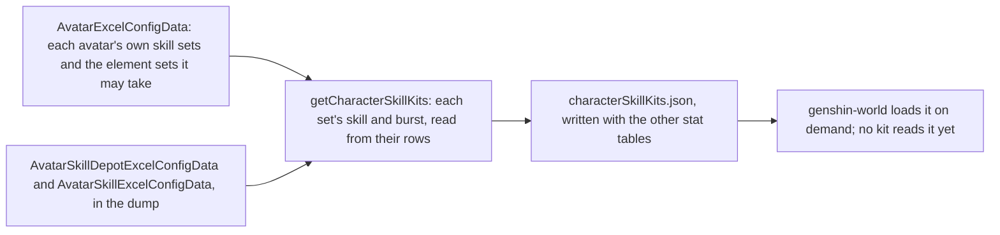

# Character kits

A character's combat kit is its skills, cooldowns, costs and talent multipliers, and the game keeps those in its tables by the character's skill sets. The Traveler's first kit is typed beside its hits, and every character on the roster fights with it until a kit reads its own. What is built is the table side: each playable character's skill sets, written beside the stat tables by the stats run, and the targeting that turns an action to its enemy. The kits' hits are [combat](/docs/genshin/combat)'s, and the kit's action state machine is documented there too.

## Skill sets

A character has one skill set in its own form, and a set for each element form its element may take, the one a statue's element picks. A set holds a skill, the character's elemental skill, and a burst, its energy skill, each read from the skill table by its id. The skill has a cooldown and its charges, the burst a cooldown, an energy cost and the element it deals, the element its energy is named as.

- **A set with neither a skill nor a burst is left out.** A character none of whose sets has either is left out too. One of the Traveler's element sets, 705, holds neither in this dump, so the dump gives the Traveler no form for it.
- **A burst's element is the one its energy names, when it names one of the seven.** A burst that costs no element has none. Which set a Traveler's kit reads is for the element a statue gives, which is not built yet.
- **The Traveler's Anemo set** holds a skill of 5 seconds, one charge, and a burst of 15 seconds for 60 energy, which are the numbers `TRAVELER_KIT` types beside its hits.
- **The table is written by** `pnpm -C scripts genshin:assets stats`, the same run as the characters, weapons and artifacts. Each character is checked against the world's schema as it is written.

## Targeting

An action turns the body to the enemy it targets as it starts. That is the living enemy inside the action's targeting area scoring highest, where an enemy's score is 0.7 times its nearness to the body within the area's radius, plus 0.3 times its nearness to straight ahead, the angle from the body's facing over a half-turn. An enemy more than 2 metres above or below the body scores a fifth of that. Enemies outside the area, and the dead, are not targeted. The view, current-target and priority coefficients are not built.

## The Traveler's kit

`TRAVELER_KIT` is the first kit, at talent level 1. Its hitmarks and seconds are gcsim v2.47.2's frames, and the plunges' poise is gcsim's pyro plunge's. gcsim sets no poise on the Anemo skill or burst, so both hit with none. Its strikes' poise is not in that file, so each is provisional, as are the charged attack's and the plunge collision's.

## Key files

| File                                                                 | Role                                                                                  |
| :------------------------------------------------------------------- | :------------------------------------------------------------------------------------ |
| `packages/genshin-world/src/models/character/SkillDepot.ts`          | A skill set: its skill's cooldown and charges, its burst's cooldown, cost and element |
| `packages/genshin-world/src/models/character/CharacterSkillKit.ts`   | A playable character's skill sets by its id                                           |
| `scripts/src/services/genshinAssets/stats/getCharacterSkillKits.ts`  | Every playable character's skill sets, from the dump's tables                         |
| `scripts/src/services/genshinAssets/stats/toSkillDepot.ts`           | One skill set, from its depot row and the skill rows                                  |
| `packages/genshin-world/src/generated/stats/characterSkillKits.json` | The written table the app loads on demand                                             |
| `packages/genshin-world/src/services/kit/selectAttackTarget.ts`      | The targeting score an action turns the body to                                       |
| `packages/genshin-world/src/services/kit/constants.ts`               | `TRAVELER_KIT` and the targeting weights                                              |

## Sources

- [gcsim v2.47.2](https://github.com/genshinsim/gcsim/tree/v2.47.2/internal/characters/traveler/common), MIT: the Traveler's anemo attack, skill and burst frames, and the plunges' poise in its pyro plunge file.
- [AnimeGameData](https://github.com/DimbreathBot/AnimeGameData), the community's per-patch dump: the avatar, skill depot and skill tables the table is read from.
