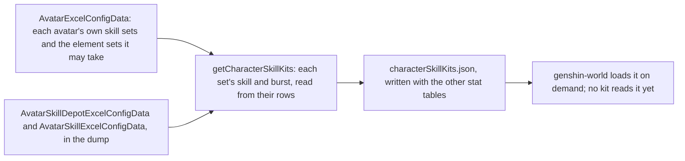
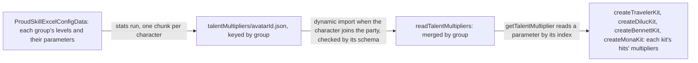

# Character kits

A character's combat kit is its skills, cooldowns, costs and talent multipliers, and the game keeps those in its tables by the character's skill sets. What is built is the table side: each playable character's skill sets, written beside the stat tables by the stats run, and the targeting that turns an action to its enemy. The Traveler's first kit reads its multipliers from the same tables and sits in its own module, as Diluc's, Bennett's and Mona's do, and a character with no module of its own fights with the Traveler's kit until one is written. The kits' hits are [combat](/docs/genshin/combat)'s, and the kit's action state machine is documented there too.

## Skill sets

A character has one skill set in its own form, and a set for each element form its element may take, the one a statue's element picks. A set holds a skill, the character's elemental skill, and a burst, its energy skill, each read from the skill table by its id. The skill has a cooldown and its charges, the burst a cooldown, an energy cost and the element it deals, the element its energy is named as.

- **A set with neither a skill nor a burst is left out.** A character none of whose sets has either is left out too. One of the Traveler's element sets, 705, holds neither in this dump, so the dump gives the Traveler no form for it.
- **A burst's element is the one its energy names, when it names one of the seven.** A burst that costs no element has none. Which set a Traveler's kit reads is for the element a statue gives, which is not built yet.
- **The Traveler's Anemo set** holds a skill of 5 seconds, one charge, and a burst of 15 seconds for 60 energy. `createTravelerKit` writes the same numbers beside its hits rather than reading them from this table, which no kit reads yet.
- **The table is written by** `pnpm -C scripts genshin:assets stats`, the same run as the characters, weapons and artifacts. Each character is checked against the world's schema as it is written.

## Talent multipliers

The stats run writes each playable character's combat talent multipliers into a chunk of its own, `talentMultipliers/<avatarId>.json`, keyed by the talent's proud skill group. A level keeps its parameters (`paramList`) up to the last one that is not zero, so a read past that point is zero. The labels, the text id naming each parameter (`paramDescList`), go apart into `talentLabels/<avatarId>.json`, which the talents screen loads when it opens and the combat table never carries.

`TalentMultiplierLoaderMap` is keyed by avatar id and imports a chunk on demand. `readTalentMultipliers` checks each chunk against its schema and merges it by group, and `getTalentMultiplier` reads a parameter from the merged table by its index. The world loads the deployed team's multipliers as it starts and again whenever the team changes, and a kit is built from the loaded table, so the world's entry carries none of them. The one static import this replaced was 1.4 MB of it.

## Targeting

An action turns the body to the enemy it targets as it starts. That is the living enemy inside the action's targeting area scoring highest, where an enemy's score is 0.7 times its nearness to the body within the area's radius, plus 0.3 times its nearness to straight ahead, the angle from the body's facing over a half-turn. An enemy more than 2 metres above or below the body scores a fifth of that. Enemies outside the area, and the dead, are not targeted. The view, current-target and priority coefficients are not built.

## The Traveler's kit

`createTravelerKit`, in the Traveler's character module, built from the loaded table, is the first kit, at talent level 1. Its hitmarks and seconds are gcsim v2.47.2's frames, and the plunges' poise is gcsim's pyro plunge's. gcsim sets no poise on the Anemo skill or burst, so both hit with none. Its strikes' poise is not in that file, so each is provisional, as are the charged attack's and the plunge collision's.

Its multipliers are read from the Anemo form's proud skill groups, 731 for the attacks, 732 for Palm Vortex and 739 for Gust Surge. Those agree with the wiki's values to two decimal places. The charged attack's second hit is 731's 0.7224, where the male form's group 730 gives 0.60716, so the kit reads 731 for it.

A hit can name its own element, which strikes the enemy as that element whatever the character's own is. The Traveler's hits name none, so they deal the element of the Traveler's form, which is none until a statue gives one.

## Character modules

Each character with a module has one file under `services/kit/characters/`, exporting a factory that builds its kit from the loaded multipliers, as `createTravelerKit` does. `CharacterIdCreateKitMap` keys them by avatar id, the world builds a character's kit once its chunk has arrived, and a character with none fights with the Traveler's kit.

- **Diluc** (`createDilucKit`, avatar 10000016): four strikes, a charged attack, a collision and two plunges, Searing Onslaught's three presses, and Dawn's slashing hit with its phoenix's ticks and explosion. Its multipliers are read from proud skill groups 1631, 1632 and 1639, and match the wiki's Tempered Sword and gcsim's level-1 values to two decimal places. Dawn's infusion, its phoenix and the A4 passive are built, as the shared effects below.
- **Amber** (`createAmberKit`, avatar 10000021): five arrows, a fully charged aimed shot, a collision and two plunges, Explosive Puppet's Baron Bunny and Fiery Rain. Its multipliers are read from proud skill groups 2131, 2132 and 2139, and match the wiki's Sharpshooter, Explosive Puppet and Fiery Rain values to two decimal places. Baron Bunny is a taunt, built as the shared effects below, and Fiery Rain is a summon of eighteen arrows, with Ascension 1's CRIT Rate and AoE.
- **Kaeya** (`createKaeyaKit`, avatar 10000025): five strikes, a charged attack, a collision and two plunges, Frostgnaw and Glacial Waltz's thirteen icicles. Its multipliers are read from proud skill groups 1531, 1532 and 1539, and match the wiki's Ceremonial Bladework, Frostgnaw and Glacial Waltz values to two decimal places. Glacial Waltz's icicles are a summon, built as the shared effects above.
- **Lisa** (`createLisaKit`, avatar 10000006): four strikes, a charged attack, a collision and two plunges, Violet Arc's press and Lightning Rose's thirty discharges. Its multipliers are read from proud skill groups 431, 432 and 439, and match the wiki's Lightning Touch, Violet Arc and Lightning Rose values to two decimal places. Lightning Rose is a summon, built as the shared effects above.
- **Noelle** (`createNoelleKit`, avatar 10000034): four strikes, a charged attack, a collision and two plunges, Breastplate's press and Sweeping Time's two slashes. Her multipliers are read from proud skill groups 3431, 3432 and 3439, and match the wiki's Favonius Bladework - Maid, Breastplate and Sweeping Time values to two decimal places. Breastplate's shield and Sweeping Time's Geo infusion and ATK bonus are built, as the shared effects below.
- **Mona** (`createMonaKit`, avatar 10000041): four strikes, a charged attack, a collision and two plunges, all Hydro catalyst hits, Mirror Reflection of Doom and Stellaris Phantasm's bubble. Its multipliers are read from proud skill groups 4131 and 4132, and match the wiki's Ripple of Fate and Mirror Reflection of Doom values to two decimal places. Mirror Reflection is a summon, built as the shared effects below; the bubble's Hydro is built, its explosion is not.
- **Bennett** (`createBennettKit`, avatar 10000032): five strikes, a charged attack, a collision and two plunges, Passion Overload's press and its two Charge Levels, and Fantastic Voyage's damage. Its multipliers are read from proud skill groups 3231, 3232 and 3239, and match the wiki's Strike of Fortune, Passion Overload and Fantastic Voyage values to two decimal places. Fantastic Voyage's field, its heal, its ATK bonus and its self infusion are built, as the shared effects below, and A1's and A4's cooldown cuts are built with them.

## Shared effects

Each effect is on the party, in a list the character component holds, so a switch leaves it running, and a drown or a jump clears it. Each one is ticked each step.

- **Damage** is a hit: its talent multiplier, its gauge of an element, and the element it names when it is not its character's own. A hit with no internal cooldown applies its whole gauge, and one under a cooldown shares it through it.
- **Infusion** makes the character's normal attacks, charged attack and plunges deal its element at the gauge the hit gives it, 1U for a strike and 0U for a collision. It is refreshed by a second one of its kind on the same character, not stacked.
- **Buff** adds a stat bonus to the character's pricing for its seconds: a flat ATK adds to its attack and any other bonus to its attribute total. It is refreshed the same way.
- **Heal** is `healPartyMember`: a share of a standing member's max HP, never above all of it. A downed member stays down, as only a revive brings one back.
- **Energy** is the party's `gainPartyEnergy`, which an enemy's drop already calls.
- **Field** is a circle placed where its character casts, for its seconds, with a tick on a schedule. Each tick runs while the body stands inside it, reading the character on the field and the team, and a tick's own buffs and infusions start at their full seconds.
- **Summon** is an entity cast where its character stands, which lands its own hits on the seconds their hitmarks fall at, for its seconds. It is priced by the combatant that cast it, as it stood then, and its hits land from its own body, not the character's. A summon may travel: its body moves forward at its speed from its start on its clock, and its hits are reached from where it is then.
- **Dawn's phoenix** is a travelling summon launched at the slash's hitmark, a metre ahead of the body and moving 14 metres a second. It strikes eight ticks, every 0.2 seconds from its launch, and explodes 1.7 seconds on, 24.8 metres out.
- **A shield** is a character's health that takes damage before the character does, for the seconds left of it, recast over one it already holds. It is a combat shield, so `absorbKitShield` hands the damage to the combat's `absorbShieldDamage`, and it is dropped once its health is spent. An enemy's strike is taken by it first, and the damage past its health is what the character loses.
- **A taunt** is an entity placed where its character cast it, with health, which draws the enemies' strikes while it stands. It explodes once, from its body and priced by the combatant that cast it, when its seconds run out or its health is gone. An enemy within its aggro range strikes it instead of the character, and each strike is taken from its health by `damageKitTaunt`.

## Decisions

- **A kit's action carries its start.** A kit action may name an `onStart` that adds its effects, given the body and the character's combatant, so a module writes what its burst or skill sets going without the framework knowing which.
- **A character's ascension phase is on its combatant.** A passive reads `combatant.ascension` against the phase its table names, so the Diluc A4 gate is `ascension >= 4`.
- **Searing Onslaught's cooldown starts on its first press.** The second and third presses are a chain: each is pressed within four seconds of the one before, and a press inside that window plays its follow-up whatever the cooldown, which the first press set at 10 seconds. The third press closes the chain, and a window that lapses ends it. gcsim sets the cooldown on the first use, and the wiki's lapse path ends a chain with the cooldown already running, so the cooldown always starts on the first press.
- **Dawn's phoenix is priced by the same ICD as its slash.** Its ticks and explosion are 2U of Pyro each under the Elemental Burst internal cooldown, and carry the slash's 100 poise, as gcsim's copy of the attack does. Their area is a circle to the far corner of gcsim's box, provisional until areas hold boxes. gcsim places tick _i_ at 1 + 2.8*i* metres; the phoenix's own clock puts it 2.8 metres further, which the kit follows.
- **The charged attack's timing is provisional.** gcsim does not model it and the wiki's talent page gives no frames, so its slashes land at half a second and a second, and it ends at a second and a fifth. Its damage is the wiki's cyclic 68.8% and final 124.7%, and its poise the wiki's 60 and 120.
- **Its stamina drains a second as it plays.** The table's 40 a second is drained each step of the charge, so its 1.2 seconds cost 48 in all, and the charge starts with any stamina. The game holds the charge up to 5 seconds and stops it when the stamina runs out, which the kit does not model.
- **Boxes are circles.** An area holds a fan or a circle, so a box is priced as the circle to its farthest corner, provisional until areas hold boxes.
- **Poise is the wiki's where gcsim gives none.** gcsim sets no poise on Diluc's skill, burst or collision; the wiki's advanced properties give 120, 100 and 35.
- **A collision infused at 0U still deals the element.** A hit's element no longer needs a gauge, so the collision's Pyro damage lands with no aura, as the wiki's table gives it.
- **Diluc's A1 and the phase-0 passive are not built.** gcsim models no combat effect for either.
- **A field's tick reads the character on the field.** Fantastic Voyage's heal and ATK bonus go to the character standing in the circle, not to each member of the team, as gcsim applies them.
- **Bennett's heal ignores Healing Bonus.** The heal is the table's flat HP plus its share of Bennett's max HP, unscaled.
- **Mona's strikes are priced round her body.** gcsim centres them on the primary target, which an area does not hold yet. Her plunges' reach is provisional, as gcsim has no plunge file for her.
- **Mona's A1 and A4 are not built.** A1 casts a phantom from her dash, which the kit does not hold. A4 raises her Hydro bonus by 20% of her Energy Recharge, a standing bonus with no hook to read it yet.
- **Stellaris Phantasm's explosion is not built.** Its damage, the Omen it leaves and the damage bonus wait on the enemy's statuses, so the bubble applies its Hydro and no damage.
- **Amber's fully charged aimed shot is the bow's charged attack.** Only the fully charged shot deals Pyro, under a charged attack internal cooldown, so the unlit Aimed Shot and its weak-point hits are not built. A bow's `R` aim is not read by the kit, so the shot targets as the others do until the kit reads the aim binding.
- **Fiery Rain's arrows are priced at twice the burst radius.** Each arrow lands at random within a radius of 2 round the burst's centre and is itself a circle of that radius, so a summon's arrow is priced at 4 round the body. Ascension 1, Every Arrow Finds Its Target, adds 10% CRIT Rate, priced on the summon's combatant, and widens the radius by 30%.
- **Baron Bunny lands where Amber stands.** The wiki's throw, 1.4 metres ahead and the hold's distance, is not built, so it is priced round Amber's body. Its HP is 41.36% of Amber's Max HP, from the table.
- **Amber's A4 is not built.** Its ATK bonus after a weak-point hit needs the weak point, which no hit tests yet.
- **Kaeya's groups are 1531, 1532 and 1539, not the talent table's 2531 and 2539.** The table names 2531 for his strikes and 2539 for his icicle, and their level-1 values, 46.6% for the first strike and 54.3% for the icicle, agree with neither the wiki nor gcsim. The 15xx groups carry the wiki's numbers, so the kit reads those; the stats run's choice of group for him is the thing to fix.
- **Frostgnaw's cooldown is the wiki's 6 seconds.** The skill table gives 21 seconds for his skill, which is not its cooldown; the proud skill group 1532 holds the 6, as gcsim's 360 frames do. Frostgnaw's damage against Water, its 4U gauge, is not built, and A1's heal, which scales on ATK, has no share of Max HP to read.
- **Glacial Waltz's activation knockback is not built.** Its 400 poise has no damage and gcsim gives no area for it, so the icicles alone are built.
- **Kaeya's reaches are priced with their offsets.** gcsim centres his strikes, charge and plunges a metre or so ahead of the body, so each reach is its offset plus its radius, or a box's far corner, until an area holds an offset.
- **Lightning Rose's activation deals no damage.** The wiki gives it 0U and 10 poise and no multiplier, so the activation is a poise-only hit. gcsim gives it a multiplier of 0.1 that the table does not, so it is left out.
- **Violet Arc's press cooldown is the wiki's 1 second.** The skill table's 16 seconds is the hold's, which is not built, nor are its Conductive stacks, so the press stands at its own cooldown.
- **A charged attack after a strike skips its windup.** gcsim skips 14 frames of the charge's windup after a normal attack, so the hit lands at 56 frames here, and at 70 from rest, which the kit does not start.
- **Breastplate's shield is set from Noelle's DEF.** It holds 160% of her DEF plus 769 for 12 seconds, and is recast over the one she holds. Its healing (21.28% of her DEF plus 102, on half of the hits it takes) and its C4 explosion are not built.
- **Sweeping Time's converted attacks keep their normal poise.** The wiki's converted strikes and plunges have their own poise, which the kit does not switch to. The Geo infusion and the ATK bonus of 40% of her DEF are built, for 15 seconds past an 80-frame start.
- **Noelle's charged attack is one cycle of its spin and its final slash.** A held spin's cycles are not built, so the charged attack hits once and then once more.
- **A skill with holds starts on its release.** A kit's `elementalSkillHolds` are ordered by their minimum seconds, and a release plays the highest level its held seconds reach, else the press, on that level's cooldown. The press therefore starts when the key is let go, as the game's Charge Levels do, rather than on the press.
- **Passion Overload's Charge Levels' thresholds are provisional.** The hold that reaches Level 1 is 0.5 seconds and Level 2's is 1 second, and no table or wiki page gives them, so a recording of the skill measures them. The hold's hits and explosion, their multipliers and poise, and the cooldowns of 7.5 and 10 seconds are the wiki's and gcsim's.
- **A cooldown multiplier is read as a skill's cooldown starts.** `getSkillCooldownMultiplier` takes the character's ascension, its id, the body and the team's effects, and each skill's cooldown is multiplied by it when the skill starts. Bennett's A1 cuts every Passion Overload by 20%, and A4 halves it while Bennett stands in a field he cast, which a field's `characterId` names.
- **Bennett's A4 no-launch is not built.** Under the field, gcsim's Level 2 hold drops to a 175-frame animation without launching Bennett, and the kit keeps the 343-frame animation the field does not change.
- **Bennett's hold boxes are circles.** The 3 by 3 box of the hold's second hit is priced as the circle to its far corner, 2.12 metres, as the other boxes are.
- **An enemy's strike takes a shield through the combat shield.** `absorbKitShield` prices the strike's damage by `absorbShieldDamage` with the character's shield strength, the rule the combat page gives, so the Geo shield's 150% and the shield strength are the combat's, and the overflow is the damage to HP. The kit keeps no second absorption arithmetic.
- **An enemy strikes the nearest live taunt within its aggro range.** `selectEnemyTaunt` picks, for each enemy on each step, the nearest taunt within `ENEMY_AGGRO_RANGE` ahead of the character, and a taunt with no seconds or no health left is not picked. The taunt takes the damage the strike would deal the active character, as the kit gives a taunt no defence of its own.
- **The team's effects are the world screen's.** The screen holds them, the character on the field steps them, and the enemies and their strikes read them. The character clears them when it unmounts, so a shield or taunt does not outlive the character that cast it.

## Key files

| File                                                                    | Role                                                                                                 |
| :---------------------------------------------------------------------- | :--------------------------------------------------------------------------------------------------- |
| `packages/genshin-world/src/models/character/SkillDepot.ts`             | A skill set: its skill's cooldown and charges, its burst's cooldown, cost and element                |
| `packages/genshin-world/src/models/character/CharacterSkillKit.ts`      | A playable character's skill sets by its id                                                          |
| `scripts/src/services/genshinAssets/stats/getCharacterSkillKits.ts`     | Every playable character's skill sets, from the dump's tables                                        |
| `scripts/src/services/genshinAssets/stats/toSkillDepot.ts`              | One skill set, from its depot row and the skill rows                                                 |
| `scripts/src/services/genshinAssets/stats/toTalentTables.ts`            | Each character's talent groups: their levels, parameters and labels, apart                           |
| `scripts/src/services/genshinAssets/stats/writeTalentTables.ts`         | Each character's chunk and the loader map the world imports them through                             |
| `packages/genshin-world/src/generated/stats/characterSkillKits.json`    | The written table the app loads on demand                                                            |
| `packages/genshin-world/src/generated/talentMultipliers/`               | Each character's multipliers per level, loaded on demand as the character joins                      |
| `packages/genshin-world/src/services/kit/readTalentMultipliers.ts`      | The loaded characters' multipliers, checked and merged by proud skill group                          |
| `packages/genshin-world/src/services/kit/getTalentMultiplier.ts`        | A talent's parameter at a level, by its index                                                        |
| `packages/genshin-world/src/services/kit/selectAttackTarget.ts`         | The targeting score an action turns the body to                                                      |
| `packages/genshin-world/src/services/kit/characters/travelerKit.ts`     | `createTravelerKit`, the Traveler's Anemo kit over the loaded multipliers                            |
| `packages/genshin-world/src/services/kit/characters/bennettKit.ts`      | `createBennettKit`, Bennett's kit with Passion Overload's Charge Levels and Fantastic Voyage's field |
| `packages/genshin-world/src/models/kit/KitSkillHold.ts`                 | A skill's hold level: its action, cooldown and the seconds held to reach it                          |
| `packages/genshin-world/src/models/kit/KitSkillCooldownState.ts`        | What a skill's cooldown reads as it starts, for `getSkillCooldownMultiplier`                         |
| `packages/genshin-world/src/services/kit/effects/stepKitField.ts`       | A field's schedule, run on each step, ticking while the body stands in it                            |
| `packages/genshin-world/src/services/kit/characters/monaKit.ts`         | `createMonaKit`, Mona's kit with Mirror Reflection's summon                                          |
| `packages/genshin-world/src/services/kit/characters/amberKit.ts`        | `createAmberKit`, Amber's kit with Baron Bunny's taunt and Fiery Rain's summon                       |
| `packages/genshin-world/src/services/kit/effects/stepKitTaunt.ts`       | A taunt's explosion, once its seconds or its health run out                                          |
| `packages/genshin-world/src/services/kit/selectEnemyTaunt.ts`           | The nearest live taunt in an enemy's aggro range, which it strikes                                   |
| `packages/genshin-world/src/services/kit/characters/kaeyaKit.ts`        | `createKaeyaKit`, Kaeya's kit with Glacial Waltz's icicles                                           |
| `packages/genshin-world/src/services/kit/characters/lisaKit.ts`         | `createLisaKit`, Lisa's kit with Lightning Rose's discharges                                         |
| `packages/genshin-world/src/services/kit/characters/noelleKit.ts`       | `createNoelleKit`, Noelle's kit with Breastplate's shield and Sweeping Time's buffs                  |
| `packages/genshin-world/src/services/kit/effects/absorbKitShield.ts`    | A shield takes the strike's damage through the combat's absorption                                   |
| `packages/genshin-world/src/services/kit/effects/stepKitSummon.ts`      | A summon's clock, landing the hits whose hitmarks fall within each step                              |
| `packages/genshin-world/src/services/kit/characters/dilucKit.ts`        | `createDilucKit`, Diluc's kit with Searing Onslaught's chain, Dawn's infusion and phoenix            |
| `packages/genshin-world/src/models/kit/KitSkillChain.ts`                | A skill's follow-up presses and the window each press leaves open                                    |
| `packages/genshin-world/src/services/kit/CharacterIdCreateKitMap.ts`    | Each built character's kit factory by avatar id, read by the roster                                  |
| `packages/genshin-world/src/services/kit/effects/addKitEffect.ts`       | Adds an effect, refreshing one of its kind on the same character                                     |
| `packages/genshin-world/src/services/kit/effects/stepKitEffects.ts`     | Runs the effects' seconds down and drops those that run out                                          |
| `packages/genshin-world/src/services/kit/effects/getInfusedElement.ts`  | The element a character's normal attacks, charged attack and plunges are infused with                |
| `packages/genshin-world/src/services/kit/effects/infuseKitHits.ts`      | Infuses a step's landed hits from the kit's normal attacks, charged attack and plunges               |
| `packages/genshin-world/src/services/kit/effects/getBuffedCombatant.ts` | The combatant with its buffs added to the pricing                                                    |
| `packages/genshin-world/src/services/kit/constants.ts`                  | The targeting weights and the kit's shared timing constants                                          |
| `packages/genshin-world/src/services/party/healPartyMember.ts`          | Heals a standing member up to all its HP                                                             |

## Sources

- [gcsim v2.47.2](https://github.com/genshinsim/gcsim/tree/v2.47.2/internal/characters/traveler/common), MIT: the Traveler's anemo attack, skill and burst frames, and the plunges' poise in its pyro plunge file.
- [Tempered Sword](https://genshin-impact.fandom.com/wiki/Tempered_Sword), Genshin Impact Wiki: Diluc's advanced properties (gauge, internal cooldown, poise, blunt) and the charged attack's and plunges' values.
- [Searing Onslaught](https://genshin-impact.fandom.com/wiki/Searing_Onslaught), [Dawn](https://genshin-impact.fandom.com/wiki/Dawn) and [Elemental Gauge Theory: Character Data](https://genshin-impact.fandom.com/wiki/Elemental_Gauge_Theory/Character_Data), Genshin Impact Wiki: the skill's and burst's gauges and poise, and the infused collision's 0U.
- [gcsim v2.47.2](https://github.com/genshinsim/gcsim/tree/v2.47.2/internal/characters/diluc), MIT: Diluc's strikes', skill's, burst's and plunges' hitmarks, cancel frames and areas, and the burst's infusion and A4.
- [Strike of Fortune](https://genshin-impact.fandom.com/wiki/Strike_of_Fortune), [Passion Overload](https://genshin-impact.fandom.com/wiki/Passion_Overload) and [Fantastic Voyage](https://genshin-impact.fandom.com/wiki/Fantastic_Voyage), Genshin Impact Wiki: Bennett's advanced properties, gauges, poise and the field's heal and ATK bonus.
- [gcsim v2.47.2](https://github.com/genshinsim/gcsim/tree/v2.47.2/internal/characters/bennett), MIT: Bennett's hitmarks, cancel frames, areas and the field's ticks.
- [Ripple of Fate](https://genshin-impact.fandom.com/wiki/Ripple_of_Fate), [Mirror Reflection of Doom](https://genshin-impact.fandom.com/wiki/Mirror_Reflection_of_Doom) and [Stellaris Phantasm](https://genshin-impact.fandom.com/wiki/Stellaris_Phantasm), Genshin Impact Wiki: Mona's advanced properties, gauges, poise and the phantom's values.
- [gcsim v2.47.2](https://github.com/genshinsim/gcsim/tree/v2.47.2/internal/characters/mona), MIT: Mona's strikes', charged attack's and skill's hitmarks, cancel frames and areas, and the phantom's ticks and explosion.
- [Sharpshooter](https://genshin-impact.fandom.com/wiki/Sharpshooter), [Explosive Puppet](https://genshin-impact.fandom.com/wiki/Explosive_Puppet) and [Fiery Rain](https://genshin-impact.fandom.com/wiki/Fiery_Rain), Genshin Impact Wiki: Amber's arrows' and shots' poise and gauges, the bunny's explosion, and Fiery Rain's arrows.
- [gcsim v2.47.2](https://github.com/genshinsim/gcsim/tree/v2.47.2/internal/characters/amber), MIT: Amber's arrows', aimed shot's, skill's and burst's hitmarks, cancel frames and areas, and the bunny's explosion.
- [Ceremonial Bladework](https://genshin-impact.fandom.com/wiki/Ceremonial_Bladework), [Frostgnaw](https://genshin-impact.fandom.com/wiki/Frostgnaw) and [Glacial Waltz](https://genshin-impact.fandom.com/wiki/Glacial_Waltz), Genshin Impact Wiki: Kaeya's strikes', charged attack's and plunges' poise, Frostgnaw's gauge and poise, and Glacial Waltz's icicle damage, gauge and poise.
- [gcsim v2.47.2](https://github.com/genshinsim/gcsim/tree/v2.47.2/internal/characters/kaeya), MIT: Kaeya's strikes', charge's, skill's and burst's hitmarks, cancel frames and areas, and the icicles' ticks.
- [Lightning Touch](https://genshin-impact.fandom.com/wiki/Lightning_Touch), [Violet Arc](https://genshin-impact.fandom.com/wiki/Violet_Arc) and [Lightning Rose](https://genshin-impact.fandom.com/wiki/Lightning_Rose), Genshin Impact Wiki: Lisa's strikes', charged attack's and plunges' gauges and poise, Violet Arc's press gauge, poise and cooldown, and Lightning Rose's activation and discharge.
- [gcsim v2.47.2](https://github.com/genshinsim/gcsim/tree/v2.47.2/internal/characters/lisa), MIT: Lisa's strikes', charge's, skill's and burst's hitmarks, cancel frames and areas, and Lightning Rose's discharges.
- [Favonius Bladework - Maid](https://genshin-impact.fandom.com/wiki/Favonius_Bladework_-_Maid), [Breastplate](https://genshin-impact.fandom.com/wiki/Breastplate) and [Sweeping Time](https://genshin-impact.fandom.com/wiki/Sweeping_Time), Genshin Impact Wiki: Noelle's strikes', charged attack's and plunges' poise, Breastplate's gauge, poise and shield, and Sweeping Time's damage, poise and infusion.
- [gcsim v2.47.2](https://github.com/genshinsim/gcsim/tree/v2.47.2/internal/characters/noelle), MIT: Noelle's strikes', charge's, skill's and burst's hitmarks, cancel frames and areas, the shield's size and duration, and Sweeping Time's buff length.
- [AnimeGameData](https://github.com/DimbreathBot/AnimeGameData), the community's per-patch dump: the avatar, skill depot and skill tables the table is read from, and the proud skill table the multipliers are read from.
