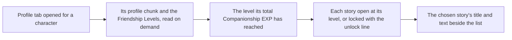

# Character profile

The character screen's Profile tab lists a character's stories down its left, `Character Details`, the five character stories, the pet's story and `Vision` in the game's order, and then its voice-overs in the order the game lists them. It shows the chosen entry's title and text down its right. A story or voice-over opens at the Friendship Level its fetter names. One that waits on another condition, a quest for instance, stays locked whatever the level. The locked list shows the game's unlock line in place of a story's title, or its title alone when no level opens it.

## How it works

`pnpm -C scripts genshin:assets profile` writes each playable character's stories, voice-overs and namecard from the dump, in every language, one chunk a character and language. The panel reads the chunk of the language the screen is in, so a reader downloads only its own language's text.

## Decisions

- **Stories are the fetter story table's rows, one each.** A character's rows are taken in the order the table gives them, by fetter id, and each title and text is the game's own string by its text id, read from the language's text map and English where that map lacks one.
- **Voice-overs are the fetters table's rows, read as stories.** Each row's title is its voice title's text id and its text the line it speaks, so one conversion serves both. The rows the game hides are left out, and the rest keep the table's order by fetter id after the stories.
- **A story or voice-over opens at its Friendship Level.** Its open conditions name the level, and one with no level opens at once. One whose conditions name anything besides a level or none stays locked whatever the level.
- **A locked story with a level to open at shows the game's unlock line,** `Lv. {0} unlocks: {1}`, with that level and its title, and no text. This is the game's own line by its text id, so nothing is phrased here. A locked story no level opens shows its title alone.
- **The tab sits in the character menu's panel,** widened from the characters' row's left edge so the list and the text share it. The reference is the game's separate Profile / Story page with its own header, and that page is not built; the tab's layout and colours are provisional until the user compares them.
- **The namecard is the avatar icon's name with the namecard prefix,** for every playable character but Xinyan, Yae Miko and Momoka, who have none. The writer stores it per character; the namecard view that shows it is not built.
- **The Friendship Level is read from the save's Companionship EXP,** through the [companionship](/docs/genshin/companionship) level table, once the screen is given the save's companionship slice.

## Notes

- **Not drawn yet.** The reference's `Voice:` line with the voice actor, the player's UID, and the character's model in the middle of the page. The model waits on [characters](/docs/genshin/characters), the rest on their own pages.
- **The `Friendship` text** is written with the other game text, but no place in this frame shows it, so nothing draws it yet.

## Key files

| File                                                                       | Role                                                                                         |
| :------------------------------------------------------------------------- | :------------------------------------------------------------------------------------------- |
| `scripts/src/services/genshinAssets/profile/writeProfileText.ts`           | Writes each character's profile chunks and the loader map from the dump                      |
| `scripts/src/services/genshinAssets/profile/toProfileStory.ts`             | A story row's open conditions and its text in one language                                   |
| `scripts/src/models/genshinAssets/profile/ExcelFetterVoiceRow.ts`          | A voice-over row of the fetters table, read as a story row                                   |
| `scripts/src/services/genshinAssets/profile/getNamecardIconName.ts`        | The namecard convention and the characters with none                                         |
| `packages/genshin-world/src/services/profile/ProfileTextLoaderMap.ts`      | The generated loader of each character's chunk, imported on demand                           |
| `packages/genshin-world/src/services/profile/readCharacterProfile.ts`      | Reads a character's profile and its Friendship Level                                         |
| `packages/genshin-world/src/services/profile/isProfileStoryUnlocked.ts`    | The unlock rule                                                                              |
| `packages/genshin-world/src/services/profile/toCharacterProfileEntries.ts` | Turns the stories and voice-overs into the panel's entries, locked ones with the unlock line |
| `packages/genshin-world/src/components/Character/Profile/Index.vue`        | The wrapper that loads the profile for the screen's character                                |
| `packages/genshin-world/src/components/Character/Screen/Index.vue`         | Opens the Profile tab for the chosen character                                               |
| `packages/genshin-interface/src/components/CharacterMenuProfile/Index.vue` | The list and the chosen story's text                                                         |
