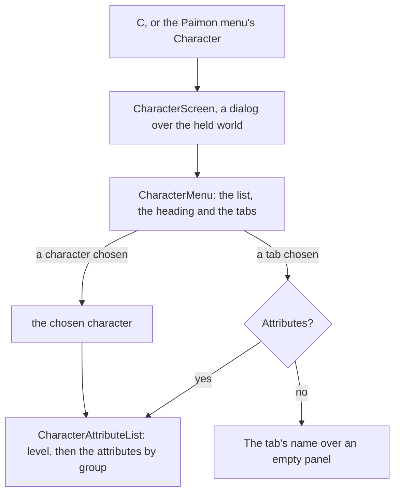

# Character screen

In the game, `C` opens the character screen: the player's characters down its left, one chosen, and six tabs down its right, Attributes, Weapons, Artifacts, Constellation, Talents and Profile, each showing a panel for the chosen character. The structure and its logic are built; its look is provisional until its passes measure it ([parity](/docs/genshin/parity)).

## How it works

- **A frame with no words of its own.** `CharacterMenu`, in `genshin-interface`, draws the frame: the characters down the left, each a button naming the character, the open tab's name over the chosen character's name, the tabs down the right in the game's order (`CharacterMenuTabs`), and the open tab's panel as its slot. The chosen character and the open tab are its two models. Every word is a prop, so the interface package needs no game text and no world data.
- **The world's screen fills it.** `CharacterScreen`, in `genshin-world`, takes the player's characters, the one on the field, the game's words and the party's stamina. It opens on the character on the field and on Attributes, names each tab by the game's own text (`CharacterMenuTabGameTextKeyMap`) and the Traveler by the game's own word for them, and draws the Attributes tab's panel. It is a dialog over the held world with a way back, and the screens' rule closes it on `Escape`, a pad's cancel or `C` again ([screens](/docs/genshin/screens)).
- **The Attributes tab is the game's sums.** `CharacterAttributeList` shows the character's level over its phase's cap, in the game's `Lv.` wording, then its attributes in the three groups the game's details sort them into, each group titled in the game's words: Max HP, ATK, DEF, Elemental Mastery and Max Stamina whole; CRIT Rate, CRIT DMG, Healing Bonus and Energy Recharge; and each element's DMG Bonus and Physical's, each a percentage to one place. Every value comes from [character attributes](/docs/genshin/character-attributes).

## Key files

| File                                                                              | Role                                                     |
| :-------------------------------------------------------------------------------- | :------------------------------------------------------- |
| `packages/genshin-interface/src/components/CharacterMenu/Index.vue`               | The frame: the list, the heading, the tabs and the panel |
| `packages/genshin-interface/src/models/CharacterMenuTab.ts`                       | The six tabs, and their order down the screen            |
| `packages/genshin-world/src/components/Character/Screen/Index.vue`                | The screen: the words, the characters and the way back   |
| `packages/genshin-world/src/components/Character/AttributeList/Index.vue`         | The Attributes tab's level and attributes by group       |
| `packages/genshin-world/src/services/character/CharacterMenuTabGameTextKeyMap.ts` | Each tab's name in the game's text                       |
| `packages/genshin-world/src/services/character/constants.ts`                      | The Traveler's id and the advanced and elemental groups  |

## Notes

- **Its look is provisional.** Every place, size and colour of the frame and the tab is marked so in its style, until a recording of the English client's character screen is referenced and its passes measure it.
- **Only the Traveler has a name.** The roster's other characters are named by the game's text once the roster's names are referenced.

## Sources

- [Character Menu](https://genshin-impact.fandom.com/wiki/Character/Menu), Genshin Impact Wiki: `C`, the list of characters, the six tabs and what each shows, and the Attributes tab's summary and details.
