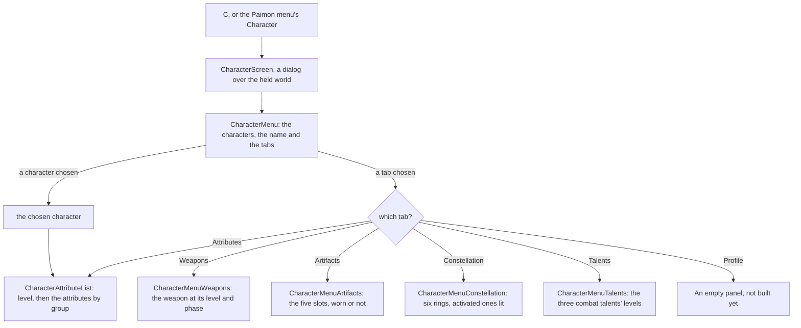

# Character screen

In the game, `C` opens the character screen: the player's characters across its top, one chosen, six tabs down its left, Attributes, Weapons, Artifacts, Constellation, Talents and Profile, and the open tab's panel down its right. The layout is measured off the English PC client's own frame (below). The look is provisional until the passes measure the colours, the portraits and the element's background. Each tab the recording shows is scored against its own frame of it, in the Notes.

## How it works

- **A frame with no words of its own.** `CharacterMenu`, in `genshin-interface`, draws the frame: the characters across the top, each a button naming the character, the chosen character's name at the top left, the six tabs down the left in the game's order (`CharacterMenuTabs`) with the open one lit, and the open tab's panel down the right as its slot. The chosen character and the open tab are its two models. Every word is a prop, so the interface package needs no game text and no world data.
- **The world's screen fills it.** `CharacterScreen`, in `genshin-world`, takes the player's characters, the one on the field, the game's words, the party's stamina and the stat tables the world screen has read before it opens ([character attributes](/docs/genshin/character-attributes)). It opens on the character on the field and on Attributes, names each tab by the game's own text (`CharacterMenuTabGameTextKeyMap`) and the Traveler by the game's own word for them, and draws the open tab's panel: the Attributes list, or one of the four panels below. It is a dialog over the held world with a way back, and the screens' rule closes it on `Escape`, a pad's cancel or `C` again ([screens](/docs/genshin/screens)).
- **The Attributes tab is the game's sums.** `CharacterAttributeList` shows the character's name, its level over its phase's cap in the game's `Lv.` wording, the experience bar, then its base five attributes: Max HP, ATK, DEF, Elemental Mastery and Max Stamina, whole. The advanced group (CRIT Rate, CRIT DMG, Healing Bonus and Energy Recharge) and each element's DMG Bonus with Physical's sit beneath, each a percentage to one place, under their titles. Every value comes from [character attributes](/docs/genshin/character-attributes).
- **The four other panels are `genshin-interface` components, filled from the systems.** `CharacterMenuWeapons` takes the weapon's name by its text id, its rarity, its base ATK and secondary attribute at its level and phase, each attribute's lines summed as the Attributes tab sums them (`getGrownAttributeLines`, `computeCharacterAttributes`), the secondary written whole or as a percentage by its kind, the level over its phase's cap, its refinement rank and its ascension phase. `CharacterMenuArtifacts` takes which of the five slots are worn, in the game's order. `CharacterMenuConstellation` takes which of the six are activated, from the character's count. `CharacterMenuTalents` takes the three combat talents' levels, the normal attack, the Elemental Skill and the Burst. Each is a prop-only frame with the game's words left out, since the game's text for their labels and names is not decoded yet.
- **A slot for the host's own interface.** The screen lays its default slot over itself with the character it shows, outside the game's own screen, which its fixture never fills. The world fills it with the [official model's loader](/docs/genshin/characters), our own control rather than the game's.

## Layout

Measured off the reference frame at 21:9, 3440 by 1440 pixels, in units: a pixel at 1440 high is 0.75 units, so the frame is 2580 units wide. Anchored pieces are placed from the edge they ride on, as the game places them.

| Piece                     | Place (units)                                                                                                          |
| :------------------------ | :--------------------------------------------------------------------------------------------------------------------- |
| Characters across the top | 69-unit portraits on a 96-unit pitch, the first's centre 643 from the left, centre 47 from the top                     |
| Chosen character's name   | Left 216, centre 47 from the top                                                                                       |
| Tabs down the left        | Diamonds centred at 195, words at 225, 69-unit rows from 154; the open one's pill 165 from the left, 352 wide, 56 high |
| Panel                     | Left 2057, right margin 195 (its right edge is the frame's), 330 wide, top 124                                         |
| Way back                  | Centre 149 from the right, 49 from the top                                                                             |

## Decisions

- **The layout is the reference's.** The earlier frame drew the characters down the left and the tabs down the right; the game draws them the other way round. It was read off the user's own recording of the current build at 21:9 (`captures/session-2.mp4`, its English text, 49.9 frames a second), the character screen from about 154 seconds on, every tab in turn.
- **The panel is anchored to the right edge.** It moves with the window's width. Where the game anchors it at 16:9 is not measured yet: the reference is 21:9 only.
- **The name has no element prefix yet.** The game writes the element before the name (`Geo / Xilonen`). That needs the element on `CharacterMenuEntry`, which is not built, so the breadcrumb shows the name alone.
- **The open tab's pill slides.** At 158 seconds the pill is still moving from Constellation to Talents while Talents' text is already bold, and by 159 seconds the pill has faded out of its old place. The slide is not measured yet; it waits on the recording named in the roadmap.
- **Profile's red alert is not drawn.** The game marks Profile with a red alert when something waits there; its trigger is not built.
- **No heading over the panel.** The game draws the open tab's name nowhere on this frame; the lit row on the left says it.
- **Portraits are name circles.** The game's portraits are its own art, an asset the rules keep out of the repository; the circles stand in until a derived one is settled.
- **The background is one element's tint, per tab.** Each tab draws its own backdrop, a four-stop vertical gradient sampled from that tab's reference frame (numbers only, never the image) and held in `CharacterMenu`'s style. Profile has no reference frame, so it keeps Geo's radial tint. Each element has its own tint in the game, which is not built.
- **The player's UID is not drawn.** The reference shows it under the panel; it is the player's own data.

## Notes

- **Five states are scored, each a frame of the same recording.** `Character/Screen` fixes the roster of fifteen characters, the Traveler among them, with Xilonen chosen at level 90 and phase six, and its stat tables read by `readStatTables` from the hosted game data's local mirror. `initialTab` opens the screen on the tab the reference shows, and the fixture's `variants` open it on the other four. Each reference is a frame of the user's recording of the current build (`session-2.mp4`) at 21:9, the tab settled, and it is scored over the whole frame and the tab column:

| Tab open            | Reference | Whole frame, mean / FLIP              | Tab column, mean / FLIP              |
| :------------------ | :-------- | :------------------------------------ | :----------------------------------- |
| Attributes, Xilonen | 154.4 s   | 7.78% / 0.3535 (was 8.10% / 0.3570)   | 6.37% / 0.3096 (was 7.26% / 0.3337)  |
| Weapons             | 156 s     | 10.21% / 0.4153 (was 10.91% / 0.4369) | 7.39% / 0.3384 (was 6.94% / 0.3201)  |
| Artifacts           | 157.5 s   | 10.44% / 0.4314 (was 13.01% / 0.5022) | 7.93% / 0.3583 (was 6.73% / 0.3174)  |
| Constellation       | 158.3 s   | 6.74% / 0.2813 (was 23.13% / 0.7374)  | 5.32% / 0.2054 (was 27.18% / 0.8279) |
| Talents             | 159 s     | 7.94% / 0.3512 (was 11.56% / 0.4587)  | 6.94% / 0.3231 (was 6.42% / 0.3055)  |

Attributes stayed at 8.10% (FLIP 0.3570) before the per-tab backdrop, and Xilonen's record now holds the Weapons and Talents frames' state (Peak Patrol Song at level 90, refinement five, and talents at 10, 13 and 13), which moves no Attributes figure by more than 0.01 (the panel's row, 7.96% to 7.97%). The four panels are drawn in this pass. Their whole-frame means barely move, while their shape rises: Weapons 0.334 to 0.477, Artifacts 0.347 to 0.477, Constellation 0.330 to 0.387, Talents 0.434 to 0.463. The Attributes, Weapons and Talents tab columns do not move, since the pill and words are the same.

The Artifacts and Constellation references do not show their tabs, so their whole-frame scores cannot show their panels. The 157 second frame was mid-slide, with Weapons still lit and its Weapons panel still drawn, so Artifacts is re-timed to 157.5 seconds, where its tab has settled. The Constellation tab's node list is still fading in at 158 seconds, so it is re-timed to 158.3 seconds, where the list is drawn in full. Their tab-column references, `character-artifacts-tabs` and `character-constellation-tabs`, are re-timed the same way, to 157.5 and 158.3 seconds. Artifacts' column moves from 6.90% to 6.73% (FLIP 0.3196 to 0.3174; its shape falls from 0.505 to 0.478). Constellation's column rises from 6.90% to 27.18% (FLIP 0.3190 to 0.8280), and that rise is the held scene, not the tabs: at 158.3 seconds the column's left is dark brown where the flat tint is gold, while the old 157.5 second frame was gold, so its 6.90% was the scene agreeing with the tint. The pill's slide is provisional until it is timed off a recording (the owed clip `menu-character.mkv`, and the Profile still on the roadmap's Recordings owed list).

- **The Constellation panel is drawn.** Its six rings sit where the tab's list is at 158.3 seconds: 72 units across, their centres 111 units apart down the panel on an arc that bows right at the middle, all six lit, as Xilonen's record now holds all six constellations (`constellationCount` 6). The whole frame's mean moves from 23.19% to 23.13% (FLIP 0.7391 to 0.7374, shape 0.538 to 0.624), and the tab column stays at 27.18% under the flat tint, since the panel sits outside it. The per-tab backdrop then brings the column to 5.32%. The icons are the game's art, which the rules keep out of the repository, and the names wait on the game's text, so neither is drawn.
- **The rest of the frame is the game's scene, a floor for now.** The middle is the held scene: the golden beams and particles and the character's model, which rises over 154.4 to 155.6 seconds and is the game's art, so the screen draws each tab's backdrop from its reference's scene and nothing more. The backdrop is sampled over the whole frame less its head band and its foot, as the median of six horizontal bands: the panels and the tab column are text over the scene, with no fill of their own in the reference. Sampling only the area the panels leave bare scored worse on every tab column but one, so it was not kept.
- **Not drawn yet, for want of text or art.** The Details button and the Friendship row with its bar, which the default panel shows under the base rows, and the character's description: their words are not in the decoded English text yet. The element emblem, the element-coloured stars, the Q and E keys, W and S, the arrows, the Ascension Limit pill and the UID wait on the glyph pass or the text. The panel shows the advanced and elemental groups beneath the base five, which the game holds behind Details.
- **The level line reads "Lv. 90/90".** The game writes "Level 90 / 90", a wording not in the decoded text yet.
- **The Attributes tab's motion is owed.** The pill's slide and the model's rise are read off the recording at 60 frames a second once `character-details.mkv` and the other owed clips land on the roadmap's Recordings owed list.
- **The 16:9 layout is anchored, not measured.** At 16:9 the panel stays right-anchored, as the settled call holds, and `character-attributes-1080.png` on the roadmap's Recordings owed list checks it.
- **Only the Traveler and the roster's names come from the game's text.** Every other character's name is read from the name text map (`nameText`), which the world screen loads for the banners as well.

## Key files

| File                                                                              | Role                                                                   |
| :-------------------------------------------------------------------------------- | :--------------------------------------------------------------------- |
| `packages/genshin-interface/src/components/CharacterMenu/Index.vue`               | The frame: the characters, the name, the tabs and the panel            |
| `packages/genshin-interface/src/components/CharacterMenu/Index.fixture.ts`        | Xilonen on Attributes, the reference's state                           |
| `packages/genshin-interface/src/models/CharacterMenuTab.ts`                       | The six tabs, and their order down the screen                          |
| `packages/genshin-interface/src/components/CharacterMenuWeapons/Index.vue`        | The Weapons panel: the weapon, its stats, level and refinement         |
| `packages/genshin-interface/src/components/CharacterMenuArtifacts/Index.vue`      | The Artifacts panel: the five slots, worn or not                       |
| `packages/genshin-interface/src/components/CharacterMenuConstellation/Index.vue`  | The Constellation panel: six rings, activated ones lit                 |
| `packages/genshin-interface/src/components/CharacterMenuTalents/Index.vue`        | The Talents panel: the three combat talents' levels                    |
| `packages/genshin-world/src/components/Character/Screen/Index.vue`                | The screen: the words, the characters and the way back                 |
| `packages/genshin-world/src/components/Character/AttributeList/Index.vue`         | The Attributes tab's level and attributes by group                     |
| `packages/genshin-world/src/services/character/CharacterMenuTabGameTextKeyMap.ts` | Each tab's name in the game's text                                     |
| `packages/genshin-world/src/services/character/constants.ts`                      | The Traveler's id and the advanced and elemental groups                |
| `packages/genshin-world/src/services/character/readStatTables.ts`                 | The stat tables fetched by their keys and parsed against their schemas |
| `packages/genshin-world/src/components/Character/Screen/Index.fixture.ts`         | The roster and Xilonen's tables, the parity page's state               |

## Sources

- The English PC client's character screen, from the user's own recording of the current build at 21:9 (`captures/session-2.mp4`): Attributes at about 154 seconds, then Weapons, Artifacts, Constellation and Talents one second apart, the reference frame at 154 seconds.
- [Character Menu](https://genshin-impact.fandom.com/wiki/Character/Menu), Genshin Impact Wiki: `C`, the list of characters, the six tabs and what each shows, and the Attributes tab's summary and details. Its screenshots of this screen are phone-sized (`File:Traveler Pyro Character Details 1.png`, 700 by 1213), so they settle the phone's layout, not the PC's.
