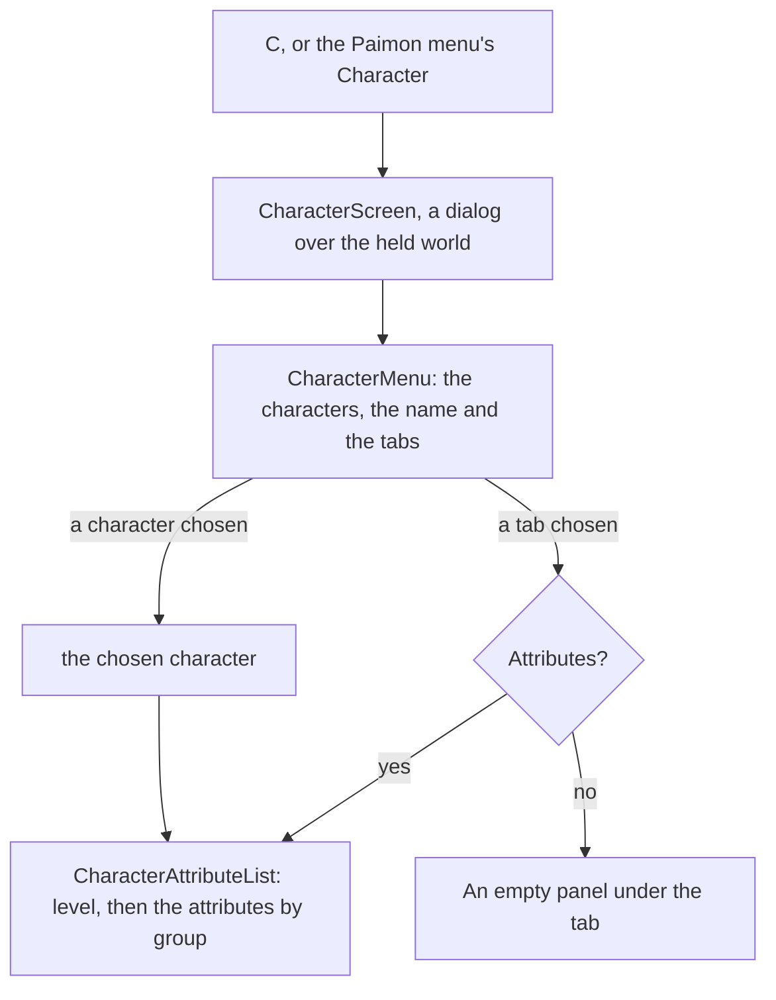

# Character screen

In the game, `C` opens the character screen: the player's characters across its top, one chosen, six tabs down its left, Attributes, Weapons, Artifacts, Constellation, Talents and Profile, and the open tab's panel down its right. The layout is measured off the English PC client's own frame (below). The look is provisional until the passes measure the colours, the portraits and the element's background, and nothing on the screen is scored against the game yet.

## How it works

- **A frame with no words of its own.** `CharacterMenu`, in `genshin-interface`, draws the frame: the characters across the top, each a button naming the character, the chosen character's name at the top left, the six tabs down the left in the game's order (`CharacterMenuTabs`) with the open one lit, and the open tab's panel down the right as its slot. The chosen character and the open tab are its two models. Every word is a prop, so the interface package needs no game text and no world data.
- **The world's screen fills it.** `CharacterScreen`, in `genshin-world`, takes the player's characters, the one on the field, the game's words, the party's stamina and the stat tables the world screen has read ([character attributes](/docs/genshin/character-attributes)), opening as its placeholder until they arrive. It opens on the character on the field and on Attributes, names each tab by the game's own text (`CharacterMenuTabGameTextKeyMap`) and the Traveler by the game's own word for them, and draws the Attributes tab's panel. It is a dialog over the held world with a way back, and the screens' rule closes it on `Escape`, a pad's cancel or `C` again ([screens](/docs/genshin/screens)).
- **The Attributes tab is the game's sums.** `CharacterAttributeList` shows the character's name, its level over its phase's cap in the game's `Lv.` wording, the experience bar, then its base five attributes: Max HP, ATK, DEF, Elemental Mastery and Max Stamina, whole. The advanced group (CRIT Rate, CRIT DMG, Healing Bonus and Energy Recharge) and each element's DMG Bonus with Physical's sit beneath, each a percentage to one place, under their titles. Every value comes from [character attributes](/docs/genshin/character-attributes).

## Layout

Measured off the reference frame at 21:9, 3440 by 1440 pixels, in units: a pixel at 1440 high is 0.75 units, so the frame is 2580 units wide. Anchored pieces are placed from the edge they ride on, as the game places them.

| Piece                     | Place (units)                                                                                                          |
| :------------------------ | :--------------------------------------------------------------------------------------------------------------------- |
| Characters across the top | 69-unit portraits on a 96-unit pitch, the first's centre 643 from the left, centre 47 from the top                     |
| Chosen character's name   | Left 216, centre 47 from the top                                                                                       |
| Tabs down the left        | Diamonds centred at 195, words at 225, 69-unit rows from 154; the open one's pill 165 from the left, 352 wide, 56 high |
| Panel                     | Left 2057, right margin 195 (its right edge is the frame's), 330 wide, top 124                                         |
| Way back                  | Centre 149 from the right, 49 from the top                                                                             |

## Decisions

- **The layout is the reference's.** The earlier frame drew the characters down the left and the tabs down the right; the game draws them the other way round. It was read off the user's own recording of the current build at 21:9 (`captures/session-2.mp4`, its English text, 49.9 frames a second), the character screen from about 154 seconds on, every tab in turn.
- **The panel is anchored to the right edge.** It moves with the window's width. Where the game anchors it at 16:9 is not measured yet: the reference is 21:9 only.
- **The name has no element prefix yet.** The game writes the element before the name (`Geo / Xilonen`). That needs the element on `CharacterMenuEntry`, which is not built, so the breadcrumb shows the name alone.
- **The open tab's pill slides.** At 158 seconds the pill is still moving from Constellation to Talents while Talents' text is already bold, and by 159 seconds the pill has faded out of its old place. The slide is not measured yet; it waits on the recording named in the roadmap.
- **Profile's red alert is not drawn.** The game marks Profile with a red alert when something waits there; its trigger is not built.
- **No heading over the panel.** The game draws the open tab's name nowhere on this frame; the lit row on the left says it.
- **Portraits are name circles.** The game's portraits are its own art, an asset the rules keep out of the repository; the circles stand in until a derived one is settled.
- **The background is one element's tint.** The reference is Geo's gold, sampled as a radial gradient. Each element has its own tint in the game, which is not built.
- **The player's UID is not drawn.** The reference shows it under the panel; it is the player's own data.

## Notes

- **The scored state is Xilonen's Attributes tab.** `Character/Screen` fixes the roster of fifteen characters, the Traveler among them, with Xilonen chosen at level 90 and phase six, and its stat tables parsed from the generated tables by `parseStatTables`. Its reference is the frame at 154.4 seconds of the user's recording of the current build (`session-2.mp4`), at 21:9, before the character's model rises into the frame. Scored over the whole frame, its mean difference went from 9.62% (FLIP 0.4052) to 8.10% (FLIP 0.3570). Over the regions the frame's pieces are scored by: the top band 12.62% to 11.15%, the tab column 8.67% to 7.26%, and the panel 12.47% to 7.96%.
- **The rest of the frame is the game's scene, a floor for now.** The middle is the held scene: the golden beams and particles and the character's model, which rises over 154.4 to 155.6 seconds and is the game's art, so the screen draws a tint sampled from the reference's scene (about #6c5224 at the dark corners, #af9544 at the bright centre) and nothing more.
- **Not drawn yet, for want of text or art.** The Details button and the Friendship row with its bar, which the default panel shows under the base rows, and the character's description: their words are not in the decoded English text yet. The element emblem, the element-coloured stars, the Q and E keys, W and S, the arrows, the Ascension Limit pill and the UID wait on the glyph pass or the text. The panel shows the advanced and elemental groups beneath the base five, which the game holds behind Details.
- **The level line reads "Lv. 90/90".** The game writes "Level 90 / 90", a wording not in the decoded text yet.
- **The Attributes tab's motion is owed.** The pill's slide and the model's rise are read off the recording at 60 frames a second once `character-details.mkv` and the other owed clips land on the roadmap's Recordings owed list.
- **The 16:9 layout is anchored, not measured.** At 16:9 the panel stays right-anchored, as the settled call holds, and `character-attributes-1080.png` on the roadmap's Recordings owed list checks it.
- **Only the Traveler and the roster's names come from the game's text.** Every other character's name is read from the name text map (`nameText`), which the world screen loads for the banners as well.

## Key files

| File                                                                              | Role                                                        |
| :-------------------------------------------------------------------------------- | :---------------------------------------------------------- |
| `packages/genshin-interface/src/components/CharacterMenu/Index.vue`               | The frame: the characters, the name, the tabs and the panel |
| `packages/genshin-interface/src/components/CharacterMenu/Index.fixture.ts`        | Xilonen on Attributes, the reference's state                |
| `packages/genshin-interface/src/models/CharacterMenuTab.ts`                       | The six tabs, and their order down the screen               |
| `packages/genshin-world/src/components/Character/Screen/Index.vue`                | The screen: the words, the characters and the way back      |
| `packages/genshin-world/src/components/Character/AttributeList/Index.vue`         | The Attributes tab's level and attributes by group          |
| `packages/genshin-world/src/services/character/CharacterMenuTabGameTextKeyMap.ts` | Each tab's name in the game's text                          |
| `packages/genshin-world/src/services/character/constants.ts`                      | The Traveler's id and the advanced and elemental groups     |
| `packages/genshin-world/src/services/character/parseStatTables.ts`                | The generated tables parsed against their schemas, sync     |
| `packages/genshin-world/src/components/Character/Screen/Index.fixture.ts`         | The roster and Xilonen's tables, the parity page's state    |

## Sources

- The English PC client's character screen, from the user's own recording of the current build at 21:9 (`captures/session-2.mp4`): Attributes at about 154 seconds, then Weapons, Artifacts, Constellation and Talents one second apart, the reference frame at 154 seconds.
- [Character Menu](https://genshin-impact.fandom.com/wiki/Character/Menu), Genshin Impact Wiki: `C`, the list of characters, the six tabs and what each shows, and the Attributes tab's summary and details. Its screenshots of this screen are phone-sized (`File:Traveler Pyro Character Details 1.png`, 700 by 1213), so they settle the phone's layout, not the PC's.
