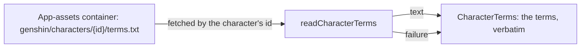

# Characters

A character's official MMD model pack is hosted in the app's Blob Storage rather than the repository, and the terms text bundled with it is read and shown beside it. The reader fetches the terms of one character by its id from a base URL the app passes in, so the world holds no account of where storage lives.

The pack's model file is uploaded beside its terms and not read yet: parsing a PMX needs a dependency that is not in the workspace (see the proposal).

## Key files

| File                                                                  | Role                                                                    |
| :-------------------------------------------------------------------- | :---------------------------------------------------------------------- |
| `packages/genshin-world/src/services/character/readCharacterTerms.ts` | Fetches a character's `terms.txt` from its pack's base URL, as a Result |
| `packages/genshin-world/src/services/character/constants.ts`          | The timeout a terms fetch is abandoned past                             |
| `packages/genshin-world/src/components/Character/Terms/Index.vue`     | Shows the terms verbatim, or that they could not be loaded              |
