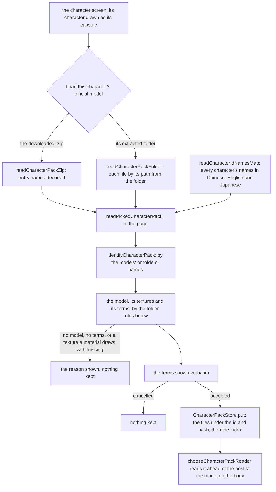
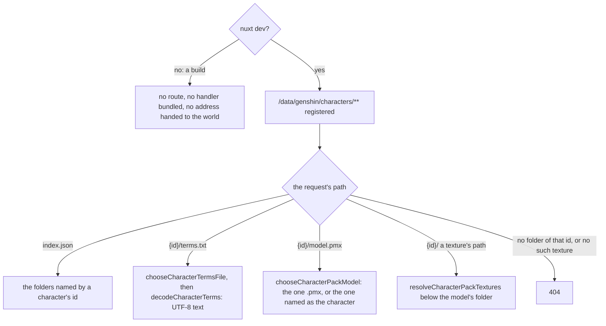

# Characters

A character is drawn from the official MMD model pack HoYoverse publishes for it. Every pack's bundled terms forbid redistributing it, as 「请勿二次配布」, "do not redistribute", or in three of them the short form 「请勿二配」, so the app never hosts one: nothing of a pack is committed, uploaded to Blob Storage or served from a public address ([hosting the official packs](/docs/genshin/rejected/hosting-official-character-packs)). A pack reaches the world only from a copy its reader holds: the release a player downloaded themselves, which they load on the character screen and their own browser reads and keeps, and under `nuxt dev` the developer's own extracted packs, which the development server serves from disk. A character with neither is drawn as its body's capsule, with no request for a pack. The world takes the development packs' address from the app and reads any host laid out the same way, so it holds no account of where the packs live, and the rules that read an official release's folder are the world package's, with no Node import, so the browser applies them to a player's release as the development server does to a folder on its disk. The terms bundled with each model are read beside it and shown verbatim. three ships no MMD loader and the workspace has no PMX parser, so the engine reads the model itself, from the public PMX 2.0 and 2.1 specification, and the world draws it on the same toon ramp as everything else while the world itself stays generated.

## How it works

```mermaid
flowchart LR
  KEPT{"the browser keeps a pack for the character?"} -->|yes| STORE["CharacterPackStore: its files under its id and hash"]
  KEPT -->|no| BASE{"the app hands the world a packs address?"}
  BASE -->|"no: a build, the parity page"| NONE["no request: the body's capsule"]
  BASE -->|"yes: nuxt dev"| INDEX["index.json, read once: the ids the host holds a pack for"]
  INDEX -->|"the character is not listed"| NONE
  INDEX -->|listed| HOST["the host's {id}/ files"]
  STORE --> MODELFILE["model.pmx"]
  HOST --> MODELFILE
  MODELFILE --> PARSE["parsePmx: the file in three's space"]
  PARSE -->|"textures a material draws with"| TEXTURE["each texture's path: createPmxTexture, each read once"]
  PARSE --> MATERIAL["createCharacterMaterial: the ramp, the rim, the outline where the edge is set"]
  TEXTURE --> MATERIAL
  PARSE --> MESH["createPmxMesh: groups, skeleton, metres"]
  MATERIAL --> MESH
  MESH -->|"every file arrived"| MODEL["CharacterModel, facing -z at its holder's origin"]
  MESH -->|"any file failed"| LOG["Logged and emitted"]
  LOG --> CAPSULE["The body's capsule drawn in its place"]
  MODELFILE -.->|"beside it"| TERMS["terms.txt: CharacterTerms, verbatim"]
```

### The pack's layout

- **One folder per character, named by its id in the game's data** as the party's characters are, under the base URL the app hands the world. Beside the folders, `index.json` (`CHARACTER_PACK_INDEX_PATH`) lists the ids the host holds a pack for, and each folder serves `model.pmx`, the character's model whatever its own file is called; `terms.txt`, the terms bundled with it, as UTF-8; and the textures at the paths the model names them by, relative to it. `readCharacterPackFile` reads every one of them through `getCharacterPackFileUrl`, so the three kinds of file share one layout, and the path is cut by `getCharacterPackFilePath`, which reads MMD's backslashes as slashes and drops an empty or `.` part, and each part is encoded on its own, since a model's paths hold letters of any script.
- **A pack the browser keeps is laid out the same way.** `CharacterPackStore` reads a kept pack's file by the same path, cut by the same `getCharacterPackFilePath`, so the world asks for the same files whichever copy it reads, through the `CharacterPackReader` it is handed.
- **The browser's packs first, then the host's.** `useCharacterPacks` reads the index of the packs the browser keeps as the world opens and, through `useCharacterPackIds`, the host's index once, and `chooseCharacterPackReader` reads a character's pack from the browser's copy where it keeps one, else from the host's where its index lists the character. A character neither lists is drawn as the body's capsule with no request for its pack. With no address, or an index that fails to load, which is logged, the host has none.
- **A pack is drawn whole or not at all.** Only the textures a material draws with are read; a toon ramp or a sphere map the model names is never read, since the world's own light stands in for both. A failed read, a texture the release does not ship among them, is logged and emitted, and the world draws the body's capsule in its place, and a model arriving after its character has gone is released at once.

### A player's own pack

A player loads the official release they downloaded on the character screen, for the character it shows. The release is read in the page and kept in the browser's own storage, so a returning player loads it once, and nothing of it leaves the browser: the only requests the load makes are the game data's characters' names, fetched by key.

- **Loaded on the character screen.** `CharacterPackLoader` fills the character screen's slot: where the character it shows is drawn as its capsule it offers to load the character's official model, from the downloaded zip or its extracted folder, and where the browser keeps a pack for the character it offers to remove it.
- **A zip is read in the page.** `readCharacterPackZip` lists a zip's entries with fflate without inflating any, and inflates only the files a read asks for. fflate reads a name the archive leaves unflagged as UTF-8 as Latin-1, a letter a byte, so `decodeCharacterPackEntryNames` reads those names back to their bytes and decodes them together by the rule the terms are decoded by: strictly as UTF-8, else Shift-JIS where they read as Japanese, else GBK. The releases mix names flagged as UTF-8 with Shift-JIS ones, as Ningguang's and Klee's do, or GBK ones, as Zhongli's and Tartaglia's do. The resource forks macOS's archiver adds under `__MACOSX` are passed over.
- **A RAR is read from its extracted folder.** Lumine's release of 2020 ships as RAR5, which nothing in the page decodes, so the player extracts it and picks the folder, which the browser hands over with each file's path from it.
- **Whose release it is.** `identifyCharacterPack` matches the models' own names, else the folders' names, to every character's names in the languages the releases use, as `chooseCharacterPackModel` matches a model's name. A release matching another character is kept for that character, which the terms' dialog says; one matching none, as the Traveler's "女主角" and folder "荧" match no name of hers, or several, is kept for the character it was picked for.
- **Read by the folder's rules.** `readPickedCharacterPack` chooses the model, matches every texture it names that the release holds and reads the terms, as the next section sets out, and refuses a release lacking a texture a material draws with, naming it, since a pack is drawn whole or not at all: Tartaglia's release names a `tex/面.png` it does not ship.
- **The terms before anything is kept.** The terms are shown verbatim with the model's name, and the release is kept only once the player accepts them; cancelling keeps nothing.
- **Kept in the browser's own storage.** `openCharacterPackStore` opens the private file system where the page can write a file there, else IndexedDB, else the page's own memory, logging a storage the browser has but refuses, as a private window may. A pack's files lie under its character's id and its hash, a SHA-256 of its files and their paths, and `index.json` beside them lists which characters have one. A pack is written whole before the index names it, the pack it replaces is removed after, and a removal forgets the pack in the index before its files go, so the index never names a pack with files missing. An index that no longer parses is read as empty.

### Reading a release's folder

An official release is extracted as it shipped: its folder names its files in Chinese or Japanese, nests the model a folder or two down, and spells a texture's case as it likes. Three rules turn it into the layout above, each in the world package and run wherever a folder is read.

- **The model.** `chooseCharacterPackModel` takes the folder's one `.pmx`, in any case. Of several, as Zhongli's release ships his skill effects beside him, it takes the one whose own name, read from its header, is one of the character's names in Chinese, English or Japanese, which `readCharacterNames` reads from the [hosted game data](/docs/genshin/hosted-game-data); the names are read only for such a folder. The releases spell a name in a case and spacing of their own, so a name is matched without either. A folder with no model, or with several and not one named as its character, is refused, naming each.
- **The textures.** `resolveCharacterPackTextures` matches each path the model names to a file below the model's own folder case-insensitively and in either Unicode form, as MMD reads a path, and a path climbing out of that folder matches nothing.
- **The terms.** `chooseCharacterTermsFile` takes the text file named as terms are, `利用規約`, then `readme`, `使用说明`, `规约`, `规则` and `terms`, the one nearest the root where several share a name, and `decodeCharacterTerms` decodes it strictly, from UTF-16 by its byte-order mark, or UTF-8, Shift-JIS or GBK, so a byte no character maps refuses the encoding rather than being replaced. A folder with no terms is refused.

### The development server's packs

Under `nuxt dev`, the app's module `apps/web/modules/serveGenshinCharacterPacks.ts` registers a route at `GENSHIN_CHARACTER_PACK_BASE_URL`, "/data/genshin/characters", and the app's world component hands the world that address. A build registers no route, bundles neither the route's handler nor the readers it imports, and hands the world no address. The route reads the folder `GENSHIN_CHARACTER_PACKS_DIRECTORY` names, by default `~/Esposter/character-packs/extracted`, which holds one folder a character named by its id, each an official release extracted as it shipped, and answers the layout above from it through `serveGenshinCharacterPack`. The server reaches the world's rules through the package's `genshin-world/characterPack` entry, which reaches none of its components.

Only a folder named by a character's id is read, and only a file the folder's own listing holds is served, so no request reaches outside the directory. Nothing is cached: an edited pack is read again on the next request.

### Reading a PMX

`parsePmx` reads the file's sections in order through `PmxReader`, a cursor sized by the header's globals: the text's encoding, the extra vectors each vertex carries, and each kind of index's width.

- **Everything is turned into three's space as it is read.** MMD is left-handed, so z is mirrored in every position, normal, bone, morph offset, rigid body and joint. Mirroring turns each triangle's winding round, so the reader reverses it, and turns a joint's ranges round as well: a translation's along z, and a rotation's about x and y. An MMD model faces +z once mirrored.
- **Every vertex is bound to four bones.** One bone takes all of a vertex's weight, two share it by the first one's weight, and four by their own. three's skinning blends linearly, so a spherical blend is read as its two bones' linear one and a dual quaternion blend as its four bones' linear one. A slot the file leaves unused names no bone and is bound to the first at no weight. The four weights need not sum to one in the file, so the mesh scales them until they do.
- **What is kept.** The model's name; its vertices; its triangles; its texture paths; each material's diffuse colour, triangle count, faces drawn, edge, texture, sphere map and toon ramp; each bone's name, place and parent; vertex and group morphs; and the rigid bodies and joints MMD's physics reads. A morph of any other kind keeps its place in the list with nothing in it, so a group morph's members still index the whole list.
- **What is passed over.** The comments and every name in English, the specular and ambient colours, the edge's own colour and size, every bone field past its parent, the display frames, and a 2.1 file's soft bodies.

### Drawing it

- **One skinned mesh.** `createPmxMesh` builds one geometry with a group for each material's run of triangles, in the file's order, which is the order MMD draws them in. Each bone is nested under its parent and placed from it, bound by the step back from where it stands, since the rest pose turns no bone. MMD's unit is scaled into the world's metres by `PMX_UNIT_METRES`.
- **The toon ramp, the rim and the outline.** `createCharacterMaterial` lights each material with three's toon lighting over the world's ramp, its colour the material's diffuse under its texture, with the sky's rim on its lit silhouette as every surface takes it. The outline pass picks a material by its toon flag, so only a material whose edge the file sets is outlined, as MMD draws an edge.
- **Blended in the model's own order.** Every material is blended and writes its depth, as MMD draws one, so a texel the texture leaves clear shows what the materials before it drew. A material set to draw both faces is drawn from behind as well.
- **Textures as the model samples them.** `createPmxTexture` decodes a texture unpremultiplied and unconverted, leaving the blend and the colour space to three, and unflipped, since a PMX model's texture coordinates run from the image's top left. Past its edges it repeats.
- **It faces where its holder faces.** `CharacterModel` stands the model at the origin of whatever holds it, turned half round to face -z as a yaw of none does. The [character controller](/docs/genshin/character-controller)'s body faces the same way, so whatever moves the body moves the model by holding it.
- **The Traveler rides the controller's body.** The world plays the Traveler (`TRAVELER_CHARACTER_ID`), drawn on the character controller's body from where Windrise starts, from whichever pack it has, else as the body's capsule. A witness render draws no character.

No parsed model is cached, a kept pack's included: the browser keeps a pack's files, and the model is parsed again each time it is drawn. `parsePmx.bench.md` reads a model of tens of megabytes in tens of milliseconds, and a structured clone of what it returns, the least an IndexedDB read of it would cost, takes about a third of that before any disk is read, so such a cache would save a few milliseconds a character and add a store to keep.

## Decisions

- **The development server serves the packs, and no build holds the route.** A route that refused outside development would still be bundled into the production server with the readers it imports; the module that registers it returns before registering anything unless Nuxt runs under `nuxt dev`.
- **An index lists the packs a host holds,** read once, so a character without one costs no request: without it the world could tell an absent pack from a failed one only by asking for its model.
- **A folder of several models is matched by the model's own name.** The releases name a model in Chinese or English, Zhongli's as "ZhongLi" beside a "skill" model, so the character's names in those languages, and in Japanese, the language of MMD's own models, choose it; the Traveler's release names hers "女主角", "protagonist", and ships one model.
- **A kept pack is stored under its hash; a host's is served at its character's id.** A pack loaded again lands beside the one it replaces, so the index names whole packs only, while a host's files are the developer's folder, read as they stand on each request.
- **The loader is our own interface, laid over the character screen.** The game has no such control, so no reference measures it, and it stays out of what the parity loop scores: the screen's fixture fills no slot, so its approved images and scores stay the game's. It is drawn in the screen's own colours and units.
- **A zip's unflagged names are decoded together.** A name on its own can read as Japanese in an archive whose names are Chinese, "唷" in GBK reading as "爍" in Shift-JIS, and the releases write one archive's unflagged names in one encoding, so the archive's names together decide it. A release flags the rest as UTF-8, which fflate decodes.
- **The private file system first.** It keeps a pack's files as files, read back without a structured clone; IndexedDB stands in where the page cannot write a file there, and the page's memory where a browser keeps neither, so a pack loaded in a private window still draws until the page closes.
- **A RAR is extracted by the player.** Decoding RAR5 in the page would add a decoder for one release, so its folder is picked instead.

## Key files

| File                                                                                   | Role                                                                                                               |
| :------------------------------------------------------------------------------------- | :----------------------------------------------------------------------------------------------------------------- |
| `packages/genshin-engine/src/character/parsePmx.ts`                                    | Reads a PMX file's sections in order into three's space                                                            |
| `packages/genshin-engine/src/models/character/PmxReader.ts`                            | The cursor over the file, sized by its globals, mirroring z as it reads                                            |
| `packages/genshin-engine/src/character/parsePmxVertices.ts`                            | Each vertex's place, normal, texture coordinate and four bones                                                     |
| `packages/genshin-engine/src/character/parsePmxMorphs.ts`                              | Vertex and group morphs read, every other kind passed over by its size                                             |
| `packages/genshin-engine/src/character/createPmxMesh.ts`                               | The skinned mesh: the geometry's groups, the skeleton, and the scale to metres                                     |
| `packages/genshin-engine/src/character/createPmxSkeleton.ts`                           | Each bone nested and placed from its parent, and bound where it stands                                             |
| `packages/genshin-engine/src/character/createCharacterMaterial.ts`                     | The toon ramp, the rim and the outline where the edge is set                                                       |
| `packages/genshin-engine/src/character/createPmxTexture.ts`                            | A texture decoded as the model samples it                                                                          |
| `packages/genshin-engine/src/character/constants.ts`                                   | MMD's unit in metres                                                                                               |
| `packages/genshin-engine/src/character/parsePmx.bench.ts`                              | A model's read timed at two sizes, against a structured clone of it                                                |
| `packages/genshin-world/src/composables/useCharacterPacks.ts`                          | The browser's kept packs and the host's, the reader of the character on the field, and keeping and removing a pack |
| `packages/genshin-world/src/composables/useCharacterPackIds.ts`                        | The ids the host's index lists, read once                                                                          |
| `packages/genshin-world/src/services/character/chooseCharacterPackReader.ts`           | A character's pack read from the browser's copy, else the host's, else none                                        |
| `packages/genshin-world/src/services/character/openCharacterPackStore.ts`              | The kept packs' store over the private file system, else IndexedDB, else the page's memory                         |
| `packages/genshin-world/src/services/character/createCharacterPackStore.ts`            | Each kept pack's files under its id and hash, and the index of them                                                |
| `packages/genshin-world/src/services/character/createOpfsCharacterPackStorage.ts`      | The kept files in the browser's private file system                                                                |
| `packages/genshin-world/src/services/character/createIndexedDbCharacterPackStorage.ts` | The kept files in IndexedDB                                                                                        |
| `packages/genshin-world/src/services/character/createMemoryCharacterPackStorage.ts`    | The kept files in the page's memory                                                                                |
| `packages/genshin-world/src/services/character/readCharacterPackZip.ts`                | A release's zip read in the page, its entries inflated only when asked for                                         |
| `packages/genshin-world/src/services/character/decodeCharacterPackEntryNames.ts`       | A zip's entry names decoded as the release wrote them                                                              |
| `packages/genshin-world/src/services/character/readCharacterPackFolder.ts`             | An extracted release's folder, each file by its path from it                                                       |
| `packages/genshin-world/src/services/character/readPickedCharacterPack.ts`             | A picked release read into the pack layout, hashed, with its terms as text                                         |
| `packages/genshin-world/src/services/character/identifyCharacterPack.ts`               | The character a release is of, by its models' and folders' names                                                   |
| `packages/genshin-world/src/services/character/readCharacterIdNamesMap.ts`             | Every character's names in the languages the releases use                                                          |
| `packages/genshin-world/src/services/character/getCharacterNameKey.ts`                 | A name as it is matched, in one form and case and with no spaces                                                   |
| `packages/genshin-world/src/components/Character/PackLoader/Index.vue`                 | Loads a character's release on the character screen, its terms accepted first, and removes a kept one              |
| `packages/genshin-world/src/services/character/readCharacterPackIds.ts`                | The host's index, parsed as unique ids                                                                             |
| `packages/genshin-world/src/services/character/readCharacterPackFile.ts`               | Reads any file of a host's pack by its path                                                                        |
| `packages/genshin-world/src/services/character/getCharacterPackFileUrl.ts`             | Where a file of a pack is served, by the character's id and the file's path                                        |
| `packages/genshin-world/src/services/character/getCharacterPackFilePath.ts`            | A model's path cut into the path a pack serves the file at                                                         |
| `packages/genshin-world/src/services/character/chooseCharacterPackModel.ts`            | A folder's one model, or of several the one named as its character                                                 |
| `packages/genshin-world/src/services/character/readCharacterNames.ts`                  | A character's names in the languages the releases name their models in                                             |
| `packages/genshin-world/src/services/character/resolveCharacterPackTextures.ts`        | Each texture matched to its file case-insensitively, kept at the model's spelling                                  |
| `packages/genshin-world/src/services/character/chooseCharacterTermsFile.ts`            | The terms file a folder holds                                                                                      |
| `packages/genshin-world/src/services/character/decodeCharacterTerms.ts`                | The terms decoded strictly, from UTF-16, UTF-8, Shift-JIS or GBK                                                   |
| `packages/genshin-world/src/characterPack.ts`                                          | The rules and readers the app's server imports, with none of the world's components                                |
| `packages/genshin-world/src/services/character/readCharacterMesh.ts`                   | A pack's model and its textures into one mesh through its reader, as a Result                                      |
| `packages/genshin-world/src/services/character/readCharacterTerms.ts`                  | A pack's terms, as a Result                                                                                        |
| `packages/genshin-world/src/services/character/constants.ts`                           | A pack's index and file names, the store's names, the terms' names and encodings' tell, and a read's wait          |
| `packages/genshin-world/src/components/Character/Model/Index.vue`                      | Draws a character's model at its holder's origin, and releases it                                                  |
| `packages/genshin-world/src/components/Character/Terms/Index.vue`                      | Shows the terms verbatim, or that they could not be loaded                                                         |
| `packages/genshin-world/src/components/World/Windrise/Index.vue`                       | Stands the Traveler at Windrise's start point, drawn from the pack it is handed a reader of                        |
| `apps/web/modules/serveGenshinCharacterPacks.ts`                                       | Registers the packs' route under `nuxt dev` alone                                                                  |
| `apps/web/server/development/genshinCharacterPacks.ts`                                 | The route: the packs' directory and the game data's address handed to the service                                  |
| `apps/web/server/services/genshin/characterPack/serveGenshinCharacterPack.ts`          | Answers the pack layout from an extracted release's folder                                                         |
| `apps/web/server/services/genshin/characterPack/readCharacterPackModelPath.ts`         | The folder's model, its several models' names read from their headers                                              |
| `apps/web/server/services/genshin/characterPack/listCharacterPackIds.ts`               | The index: the folders named by a character's id                                                                   |
| `apps/web/server/services/genshin/characterPack/listCharacterPackFiles.ts`             | A folder's files by their paths in it                                                                              |
| `apps/web/server/services/genshin/characterPack/constants.ts`                          | The packs' default directory, and the folder names read                                                            |
| `apps/web/shared/services/genshin/constants.ts`                                        | `GENSHIN_CHARACTER_PACK_BASE_URL`, where the world reads the packs from                                            |
| `apps/web/app/components/Genshin/World.vue`                                            | Hands the world the packs' address in development alone                                                            |

## Notes

- **Within what the terms allow.** No redistribution, which is why the app serves a pack only to the developer whose copy it is, from their own disk, and a player's pack never leaves their own browser; no commercial use of the models; and none of the uses the terms list (adult, extreme religious, gore, personal attacks), which the platform's own rules already forbid. The credit the terms carry, the copyright being miHoYo's, is shown as part of their text.
- **The game's characters do not darken in the rain**, so a character's material takes none of the wetness the environment's toon material reads ([weather](/docs/genshin/weather)).
- **The world's ramp replaces the model's toon ramp, and sphere maps are not drawn.** A character is lit as the rest of the world is lit; the toon and sphere references are read, so a later pass can draw them, and are never fetched.
- **Nothing swings yet.** The rigid bodies and joints are read for the physics that will swing hair and cloth, and nothing reads them. The morphs are read for expressions, and none is set.
- **MMD's unit is reckoned, not measured.** Eight centimetres is the community's reckoning from a model's height; the scale the game draws a character at is measured from its own models, as the [proposal](/docs/proposals/genshin/characters) lists.

## Sources

- [PMX 2.0/2.1 specification](https://gist.github.com/felixjones/f8a06bd48f9da9a4539f), Felix Jones: the byte layout of every section the reader reads and passes over.
- [mmd-parser](https://github.com/takahirox/mmd-parser), takahirox: the turn from MMD's left-handed space into a right-handed one, z mirrored with the triangles' winding, the rotations' x and y, and the joints' ranges turned round.
- [1 MMD unit in real world units](https://hogarth-mmd.deviantart.com/journal/1-MMD-unit-in-real-world-units-685870002), Hogarth-MMD: MMD's unit reckoned at about eight centimetres from a model's height.
- The terms bundled with each official model, read from each release's own file: 「请勿二次配布」 or 「请勿二配」, "do not redistribute", the releases whose terms are a readme adding 「以及拆取部件以用于改造其他模型」, "nor take parts to modify other models", beside the uses they forbid and miHoYo's copyright.
