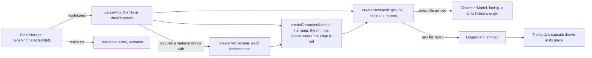

# Characters

A character is drawn from the official MMD model pack HoYoverse publishes for it. The pack is hosted in the app's Blob Storage rather than the repository: a pack runs to tens of megabytes, and nothing of it is committed. Hosting the official packs is an exception to the area's rule that every asset is authored here ([Genshin](/docs/proposals/genshin)): they are HoYoverse's own fan release, never anything read out of the game's files, while the world stays generated. The terms bundled with the model are read beside it and shown verbatim. three ships no MMD loader and the workspace has no PMX parser, so the engine reads the model itself, from the public PMX 2.0 and 2.1 specification, and the world draws it on the same toon ramp as everything else. The world takes the packs' address from the app, so it holds no account of where storage lives.

## How it works

### The pack

- **One folder per character, named by its id in the game's data** as the party's characters are, under the base URL the app hands the world, `GENSHIN_CHARACTER_PACK_PATH` in its assets container: `model.pmx`, the model renamed on upload; `terms.txt`, the terms bundled with it; and the textures at the paths the model names them by, relative to it. `readCharacterPackFile` reads every one of them, so the three kinds of file share one layout, and it encodes each part of a path on its own, since a model's paths hold MMD's backslashes and letters of any script.
- **A pack is drawn whole or not at all.** Only the textures a material draws with are fetched; a toon ramp or a sphere map the model names is never fetched, since the world's own light stands in for both. A failed read is logged and emitted, and the world draws the body's capsule in its place, and a model arriving after its character has gone is released at once.

### Reading a PMX

`parsePmx` reads the file's sections in order through `PmxReader`, a cursor sized by the header's globals: the text's encoding, the extra vectors each vertex carries, and each kind of index's width.

- **Everything is turned into three's space as it is read.** MMD is left-handed, so z is mirrored in every position, normal, bone, morph offset, rigid body and joint. Mirroring turns each triangle's winding round, so the reader reverses it, and turns a joint's ranges round as well: a translation's along z, and a rotation's about x and y. An MMD model faces +z once mirrored.
- **Every vertex is bound to four bones.** One bone takes all of a vertex's weight, two share it by the first one's weight, and four by their own. three's skinning blends linearly, so a spherical blend is read as its two bones' linear one and a dual quaternion blend as its four bones' linear one. A slot the file leaves unused names no bone and is bound to the first at no weight. The four weights need not sum to one in the file, so the mesh scales them until they do.
- **What is kept.** The model's name; its vertices; its triangles; its texture paths; each material's diffuse colour, triangle count, faces drawn, edge, texture, sphere map and toon ramp; each bone's name, place and parent; vertex and group morphs; and the rigid bodies and joints MMD's physics reads. A morph of any other kind keeps its place in the list with nothing in it, so a group morph's members still index the whole list.
- **What is passed over.** The comments and every name in English, the specular and ambient colours, the edge's own colour and size, every bone field past its parent, the display frames, and a 2.1 file's soft bodies.

### Drawing it

- **One skinned mesh.** `createPmxMesh` builds one geometry with a group for each material's run of triangles, in the file's order, which is the order MMD draws them in. Each bone is nested under its parent and placed from it, bound by the step back from where it stands, since the rest pose turns no bone. MMD's unit is scaled into the world's metres by `PMX_UNIT_METRES`.
- **The toon ramp, the rim and the outline.** `createCharacterMaterial` lights each material with three's toon lighting over the world's ramp, its colour the material's diffuse under its texture, with the sky's rim on its lit silhouette as every surface takes it. The outline pass picks a material by its toon flag, so only a material whose edge the file sets is outlined, as MMD draws an edge.
- **Blended in the model's own order.** Every material is blended and writes its depth, as MMD draws one, so a texel the texture leaves clear shows what the materials before it drew. A material set to draw both faces is drawn from behind as well.
- **Textures as the model samples them.** `createPmxTexture` decodes a texture unpremultiplied and unconverted, leaving the blend and the colour space to three, and unflipped, since a PMX model's texture coordinates run from the image's top left. Past its edges it repeats.
- **It faces where its holder faces.** `CharacterModel` stands the model at the origin of whatever holds it, turned half round to face -z as a yaw of none does. The [character controller](/docs/genshin/character-controller)'s body faces the same way, so whatever moves the body moves the model by holding it.
- **The Traveler stands where Windrise starts.** The world plays the Traveler (`TRAVELER_CHARACTER_ID`), drawn at `WINDRISE_START_POINT` on the ground until the controller's body holds it. Without the packs' address, as on the parity page, and in a witness render, no character is drawn.

## Key files

| File                                                                     | Role                                                                           |
| :----------------------------------------------------------------------- | :----------------------------------------------------------------------------- |
| `packages/genshin-engine/src/character/parsePmx.ts`                      | Reads a PMX file's sections in order into three's space                        |
| `packages/genshin-engine/src/models/character/PmxReader.ts`              | The cursor over the file, sized by its globals, mirroring z as it reads        |
| `packages/genshin-engine/src/character/parsePmxVertices.ts`              | Each vertex's place, normal, texture coordinate and four bones                 |
| `packages/genshin-engine/src/character/parsePmxMorphs.ts`                | Vertex and group morphs read, every other kind passed over by its size         |
| `packages/genshin-engine/src/character/createPmxMesh.ts`                 | The skinned mesh: the geometry's groups, the skeleton, and the scale to metres |
| `packages/genshin-engine/src/character/createPmxSkeleton.ts`             | Each bone nested and placed from its parent, and bound where it stands         |
| `packages/genshin-engine/src/character/createCharacterMaterial.ts`       | The toon ramp, the rim and the outline where the edge is set                   |
| `packages/genshin-engine/src/character/createPmxTexture.ts`              | A texture decoded as the model samples it                                      |
| `packages/genshin-engine/src/character/constants.ts`                     | MMD's unit in metres                                                           |
| `packages/genshin-world/src/services/character/readCharacterPackFile.ts` | Reads any file of a pack by its path in the pack                               |
| `packages/genshin-world/src/services/character/readCharacterMesh.ts`     | A pack's model and its textures into one mesh, as a Result                     |
| `packages/genshin-world/src/services/character/readCharacterTerms.ts`    | A pack's terms, as a Result                                                    |
| `packages/genshin-world/src/services/character/constants.ts`             | A pack's file names, and how long each read waits                              |
| `packages/genshin-world/src/components/Character/Model/Index.vue`        | Draws a character's model at its holder's origin, and releases it              |
| `packages/genshin-world/src/components/Character/Terms/Index.vue`        | Shows the terms verbatim, or that they could not be loaded                     |
| `packages/genshin-world/src/components/World/Windrise/Index.vue`         | Stands the Traveler at Windrise's start point                                  |
| `apps/web/shared/services/genshin/constants.ts`                          | Where the packs are kept in the app's assets container                         |

## Notes

- **Within what the terms allow.** No commercial use of the models, and none of the uses the terms list (adult, extreme religious, gore, personal attacks), which the platform's own rules already forbid. The credit the terms carry, the copyright being miHoYo's, is shown as part of their text.
- **The game's characters do not darken in the rain**, so a character's material takes none of the wetness the environment's toon material reads ([weather](/docs/genshin/weather)).
- **The world's ramp replaces the model's toon ramp, and sphere maps are not drawn.** A character is lit as the rest of the world is lit; the toon and sphere references are read, so a later pass can draw them, and are never fetched.
- **Nothing swings yet.** The rigid bodies and joints are read for the physics that will swing hair and cloth, and nothing reads them. The morphs are read for expressions, and none is set.
- **MMD's unit is reckoned, not measured.** Eight centimetres is the community's reckoning from a model's height; the scale the game draws a character at is measured from its own models, as the [proposal](/docs/proposals/genshin/characters) lists.
- **A pack's paths are case-sensitive in Blob Storage** where MMD's are not, so a texture the model names in another case than its file's fails the pack's read until the upload matches.

## Sources

- [PMX 2.0/2.1 specification](https://gist.github.com/felixjones/f8a06bd48f9da9a4539f), Felix Jones: the byte layout of every section the reader reads and passes over.
- [mmd-parser](https://github.com/takahirox/mmd-parser), takahirox: the turn from MMD's left-handed space into a right-handed one, z mirrored with the triangles' winding, the rotations' x and y, and the joints' ranges turned round.
- [1 MMD unit in real world units](https://hogarth-mmd.deviantart.com/journal/1-MMD-unit-in-real-world-units-685870002), Hogarth-MMD: MMD's unit reckoned at about eight centimetres from a model's height.
- The terms bundled with each official model, read secondhand so far from fan sites reproducing them (3dnchu.com, fnoji.com); each pack's own terms file is read when it is uploaded.
