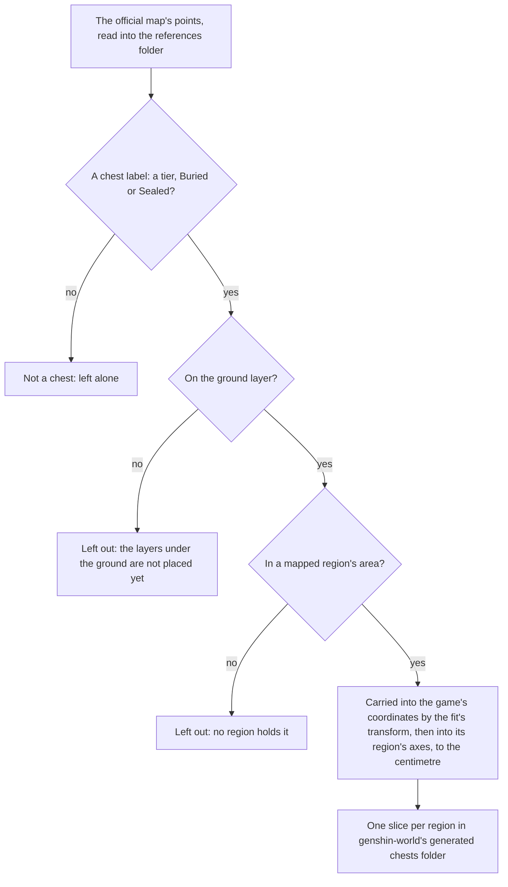

# Chests

The servers' chests are not in the client's data, so the official map's public points stand in for them, as the [spawned places](/docs/genshin/spawned-places) page describes. This page is the first half of the [chests](/docs/proposals/genshin/chests) proposal: each chest the map marks on the ground is carried into the scene by the fit's transform and written into its region's slice, with its kind. Opening one is the second half, below.

## How it works

## The kinds

`ChestKind` names seven. The five tiers are the map's own labels, Common to Remarkable, one per chest. Buried and Sealed are places the map marks with no tier: a Buried chest is dug up where it stands and a Sealed one is freed of its seal first. A dug or freed place's contents are not yet settled, since the map gives no tier for it and the buried and sealed points stand well apart from every tiered chest, so none can be read off a neighbour.

## Opening

`openChest` opens one chest. It rolls the kind's Primogems and Mora within their ranges into the wallet and keeps the chest as opened, so a second opening pays nothing. The ranges are the wiki's chest reward table, one range per tier, not banded by Adventure Rank, since the table lists no bands.

| Kind      | Primogems | Mora         |
| :-------- | :-------- | :----------- |
| Common    | 0 to 2    | 257 to 996   |
| Exquisite | 2 to 5    | 756 to 1,367 |
| Precious  | 5 to 10   | 1,433        |

A kind with no entry stays unopened: Luxurious, whose Mora the table leaves unstated, and Remarkable, whose blueprints are not built, and the buried and sealed places, which the map gives no tier. Each roll is uniform within its range, a provisional draw until a recording of openings reads its spread. Opening also pours out what the wiki lists for the tier, as provisional pools: one weapon picked from the one-star weapons Common and Exquisite chests name, and the Character EXP materials by star with their counts (Wanderer's Advice, Adventurer's Experience, Hero's Wit). The artifacts are not rolled yet, since an artifact needs its slot and rarity, and the pour-out is not yet placed in the world. The high zone-level areas (Dragonspine, the Stormbearer Mountains, Guyun Stone Forest, Lisha and the Chasm) give more Primogems than the default, which the places cannot yet tell, since they name no area.

## The writer

`pnpm -C scripts genshin:assets chests` reads the points and the fit, and writes one slice per region as a compact list of places, each with its id (the map's point id), its kind and its position in its region's axes. It writes only its own slices, and the report counts each region's chests and what it left out. It does not read the game's tables, the wiki or the installed game.

- **The ground only.** Points on a layer under the ground stand on floors of their own, which the place does not yet know, so they are counted and left out.
- **Mapped areas only.** A point in an area no region is mapped to has no region to join, so it is counted and left out. The current run leaves none out.
- **Mora chests are not chests of these kinds.** The map's Mora chests are not among the seven, so the writer does not place them.
- **Not landmarks.** A landmark is built by a region kit, and a chest is acted on, so the places live in their own model rather than in `LandmarkKind`, and no kit draws them.
- **Regions, not catalogue areas.** Each slice is a region, and a place does not yet name its catalogue area, since that needs the region outlines the exploration progress reads. The area each chest counts toward is not set.
- **Region axes.** The fit carries a point into the game's axes, so `placeMapPoints` carries each place round the Windrise origin into its region's axes, x less the origin's x and z the origin's less the place's, as the landmarks and residents are. Every writer of a map point takes the same step through it, so no slice is left in the game's axes.
- **No height is written.** A place stands on the ground at its point, and that height is read where the place is stood on, which the runtime step does when it lands.

## Key files

| File                                                               | Role                                                                                             |
| :----------------------------------------------------------------- | :----------------------------------------------------------------------------------------------- |
| `scripts/src/services/genshinAssets/points/placeMapPoints.ts`      | Carries each kind's points into its region's axes, the ground and mapped areas, shared with the other map points |
| `scripts/src/services/genshinAssets/chests/writeChestPlaces.ts`    | Writes each region's slice from the points and the fit                                           |
| `scripts/src/services/genshinAssets/chests/ChestKindLabelIdMap.ts` | Each chest kind's label on the official map                                                      |
| `scripts/src/services/genshinAssets/chests/constants.ts`           | The slice folder                                                                                 |
| `scripts/src/services/genshinAssets/commands/chestsCommand.ts`     | `genshin:assets chests`                                                                          |
| `packages/genshin-world/src/models/chest/ChestKind.ts`             | The five tiers, and the buried and sealed places                                                 |
| `packages/genshin-world/src/models/chest/ChestPlace.ts`            | A placed chest: its id, kind and ground position                                                 |
| `packages/genshin-world/src/services/chest/openChest.ts`           | Opens a chest once and rolls its Primogems and Mora into the wallet                              |
| `packages/genshin-world/src/services/chest/ChestKindRewardMap.ts`  | Each tier's Primogem and Mora ranges, from the wiki's chest reward table                         |
| `packages/genshin-world/src/generated/chests/`                     | One slice per region, imported on demand by the world                                            |

## Sources

- [Chest](https://genshin-impact.fandom.com/wiki/Chest), Genshin Impact Wiki: the chest reward table's ranges per tier.
- [Teyvat Interactive Map](https://act.hoyolab.com/ys/app/interactive-map/index.html), HoYoLAB: the official map. Its label tree and point list are the public data the writer reads as references.
- [Common Chest Windrise, Mondstadt](https://www.youtube.com/watch?v=JQEikGg8Nvk), OAT_OA, 30 to 42 seconds: a Common chest in Windrise's area opened from standing in reach, its rewards (Adventure EXP, Anemo Sigil, Enhancement Ore, Traveling Doctor's Medicine Pot and Mora) in the wallet's list. Read at 1080 high and 30 frames a second, with the interaction key shown as Enter rather than F, so its opening's timing is measured to a frame at 30 a second.
