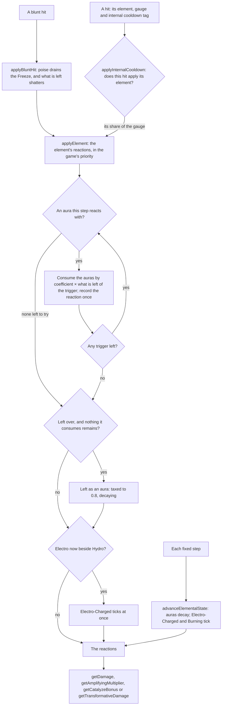

# Combat

The game's combat is one small set of rules every character and enemy shares, and its community has documented them to the decimal. They live in `genshin-world` under `services/combat`, as functions over plain state with no rendering, no input and no three.js, since the engine knows no rule of the game as it knows no place. Nothing draws them yet: the controller and the [enemies](/docs/genshin/enemies) call into them.

## How it works

Each target holds an `ElementalState`: its auras, its own clock, and when its Electro-Charged and Burning last ticked and it last crystallized. `createElementalState` makes an empty one.

### Auras

An attack applies a gauge of its element, in gauge units. Pyro, Hydro, Electro, Cryo and Dendro left as an aura are taxed to 0.8 of that gauge and decay evenly over 2.5 seconds a unit of the attack plus 7, so Bennett's 2U tap leaves 1.6U of Pyro for 12 seconds. Anemo and Geo leave no aura. A second attack of the same element keeps the larger gauge at the first aura's rate, except Pyro: a larger Pyro replaces the aura with its own rate.

### Reactions, in the game's priority

`ElementReactionStepsMap` holds, for each applied element, the reactions it tries in the order the game tries them. Each step names the auras it reacts with and the gauge of aura each unit of the trigger consumes. A step meeting several auras consumes them together, by the larger one's gauge. What is left of the trigger after a step goes on to the next, so 2U of Hydro on a Burning target vaporizes the Burning and its Pyro, then blooms the Dendro under them with the unit left over. A reaction is recorded once per application, however many auras it meets.

| Applied | Its reactions, in order                                                                                                |
| :------ | :--------------------------------------------------------------------------------------------------------------------- |
| Pyro    | Overloaded on Electro (1); Vaporize on Hydro (0.5); Melt on Cryo and Freeze (2); Burning on Dendro or Quicken          |
| Hydro   | Vaporize on Pyro and Burning (2); Frozen on Cryo (1); Bloom on Dendro and Quicken (0.5)                                |
| Electro | Aggravate on Quicken; Overloaded on Pyro and Burning (1); Superconduct on Cryo, then Freeze (1); Quicken on Dendro (1) |
| Cryo    | Superconduct on Electro (1); Melt on Pyro and Burning (0.5); Frozen on Hydro (1)                                       |
| Dendro  | Spread on Quicken; Quicken on Electro (1); Burning on Pyro or Burning; Bloom on Hydro (2)                              |
| Anemo   | Swirl on Electro, Pyro and Burning, Hydro, Cryo, then Freeze (0.5 each)                                                |
| Geo     | Shattered on Freeze; Crystallize on Electro, Pyro and Burning, Hydro, then Cryo (0.5 each)                             |

What is left once every step has run stays as an aura, if the element leaves one and no aura it consumes remains. A reaction with no coefficient consumes neither side, which is how auras come to coexist.

- **Electro-Charged** is no step: it is Electro and Hydro left on a target together. It ticks the moment they meet and each second after, every tick taking 0.4U from each aura that has more than that to give. Once one decays away it ends, ticking once more if half a second has passed since the last.
- **Quicken** consumes Dendro and Electro at 1 and leaves the gauge it consumed as its own aura, lasting 5 seconds a unit plus 6. Aggravate and Spread consume neither the Quicken nor their trigger, so the trigger goes on to its later steps and may lie beside the Quicken.
- **Burning** consumes nothing when it lights. It leaves a 2U Burning aura that never decays over the Pyro and Dendro beneath it, ticks every quarter second, and applies 1U of Pyro under Burning's internal cooldown. The Dendro and Quicken under it drain at twice their own decay, 0.4U a second at least, and it goes out once neither is left. Pyro or Dendro on a burning target refreshes it without triggering it again, and Dendro then replaces the Dendro whatever its gauge.
- **Frozen** leaves twice the gauge it consumed as a Freeze, which decays at 0.4U a second and faster by 0.1 every second it holds, so its gauge G lasts 2√(5G + 4) − 4 seconds. Hydro and Cryo lie under it. Pyro and Electro meet only the Freeze over a Hydro, and what is left of them stays as no aura. A Geo hit shatters it, at no gauge too, and `applyBluntHit` drains 0.006U of it per point of poise damage before shattering what is left. A Shatter takes 8U.
- **Swirl** records the gauge it spreads its element at, (G − 0.04) × 1.25 + 1, where G is the Anemo's gauge if the aura takes all of it and the aura's gauge if not. 1U of Anemo on 0.8U of Hydro spreads 2.2U.
- **Crystallize** triggers once a second on a target at most.
- **Bloom** leaves a Dendro Core. A core bursts six seconds after it is left, and at most five stand on the field, the oldest bursting as a sixth is left (`burstDendroCores`). Electro on a core is Hyperbloom and Pyro is Burgeon (`DendroCoreReactionTypeMap`).

Each recorded reaction carries the element its damage is dealt in, none for Shattered's physical damage or for a reaction that deals none.

### Damage

`getDamage` is the game's general formula. The talent's multiplier of its stat, plus any flat bonus, is multiplied by one plus the damage bonus and by a crit's one plus critical damage. It is then cut by the enemy's defence, (attacker level + 100) / (attacker level + 100 + enemy level + 100) before any reduction or ignoring, and by the enemy's resistance. Last it is multiplied by an amplifying reaction's multiplier. `getResistanceMultiplier` adds half a negative resistance, takes off a resistance up to 75%, and leaves 1 / (4 × resistance + 1) past that.

- **Amplifying**: Vaporize and Melt multiply their hit by 2 where Hydro vaporizes or Pyro melts, and by 1.5 the other way round. Elemental mastery raises that by 2.78 × EM / (EM + 1400), plus any reaction bonus (`getAmplifyingMultiplier`).
- **Catalyze**: Aggravate adds 1.15 and Spread 1.25 times the character's level multiplier to the hit's flat bonus, raised by 5 × EM / (EM + 1200) (`getCatalyzeBonus`).
- **Transformative**: Overloaded, Superconduct, Electro-Charged, Swirl, Shattered, Bloom, Hyperbloom, Burgeon and Burning deal their own damage, from 0.25 to 3 times the level multiplier. That is raised by 16 × EM / (EM + 2000) and cut by resistance alone, since it ignores defence and cannot crit (`getTransformativeDamage`).

`CharacterLevelMultiplierMap` is the wiki's level multiplier for characters at every level to 90, then 95 and 100.

### Internal cooldown

A hit applies its element under an internal cooldown, kept per attacker, target and tag. `applyInternalCooldown` counts a hit into one and returns the share of its gauge it applies. A hit once the reset interval has passed restarts the timer and the count and applies; any other is the next hit of the group's gauge sequence. `DEFAULT_INTERNAL_COOLDOWN_GROUP` is the standard 2.5 seconds with every third hit applying, so Yoimiya's seven arrows melt on the first, fourth and seventh. `BURNING_INTERNAL_COOLDOWN_GROUP` applies once each two seconds.

### Shields and energy

`absorbShieldDamage` takes damage on a shield. Each point of its health absorbs its absorption times one plus the character's shield strength: a Geo shield's 150% of any damage, an elemental shield's 250% of its own element, and 100% otherwise. What it cannot absorb passes to the character. `getCrystallizeShieldHealth` is the shard's shield: its base for the crystallizing character's level, raised by 4.44 × EM / (EM + 1400).

`getEnergyGain` is the energy a party member gains from a particle or an orb. A particle gives 3 of their own element, 1 of another and 2 of none, and an orb three times that. A member off the field takes 80%, 70% or 60% in a party of two, three or four, and their energy recharge multiplies it.

## Calling in

The rules hold no clock of their own past a target's state, so a caller drives them:

1. Each fixed step, `advanceElementalState` moves every target's state on and pushes the ticks it brings onto the caller's array, so a quiet step allocates nothing.
2. A hit runs its element's gauge through `applyInternalCooldown` with its tag's group, a blunt hit through `applyBluntHit` first, then `applyElement` with the share it applies.
3. Each reaction returned prices its damage through the damage functions. A Swirl's spread gauge and a Burning tick's Pyro are applied by the caller to the targets round it, and a Bloom's core is the caller's to place.

The enemies' `damageEnemy` takes a hit's damage and poise damage, which is where these meet the enemies.

## Key files

| File                                                                                   | Role                                                                    |
| :------------------------------------------------------------------------------------- | :---------------------------------------------------------------------- |
| `packages/genshin-world/src/services/combat/aura/applyElement.ts`                      | An element applied to a target: its reactions in order, and its aura    |
| `packages/genshin-world/src/services/combat/aura/ElementReactionStepsMap.ts`           | Each element's reactions in the game's priority, with their coefficient |
| `packages/genshin-world/src/services/combat/aura/advanceElementalState.ts`             | Decay, Electro-Charged's and Burning's ticks, at the fixed step         |
| `packages/genshin-world/src/services/combat/aura/applyReactionAura.ts`                 | What Frozen, Quicken, Burning, Shattered and Crystallize leave or take  |
| `packages/genshin-world/src/services/combat/aura/constants.ts`                         | The aura tax and durations, and every reaction's documented number      |
| `packages/genshin-world/src/services/combat/damage/getDamage.ts`                       | The general damage formula                                              |
| `packages/genshin-world/src/services/combat/damage/getTransformativeDamage.ts`         | A transformative reaction's own damage                                  |
| `packages/genshin-world/src/services/combat/damage/CharacterLevelMultiplierMap.ts`     | The level multiplier by a character's level                             |
| `packages/genshin-world/src/services/combat/internalCooldown/applyInternalCooldown.ts` | A hit counted into its internal cooldown                                |
| `packages/genshin-world/src/services/combat/shield/absorbShieldDamage.ts`              | Damage taken on a shield                                                |
| `packages/genshin-world/src/services/combat/energy/getEnergyGain.ts`                   | Energy from a particle or an orb                                        |
| `packages/genshin-world/src/models/combat/ReactionType.ts`                             | Every reaction, merged from the amplifying, catalyze and transformative |

## Notes

- **What is left of a trigger stays at its own gauge.** An aura left over after a reaction is taxed and decays as an attack of the gauge left would, since the sources give no rate for a leftover.
- **A Freeze over a Freeze keeps the larger.** Frozen triggered again over a Freeze keeps the larger gauge at the Freeze's growing rate, as any aura reapplied keeps its rate. A new Freeze starts at 0.4U a second.
- **Burning's first tick is a quarter second after it lights.** The library places its first Pyro between a quarter second and 0.42 seconds after the text, and the rules take the earliest.
- **Electro-Charged's last tick is seen at the step.** An aura decaying out between two steps ends it at the step after, so a target advanced at the world's fixed step ends within a sixtieth of a second of the game's.
- **The wiki's mastery scales are taken as written.** Its 2.78 and 4.44 are rounded, and its tables of the bonus they give read them as written.

## Sources

- [Elemental Gauge Theory](https://genshin-impact.fandom.com/wiki/Elemental_Gauge_Theory), Genshin Impact Wiki: the aura tax, the aura's duration and decay, reapplication and Pyro's exception, and each reaction's coefficient.
- [Elemental Gauge Theory: Advanced Mechanics](https://genshin-impact.fandom.com/wiki/Elemental_Gauge_Theory/Advanced_Mechanics), Genshin Impact Wiki: Swirl's gauge, Freeze's gauge and duration, the blunt hit's poise cost and Shatter, Quicken's aura, and Burning's aura, drain and refresh.
- [Simultaneous Reaction Priority](https://genshin-impact.fandom.com/wiki/Elemental_Gauge_Theory/Simultaneous_Reaction_Priority), Genshin Impact Wiki: the order an applied element tries its reactions in, and the scenarios with several auras.
- [Electro-Charged](https://genshin-impact.fandom.com/wiki/Electro-Charged), Genshin Impact Wiki: its ticks, and the last tick as an aura decays out.
- [Damage](https://genshin-impact.fandom.com/wiki/Damage), Genshin Impact Wiki: the general formula, defence, resistance, and the amplifying, catalyze and transformative formulas.
- [Elemental Reaction: Level Scaling](https://genshin-impact.fandom.com/wiki/Elemental_Reaction/Level_Scaling), Genshin Impact Wiki: the level multiplier and the Crystallize shield by level, and each reaction's base damage at each level.
- [Elemental Mastery](https://genshin-impact.fandom.com/wiki/Elemental_Mastery), Genshin Impact Wiki: the mastery bonus of each kind of reaction.
- [Internal Cooldown](https://genshin-impact.fandom.com/wiki/Internal_Cooldown) and [its data](https://genshin-impact.fandom.com/wiki/Internal_Cooldown/Data), Genshin Impact Wiki: the standard rule, the tag and group, and each group's reset interval and gauge sequence.
- [Shield](https://genshin-impact.fandom.com/wiki/Shield) and [Crystallize](https://genshin-impact.fandom.com/wiki/Crystallize), Genshin Impact Wiki: absorption by element and shield strength, and the shard's shield and once-a-second limit.
- [Energy](https://genshin-impact.fandom.com/wiki/Energy), Genshin Impact Wiki: particles and orbs by element, the shares off the field, and Energy Recharge.
- [Elemental Gauge Theory](https://library.keqingmains.com/combat-mechanics/elemental-effects/elemental-gauge-theory) and [Transformative Reactions](https://library.keqingmains.com/combat-mechanics/elemental-effects/transformative-reactions), KeqingMains Theorycrafting Library: the decay rate, Electro-Charged's ticks, Burning's tick, and the Dendro Core's lifetime and limit.
