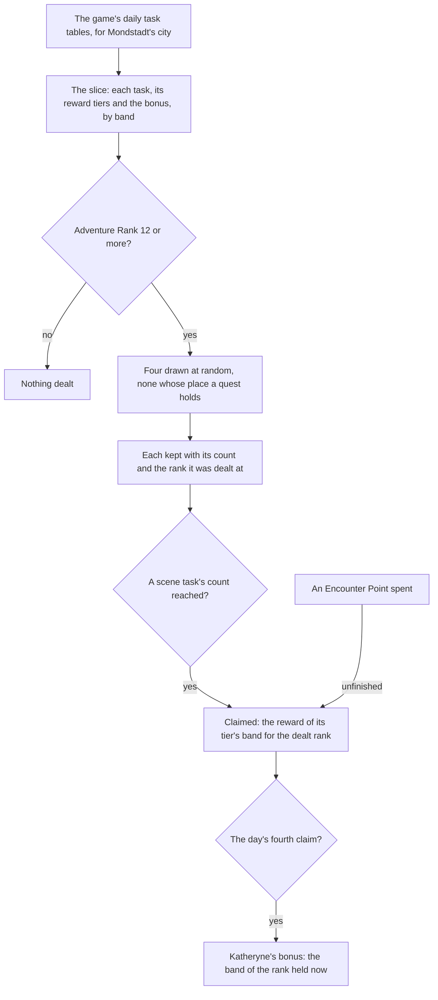

# Commissions

The game's daily commissions as the world holds them: Mondstadt's daily tasks read from the game's own tables, four dealt for the day, each finished one claimed for the reward of the Adventure Rank it was dealt at, and Katheryne's bonus on the day's fourth claim. This is the built part of the [commissions](/docs/proposals/genshin/commissions) proposal. Its scene swap, its handbook tab and its kept day are not built yet.

## How it works

## The daily tasks

A commission is one daily task of Mondstadt's city, read from the game's daily task table. It names its pool, the scene point it is set at, the radius it begins and ends in, what finishes it and how far, the groups a scene task swaps, the quest a quest task is, and the reward tier it pays from. A **scene task** puts its own camp or objects in place of its area's while it is open; a **quest task** is one of the quests the world carries. A scene task is finished by enemies defeated, gadgets used or a challenge cleared, and a quest task has no finish of its own, since its quest finishes it.

## Dealing

`dealCommissions` deals up to four tasks for the day. They are drawn at random without repeats from every task of the reached areas, skipping any whose place a quest in progress holds, and nothing is dealt before Adventure Rank 12, where commissions open. Each dealt commission keeps its count and the rank it was dealt at, because its reward is paid for that rank and not the rank the player later reaches.

## Claims and rewards

The game's Adventure Rank is cut into twelve bands of five ranks, rank 1 to 5 the first and rank 56 to 60 the last, and a rank past the last band stays in it. A reward tier holds the items of each band, and a claim draws each item's count from its range with the world's random source. A draw of zero gives nothing.

- `claimCommissionReward` claims a dealt scene task whose count has reached its finish count. Its reward is the tier's band for the rank it was dealt at.
- `claimCommissionWithEncounterPoint` claims one for a point, the commission unfinished, and spends the point. A commission claimed either way cannot be claimed again.
- Claims stop at four a day. Each claim counts toward the four, whichever way it was made.

A claim returns the items drawn, Mora and the Adventure EXP and Companionship EXP items included. Routing those to the wallet, the bag, the Adventure Rank and the friendship is the caller's, and no caller of it is built yet.

## Katheryne's bonus

The fourth claim of the day also draws Katheryne's bonus, for the band the rank the player holds at that moment falls in. The bonus is the game's score preview for each band, read from its level table. At every band it gives 20 Primogems and 500 Adventure EXP, and its Mora and Companionship EXP rise with the band, to 13,175 Mora and 100 Companionship EXP at the top band.

The Adventure Treasure Pack the wiki lists is not paid. The preview names its item at a count of zero in every band, so the reader leaves it out. Whether the game gives it on the bonus is a recording still owed on the [roadmap](/docs/genshin/roadmap).

## Data

`pnpm -C scripts genshin:assets commissions` writes `packages/genshin-world/src/generated/commissions/mondstadt.json` from the game text dump outside the repository. The run reads the daily task, reward and level tables and the reward previews, and refuses a level table that is not the game's twelve bands. The slice is imported on demand by `readMondstadtCommissions` and checked against its schema as it arrives.

The dump at its revision lacked the three daily task tables, which the [game data formats](/docs/genshin/game-data-formats) page covers, and nothing from them is committed.

## Not built yet

- **The scene swap.** The [proposal](/docs/proposals/genshin/commissions) owns how a scene task's groups stand in for its area's. The region data holds only hand-placed camps, and the area's groups are not extracted, so the slice carries each task's old and new group ids for that page to read.
- **The handbook's Commissions tab and the commissions' words.** The tab lists the day's four, and the titles and descriptions are the game's text by their ids, in the reader's language. Neither has a consumer yet.
- **The kept day.** The four dealt, their counts and their claims are not kept between visits, and the daily reset is not read, as the quests' progress is not kept yet.
- **A quest task's finish.** It finishes with its quest, which the world does not report yet, so a quest task reads unfinished.
- **Finishing counts.** `advanceCommission` counts a doing against a commission, but no defeat, gadget or challenge event is fed to it yet.
- **Regions beyond Mondstadt.** Their pools join once their quests are done.
- **Encounter Points' sources.** Quests, chests and certain items give them, and none of those give them yet.

## Key files

| File                                                                                  | Role                                                                 |
| :------------------------------------------------------------------------------------ | :------------------------------------------------------------------- |
| `packages/genshin-world/src/models/commission/Commission.ts`                          | One daily task: its place, finish, groups and reward tier            |
| `packages/genshin-world/src/models/commission/CommissionSlice.ts`                     | The slice's shape: the tasks, the reward tiers and the bonus by band |
| `packages/genshin-world/src/services/commission/dealCommissions.ts`                   | Deals four at random, none held and none before Adventure Rank 12    |
| `packages/genshin-world/src/services/commission/takeCommissionClaim.ts`               | Draws a claim's reward and, on the day's fourth, the bonus           |
| `packages/genshin-world/src/services/commission/claimCommissionReward.ts`             | A finished commission's claim                                        |
| `packages/genshin-world/src/services/commission/claimCommissionWithEncounterPoint.ts` | An unfinished commission's claim for one Encounter Point             |
| `packages/genshin-world/src/services/commission/computeCommissionBand.ts`             | The band an Adventure Rank falls in                                  |
| `packages/genshin-world/src/services/commission/readMondstadtCommissions.ts`          | Imports the slice on demand                                          |
| `packages/genshin-world/src/models/reward/RewardItem.ts`                              | An item a reward gives, with the least and the most a claim may draw |
| `scripts/src/services/genshinAssets/commissions/writeMondstadtCommissions.ts`         | The writer: the dump's tables into the slice                         |
| `scripts/src/services/genshinAssets/commissions/toCommissionTask.ts`                  | One dump task read into a commission                                 |
| `scripts/src/services/genshinAssets/rewards/toPreviewItems.ts`                        | A reward preview's items, shared with the expeditions                |

## Sources

- [AnimeGameData](https://github.com/DimbreathBot/AnimeGameData), the community's per-patch dump: `DailyTaskExcelConfigData`, `DailyTaskRewardExcelConfigData` and `DailyTaskLevelExcelConfigData`, the tasks, their reward tiers and the Adventure Rank bands, with `RewardPreviewExcelConfigData` for each reward's items.
- [Commission](https://genshin-impact.fandom.com/wiki/Commission), Genshin Impact Wiki: the four commissions a day, the unlock at Adventure Rank 12, and the bonus's items the dump's preview is checked against. The page could not be read when this page was written, so its figures are the dump's.
