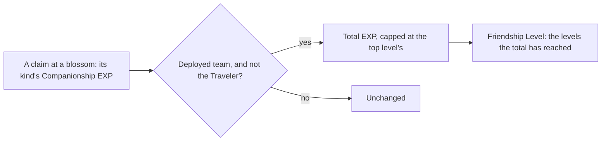

# Companionship

Every character but the Traveler keeps a total of Companionship EXP, and its Friendship Level is the count of the game's levels that total has reached. Only the total is stored, so the level cannot disagree with it. The Original Resin claims are the first source that gives the EXP. The stories and voice-overs a level opens are on the [character profile](/docs/genshin/character-profile), a character at level 10 holds its namecard, shown on the profile by its name, and the Serenitea Pot dialogue and the namecard's art and description are not drawn yet; the commissions and random events that also give EXP have no page built.

## How it works

## Data

- **The level table.** The dump's `AvatarFettersLevelExcelConfigData` rows give the EXP each level takes to leave. `genshin:assets friendship` sums them into each level's total, so level 2 is 1,000 and level 10 is 29,100. The row past the top level is never summed in.
- **The namecards.** The dump's `FetterCharacterCardExcelConfigData` rows name each character's level 10 reward. `RewardExcelConfigData` gives its one item, and `MaterialExcelConfigData` names that item as a namecard, so Amber's is item 210003 under text id 273889772. The namecards and the levels are one file, `friendship.json`.
- **The claim amounts.** `BlossomCompanionshipExpMap` holds one amount per blossom kind, provisional until a recording measures it.

## Notes

- **The grant is whole, not split.** Every deployed member but the Traveler gets the full amount, a fallen one included, since the grant reads the team rather than their health.
- **Past the top, nothing is kept.** The total stops at the top level's, so a character there gains nothing and a claim that would pass it is cut short.
- **Provisional amounts.** Each claim kind is given the low end of the wiki's range for it, and two clips on the roadmap's Recordings owed list, one per pair of kinds, measure what a claim gives.
- **A namecard is held by its level.** A namecard is in the held list once its character's total EXP reaches level 10, read from the same levels, so no save keeps it. Its art is the game's texture and is never served, so the profile sets its name on a plate of its own, its description waiting on the static-data host.
- **Not built.** The Serenitea Pot dialogue and the namecard's description and art, which the [proposal](/docs/proposals/genshin/companionship) keeps; the stories and voice-overs are on the [character profile](/docs/genshin/character-profile). The claim is a rule with no claim screen calling it yet.

## Key files

| File                                                                              | Role                                                                        |
| :-------------------------------------------------------------------------------- | :-------------------------------------------------------------------------- |
| `packages/genshin-world/src/services/friendship/gainCompanionshipExp.ts`          | The grant to the deployed team but the Traveler, capped at the top level    |
| `packages/genshin-world/src/services/shared/computeLevelReached.ts`               | The level a total EXP has reached, read over any table of levels            |
| `packages/genshin-world/src/services/friendship/readFriendshipLevels.ts`          | The generated levels, imported on demand and checked against their shape    |
| `packages/genshin-world/src/services/friendship/readFriendshipNamecards.ts`       | The generated namecards, imported on demand and checked against their shape |
| `packages/genshin-world/src/services/friendship/computeHeldNamecardItemIds.ts`    | The namecards whose character has reached level 10                          |
| `packages/genshin-world/src/generated/friendship/friendship.json`                 | Each level's total EXP and each character's namecard, written from the dump |
| `packages/genshin-world/src/models/friendship/FriendshipLevel.ts`                 | A level's number and total EXP, with its schema                             |
| `packages/genshin-world/src/models/friendship/FriendshipNamecard.ts`              | A character's namecard item and its name text id, with its schema           |
| `packages/genshin-world/src/components/Character/Profile/Index.vue`               | Passes the namecard's name, from the name chunk, to the profile panel       |
| `packages/genshin-world/src/models/character/Character.ts`                        | Carries the total Companionship EXP of each character                       |
| `packages/genshin-world/src/services/originalResin/BlossomCompanionshipExpMap.ts` | Each blossom kind's Companionship EXP per claim, provisional                |
| `scripts/src/services/genshinText/writeNames.ts`                                  | Names each namecard's text id in the name chunk every language shares       |
| `scripts/src/services/genshinAssets/friendship/writeFriendship.ts`                | Writes the friendship slice from the dump's tables                          |
| `scripts/src/services/genshinAssets/friendship/toFriendshipNamecards.ts`          | Joins each level 10 card to its reward's namecard item and its name         |
| `scripts/src/services/genshinAssets/friendship/toFriendshipLevels.ts`             | Sums each level's rows into its total                                       |

## Sources

- [AnimeGameData](https://gitlab.com/Dimbreath/AnimeGameData), the community's per-patch dump: the `AvatarFettersLevelExcelConfigData` rows the level totals are summed from.
- [Companionship EXP](https://genshin-impact.fandom.com/wiki/Companionship_EXP), Genshin Impact Wiki: the per-claim ranges the provisional amounts take their low end from.
