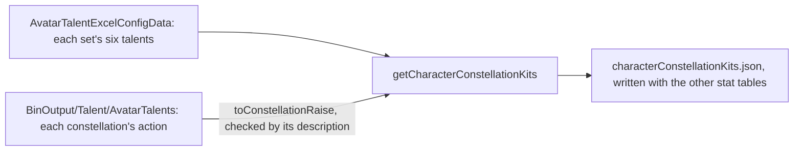

# Constellations

A character's six constellations are sequential upgrades, each activated with one Stella Fortuna of that character. What is built is the table side, which the stats run writes with the other stat tables, the activation as a pure rule over the character, the talent levels the active raises add, and the Stella Fortuna a wish counts to its character. A constellation's effect is a kit module's and waits on the [character kits](/docs/proposals/genshin/character-kits), as the Traveler's element sets wait on the statues.

## The table

- **One depot for each skill set that holds constellations.** A set's `talents` lists its six constellations in the order the game activates them. A character has one such set, or one for each element form, as the Traveler does; the Traveler's own form holds none. Each depot is keyed by its skill set's id, the one the [character kits](/docs/genshin/character-kits) table uses.
- **A third and fifth raise a talent by three.** Each constellation's config names a skill action, in one of the two shapes the dump's configs take. Its slot is the last digit of the skill's proud skill group: 1 the normal attack, 2 the Elemental Skill, 9 the burst. The description names the same skill by its English name, and a disagreement refuses the table rather than raising the wrong talent. Every constellation in the dump's sets agrees with its description. The other four are switches, carrying only their numbers.
- **A set spends one item.** All six of a set spend one Stella Fortuna of one item, the character's own. The writer refuses a set whose six do not.
- **A set with a constellation the dump names no config for is left out, with a note.** Aloy's six talents are unnamed placeholders, so her set is not written, which matches the game's rule that her constellations cannot be activated. A newer character whose config the dump lacks is noted the same way, since its raised talent is unknown.
- **The configs the dump's folder lacks come from the repository's default branch.** Some of the dump's talent configs sit in files of their own, and a few are missing from the revision the talent table matches. Those are fetched beside the dump, as the talent table was, and each raise is checked against its description before it is written.

## Activation

- **The next constellation is activated, spending one Stella Fortuna.** `activateConstellation` takes the character and its set. The constellation after the last active is the one activated, and it costs one of the character's own Stella Fortuna.
- **A refusal leaves the character as it was.** A set with every constellation active, a set with none, and a character holding no Stella Fortuna throw before anything is returned. Aloy's empty set refuses the same way.
- **The active raises are added to the talents a kit reads.** `getConstellationTalentAdditions` sums the levels each active constellation with a raise adds to its talent. A kit reads a talent at its own level plus these, which materials never pay for.

## Stella Fortuna from wishes

- **A duplicate among the first six brings its character's Stella Fortuna.** `makeWishes` counts it to the character the wish drew, in `stellaFortunaCountMap`, for the caller to hand over. A new character brings none, and the sixth duplicate is the last to bring one.
- **A five-star past six copies brings a Masterless Stella Fortuna.** It goes to the wallet, once per copy, beside the Starglitter that a complete set returns. It is counted in `makeWishes` rather than `getWishReturn`, since that returns one currency and a five-star past six brings two.
- **A new character starts with none.** `createCharacter` sets the constellations active and the Stella Fortuna held to zero.

## Not built yet

- **The constellations' effects.** Each non-raising constellation is a switch its character's kit module reads, and no module exists until the [character kits](/docs/proposals/genshin/character-kits) page is built.
- **The Traveler's element sets.** The statues pick which element's set the Traveler holds, and the sources that unlock each set are their own pages'. Until then the Traveler has no set chosen, and the table holds all of them.
- **The Constellation tab and the store.** The character screen's tab that presses an activation, and the store that hands a wish's Stella Fortuna to its character, are not built. The wish screen does not show a draw's Stella Fortuna or Masterless one.

## Key files

| File                                                                               | Role                                                                                  |
| :--------------------------------------------------------------------------------- | :------------------------------------------------------------------------------------ |
| `packages/genshin-world/src/models/character/Constellation.ts`                     | One constellation: its names by text id, its numbers, and the talent it raises        |
| `packages/genshin-world/src/models/character/ConstellationDepot.ts`                | A skill set's six constellations, in activation order                                 |
| `packages/genshin-world/src/models/character/CharacterConstellationKit.ts`         | A character's sets, one depot for each that holds constellations                      |
| `packages/genshin-world/src/models/character/Character.ts`                         | Gains the constellations active and the Stella Fortuna held                           |
| `packages/genshin-world/src/services/character/activateConstellation.ts`           | The activation rule: the next constellation, one Stella Fortuna spent                 |
| `packages/genshin-world/src/services/character/getConstellationTalentAdditions.ts` | The levels the active raises add to each combat talent                                |
| `packages/genshin-world/src/services/character/readConstellationTables.ts`         | The table, imported on demand and checked against its shape                           |
| `packages/genshin-world/src/services/wish/makeWishes.ts`                           | Counts a duplicate's Stella Fortuna to its character and a five-star's Masterless one |
| `packages/genshin-world/src/generated/stats/characterConstellationKits.json`       | The written table                                                                     |
| `scripts/src/services/genshinAssets/stats/getCharacterConstellationKits.ts`        | Each playable character's sets with their constellations, from the dump               |
| `scripts/src/services/genshinAssets/stats/toConstellationRaise.ts`                 | The talent a constellation's action raises, checked against its description           |
| `scripts/src/services/genshinAssets/stats/readTalentActions.ts`                    | Every talent config's actions in the dump, by the name a talent row gives             |

## Sources

- [AnimeGameData](https://gitlab.com/Dimbreath/AnimeGameData), the community's per-patch dump: `AvatarTalentExcelConfigData` and the skill depots' `talents`, and the talent configs under `BinOutput/Talent/AvatarTalents`.
- [Constellation](https://genshin-impact.fandom.com/wiki/Constellation), Genshin Impact Wiki: six levels per character, the third and fifth raising a combat talent by three, and one Stella Fortuna each.
- [Stella Fortuna](https://genshin-impact.fandom.com/wiki/Stella_Fortuna), Genshin Impact Wiki: a duplicate from a wish as the source of a character's own Stella Fortuna, six at most.
- [Masterless Stella Fortuna](https://genshin-impact.fandom.com/wiki/Masterless_Stella_Fortuna), Genshin Impact Wiki: one for a five-star drawn at its full constellations.
