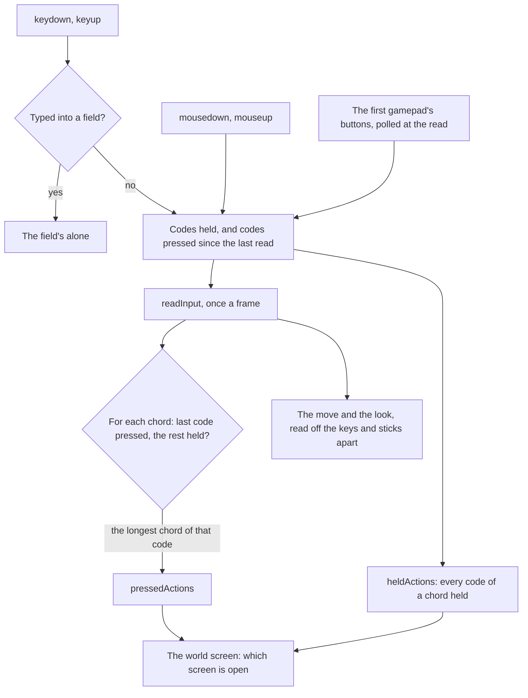

# Controls

The world reads its controls the way the game binds them. Every action a player's buttons ask for, from jumping to opening the map, is an `InputAction` in `genshin-engine`'s `input` module, and `InputActionBindingMap` holds the game's default binding for each, as the game's own controls list sets them out for a PC and an Xbox pad. The map is the one statement of what a key does: a screen, the camera and the HUD read actions, never a key of their own.

## A binding is chords

Each action's binding is a list of chords, and a chord is the codes held together, its last code the one whose press triggers it. Most chords are one code: `M` opens the map, `Q` is the elemental burst, a pad's top face button is the burst too. A few are two: on a pad, the left bumper held with the right face button is the quick-use gadget, and with the directional pad's right the co-op screen; on a keyboard, Left Alt held with a number switches to that party member and uses its burst.

Keys, mouse buttons and gamepad buttons share one namespace of codes. A key is its physical code (`KeyM`), so a layout does not move it; a mouse button and a gamepad button are each an enum value spelt apart from every key code (`MouseButton`, `GamepadButton`), so one chord can name any of them. A gamepad's buttons are read in the browser's standard layout and named by where they sit, so a PlayStation pad's cross and an Xbox pad's A are both `FaceBottom`.

## How a frame reads them

- **Held and pressed.** An action is held while every code of one of its chords is held, and pressed on the read after its chord's last code went down with the rest held. A key pressed and let go between two reads still presses its action once; a key held down presses it once, however long the browser repeats it.
- **The longest chord wins.** When one press completes several chords, only the longest of them presses its action. Holding the left bumper and pressing the right face button is the gadget alone, never the normal attack the face button is by itself, as the game's pad turns its face buttons into the shortcut wheel's while the bumper is held.
- **A move and a look are axes, not actions.** `W`, `A`, `S` and `D`, the sticks and the locked pointer are read into the same state as numbers, as the [free camera](/docs/genshin/free-camera) describes.
- **A blur lets every key go**, since the keys released while the page is away never reach it.

## The browser's own keys

A bound key's default is prevented, so `F5` opens the events screen rather than reloading the page, `F1` the handbook rather than the browser's help and `F3` the wish rather than its find bar. `Enter`, `Space` and `Tab` keep their defaults: they are how a screen's buttons are pressed and walked through from the keyboard, so preventing them would leave a menu unreachable without a pointer.

A key typed into a field (an input, a text area, a select or anything editable) reaches no binding at all and keeps its default, so a letter typed into a chat or a console never opens a screen.

## Escape and the locked pointer

While the pointer is locked to turn the camera, the browser keeps `Escape` for itself: it lets the lock go and never passes the key on. So a lock lost while the world is in play opens the Paimon menu, as `Escape` does with the pointer free ([screens](/docs/genshin/screens)). The lock is taken again by a click on the world, since the browser takes no lock from `Escape` itself.

## Decisions

- **The game's defaults, and only them.** No binding is remapped: the game's controls fix most of its defaults, and the ones a player can change are left at the game's own until a Settings row backs a change.
- **Left Control stays the walk switch.** The free camera falls on left Shift as before, not on the Control the game crouches with, since a held Control with `W` is the browser's close-tab shortcut.
- **The pad's Back opens the chat.** A PlayStation pad's touchpad, the game's chat button there, is no button in the browser's standard layout, so the button left of centre (an Xbox pad's View, a PlayStation pad's Share) carries it on every pad.
- **Bindings with nothing behind them are kept.** The normal attack, the elemental skill, the party switches and the rest are read every frame though no feature reads them yet, so each feature that lands finds its action already bound as the game binds it.

## Not bound

The bindings of places and modes the world does not have are left out: the Serenitea Pot's and the Cat's Tail's screens (`F6`, `F7`), Stellar Reunion (`F8`), a fifth party member, a challenge's abandon, the tutorial, notification and special environment pop-ups, and every Miliastra Wonderland control.

## Key files

| File                                                         | Its role                                                                                  |
| :----------------------------------------------------------- | :---------------------------------------------------------------------------------------- |
| `packages/genshin-engine/src/models/input/InputAction.ts`    | every action a player's buttons ask for                                                   |
| `packages/genshin-engine/src/input/InputActionBindingMap.ts` | the game's default chords for each action, on a PC and a pad                              |
| `packages/genshin-engine/src/models/input/GamepadButton.ts`  | a pad's buttons in the standard layout, named by where they sit                           |
| `packages/genshin-engine/src/models/input/MouseButton.ts`    | a mouse's buttons, spelt apart from every key                                             |
| `packages/genshin-engine/src/input/createInput.ts`           | the listeners, the gamepad's poll and the once-a-frame read into held and pressed actions |
| `packages/genshin-engine/src/input/constants.ts`             | the focus keys, the field selector and the standard layout's button order                 |

## Sources

- [Controls](https://genshin-impact.fandom.com/wiki/Controls), Genshin Impact Wiki: the default PC, Xbox and PlayStation binding of every action and menu, the ones a player cannot change, and the bumper's combinations on a pad.
- [Standard Gamepad](https://w3c.github.io/gamepad/#remapping), W3C Gamepad: the standard layout's button order, which `GAMEPAD_BUTTONS` follows.
- [Pointer Lock 2.0](https://w3c.github.io/pointerlock/), W3C: the user agent leaving the lock on `Escape`.
- [User activation](https://html.spec.whatwg.org/multipage/interaction.html#activation-triggering-input-event), WHATWG HTML: `Escape` gives no activation, so no lock can be requested from it.
