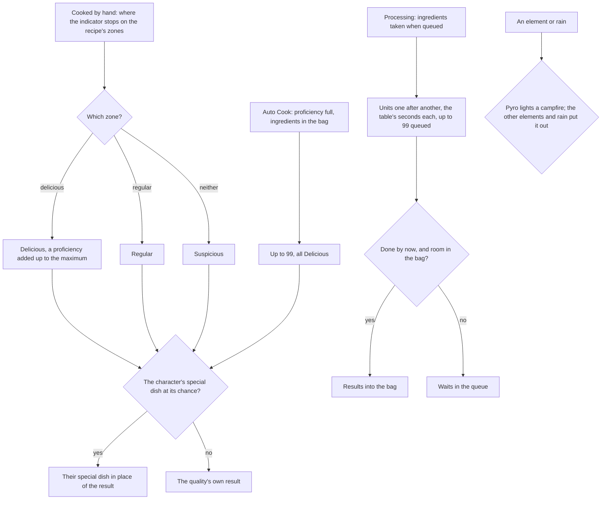

# Cooking

The dishes and processings of the game's cooking are rules over the game's own tables, and a campfire's lit state follows the elements and the weather. This page is the first build of the [cooking](/docs/proposals/genshin/cooking) proposal, covering its recipes, cooking by hand, proficiency, Auto Cook, specialties, processing and campfires. The stove's place in Mondstadt, the cooking screen and its indicator, what a dish does once eaten, and the characters' passives that bonus a kind of dish are not built and stay in the proposal.

## How it works

## The recipes

`pnpm -C scripts genshin:assets cooking` writes two slices from the game text dump: the dishes, from the cook recipe table with each dish's specialties and the instruction items that teach it, and the processings, from the compound table. The cook recipe, cook bonus and compound tables are missing from the community dump, so they are fetched as the [game data formats](/docs/genshin/game-data-formats) page describes.

- **Dishes.** A dish is written with its ingredients, the item each quality of its result is, its maximum proficiency, its rarity, its zone parameters, whether it is known from the start, its specialties, and the instruction items that teach it. Each result's quality is read off its item row's food quality, not its place in the table, and each specialty's chances are read in the order of the results.
- **Processings.** Only the rows of the cooking type are written. A random processing draws its result from a drop table the build does not read, so it is left out. Each keeps its ingredients, its one result, the seconds a unit takes, how many may be queued, and whether it is known from the start.

## The rules

- **Known.** A dish is known from the start or once one of its instruction items is used, which takes the item from the bag and records the dish as learned.
- **Cooked by hand.** The indicator's stop on the recipe's zones decides the quality: the delicious zone makes a Delicious dish, the regular zone a Regular one, and anywhere else a Suspicious one. The dish's ingredients are taken and the dish put in the bag, all or nothing; leaving the minigame spends nothing. A Delicious dish adds one proficiency up to the dish's maximum, whatever the dish is, its special dish included.
- **Auto Cook.** Once a dish's proficiency is full, a batch makes as many dishes as the bag's ingredients allow, up to 99, every one Delicious. The batch is made whole or refused, so it is refused where the bag has no room for every dish. Each dish rolls its character's special dish once, at the Delicious chance.
- **Specialties.** A character named in a dish's specialties may have its special dish made in place of the result: a roll under that character's chance for the quality cooked makes the special dish. Raiden Shogun is refused, so no dish is made with her, by hand or by Auto Cook.
- **Processing.** A processing is queued for up to its queue size of units, its ingredients for every unit taken from the bag when it is queued. Its units run one after another, each taking its seconds: a queue that is idle starts from the moment it is queued, and one still running is extended from when it began. The units done by a moment are taken into the bag together, and a unit whose result the bag has no room for waits in the queue, with the units behind it. A processing not known from the start is refused.
- **Campfires.** Pyro lights a campfire. Anemo, Cryo, Electro, Geo and Hydro put it out, and so do rain and thunderstorms in the open. Dendro leaves it as it was.

The quality weights the table gives each dish are all the Delicious weight in this patch, which is Auto Cook's always-Delicious rule, so they are not read. The zones are provisional, as below.

## Key files

| File                                                                   | Role                                                                      |
| :--------------------------------------------------------------------- | :------------------------------------------------------------------------ |
| `scripts/src/services/genshinAssets/cooking/writeCookingRecipes.ts`    | The dishes slice written from the cook recipe table                       |
| `scripts/src/services/genshinAssets/cooking/toCookingRecipe.ts`        | One dish row as a recipe, its results' qualities read off their item rows |
| `scripts/src/services/genshinAssets/cooking/writeProcessingRecipes.ts` | The processings slice written from the compound table                     |
| `packages/genshin-world/src/services/cooking/cookRecipeByHand.ts`      | A dish cooked by hand: its quality, a proficiency, the dish into the bag  |
| `packages/genshin-world/src/services/cooking/autoCookRecipe.ts`        | Auto Cook's batch of up to 99 Delicious dishes, made whole or refused     |
| `packages/genshin-world/src/services/cooking/pickDishItemId.ts`        | A character's special dish in place of a result, at its chance            |
| `packages/genshin-world/src/services/cooking/getCookingQuality.ts`     | The quality of a stop on the zones                                        |
| `packages/genshin-world/src/services/cooking/startProcessing.ts`       | Units queued with their ingredients taken, the queue's size held          |
| `packages/genshin-world/src/services/cooking/collectProcessing.ts`     | The units done by a moment taken into the bag, the rest queued            |
| `packages/genshin-world/src/services/cooking/applyCampfireElement.ts`  | Pyro lights a campfire, the elements that put it out do                   |
| `packages/genshin-world/src/services/cooking/applyCampfireWeather.ts`  | Rain puts a campfire in the open out                                      |
| `packages/genshin-world/src/generated/cooking/recipes.json`            | The dishes, a few hundred of them                                         |
| `packages/genshin-world/src/generated/cooking/processing.json`         | The processings, about sixty of them                                      |

## Notes

- **The zones are provisional.** `readCookingZones` reads a recipe's zone parameters as the centre and the width of the regular zone along the bar, and the delicious zone takes a provisional share of that width. Which parameter lays out which zone, and the indicator's speed, are measured off a recording of the cooking screen, owed on the roadmap.
- **The special dish's order is read, not confirmed.** The chances are matched to the qualities in the order the table lists the results, the order its food qualities confirm. No public source was reachable from this build to check it, so a recording owed on the roadmap confirms it.
- **Most processings are closed.** Most are not known from the start, and the table names no instruction that teaches them, all of them in one group. They stay closed until that source is read.
- **Nothing is placed or on a screen.** The stove and the cooking screen are not built, as with the [crafting](/docs/genshin/crafting) bench, and nothing is eaten: a dish's heal and bonus wait on the [inventory](/docs/proposals/genshin/inventory)'s using and the character kits.

## Sources

- [AnimeGameData](https://github.com/DimbreathBot/AnimeGameData), the community's per-patch dump: `CookRecipeExcelConfigData`, `CookBonusExcelConfigData` and `CompoundExcelConfigData`, the tables the slices are written from, and `MaterialExcelConfigData`, whose food qualities and instruction uses are read.
- [Cooking](https://genshin-impact.fandom.com/wiki/Cooking), Genshin Impact Wiki: the zones, proficiency, Auto Cook, special dishes, and stoves and campfires, the rules the proposal settles against. The page was not reachable from this build, so the claims it backs wait on the recordings owed.
