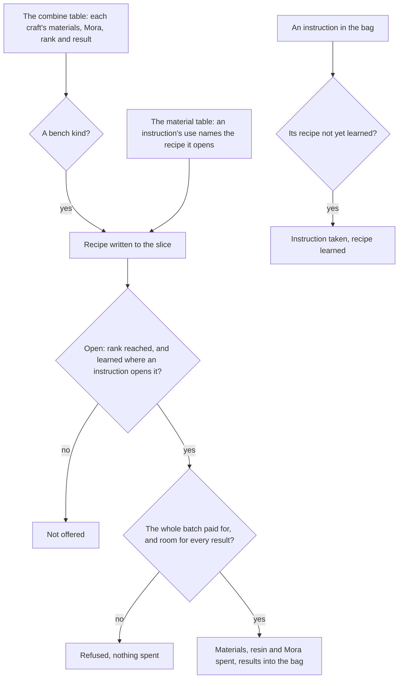

# Crafting

The bench's recipes are read from the game's combine table into the world's data, and the rules of crafting run over them: which recipes a player has open, how many of a recipe the bag and wallet pay for, a batch crafted whole or refused, and a recipe learned from its instruction. This page is the first build of the [crafting](/docs/proposals/genshin/crafting) proposal, covering the tiers, potions, baits and Condensed Resin. The characters' crafting talents are built as well, their doubles, refunds and regional talent materials. The bench's screen is built, with its recipe tabs and the crafter's talent rolled into a batch, and reached through its fixture. The bench's place in the world and the gadgets are not built yet and stay in the proposal.

## How it works

## The recipes

`pnpm -C scripts genshin:assets crafting` writes the recipe slice from the game text dump's combine and material tables. The combine table is fetched rather than read from the dump, as [game data formats](/docs/genshin/game-data-formats) records. A row is written when it is a craft at the bench and of one of these kinds:

- **Tiers**, the combine types that make three of a material for one of the next. Every tier row takes exactly three of one material for one item, and a row that does not is an error.
- **Potions**, the combine types for Heatshield and Desiccant potions and for the formulas of Pure Water and Strength Tonic.
- **Baits**, each making ten from its two ingredients.
- **Condensed Resin**, the one recipe whose result is item 220007, from one crystal core and 60 Original Resin.

Left out, each for its own reason: the convert rows, which turn a boss material into another with Dream Solvent and are not three-for-one; the homeworld's rows, which belong to the Serenitea Pot; the resonance stones and Portable Waypoint, which the statues and exploring pages will place; the gadget recipes and the essential oils, whose instructions the table does not name; and the Xiao Lantern, a quest's item.

A recipe the table shows from the start is open from the start. One it hides is written with the instruction items that open it, read off the material table's use of each instruction. A hidden recipe no instruction opens is an error, so a table change cannot hide a recipe silently.

## The rules

- **Open.** A recipe is offered once the player's Adventure Rank reaches its rank, and, for a recipe an instruction opens, once it is learned.
- **Count.** The times a recipe can be crafted is the least of what each material and the Mora pays for. Original Resin is paid from the wallet, regenerated to the moment of the craft; every other material from the bag.
- **Tabs.** The open recipes are listed under one tab per combine type they fall under, in the table's order. Each tab is named by the game's own text for its combine type (`COMBINE_TYPE_NAME1` to `COMBINE_TYPE_NAME12`), and the first tab shows until one is picked. Combine type 6 is named Consumable and type 12 Food, as the game's medium English text map files them.
- **Craft.** A batch is crafted whole or refused. Its materials, resin and Mora are spent and its results put in the bag, and a batch the bag has no stack room for every result of is refused. That is how Condensed Resin stops at the five it holds.
- **Talent.** A character's crafting talent, from the wiki's Crafting Talents category, draws on each craft of a recipe of the combine types it names: a double of the result at 10%, or a refund of the recipe's first material at 25% (20% for potions), or, for a talent book, the same tier of another talent book series in its region at 25% (Yae Miko) or 10% (Prune). A craft's draw is taken from the world's seeded random source, and a character with no talent crafts plainly.
- **Learn.** Using an instruction takes one from the bag and records the recipe as learned. The instruction must be one the recipe names, held by the bag, and the recipe not learned already.

## Key files

| File                                                                            | Role                                                                                        |
| :------------------------------------------------------------------------------ | :------------------------------------------------------------------------------------------ |
| `scripts/src/services/genshinAssets/crafting/writeCraftingRecipes.ts`           | The recipe slice written from the combine table                                             |
| `scripts/src/services/genshinAssets/crafting/toCraftingRecipe.ts`               | One row as a recipe, refusing a tier that is not three of one material                      |
| `scripts/src/services/genshinAssets/items/readUnlockItemIdMap.ts`               | Each recipe's instruction items, read off the material table                                |
| `packages/genshin-world/src/services/crafting/CharacterIdCraftingTalentMap.ts`  | The thirteen characters' crafting talents, by avatar id                                     |
| `packages/genshin-world/src/services/crafting/CombineTypeGameTextKeyMap.ts`     | Each combine type's tab name, by the game's own text key                                    |
| `packages/genshin-world/src/services/crafting/TalentBookIdOtherSeriesIdsMap.ts` | Each talent book craft's regional extra: the same tier of the region's other two series     |
| `packages/genshin-world/src/services/crafting/rollCraftingTalent.ts`            | The extra results, refunds and regional materials a character's talent adds to a batch      |
| `packages/genshin-world/src/services/crafting/craftRecipe.ts`                   | A batch crafted whole, or refused with nothing spent                                        |
| `packages/genshin-world/src/services/crafting/computeCraftableCount.ts`         | How many of a recipe the bag, wallet and regenerated resin pay for                          |
| `packages/genshin-world/src/services/crafting/checkIsRecipeOpen.ts`             | Whether a recipe is open at a rank, and learned where an instruction opens it               |
| `packages/genshin-world/src/services/crafting/learnCraftingRecipe.ts`           | A recipe learned from an instruction in the bag                                             |
| `packages/genshin-world/src/services/crafting/readCraftingRecipes.ts`           | The slice imported on demand and checked against its shape                                  |
| `packages/genshin-world/src/generated/crafting/recipes.json`                    | The bench's recipes, a few hundred of them                                                  |
| `packages/genshin-world/src/components/Crafting/Screen/Index.vue`               | The bench's screen: the open recipes, the crafter, the count and the craft                  |
| `packages/genshin-interface/src/components/CraftingScreen/Index.vue`            | The bench's 2D screen over the recipe tabs, the recipe list, the crafter pick and the craft |
| `scripts/src/services/genshinAssets/items/writeItems.ts`                        | The item table's rows, now with every crafting recipe's materials and result                |

## Notes

- **Each recipe carries its result's name.** A recipe's `nameTextId` is the text id of the item it makes, read from the material table, and `genshin:text names` writes it into the world's names chunk per language, so a bench screen can show it without a game text key.
- **The bench is not placed.** The official map marks no crafting bench, and the scene's streaming records, which place one in a city, are not read yet, so no bench stands in the world and no prompt offers a craft.
- **The gadget recipes are unsourced.** The table holds the gadgets' recipes hidden with no instruction to open them. The wiki was not reachable from this build to name the source, so they are left out until one does.
- **The screen is reached through its fixture.** The recipe list, the crafter's pick, the count and the craft are the `CraftingScreen` unit under `genshin-interface`, wrapped by the world's `Crafting/Screen`, which opens as an NPC screen. Its words are the game's own text ids, and its look waits on the bench's passes against the clip.
- **A batch's talent extra with no room is left out.** The craft is checked whole first, so the bag's room goes to the craft's own results before a talent's extra is added, and an extra that finds no room is dropped rather than refusing the craft.
- **Crafting Performed counts this visit.** The save holds no count of crafts yet, so the line counts the batches crafted since the bench opened.
- **The item table gains the crafting items.** `genshin:assets items` reads each recipe's materials and result from the material table, so every crafting item has its row and name, not only the drops'.

## Sources

- [AnimeGameData](https://github.com/DimbreathBot/AnimeGameData), the community's per-patch dump: `CombineExcelConfigData`, each craft's materials, Mora, rank and result, and `MaterialExcelConfigData`, whose instructions' uses name the recipes they open.
- [Condensed Resin](https://genshin-impact.fandom.com/wiki/Condensed_Resin), Genshin Impact Wiki: the 60 resin a craft takes and the five a player can hold, the figures the proposal settles its decisions from.
