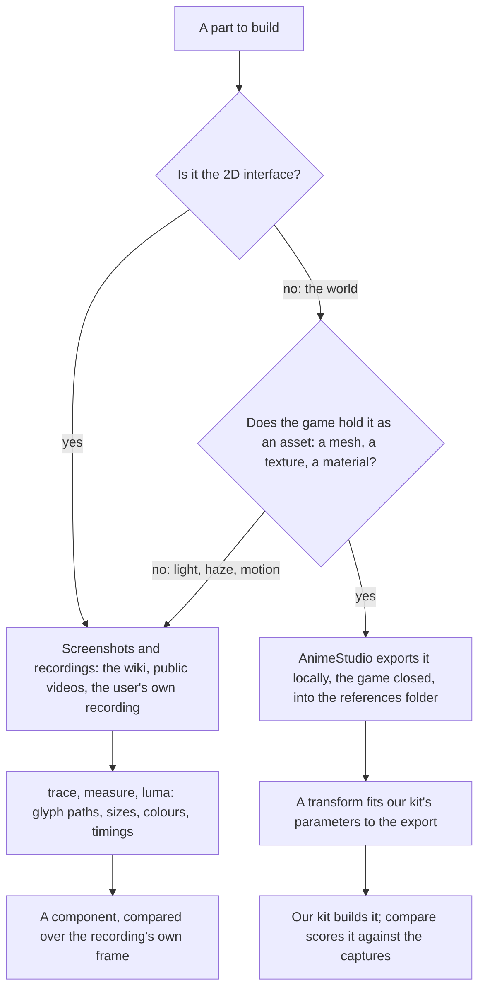

# Derived assets

Nothing of the game's ships. Every shape, colour and glyph the recreation draws is ours, measured off the game and built by our own code, and the game's own files are references like any screenshot. This page is which reference each part is measured from, how a measurement becomes ours, and how far each component has come.

## Which source a part is measured from

- **The interface comes from screenshots.** The game's interface is mostly drawn at run time from atlases whose names say little, while the wiki and recordings show every screen in every language. An interface component is compared over the recording's own frame, which holds it exactly ([parity](/docs/genshin/parity)).
- **The world comes from the game's own assets.** A tower's profile, a door's outline and a stone's palette are read off the game's mesh, texture and material exports, which pin a measure a picture can only estimate: a tower's depth, its true diameter, a moulding's height.
- **Only our parameters ship.** A transform reads an export and writes the numbers our kit takes, such as a lathe's section shares, a door's outline points or a palette. It writes them as data beside the component that reads them, and never a vertex, a pixel or a converted file of the game's. The exports stay in `~/Esposter/genshin-parity/extracted` with every other reference and never enter the repository or a build. So there is one render path, our kits, and nothing to keep in step between a local mode and the deployed one.

## Exporting

AnimeStudio's command-line tool reads the installed game's `blocks` folder, `GenshinImpact_Data/StreamingAssets/AssetBundles/blocks`, with the game closed:

1. **Map the blocks, once a patch.** `AnimeStudio.CLI <blocks> <extracted>/maps --game GI --map_op Both --map_type JSON --map_name gi_map` indexes every asset by name, type and block into a JSON asset map of about a gigabyte. The CAB map it needs to resolve dependencies is written to the tool's own `Maps` folder, beside its working directory.
2. **Find a component's assets by name.** A container is a hash without the game's asset index, so a search reads the names (`Level_…_Lod0` a mesh, `…_Diffuse` its texture) and the types in the asset map.
3. **Export only those.** `--map_op AssetMap,Load --names <regex> --types Mesh,Texture2D` exports the matched assets out of their blocks, into a folder per component under `extracted`.

## Inventory

| Component                  | Source                                         | Status                                                          |
| :------------------------- | :--------------------------------------------- | :-------------------------------------------------------------- |
| `Splash/Publisher`         | Commons' vector logo, the recording's ring     | Compared, approved                                              |
| `Splash/Title`             | The English phone video's logo                 | Compared, approved                                              |
| `Splash/HealthNotice`      | The English client's notice                    | Compared, approved                                              |
| `Loading/Startup`          | The wiki's capture, the element marks' vectors | Compared, approved                                              |
| `Login/Interface`          | The English recording's frames                 | Compared over its frames at each stage, approved                |
| `genshin-ui` pieces        | The English and the 1440 high recordings       | Measured, approved in their own suite                           |
| `Login/Scene` camera       | The walkway's edges in the four skies          | Derived                                                         |
| `Login/Scene` towers       | The captures; next, the game's tower meshes    | Placed by kind width; profiles to be fitted to their exports    |
| `Login/Scene` walkway      | The captures; next, its mesh                   | Measured; to be fitted                                          |
| `Login/Scene` door         | The door capture; next, its mesh               | Outline estimated; to be fitted                                 |
| `Login/Scene` arcades      | The captures; next, their mesh                 | Placed; to be fitted                                            |
| `Login/Scene` clouds       | The captures                                   | A noise field; cloud banks and the cloud sea's billows to build |
| `Login/Scene` sky and haze | The four skies' pixels                         | Sampled; to be fitted by tone                                   |

## Key files

| File                                                           | Role                                          |
| :------------------------------------------------------------- | :-------------------------------------------- |
| `scripts/src/services/genshinParity/constants.ts`              | Where the references and the exports are kept |
| `packages/genshin-world/src/services/login/tower/constants.ts` | The towers' measures, to be replaced by fits  |
| `packages/genshin-engine/src/kits/architecture`                | The kits every fitted parameter drives        |

## Sources

- [AnimeStudio](https://github.com/Escartem/AnimeStudio): the exporter, and its command-line options.
