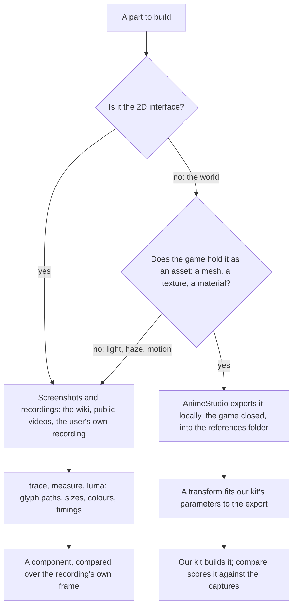
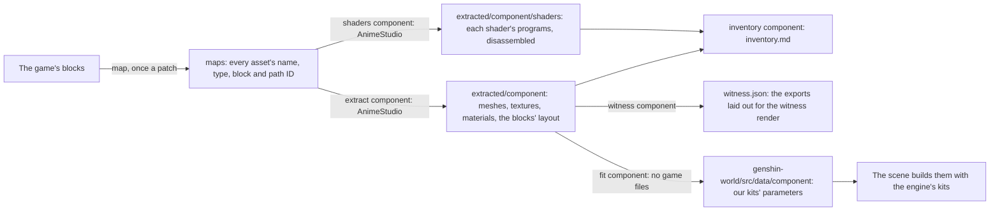
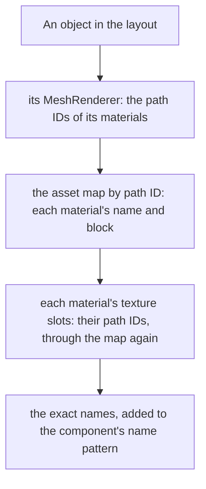

# Derived assets

Nothing of the game's ships. Every shape, colour and glyph the recreation draws is ours, measured off the game and built by our own code, and the game's own files are references like any screenshot. This page is which reference each part is measured from, how a measurement becomes ours, and how far each component has come.

## Which source a part is measured from

- **The interface comes from screenshots.** The game's interface is mostly drawn at run time from atlases whose names say little, while the wiki and recordings show every screen in every language. An interface component is compared over the recording's own frame, which holds it exactly ([parity](/docs/genshin/parity)).
- **The world comes from the game's own assets.** A tower's profile, a door's outline and a stone's palette are read off the game's mesh, texture and material exports, and where each stands from the blocks' own layout, which pin a measure a picture can only estimate: a tower's depth, its true diameter, a moulding's height.
- **Only our parameters ship.** A transform reads an export and writes the numbers our kit takes, such as a lathe's section shares, a door's outline points or a palette. It writes them as data beside the component that reads them, and never a vertex, a pixel or a converted file of the game's. The exports stay in `~/Esposter/genshin-parity/extracted` with every other reference and never enter the repository or a build. So there is one render path, our kits, and nothing to keep in step between a local mode and the deployed one. How a scene grows past its kits' few parameters, each loss priced against the exports before it is closed, is [proposed](/docs/proposals/genshin/scene-derivation).

## The pipeline

`pnpm -C scripts genshin:assets <step>` runs AnimeStudio's command-line tool (`GENSHIN_ANIMESTUDIO_CLI`, by default under `~/Downloads/AnimeStudio`) over the installed game's blocks, with the game closed. Each step reads what the one before it wrote:

1. **`map`** indexes every block into the asset map, about a gigabyte of JSON, and streams it into `index.tsv`, which a search reads in seconds. AnimeStudio writes the CAB map it needs into its own folder.
2. **`extract <component>`** finds the blocks holding the component's assets by the name pattern `DerivedAssetComponentMap` gives it, exports them block by block, and dumps each block's Transform, GameObject, MeshFilter and MeshRenderer as JSON.
3. **`shaders <component>`** exports every shader in the blocks holding the shaders its materials name, raw, since a shader is exported nameless and its block also holds the sky's and the post-processing's. The game keeps each compiled variant as a plain DXBC container, so `readDxbcPrograms` carves them out by their own stated sizes and Windows' own `d3dcompiler_47` disassembles each into its assembly (`disassembleDxbcDirectory`), beside the property names the shader declares, which tell a nameless shader apart. Each variant is also compiled for DirectX 12 as DXIL, which that disassembler cannot read; its DirectX 11 twin says the same. A shader AnimeStudio cannot parse, which includes the login stone's, is left out. This and `extract` are the only steps that read the game.
4. **`inventory <component>`** writes `inventory.md` beside the exports: each material's shader, texture slots and values, each texture's size and what each channel spans, each mesh's vertices and the materials its renderers draw it with, and each shader's program count and properties. A scene's derivation starts from it ([scene derivation](/docs/proposals/genshin/scene-derivation)).
5. **`witness <component>`** lays the exports out as the witness render draws them (`writeWitnessLayout`): the component's placements at each part's finest level, in three's axes, with every material each submesh draws with, as a `SceneLayout`.
6. **`fit <component>`** composes every object's world placement from the layout dumps, keeps the arrangements under the component's roots (`readComponentPlacements`), fits our kits' parameters to the meshes and textures, and writes them as the world package's data, the only output that enters the repository. A change of fit or selection reruns it alone.

A new component is one name pattern in `DerivedAssetComponentMap` and one fit in `DerivedAssetFitMap`; everything else is shared.

### Finding what a scene draws

A scene's parts are found by name, but its sky, its effects and its prefab parts often live under other names and blocks. What a scene actually draws is read off its renderers:

The login sky was found this way: `Clouds`, `Atmosphere` and the three cloud emitters draw `Enviro_*` materials whose textures sit in the login blocks under names no `LoginScene_` search reaches. Names shared across the game (`Cloud_LOD0`) are matched exactly, or the pattern reaches every block that reuses them.

### What the exports hold

- **Axes.** Unity is left-handed, and an OBJ export has its x negated back to Unity's mesh space, so a fit reads meshes and placements in the game's own axes throughout, then converts what it writes to three.js as `(x, y, -z)` (`toRightHanded`), a rotation as `(-x, -y, z, w)` (`toRightHandedRotation`).
- **Placements.** A path ID is 64-bit, so the layout is parsed with a `JSON.parse` reviver reading each number's source text. A root's parent is `0`. A GameObject is dumped under its name, so of the objects sharing one (each level of detail under its group) only the last survives; the layout is read from the Transforms, each dumped under a number of its own, and a Transform whose GameObject was lost takes its ID from a child whose own is known (`toSceneObjects`). A level-of-detail group whose own GameObject and every level's were lost is given the levels of its part that name one father: two groups of one part hold the same levels, so either pairing places the same parts. An object whose parent sits in a block not read is dropped, never set down at the origin.
- **One set of meshes, several arrangements.** Blocks lay one set of meshes out several times, each under its own root, so a component names the roots it is (`DerivedAssetComponentMap`'s `roots`). The login screen is `CharacterSelectSceneNew`'s stage (its towers, bridges, pillars and door at 0.4 scale, the door capture's size) and the walkway, a root of its own; the root `LoginScene_Build_All`, its `CG_opening01` groups and the full-scale door are the opening cinematic's. Only from the walkway's far end, looking down it along −z, do the stage's towers stand where the captures show them.
- **Renderers name their materials by path ID.** A MeshRenderer's materials are references into other files, with no name, so the index's path ID column names them. A mesh draws one material a submesh, and an OBJ export writes each submesh as a group named after the mesh with its index appended. A renderer carries no lightmap fields.
- **What a dump cannot hold.** A MonoBehaviour and a particle system export without their fields, since the blocks carry no type data. The camera's path, the door's appearance, the cloud emitters' spread and every light's strength and colour live in scripts, so they are measured from the captures, and expressed over what the blocks do give: the camera's height as a share of the walkway's width, the lights' strengths over the stone's fitted albedo, the cloud bands over the cloud layer's height.
- **Packed textures.** A texture's channels are rarely colours: read what each holds before fitting it. The sky gradient's are three falloff curves over the sky's height, not the hour's colours, which are the sky profile's. A cloud atlas holds two columns of four painted clouds, alpha their silhouette and red the light the painter put on them. A diffuse texture is the part's albedo, which the light warms and cools.

### The fits

| Fit                              | Reads                                                     | Writes                                                                                                                                                                                             |
| :------------------------------- | :-------------------------------------------------------- | :------------------------------------------------------------------------------------------------------------------------------------------------------------------------------------------------- |
| Lathe, `fitLatheProfile`         | A round mesh's vertices                                   | Its axis, its foot, and a section per two-metre band of its outer radius, merged within 3%                                                                                                         |
| Footprint, `fitFootprintOutline` | The triangles of every piece, seen from above             | The outline they cover, traced on a quarter-metre grid and simplified within ten centimetres                                                                                                       |
| Silhouette, `fitSilhouette`      | A slab's triangles on its broad face (a bridge, a pillar) | Every loop round what they cover, holes (its arches) clockwise, traced on a half-metre grid and simplified within a quarter metre; `createSilhouetteGeometry` extrudes it through the slab's depth |
| Bounds, `fitLoginDoor`           | One placed mesh                                           | Its foot and its size, which the kit's measured shares divide                                                                                                                                      |
| Cloud sprites, `fitCloudSprites` | A cloud atlas's alpha and red                             | Each cell's outline and lit crown as loops in its unit square; `createCloudAtlasTexture` paints them into an atlas of our own at run time                                                          |
| Horizon band, `fitHorizonBand`   | The sky gradient's red curve                              | The end of the smoothstep that falls as it does, by least squares: how far up the zenith's colour takes over                                                                                       |
| Albedo, `fitAlbedo`              | Every part's diffuse texture                              | The median of each channel over all their texels, as one hex                                                                                                                                       |

A grid of covered cells is traced by one `traceCoveredGrid`, whichever fit filled it (a mesh's triangles, a texture's thresholded channel), and a part drawn at several levels of detail is fitted from its finest by one `readLevelOfDetailParts`. Every number is kept to the centimetre (`roundFitted`).

## Inventory

| Component                         | Source                                                    | Status                                                              |
| :-------------------------------- | :-------------------------------------------------------- | :------------------------------------------------------------------ |
| `Splash/Publisher`                | Commons' vector logo, the recording's ring                | Compared, approved                                                  |
| `Splash/Title`                    | The English phone video's logo                            | Compared, approved                                                  |
| `Splash/HealthNotice`             | The English client's notice                               | Compared, approved                                                  |
| `Loading/Startup`                 | The wiki's capture, the element marks' vectors            | Compared, approved                                                  |
| `Login/Interface`                 | The English recording's frames                            | Compared over its frames at each stage, approved                    |
| `genshin-ui` pieces               | The English and the 1440 high recordings                  | Measured, approved in their own suite                               |
| `Login/Scene` camera              | The walkway's edges in the four skies                     | Derived, flying along −z from the walkway's far end                 |
| `Login/Scene` towers              | The stage's `LoginScene_Build*` meshes and placements     | Fitted as lathes, placed where the game stands them                 |
| `Login/Scene` walkway             | `LoginScene_Bridge01_*` meshes                            | Fitted as a footprint and its two heights                           |
| `Login/Scene` door                | The stage's `LoginScene_Door01_Vo`                        | Placed and sized by its mesh; stands once the flight reaches it     |
| `Login/Scene` bridges and pillars | The stage's `LoginScene_Bridge02`–`04`, `Pillar03` meshes | Fitted as silhouettes, placed and turned where the game stands them |
| `Login/Scene` stone               | Every `LoginScene_*_Diffuse`                              | Fitted as one albedo                                                |
| `Login/Scene` clouds              | The three `Enviro_Clouds_*_Particle_Atlas` textures       | Fitted as sprites; each band's spread measured off the captures     |
| `Login/Scene` sky and haze        | `Enviro_Sky_Gradient`, the four skies' pixels             | Horizon band fitted; colours and light strengths measured           |
| `Login/Scene` broken pieces       | `LoginScene_Broken_*` meshes                              | Exported; no placement in the arrangements shown                    |

## Key files

| File                                                             | Role                                                  |
| :--------------------------------------------------------------- | :---------------------------------------------------- |
| `scripts/src/services/genshinAssets/constants.ts`                | Where the exports are kept, and every fit's tolerance |
| `scripts/src/services/genshinAssets/DerivedAssetComponentMap.ts` | Each component's assets by name                       |
| `scripts/src/services/genshinAssets/DerivedAssetFitMap.ts`       | Each component's fit                                  |
| `scripts/src/services/genshinAssets/fitLoginScene.ts`            | The login screen's roots and every fit it writes      |
| `scripts/src/services/genshinAssets/traceCoveredGrid.ts`         | The loops round a grid's covered cells                |
| `scripts/src/services/genshinAssets/extractComponentShaders.ts`  | Each shader's programs carved out and disassembled    |
| `scripts/src/services/genshinAssets/writeComponentInventory.ts`  | The inventory report of everything an export holds    |
| `scripts/src/services/genshinAssets/writeWitnessLayout.ts`       | The exports laid out for the witness render           |
| `packages/genshin-world/src/data`                                | The fitted parameters the scenes read                 |
| `packages/genshin-engine/src/kits/architecture`                  | The kits the fitted shapes drive                      |
| `packages/genshin-engine/src/atmosphere/placeCloudBand.ts`       | A band of painted clouds scattered round a centre     |

## Sources

- [AnimeStudio](https://github.com/Escartem/AnimeStudio): the exporter, and its command-line options.
