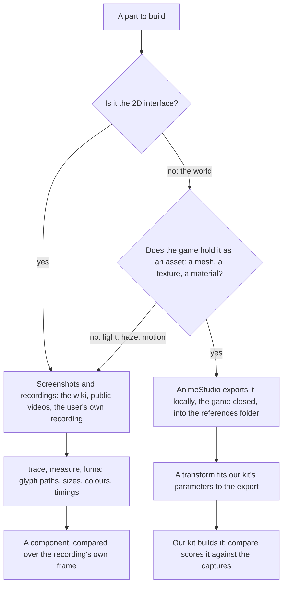
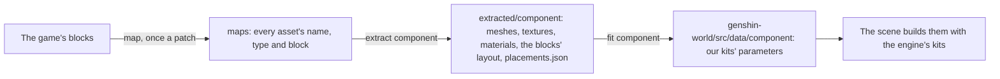

# Derived assets

Nothing of the game's ships. Every shape, colour and glyph the recreation draws is ours, measured off the game and built by our own code, and the game's own files are references like any screenshot. This page is which reference each part is measured from, how a measurement becomes ours, and how far each component has come.

## Which source a part is measured from

- **The interface comes from screenshots.** The game's interface is mostly drawn at run time from atlases whose names say little, while the wiki and recordings show every screen in every language. An interface component is compared over the recording's own frame, which holds it exactly ([parity](/docs/genshin/parity)).
- **The world comes from the game's own assets.** A tower's profile, a door's outline and a stone's palette are read off the game's mesh, texture and material exports, and where each stands from the blocks' own layout, which pin a measure a picture can only estimate: a tower's depth, its true diameter, a moulding's height.
- **Only our parameters ship.** A transform reads an export and writes the numbers our kit takes, such as a lathe's section shares, a door's outline points or a palette. It writes them as data beside the component that reads them, and never a vertex, a pixel or a converted file of the game's. The exports stay in `~/Esposter/genshin-parity/extracted` with every other reference and never enter the repository or a build. So there is one render path, our kits, and nothing to keep in step between a local mode and the deployed one.

## The pipeline

`pnpm -C scripts genshin:assets <step>` runs AnimeStudio's command-line tool (`GENSHIN_ANIMESTUDIO_CLI`, by default under `~/Downloads/AnimeStudio`) over the installed game's blocks, with the game closed. Each step reads what the one before it wrote:

1. **`map`** indexes every block into the asset map, about a gigabyte of JSON, and streams it into `index.tsv`, which a search reads in seconds. AnimeStudio writes the CAB map it needs into its own folder.
2. **`extract <component>`** finds the blocks holding the component's assets by the name pattern `DerivedAssetComponentMap` gives it, and exports them block by block. It dumps each block's Transform, GameObject and MeshFilter as JSON, and composes every object's world placement into `placements.json`.
3. **`fit <component>`** fits our kits' parameters to the meshes where they stand, and writes them as the world package's data, the only output that enters the repository.

A new component is one name pattern in `DerivedAssetComponentMap` and one fit in `DerivedAssetFitMap`; everything else is shared.

### What the exports hold

- **Axes.** Unity is left-handed, and an OBJ export has its x negated back to Unity's mesh space, so a fit reads meshes and placements in the game's own axes throughout, then converts what it writes to three.js as `(x, y, -z)` (`toRightHanded`).
- **Placements.** A path ID is 64-bit, so the layout is parsed with a `JSON.parse` reviver reading each number's source text. A root's parent is `0`. An object whose parent sits in a block not read is dropped, never set down at the origin: those are a prefab's levels of detail, placed by an instance elsewhere.
- **What a dump cannot hold.** A MonoBehaviour exports without its fields, since the blocks carry no type data. The login camera's path and the scene's weather live in scripts, so they are measured from the captures instead: the camera from where the walkway's edges meet the frame in the four skies, scaled by the walkway's fitted width.

### The fits

| Fit                              | Reads                                         | Writes                                                                                       |
| :------------------------------- | :-------------------------------------------- | :------------------------------------------------------------------------------------------- |
| Lathe, `fitLatheProfile`         | A round mesh's vertices                       | Its axis, its foot, and a section per two-metre band of its outer radius, merged within 3%   |
| Footprint, `fitFootprintOutline` | The triangles of every piece, seen from above | The outline they cover, traced on a quarter-metre grid and simplified within ten centimetres |
| Bounds, `fitLoginDoor`           | One placed mesh                               | Its foot and its size, which the kit's measured shares divide                                |

Every number is kept to the centimetre (`roundFitted`).

## Inventory

| Component                         | Source                                             | Status                                                          |
| :-------------------------------- | :------------------------------------------------- | :-------------------------------------------------------------- |
| `Splash/Publisher`                | Commons' vector logo, the recording's ring         | Compared, approved                                              |
| `Splash/Title`                    | The English phone video's logo                     | Compared, approved                                              |
| `Splash/HealthNotice`             | The English client's notice                        | Compared, approved                                              |
| `Loading/Startup`                 | The wiki's capture, the element marks' vectors     | Compared, approved                                              |
| `Login/Interface`                 | The English recording's frames                     | Compared over its frames at each stage, approved                |
| `genshin-ui` pieces               | The English and the 1440 high recordings           | Measured, approved in their own suite                           |
| `Login/Scene` camera              | The walkway's edges in the four skies              | Derived                                                         |
| `Login/Scene` towers              | `LoginScene_Build*` meshes and placements          | Fitted as lathes, placed where the game stands them             |
| `Login/Scene` walkway             | `LoginScene_Bridge01_*` meshes                     | Fitted as a footprint and its two heights                       |
| `Login/Scene` door                | `LoginScene_Door01_Vo`                             | Placed and sized by its mesh; the outline's shares measured     |
| `Login/Scene` bridges and pillars | `LoginScene_Bridge02`–`04`, `Pillar03`, `Broken_*` | Exported; to be fitted                                          |
| `Login/Scene` clouds              | The captures                                       | A noise field; cloud banks and the cloud sea's billows to build |
| `Login/Scene` sky and haze        | The four skies' pixels                             | Sampled; to be fitted by tone                                   |

## Key files

| File                                                             | Role                                                  |
| :--------------------------------------------------------------- | :---------------------------------------------------- |
| `scripts/src/services/genshinAssets/constants.ts`                | Where the exports are kept, and every fit's tolerance |
| `scripts/src/services/genshinAssets/DerivedAssetComponentMap.ts` | Each component's assets by name                       |
| `scripts/src/services/genshinAssets/DerivedAssetFitMap.ts`       | Each component's fit                                  |
| `packages/genshin-world/src/data`                                | The fitted parameters the scenes read                 |
| `packages/genshin-engine/src/kits/architecture`                  | The kits every fitted parameter drives                |

## Sources

- [AnimeStudio](https://github.com/Escartem/AnimeStudio): the exporter, and its command-line options.
