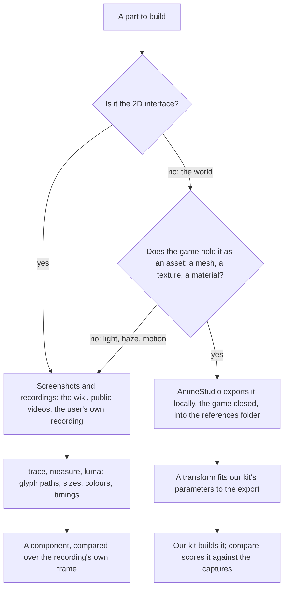
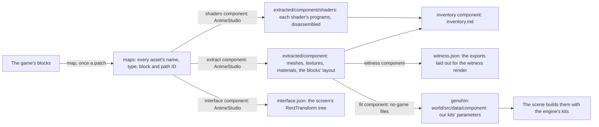
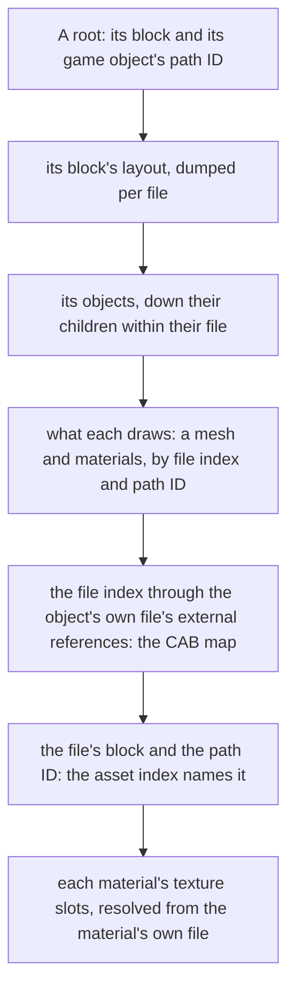

# Derived assets

Nothing the game draws ships. Every shape, colour and glyph the recreation draws is ours, measured off the game and built by our own code, and the game's own files are references like any screenshot. This page is which reference each part is measured from, how a measurement becomes ours, and how far each component has come. The game's words are the one thing of its own carried as they are, quoted as text the way the screen shows them ([game text](/docs/genshin/game-text)).

## Which source a part is measured from

- **The interface comes from screenshots.** The game's interface is mostly drawn at run time from atlases whose names say little, while the wiki and recordings show every screen in every language. An interface component is compared over the recording's own frame, which holds it exactly ([parity](/docs/genshin/parity)).
- **The world comes from the game's own assets.** A tower's profile, a door's outline and a stone's palette are read off the game's mesh, texture and material exports, and where each stands from the blocks' own layout, which pin a measure a picture can only estimate: a tower's depth, its true diameter, a moulding's height.
- **Only our parameters ship.** A transform reads an export and writes the numbers our kit takes, such as a lathe's section shares, a door's outline points or a palette. It writes them as data beside the component that reads them, and never a vertex, a pixel or a converted file of the game's. The exports stay in `~/Esposter/genshin-parity/extracted` with every other reference and never enter the repository or a build. So there is one render path, our kits, and nothing to keep in step between a local mode and the deployed one. How a scene grows past its kits' few parameters, each loss priced against the exports before it is closed, is [proposed](/docs/proposals/genshin/scene-derivation).

## The pipeline

`pnpm -C scripts genshin:assets <step>` runs AnimeStudio's command-line tool (`GENSHIN_ANIMESTUDIO_CLI`, by default under `~/Downloads/AnimeStudio`) over the installed game's blocks, with the game closed. Each step reads what the one before it wrote:

1. **`map`** indexes every block into the asset map, about a gigabyte of JSON, and streams it into `index.tsv`, which a search reads in seconds. AnimeStudio writes the CAB map it needs into its own folder.
2. **`extract <component>`** exports the component's closure: each of its roots' blocks has its Transforms, GameObjects, MeshFilters, MeshRenderers and SkinnedMeshRenderers dumped as JSON by the file (the CAB) each came from, then everything the roots reach down their children, the meshes and materials those draw and the textures each material samples, is exported from the block holding it by its exact name (`walkAssetClosure`). What no pointer from the roots reaches is exported by the component's name pattern, and every pointer that could not be resolved is printed.
3. **`shaders <component>`** exports every shader in the blocks holding the shaders its materials name, raw, since a shader is exported nameless and its block also holds the sky's and the post-processing's. The game keeps each compiled variant as a plain DXBC container, so `readDxbcPrograms` carves them out by their own stated sizes and Windows' own `d3dcompiler_47` disassembles each into its assembly (`disassembleDxbcDirectory`), beside the property names the shader declares, which tell a nameless shader apart. 3Dmigoto's command-line decompiler writes each program as HLSL beside its assembly (`decompileDxbcDirectory`): its last release to ship it alone, 1.3.16, fetched and checked by SHA-256 as FFmpeg is (`resolvePinnedTool`), and both are headed by the constant names `annotateProgramConstants` recovers, so a shader is ported from readable code; where the decompiler cannot be had, the annotated assembly stands. Each is exported unparsed (`Shader:Export`), since AnimeStudio's parser refuses some of the game's shaders, the login stone's among them, and drops what it refuses from a raw export as well. This and `extract` are the only steps that read the game.
4. **`inventory <component>`** writes `inventory.md` beside the exports: each material's shader, texture slots and values, each texture's size and what each channel spans, each mesh's vertices and the materials its renderers draw it with, and each shader's program count and properties. A scene's derivation starts from it ([scene derivation](/docs/proposals/genshin/scene-derivation)).
5. **`interface <component>`** lays a screen's interface out as the game does: the block holding it is found through an indexed asset beside it (`DerivedAssetComponentMap`'s `interface`, since GameObjects are not in the asset index), its RectTransforms are dumped as JSON for their tree and raw for their layout, and the tree under the interface's root, each piece's anchors, pivot, position, size and components, is written beside the exports and printed (`extractComponentInterface`). A screen places each piece from it ([interface library](/docs/genshin/interface-library)).
6. **`clips <component>`** decodes the animation clips the component's map names (`clipPattern`): each is exported as JSON, its streamed, dense and constant curves sampled at 60 frames a second, and each binding named where its CRC32 resolves, a property against Unity's names and a path against every sub-path of the component's interface tree, the empty path being the animator's own (`extractComponentClips`). A screen's motion is played from them rather than timed off a recording.
7. **`witness <component>`** lays the exports out as the witness render draws them (`writeWitnessLayout`): the component's placements at each part's finest level, in three's axes, with every material each submesh draws with, as a `SceneLayout`.
8. **`fit <component>`** composes every object's world placement from the layout dumps, keeps the arrangements under the component's roots (`readComponentPlacements`), fits our kits' parameters to the meshes and textures, and writes them as the world package's data, the only output that enters the repository. A change of fit or selection reruns it alone.

A new component is its roots in `DerivedAssetComponentMap` and one fit in `DerivedAssetFitMap`; everything else is shared.

### Commands

From `scripts/`, as `pnpm genshin:assets <command> <component>`, each with its own `--help`:

| Command                                    | What it does                                                                                                                                                                        |
| :----------------------------------------- | :---------------------------------------------------------------------------------------------------------------------------------------------------------------------------------- |
| `extract`                                  | The closure of the component's roots, exported by file and path ID; prints what it reached and every pointer it could not resolve                                                   |
| `arrangement`                              | Each ratio a reference shows between parts that meet, its cross-ratio measured against the fitted data's, and each fitted family's distance from the exports' objects it stands for |
| `clearance <component> [--at x,y]`         | Each part of the exports a straight path along +z pierces, and the depths it enters and leaves at: where a camera gliding along it passes through the game's own parts              |
| `behaviours [--script <pattern>]`          | Every MonoBehaviour of the component's layout blocks exported raw, its fields read by their shapes, each pointer named by what it points at                                         |
| `tree [--root <name>] [--block] [--depth]` | The hierarchy the layout dumps hold, each object's block, place, scale in the world, drawing, named components and children, flagging what its arrangement turns on                 |

- **Check the arrangement before any pose.** Two widths measured where their parts meet (the door's dais and the walkway below it) give four ends on one line, and a projection keeps their cross-ratio, so `arrangement` compares it with the fitted data's at no pose; two centred widths in ratio r give (1 + r)² / 4r, so the walkway 2.5 times too wide read 1.23 against the recording's 1.00. Its family diff shows a fit drifting from the exports as metres, which is how data fitted on another arrangement shows.
- **Read the tree before the arrangement.** `tree` flags an empty anchor (no children, nothing drawn, no script: where a script spawns a prefab), a father or children no dump holds, a root at the origin (a prefab's root), and a mesh laid out under several tops (only some of those arrangements are the scene's). The login's lost-block theory survived several sessions of reading the dumps by hand; `tree login --root SceneObj` shows its three empty anchors in one line each.

### Following a scene's pointers

A scene's parts are found from its roots, never by name: its sky, its effects and its prefab parts live under other names and blocks, and one name is shared across the game (`Cloud_LOD0`).

- **A path ID names an object only within its file.** The asset index repeats tens of thousands of path IDs across the game, so every object is held as its file and its path ID. A pointer with a file index of zero stays in its own file; any other is its file's external reference that many places down, less one, which the CAB map AnimeStudio builds with `map` lists in order (`parseCabMap`, `resolveObjectPointer`).
- **The asset index names an object by its block, not its file.** A block and path ID the index names more than once, or that several files of one block resolve to, is reported unresolved rather than given one of them. So is a material sharing its name with another, since both export to one `Material/<name>.json` and its textures could resolve through the wrong file.
- **The layout is dumped by source.** Grouped by type, a block's dumps are named by their objects' names, and each name keeps only its last object; grouped by the file each came from, the character select's block keeps about four times as many GameObjects, and every object's pointers resolve from its file.
- **A name pattern is only for what no pointer reaches.** A particle system's renderer exports without the fields that point at its materials, so the login's cloud emitters' materials and atlases stay in its pattern, named exactly.

### What the exports hold

- **Axes.** Unity is left-handed, and an OBJ export has its x negated back to Unity's mesh space, so a fit reads meshes and placements in the game's own axes throughout, then converts what it writes to three.js as `(x, y, -z)` (`toRightHanded`), a rotation as `(-x, -y, z, w)` (`toRightHandedRotation`).
- **Placements.** A path ID is 64-bit, so the layout is parsed with a `JSON.parse` reviver reading each number's source text. A root's parent is `0`. A GameObject is dumped under its name, so of the objects of one file sharing one (each level of detail under its group) only the last survives; the layout is read from the Transforms, each dumped under a number of its own, and a Transform whose GameObject was lost takes its ID from a child whose own is known (`toSceneObjects`). A level-of-detail group whose own GameObject and every level's were lost is given the levels of its part that name one father: two groups of one part hold the same levels, so either pairing places the same parts. An object whose parent sits in a block not read is dropped, never set down at the origin.
- **One set of meshes, several arrangements.** Blocks lay one set of meshes out several times, each under its own root, so a component names the roots it is (`DerivedAssetComponentMap`'s `roots`). The login screen is its own `LoginScene`, with the prefabs its `MonoLoginScene` spawns: `LoginScene_Build_All`'s towers, bridges and pillars, the walkway and the door; the character select's stage lays the same meshes out another way, at 0.4 scale.
- **A prefab a script spawns hangs from its anchor.** An empty anchor (the tree's flag) is where a script spawns a prefab at run time, and the script's raw bytes point at both (`behaviours`). A spawn in the component map (`spawns`) hangs the prefab's root from its anchor, so every placement read, the witness and the fits compose through the anchor's place, turn and scale, as Unity composes a Transform (`composeWorldMatrices`). The login's `SceneObj` holds its anchors at a tenth of its scale, so its towers, walkway and door stand at that scale; the walkway's parent, set by hand before as the door's 0.4 and 5 metres down, is `BridgeBeginNode`. Where a script also moves a spawned root at run time, the spawn's `position` is its local place under the anchor at the moment a reference shows, measured from it: the login's door stands on the walkway at the flight's end, placed by the door's pose and the walkway's on one frame of `login-door-recording`, while in the static layout its anchor stands 70 metres away. Where a script lays a prefab out several times end to end and scrolls the row past the camera, the spawn's `copies` are its record's count and the world step between them, along the camera's heading: the login's towers stand three times 200 metres apart and its walkway three times 16, one walkway's own length. The witness lays every copy out (`copySpawns`), the row running ahead from the prefab's own place as the scene scrolls it, while the fits read each prefab once and write the rows beside them (`login/scroll.json`).
- **A skinned renderer draws its own mesh.** A part whose pieces a clip moves, such as the door, has no filter: its mesh and materials are its `SkinnedMeshRenderer`'s, a mesh in another file named by its path ID through the asset index.
- **Renderers name their materials by path ID.** A MeshRenderer's materials are references into other files, with no name, so the index's path ID column names them. A mesh draws one material a submesh, and an OBJ export writes each submesh as a group named after the mesh with its index appended. A renderer carries no lightmap fields.
- **What a dump cannot hold.** A particle system exports without its fields, and a MonoBehaviour's fields survive only in its raw bytes, read by their shapes (`behaviours`). Where no shape names a setting, it is measured: the camera's path, the door's appearance, the cloud emitters' spread and every light's strength and colour live in scripts, so they are measured from the captures, and expressed over what the blocks do give: the camera's height as a share of the walkway's width, the lights' strengths over the stone's fitted albedo, the cloud bands over the cloud layer's height.
- **Packed textures.** A texture's channels are rarely colours: read what each holds before fitting it. The sky gradient's are three falloff curves over the sky's height, not the hour's colours, which are the sky profile's. A cloud atlas holds two columns of four painted clouds, alpha their silhouette and red the light the painter put on them. A diffuse texture is the part's albedo, which the light warms and cools.

### The fits

| Fit                              | Reads                                           | Writes                                                                                                                                                                                                                                                                      |
| :------------------------------- | :---------------------------------------------- | :-------------------------------------------------------------------------------------------------------------------------------------------------------------------------------------------------------------------------------------------------------------------------- |
| Lathe, `fitLatheProfile`         | A round mesh's vertices                         | Its axis, its foot, and a section per two-metre band of its outer radius, merged within 3%                                                                                                                                                                                  |
| Footprint, `fitFootprintOutline` | The triangles of every piece, seen from above   | The outline they cover, traced on a five-centimetre grid with each slab's own ends, and simplified within two centimetres, so slabs laid end to end meet                                                                                                                    |
| Silhouette, `fitSilhouette`      | Triangles in one plane (a cloud's painted cell) | Every loop round what they cover, holes clockwise, traced on a grid and simplified by Douglas-Peucker                                                                                                                                                                       |
| Visual hull, `fitVisualHull`     | A mesh's triangles (a bridge, a pillar)         | Boxes solid only where its three axis views all cover, a tenth of a metre a cell, so an arch or the space under a deck stays open from every side; `createBoxesGeometry` builds them. One view extruded through the depth filled them, and the camera glided into the solid |
| Bounds, `fitLoginDoor`           | One placed mesh                                 | Its foot and its size, which the kit's measured shares divide                                                                                                                                                                                                               |
| Cloud sprites, `fitCloudSprites` | A cloud atlas's alpha and red                   | Each cell's outline and lit crown as loops in its unit square; `createCloudAtlasTexture` paints them into an atlas of our own at run time                                                                                                                                   |
| Sky gradient, `fitSkyGradient`   | The sky gradient's red and green                | Each as evenly spaced samples across its width, its two rows averaged as the sky shader reads it at their middle; `createSkyGradientTexture` draws them back into a texture at run time                                                                                     |
| Stone, `fitLoginStone`           | Each family's materials and their textures      | The median albedo of their diffuse textures (`fitAlbedo`), the median smoothness of their masks' red, and their specular colour and rim glow, per family                                                                                                                    |

A grid of covered cells is traced by one `traceCoveredGrid`, whichever fit filled it (a mesh's triangles, a texture's thresholded channel), and a part drawn at several levels of detail is fitted from its finest by one `readLevelOfDetailParts`. Every number is kept to the centimetre (`roundFitted`).

## Inventory

| Component                         | Source                                                    | Status                                                                 |
| :-------------------------------- | :-------------------------------------------------------- | :--------------------------------------------------------------------- |
| `Splash/Publisher`                | Commons' vector logo, the recording's ring                | Compared, approved                                                     |
| `Splash/Title`                    | The English phone video's logo                            | Compared, approved                                                     |
| `Splash/HealthNotice`             | The English client's notice                               | Compared, approved                                                     |
| `Loading/Startup`                 | The wiki's capture, the element marks' vectors            | Compared, approved                                                     |
| `Login/Interface`                 | The English recording's frames                            | Compared over its frames at each stage, approved                       |
| `genshin-interface` pieces        | The English and the 1440 high recordings                  | Measured, approved in their own suite                                  |
| `Login/Scene` camera              | The door recording's walkway and door silhouettes         | Solved on the exports; held still while the world glides toward it     |
| `Login/Scene` towers              | The stage's `LoginScene_Build*` meshes, textures, places  | Lathes on their walls; their surfaces traced as loops, turned in place |
| `Login/Scene` walkway             | `LoginScene_Bridge01_*` meshes                            | Fitted as a footprint and its two heights                              |
| `Login/Scene` paving              | The walkway's tops and their four materials' textures     | Traced as each pocket's loop over one copy                             |
| `Login/Scene` door                | The stage's `LoginScene_Door01_Vo` and its texture        | Its faces traced, its relief traced as loops; placed by its mesh       |
| `Login/Scene` bridges and pillars | The stage's `LoginScene_Bridge02`–`04`, `Pillar03` meshes | Fitted as visual hulls, placed and turned where the game stands them   |
| `Login/Scene` stone               | Each family's `LoginScene_*` materials and textures       | Fitted as a physically lit stone per family                            |
| `Login/Scene` clouds              | The three `Enviro_Clouds_*_Particle_Atlas` textures       | Fitted as sprites; each band's spread measured off the captures        |
| `Login/Scene` sky and haze        | `Enviro_Sky_Gradient`, each hour's reference's pixels     | Gradient fitted; colours and light strengths measured                  |
| `Login/Scene` broken pieces       | `LoginScene_Broken_*` meshes                              | Exported; no placement in the arrangements shown                       |

## Key files

| File                                                              | Role                                                  |
| :---------------------------------------------------------------- | :---------------------------------------------------- |
| `scripts/src/services/genshinAssets/constants.ts`                 | Where the exports are kept, and every fit's tolerance |
| `scripts/src/services/genshinAssets/DerivedAssetComponentMap.ts`  | Each component's assets by name, and the roots it is  |
| `scripts/src/services/genshinAssets/DerivedAssetFitMap.ts`        | Each component's fit                                  |
| `scripts/src/services/genshinAssets/fitLoginScene.ts`             | Every fit the login screen writes                     |
| `scripts/src/services/genshinAssets/traceCoveredGrid.ts`          | The loops round a grid's covered cells                |
| `scripts/src/services/genshinAssets/extractComponentShaders.ts`   | Each shader's programs carved out and disassembled    |
| `scripts/src/services/genshinAssets/writeComponentInventory.ts`   | The inventory report of everything an export holds    |
| `scripts/src/services/genshinAssets/writeWitnessLayout.ts`        | The exports laid out for the witness render           |
| `scripts/src/services/genshinAssets/extractComponentInterface.ts` | A screen's interface tree from its RectTransforms     |
| `packages/genshin-world/src/data`                                 | The fitted parameters the scenes read                 |
| `packages/genshin-engine/src/kits/architecture`                   | The kits the fitted shapes drive                      |
| `packages/genshin-engine/src/atmosphere/placeCloudBand.ts`        | A band of painted clouds scattered round a centre     |

## Sources

- [AnimeStudio](https://github.com/Escartem/AnimeStudio): the exporter, and its command-line options.
