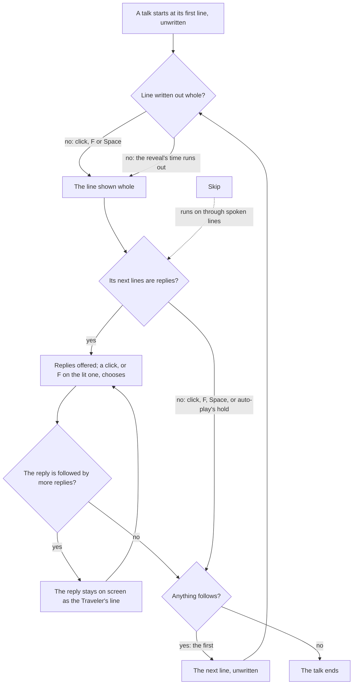

# Dialogue

In the game, a conversation is a run of lines on a band at the foot of the screen, each under its speaker's name and written out a character at a time. The Traveler never speaks a line aloud: their replies are offered down the right as choices, even when only one is on offer. The world holds a conversation the same way the game's data does, as a graph of lines, and runs it with a few pure functions. A screen draws it, and a host wires the clicks, keys and timers to it.

## How it works

### The talk graph

A `Talk` holds its lines and the id of the one it starts at. Each line has its own id, the ids of the lines that may follow it and its words' text id. There are two kinds of line:

- **A spoken line** names its speaker's name by text id, which is empty for a narration, and the voice-over the game files it under, which is empty for an unvoiced line.
- **A choice** is one of the Traveler's replies. It carries the mark the game draws beside it: a plain reply or chat, a choice that starts a quest, or one that starts a story quest. These are the names the wiki's transcripts use for the game's marks.

Both have Zod schemas, so a talk that is fetched or generated is checked before it runs. The words are never in the graph. A host hands the screen the talk's text map, its words by text id in the reader's language, as [game text](/docs/genshin/game-text) does for the interface's own words.

### The runner

Where a talk stands is a `TalkProgress`: the id of the line on screen, empty once the talk has ended, and whether its words are all written out. Four pure functions move it:

- **`advanceTalk`** is a click, F or Space. A line still being written out is shown whole. A whole line goes on to the first of its next lines, as the game would pick one by a quest's state. A line nothing follows ends the talk. A line that offers replies waits, and an ended talk stays ended.
- **`chooseTalkLine`** chooses one of the replies on offer, and refuses one that is not on offer. The talk goes on down the reply's branch, or ends where nothing follows it. A reply followed straight by more replies stays on screen as the Traveler's own line while the next ones are offered.
- **`skipTalk`** runs on to the next line that offers replies, written out whole, or to the end, so a skip never answers for the player. A talk whose spoken lines loop back without a reply between them is refused, since it would never get anywhere.
- **`getTalkChoices`** gives the replies a line offers: those of its next lines that are choices.

### On screen

`DialogueScreen` in `genshin-interface` draws a talk's state and nothing else. It shows the speaker's name over the line, which is laid out whole with its unwritten tail held in place unseen, so the line never rewraps as it is written. The replies run down the right, with the one F would choose lit once one is. A screen reader hears the whole line once, not its characters one by one.

`DialogueTalk` in `genshin-world` runs a talk over the world. The world screen mounts it while the talk screen is open, with the talk its resident began and the words of the quests, and its end sets the world back. The talk screen hides the HUD and lets the pointer go for the replies, and holds nothing else ([screens](/docs/genshin/screens)).

- **The line is written out** a character at a time, at `TALK_REVEAL_MS_PER_CHARACTER`, and is then shown whole.
- **A click goes on, and so do F and Space.** These keys are read off the engine's own `InputActionBindingMap`, as its Interact and Jump, so they stay the game's default bindings. While replies are on offer, none is lit until the pointer passes over one or an arrow lights the first, F chooses the lit one, and the arrows move the light between them.
- **Auto-play** holds each whole line for `TALK_AUTO_PLAY_HOLD_MS` and then goes on, stopping at replies. Its button reads the game's own "Auto" and "Playing".
- **Skip** runs on to the next replies or to the end. Its button reads the game's own "Skip".
- **A reply's speaker is the Traveler**, named with the game's own title for them.

### Residents

A region's data lists its residents beside its landmarks. Each resident has the game's own id, a name by text id, their day and night spots (either one absent for a resident the game shows at one time only), their catalogue area, and the talk F begins with them. The [resident schedules](/docs/genshin/resident-schedules) page places them at the hour. The [quests](/docs/genshin/quests) page's navigation finds a resident by their id or by their talk's id.

## Parity

Registered, not yet within the bar. Five references are cut from the English PC client's dialogue in `yt-nWBqOXWZuFg.mp4` (1280 by 720) and shot as `DialogueTalk`, which takes a `startProgress` naming the line the talk is held on, so each state is the reference's own props rather than the reveal's clock. Sara's line with the Traveler's two replies is scored three ways, the speaker, the line and the replies, at 19 seconds. Sara's line with no replies is at 23 seconds, and Paimon's line at 29 seconds.

The five are judged over their clean plate, the reference frame with its scored region filled from its surroundings (`isBackdrop`, see Parity above), so the overlay is scored against what the world shows there. The bare render is that plate with nothing drawn on it, so a state beats its bare render only by drawing the dialogue closer than the plate already is.

| Reference                  | Plate, component blurred | Plate, softened shot | Bare render |
| :------------------------- | :----------------------- | :------------------- | :---------- |
| `dialogue-choices-line`    | 8.66%, FLIP 0.2807       | 9.22%, FLIP 0.2912   | 9.64%       |
| `dialogue-choices-replies` | 15.08%, FLIP 0.4770      | 14.34%, FLIP 0.4678  | 17.80%      |
| `dialogue-choices-speaker` | 8.38%, FLIP 0.3228       | 7.79%, FLIP 0.3167   | 12.60%      |
| `dialogue-line`            | 10.47%, FLIP 0.3740      | 10.80%, FLIP 0.3844  | 11.65%      |
| `dialogue-paimon-line`     | 9.73%, FLIP 0.3121       | 9.98%, FLIP 0.3151   | 11.86%      |

Every state now beats its bare render, by 0.4 to 4.8 points, which is not yet the roadmap's 2% bar. What moved each figure, in the order it was fixed:

- **Position.** The line's first ascender lands on the reference's row, 591 of 720 for Sara's lines. The speaker's role line, `Waitress, Good Hunter`, sits between the name and the line and is drawn from the talk line's `speakerRoleTextId`. Paimon's line has no role, so its line sits a role's height higher, as the frame shows: scored at the role's place it was 21.93%, and at the frame's place 9.73%. The margin under the name is 13.5 units, so the line sits 30 units under the name with a role and 13.5 without.
- **Size and letter spacing.** The line is 26 units with 2.3 units of letter spacing, where it was 32 units. Its x-height and ascender then match the recording's, and its width matches within four pixels.
- **Softness.** The recording is soft and the game's face is not Signika, so a glyph a pixel off its place scores twice. The component is drawn crisp, and the comparison blurs our shot by the recording's own measured blur (`yt-nWBqOXWZuFg.mp4`, sigma 0.641, see the toolbox's Softness). A component blurred to the recording scored `dialogue-line` 0.33 points better (10.47%), but that blur is the video's and not the game's, so it is not shipped.
- **Colour.** The line stays white, the recording's peak. A paler white scored lower only by making up for the blur, so it was refused.
- **Band.** The band's gradient stays removed. Restored at 0.3 and 0.5, it scored worse on the three line states and on Paimon's line (`dialogue-line` 11.96% and 13.61%), and better only on the speaker.
- **Replies.** The pill's darkness is 0.22 of black, the best of 0.15 to 0.45 swept against the plate. The text starts 48 units in, past the mark's place, and moving the first pill up three pixels scored worse (23.78% against 22.03%), so its top stays where it was.

The reveal and auto-play timings wait on `dialogue-reveal.mkv` and `dialogue-auto-skip.mkv`.

## Key files

| File                                                                 | Role                                                                  |
| :------------------------------------------------------------------- | :-------------------------------------------------------------------- |
| `packages/genshin-world/src/models/dialogue/Talk.ts`                 | A talk: its lines and where it starts, with its schema                |
| `packages/genshin-world/src/models/dialogue/TalkLine.ts`             | A line: spoken, with its speaker and voice, or one of the replies     |
| `packages/genshin-world/src/services/dialogue/advanceTalk.ts`        | A click, F or Space: written out whole, on to the next, or the end    |
| `packages/genshin-world/src/services/dialogue/chooseTalkLine.ts`     | A reply chosen, and the branch it leads down                          |
| `packages/genshin-world/src/services/dialogue/skipTalk.ts`           | On to the next replies or the end                                     |
| `packages/genshin-world/src/services/dialogue/constants.test.ts`     | The hand-written sample talk every runner suite walks                 |
| `packages/genshin-world/src/services/dialogue/constants.ts`          | The provisional reveal and auto-play timings                          |
| `packages/genshin-world/src/components/Dialogue/Talk/Index.vue`      | A talk run over the world: reveal, keys, auto-play and skip           |
| `packages/genshin-world/src/components/World/Session/Index.vue`      | Mounts the talk over the world while its screen is open               |
| `packages/genshin-interface/src/components/DialogueScreen/Index.vue` | The speaker's name, the line written out in place, and the replies    |
| `packages/genshin-interface/src/models/DialogueChoiceIcon.ts`        | The marks a reply is drawn beside                                     |
| `packages/genshin-world/src/models/world/Resident.ts`                | A resident placed in a region's data, and the talk F begins with them |

## Notes

- **The reveal is not visible in the published recording.** An English-language public recording of the dialogue choices, at 30 frames a second and 1280 by 720, shows each line whole in its first frame: two lines measured in full, the text's ink filling in one frame and not character by character. So `TALK_REVEAL_MS_PER_CHARACTER` stays provisional, and the next line is timed off a 60 frames a second recording of a line being written out, which is owed.
- **The auto-play hold is not measured.** `TALK_AUTO_PLAY_HOLD_MS` waits on the same recording as the reveal, since no published clip found shows auto-play on.
- **The screen's place and colour are read off one frame.** The speaker's name is gold `#ffc700`, the brightest saturated pixel of its letters. The replies are dark pills 45 high and 15 apart, the first at 1275 by 698 of 1920 by 1080. The screen is drawn over the clean plate of its frame (Parity above), so the score covers the band's text and the pills over the game's own scene, and the band has no gradient, since the game's scene under its line is not darkened.
- **The speaker's role comes from the talk.** A spoken line names its role by `speakerRoleTextId`, drawn under the name in a smaller gold when it is set. The dump's dialog table gives the title text id, which the generator does not read yet, so a generated talk has no role.
- **The Confirm prompt is not drawn.** The frame shows a controller's X mark and the word Confirm bottom right. The keyboard client's key for it is the reader's call.
- **The selected reply's look is not settled.** Both replies in the frame are the same dark pill, and the first is marked by a controller's X prompt, which the keyboard client does not show. So the replies start unlit on every line, as the frame shows them, and the screen lights a reply white only once the pointer or an arrow selects it, a look no frame shows.
- **No voice plays.** A line carries the id of its voice-over, but nothing of the game's audio ships, so the voice-over is never played.
- **The replies' marks are not drawn yet.** Each reply carries its mark, and its place beside the reply is kept, until the game's marks are traced into paths of our own.

## Sources

- [Template:DIcon](https://genshin-impact.fandom.com/wiki/Template:DIcon), Genshin Impact Wiki: the marks the game draws beside a dialogue choice, a plain reply or chat, a quest and a story quest among them.
- [Controls](https://genshin-impact.fandom.com/wiki/Controls), Genshin Impact Wiki: F as Pick Up/Interact and Space as Jump, the keys a talk goes on with.
- [Genshin Impact dialogue choices](https://www.youtube.com/watch?v=nWBqOXWZuFg), an English-language public recording of the dialogue choices at 720 high, with controller prompts: the reply frame the screen is placed by, and the line frames the reveal was read off.
- [AnimeGameData](https://github.com/DimbreathBot/AnimeGameData), the community's per-patch dump: the dialog table's lines, each naming the ones that follow it and its speaker's role, with the Traveler's lines offered as choices.
