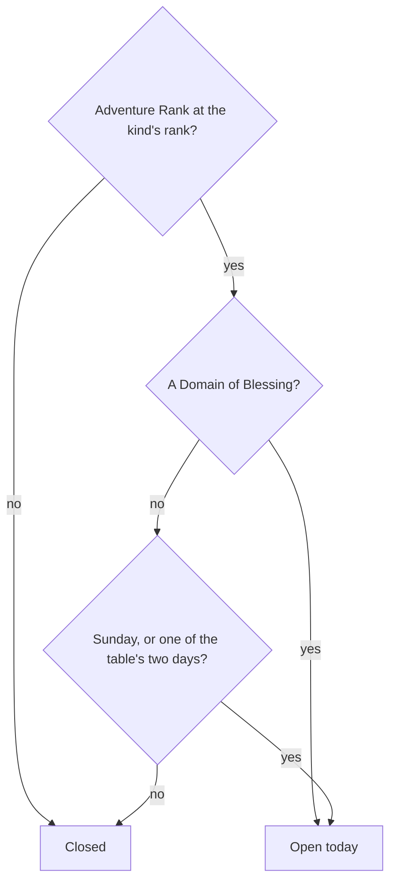

# Domains

A domain is an instance behind a temple-like entrance, challenged for a reward. The game opens each kind by [Adventure Rank](/docs/genshin/adventure-rank) and, for Forgery and Mastery, by the day of the week. This page is those opening rules as pure checks in `genshin-world`, the first part of the [domains proposal](/docs/proposals/genshin/domains). Nothing enters a domain yet, so no screen reads them.

## Decisions

- **Each kind opens at its rank.** `DomainOpenRankMap` holds Forgery at 16, Blessing at 22 and Mastery at 27, the ranks the proposal states. `checkIsDomainKindOpenAtRank` is open from the rank on. The wiki's Domain page gives the same three ranks.
- **A Domain of Blessing opens every day.** Its set days are not read.
- **A Domain of Forgery or Mastery opens every Sunday and on its two set days.** `checkIsDomainKindOpenOnDay` takes the two weekdays the table sets for the kind, as the caller reads them. A Sunday opens every kind. Weekdays are Temporal's, Monday 1 to Sunday 7, with `SUNDAY_DAY_OF_WEEK` for Sunday.
- **The day is the game's day.** The caller passes the game's day, which turns at 04:00 in UTC+8 as the game's server does and as [Original Resin](/docs/genshin/original-resin) counts its Primogem refills. A Domain of Forgery's day turns at the reset, not at midnight. This call is settled from the resin page's rule, not from a new source.

## How it works

## Not built yet

- **The entrances and their landmark.** Each entrance is placed from the streaming records, which the fit does not read yet. No `LandmarkKind` is added until a fit produces one.
- **The days each kind sets.** They sit in DailyDungeonConfigData, which the dump does not hold, so no caller passes them yet. DungeonExcelConfigData and DungeonEntryExcelConfigData are missing from the dump too, so the levels wait on the same reader.
- **The levels, challenges and scenes.** Waves, time limits, ley line disorders and the domain's own scene wait on those tables and on scene derivation.
- **The Petrified Tree's reward.** Its claim is already priced at 20 as a domain blossom ([Original Resin](/docs/genshin/original-resin)). Its reward rows wait on BlossomChestExcelConfigData, which the dump does not hold.
- **One-time domains and the quest's earlier rank.** The first-clear rewards come with their table rows, and the earlier rank waits on the wiki.

## Key files

| File                                                                         | Role                                                                                  |
| :--------------------------------------------------------------------------- | :------------------------------------------------------------------------------------ |
| `packages/genshin-world/src/models/domains/DomainKind.ts`                    | The kinds that open by rank and by the day: Blessing, Forgery and Mastery             |
| `packages/genshin-world/src/services/domains/DomainOpenRankMap.ts`           | Each kind's Adventure Rank of opening                                                 |
| `packages/genshin-world/src/services/domains/constants.ts`                   | The Sunday weekday, numbered as Temporal numbers it                                   |
| `packages/genshin-world/src/services/domains/checkIsDomainKindOpenAtRank.ts` | Open at the kind's rank or above                                                      |
| `packages/genshin-world/src/services/domains/checkIsDomainKindOpenOnDay.ts`  | Open on a game day: every day for Blessing, Sundays and the table's days for the rest |

## Sources

- [Domains](https://genshin-impact.fandom.com/wiki/Domains), Genshin Impact Wiki: the unlocking ranks and quests, and the weekday schedule. Not yet read; the wiki refused the fetch when this was built.
- [Daily Reset](https://genshin-impact.fandom.com/wiki/Daily_Reset), Genshin Impact Wiki: the Domains of Forgery and Mastery turning at the reset. Not yet read, for the same reason.
