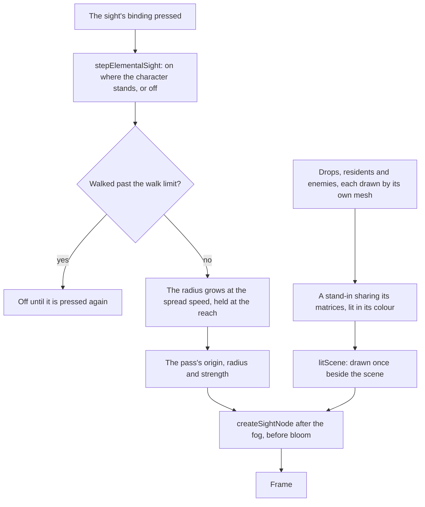

# Elemental Sight

Elemental Sight shows what can be acted on. Pressed, a range spreads out from the character, and inside it what cannot be acted on goes dark while the drops, the residents and the enemies stand lit. The [controls](/docs/genshin/controls) read its binding, and the world answers it here. Trails that lead to a bounty's target, a Seelie's court or a clue are not drawn yet: they come with the pages that place those things, as the [proposal](/docs/proposals/genshin/elemental-sight) records.

## How it works

- **The range is a circle on the ground.** Its centre is where the sight was turned on, not where the character stands now, so a walk moves the character out of it before the sight ends.
- **One pass, one shared material.** The stand-ins are one basic material per kind of thing, with each enemy's colour as its instance colour. No material the world draws changes for the sight. While the sight is off its strength is zero, so every pixel is left as it was.

## What a thing shows

- **Things that cannot be acted on go dark inside the range.** The scene keeps a quarter of its own brightness, with its colour gone. Outside the range nothing changes.
- **Interactables show white.** A drop and a resident are lit white.
- **Enemies show the element on them.** An enemy's colour is its strongest aura's element, else its innate element, else white. Burning counts as Pyro and Freeze as Cryo. Quicken names two elements, so it counts for none.
- **Enemies show their name.** A living enemy within the range has its name over its head, projected through the camera. An enemy whose name the game's text does not give shows no tag.
- **A thing behind a wall stays dark.** A stand-in is lit only where it is the nearest thing the scene draws, so the sight never shows through a wall.
- **A ring marks the reach.** A white ring sits at the range's edge while the sight is on.

## Ends and spreads

- **The range spreads, then holds.** The radius grows at the spread speed from where the sight was turned on, and stops at the reach.
- **A walk past the limit turns it off.** The check is on the ground from the point it was turned on. Standing still keeps it on.
- **A press turns it off** at once, wherever the character stands.
- **A screen over the world turns it off.** The menus, the map and a talk end the sight, which a press turns on again.

## Decisions

- **The range is centred where the sight was turned on.** The game's range is the reach from that point, and a walk ends the sight rather than moving the range with the character.
- **White is the colour of what no element affects.** The wiki's colour key gives white to things with no element on them, which covers interactables and an enemy with no element.
- **The element shown is the strongest aura naming one element.** Quicken names two, so it falls back to the innate element, and an enemy with neither is white.
- **Only what the scene shows is lit.** The stand-ins are compared with the scene's depth, so a lit thing behind a wall is muted as the wall is.
- **The sight is off wherever a screen covers the world.** A screen over the world ends it, so the menus and the talks never show it.

## Notes

- **The reach, the spread speed, the walk limit, the colours, the ring's width and the muting are provisional.** No published source gives a distance, and the colours are named only in hues. Each is a constant marked provisional, and a recording owed in the roadmap measures it.
- **The element colours are the game's interface colours.** They are the table the persona's nameplates keep, which the game's interface paints each element's name in. The highlight may differ from the interface, and the same recording settles that.
- **The middle mouse button is also Reset Camera.** The controls bind the middle button to both, and the follow camera resets on that press, so a press of the sight also resets the camera. Whether the game does both is the recording's question.
- **A name tag is not hidden by a wall.** The tag is drawn over the canvas from the enemy's projected head, and only the near and far planes cut it, so an enemy within the range behind a wall shows its name while its highlight stays muted. Hiding it needs either the scene's depth read back from the GPU, a frame late, or a ray from the camera through the landmarks and the ground for each enemy. Whether the game hides the tag at all is unmeasured, so the test waits on the sight's recording in the roadmap.
- **The Hilichurl's name has no text in the dump.** Its monster row names a text id that has no English text in the dump, so its tag stays blank until the game's text is found.
- **Trails are not drawn.** A bounty's target waits on [Reputation](/docs/proposals/genshin/reputation), a Seelie's court on [Puzzles](/docs/proposals/genshin/puzzles), and a quest's clue on a quest being carried in the world, which none is yet.

## Key files

| File                                                                        | Role                                                               |
| :-------------------------------------------------------------------------- | :----------------------------------------------------------------- |
| `packages/genshin-engine/src/post/createSightNode.ts`                       | The mute, the highlight and the ring, over the scene's depth       |
| `packages/genshin-engine/src/post/createSightUniforms.ts`                   | The origin, radius and strength the pass reads each frame          |
| `packages/genshin-engine/src/post/createPostPipeline.ts`                    | The sight's pass, drawn after the fog and before the bloom         |
| `packages/genshin-world/src/services/elementalSight/stepElementalSight.ts`  | The press, the spread and the walk that ends the sight             |
| `packages/genshin-world/src/services/elementalSight/computeSightElement.ts` | The element a target shows, from its aura or its innate element    |
| `packages/genshin-world/src/models/combat/ElementalState.ts`                | The aura a lit thing or enemy shows                                |
| `packages/genshin-world/src/models/enemy/EnemyKindTraits.ts`                | An enemy's innate element, from its kind's traits                  |
| `packages/genshin-world/src/services/elementalSight/createSightProxy.ts`    | A stand-in sharing an instanced mesh's matrices                    |
| `packages/genshin-world/src/services/elementalSight/checkIsInSightReach.ts` | Whether a ground point lies within the range                       |
| `packages/genshin-world/src/components/World/EnemyNameTags/Index.vue`       | The enemies' names over their heads, projected each frame          |
| `packages/genshin-world/src/components/World/Windrise/Index.vue`            | The sight's scene and uniforms, written each frame from the screen |
| `packages/genshin-world/src/components/World/Screen/Index.vue`              | The binding that steps the sight, and the screens that end it      |

## Sources

- [Elemental Sight](https://genshin-impact.fandom.com/wiki/Elemental_Sight), Genshin Impact Wiki: the binding, the white range that spreads from the character, the colour key of white for what no element affects and the element hues, the interactables it highlights and those it leaves unlit, and its end after a short walk.
