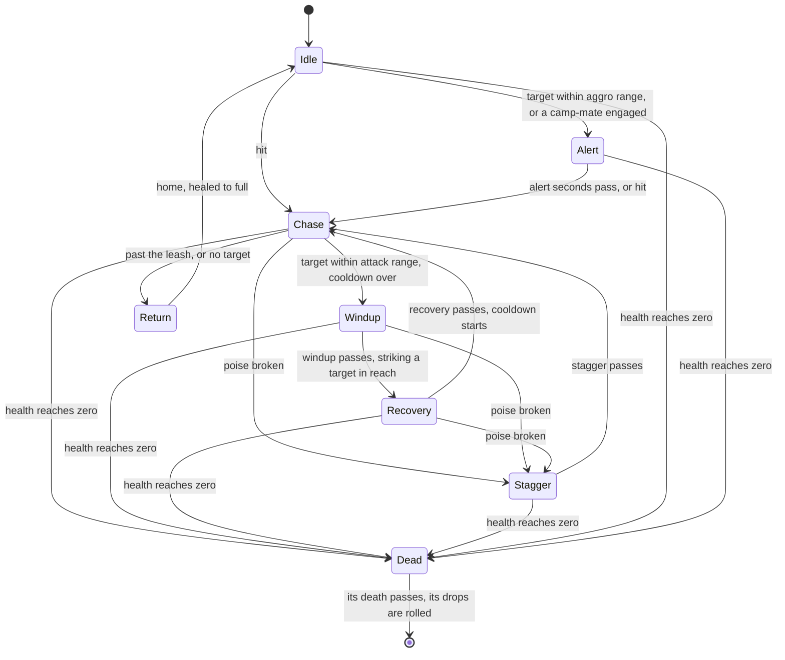

# Enemies

The world's enemies follow the rules the wiki documents for the game's open world. A camp placed in a region's data spawns when the region comes into reach. Its enemies notice whoever comes near, fight together, give up when led too far from home, and come back on the game's own timers once beaten. All of it is `genshin-world`'s, since it is the game's rules rather than the engine's. Until a model is built for each kind, an enemy is drawn as a capsule, tinted by its AI's state so the states can be watched.

## How it works

- **One deterministic step.** `stepEnemy` reads an enemy, the target on the ground (or none) and the step's seconds, and writes the enemy's next state, position, heading and poise in place. It reads no clock and no random source, so a test steps it exactly as the world does. Idle is standing at its spawn, or walking its patrol's points in a loop.
- **A hit is combat's to compute.** `damageEnemy` takes the damage and poise damage combat's formula computes for a hit. The enemy's health falls, and each energy threshold it falls to drops its energy, once for the enemy's life however it is healed. A hit on a broken poise, or one that breaks it, staggers the enemy and cancels its attack; any other hit sets an unengaged enemy on its attacker. A returning or dead enemy is immune.
- **Hit by the kit, striking back.** A kit's hit lands through `strikeEnemy`: a blunt hit shatters a Freeze first, an elemental hit applies its element under the internal cooldown kept on the enemy for each attacker and tag, and the damage is priced by combat before `damageEnemy` takes it. A dead or returning enemy is passed by. An enemy's own strike lands on the member on the field through `strikePartyMember`, the [party](/docs/genshin/party)'s HP falling by the damage over its Max HP.
- **Elements it keeps.** Each enemy carries an `ElementalState`, advanced at each of its fixed steps so its auras decay and its Electro-Charged and Burning tick between hits. Those ticks are read and dropped for now, since no hit prices them. `hitSeconds` counts the seconds since the enemy was last hit, which is what draws a hit.
- **Camps wake together.** After every step, `wakeEnemyCamps` alerts each idle enemy whose camp has a member engaged, so a whole hilichurl camp turns at once.
- **Leashed to home.** An enemy farther from its spawn than the leash distance, or one left with no target, walks home. It is immune on the way and arrives healed to full, with its poise restored.

## Kinds and their stats

A kind is the game's own monster, named by the game's monster id (`EnemyKindId`). Its row of the game's table holds its family, its type, its base HP, ATK and DEF with the level curve each grows by, and its resistance to each element and to physical damage. `genshin:assets enemies` writes that row for every kind a region's camps place, and every curve they name, from the community's dump of the game's tables. The family is the archive's group, and the type is the table's security level: common, elite or boss. Both are spelt as the game spells them, so the tables parse into the world's enums.

`computeEnemyStats` scales each base stat by its curve's multiplier at the enemy's level, as the wiki's formulas do: max HP and ATK by their curves, and DEF by one plus a hundredth of the level.

What the game's table does not hold is authored from the wiki in `EnemyKindTraitsMap`: the kind's poise type, the element its energy carries, its energy drops in falling order, and the family whose Mora and materials it drops. Each poise type's bar (its length, refill speed, endurance and reset time) is the wiki's table.

## Spawns and respawn

A region's data places its enemies in camps, each member with its kind, its level, its spawn and its patrol. The world spawns a camp when its region's data arrives, and drops it when the region leaves reach. A member defeated earlier is spawned again only once its respawn time has passed, so an enemy never comes back in view:

| Camp                   | A defeated member comes back                                 |
| :--------------------- | :----------------------------------------------------------- |
| Common enemies only    | 12 hours after its defeat                                    |
| With an elite among it | at the next daily reset, 04:00 in the reader's own time zone |
| With a boss among it   | at once, its reward taken as claimed, so on the next load    |

The daily reset is the reader's own 04:00, since the world has no server to keep a time zone.

The world keeps every spawned enemy in one map by its spawn key, the camp's id and the member's id. A camp's leaving removes its enemies from the map and a spawn's return adds it back, and the character's kit and the enemies' steps read the same map.

## Drops

A defeated enemy's drops are rolled by `computeEnemyDrops` from its level's band of five levels, the last band holding every level from 90. Its family's base Mora is scaled by the band's share: a random amount in the band's range for a common enemy, and the band's one share for an elite. Character EXP is the band's, for common and elite enemies. Each material drops its whole expected count and one more at the chance of its fraction, the second tier starting at level 40 and the third at 60. A boss drops nothing, since its reward is claimed from its blossom. Enemies give no Adventure EXP: the game awards it only for claiming a boss's reward. The Mora and the materials lie where the enemy fell, Mora as one pile and each material piece as a drop of its own, and the player picks them up as the [interaction](/docs/genshin/interaction) page describes.

## The stand-in

`World/Enemies` steps every enemy in reach on the engine's fixed-step loop, and draws them all as one instanced capsule, stood on the ground, turned to its heading and tinted by its state. Its target is the character's feet, which the world screen hands down, so every enemy turns on the body wherever it goes. Where no character stands, as on a reference's held camera or a witness render, the enemies have no target. A screen holding the world holds its enemies too, and a witness render draws none, since the references it is judged against show none.

A capsule that a hit landed on is tinted white for 0.15 seconds after the hit, and a flash 0.3 metres across stands at its middle for 0.1 seconds, drawn as a second instanced mesh. Both timings, the flash's size and the tint's colour are provisional.

## Cost

- **Two draws for all enemies.** The capsules are one instanced mesh and the hit flashes a second, their matrices and tints written each frame from scratch objects, so a frame allocates nothing for them.
- **The AI costs what is in reach.** Only the camps of regions in reach are stepped, and waking a camp compares each idle enemy with its camp-mates, which a camp's handful keeps cheap.

## Key files

| File                                                                   | Role                                                                    |
| :--------------------------------------------------------------------- | :---------------------------------------------------------------------- |
| `packages/genshin-world/src/services/enemy/stepEnemy.ts`               | The AI: one fixed step of an enemy's state machine                      |
| `packages/genshin-world/src/services/enemy/damageEnemy.ts`             | A hit: health, energy thresholds, poise and stagger                     |
| `packages/genshin-world/src/services/enemy/wakeEnemyCamps.ts`          | Camps waking together                                                   |
| `packages/genshin-world/src/services/enemy/computeEnemyStats.ts`       | A kind's stats at a level from its curves                               |
| `packages/genshin-world/src/services/enemy/computeEnemyRespawnTime.ts` | When a defeated spawn comes back, by its camp                           |
| `packages/genshin-world/src/services/enemy/computeEnemyDrops.ts`       | Mora, Character EXP and materials by level band                         |
| `packages/genshin-world/src/services/enemy/EnemyKindTraitsMap.ts`      | What the wiki gives of each kind: poise, energy and drop family         |
| `packages/genshin-world/src/services/enemy/constants.ts`               | The AI's ranges, speeds and timings, the respawn timers, the hit's look |
| `packages/genshin-world/src/models/enemy/Enemy.ts`                     | One enemy: its state, health, elements and internal cooldowns           |
| `packages/genshin-world/src/services/kit/strikeEnemy.ts`               | A kit's hit landing on an enemy: its elements, damage and poise         |
| `packages/genshin-world/src/services/kit/strikePartyMember.ts`         | An enemy's strike on the member on the field                            |
| `packages/genshin-world/src/data/enemies/kinds.json`                   | The kinds' rows of the game's monster table                             |
| `packages/genshin-world/src/data/regions/mondstadt.json`               | Windrise's hilichurl camp                                               |
| `packages/genshin-world/src/components/World/Enemies/Index.vue`        | Spawns, steps and draws the enemies in reach, each aimed at the body    |
| `scripts/src/services/genshinAssets/enemies/writeEnemyKinds.ts`        | Writes the kinds and their level curves from the game's tables          |

## Notes

- **The tables hold one kind until they are read.** `kinds.json` holds the Hilichurl Fighter as the game's table has it, and `levelCurves.json` its curves' first ten levels, until `genshin:assets enemies` writes them whole from the dump.
- **The AI's numbers are provisional.** Its ranges, speeds and timings, the leash, the capsule's size, and the hit's tint and flash are starting points marked in `services/enemy/constants.ts`, each to be measured off a recording or the Hilichurl's own clips.
- **Character EXP is computed, not yet given.** The party has no levels to take it, so a defeat's EXP is rolled and left. A defeat's drops are placed and picked up by the world's screen, and the component emits `strike` and `defeat` for it.
- **Electro-Charged and Burning ticks deal no damage yet.** Combat prices them by the character who triggered them once a kit's module does, so an enemy's ticks only decay its auras for now.
- **Defeats last the page's life.** A reload of the page brings every enemy back, until a saved game keeps when each was defeated.
- **Windrise's camp stands where we put it.** Its place and level are ours until the game's own spawns are read.

## Sources

- [Enemy](https://genshin-impact.fandom.com/wiki/Enemy), Genshin Impact Wiki: the enemy types and the archive's families.
- [Enemy/Level Scaling](https://genshin-impact.fandom.com/wiki/Enemy/Level_Scaling), Genshin Impact Wiki: max HP and ATK as base value times a level multiplier, and DEF's multiplier of one plus a hundredth of the level.
- [Interruption Resistance/Poise](https://genshin-impact.fandom.com/wiki/Interruption_Resistance/Poise), Genshin Impact Wiki: the poise bar, its refill and reset, and each poise type's values.
- [Energy/Data](https://genshin-impact.fandom.com/wiki/Energy/Data), Genshin Impact Wiki: each enemy's energy at its HP thresholds and on death, each threshold once per enemy.
- [Reset](https://genshin-impact.fandom.com/wiki/Reset), Genshin Impact Wiki: common enemies back 12 hours after defeat unless in an elite's group, elites and their groups at the daily reset, and normal bosses once their reward is claimed.
- [Module:Drops Table/data](https://genshin-impact.fandom.com/wiki/Module:Drops_Table/data), Genshin Impact Wiki: Mora and Character EXP by level band, each family's materials and the tiers' shares by band.
- [Adventure EXP](https://genshin-impact.fandom.com/wiki/Adventure_EXP), Genshin Impact Wiki: Adventure EXP from bosses' rewards and none from defeating enemies.
- [AnimeGameData](https://github.com/DimbreathBot/AnimeGameData), the community's dump of the game's data: `MonsterExcelConfigData`, `MonsterCurveExcelConfigData` and `AnimalCodexExcelConfigData`, the tables the kinds are read from.
