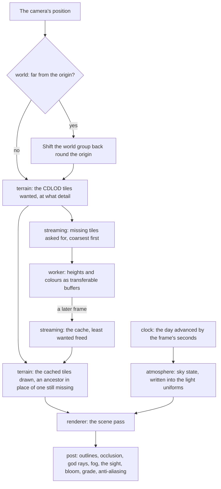
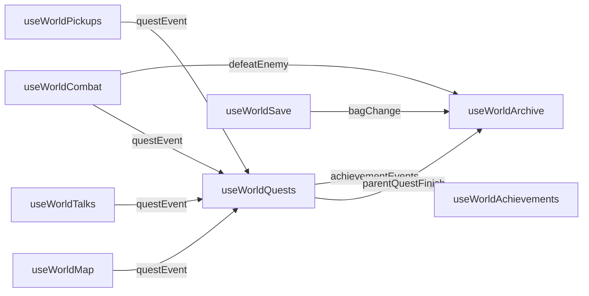

# Engine architecture

The Genshin program is long: terrain, water, vegetation, every region, then a character and its play. A world built as one scene component would couple its terrain to its camera and its sky to its grass, and be rewritten by the third region. So the engine is divided into modules, each with one job, a typed interface and its own tests, and the modules meet only through those interfaces.

## How it is divided

- **The engine is a published package; the app only mounts it.** `genshin-engine`, public on npm like `keyframe-store` and `vue-phaserjs`, holds the engine as plain TypeScript and TSL node graphs, free of Vue, of stores and of any DOM past a canvas. It is tested without a DOM, and nothing in the app reaches past a module's interface.
- **The game's world is a second package over the engine.** `genshin-world`, published beside it, holds what is Genshin's rather than any engine's: the catalogue of regions and areas, each region's data, the scenes and screens, and the TresJS components and composables that create the engine's modules for them. The engine knows no place by name. The world's screen owns its canvas; the app keeps its stores and hands the world only what a bundler or a server decides: the terrain worker, where region data is served, and whether the tuning panel shows.
- **One module, one job.** Each is a folder of the engine's source:

  | Module       | Its job                                                                                                                                             |
  | :----------- | :-------------------------------------------------------------------------------------------------------------------------------------------------- |
  | `renderer`   | builds `WebGPURenderer` and owns the quality tier                                                                                                   |
  | `clock`      | the game's day, advanced by each frame's seconds                                                                                                    |
  | `world`      | the floating origin's shift, and how far the camera stands from an area's outline                                                                   |
  | `simulation` | fixed steps from an accumulator, at most five a frame, so a motion is the same at any rate                                                          |
  | `input`      | the keys, mouse buttons, the locked pointer, a gamepad and the touch controls, read once a frame into one move, look and the actions the game binds |
  | `camera`     | the follow camera behind a body, pulled in by what stands between, and the free camera's flight, held above the ground                              |
  | `collision`  | what a moving thing meets: the ground under it, the water's surface, and the landmarks' meshes a capsule is pushed out of and a sphere cast against |
  | `locomotion` | the character's body through the game's movement states, and the stamina they spend                                                                 |
  | `character`  | an MMD model read from its PMX file, and drawn as one skinned mesh on the toon ramp                                                                 |
  | `streaming`  | which tiles are wanted, asked for coarsest first, and a cache that frees the least wanted                                                           |
  | `terrain`    | height tiles, the CDLOD selection and mesh, and the ground material                                                                                 |
  | `atmosphere` | the sky, its clouds and the light state they produce                                                                                                |
  | `wind`       | the shared wind field                                                                                                                               |
  | `materials`  | the toon ramp every environment material reads                                                                                                      |
  | `nodes`      | every TSL node graph: the toon, stone, leaf and water materials, the sky, the rim, the wind                                                         |
  | `post`       | what follows the scene: outlines, occlusion, god rays, fog, the sight, bloom, grade, anti-aliasing                                                  |
  | `vegetation` | grass generated round the camera, and the ground capture it stands on                                                                               |
  | `water`      | still water's uniforms, and the fog under its surface                                                                                               |
  | `kits`       | the parametric generators a region's kits are built from: trees, the statue, architecture                                                           |
  | `audio`      | the music's player, its synthesizer and sampler, and the sound effects' buffers                                                                     |
  | `noise`      | simplex noise, the one source of procedural detail                                                                                                  |
  | `random`     | a seeded random source, so a generator runs the same everywhere                                                                                     |

  A module is added by the proposal that first needs it, never ahead of it as an empty folder: `input`, `simulation`, `camera` and `collision` with the [free camera](/docs/genshin/free-camera), `locomotion` with the [character controller](/docs/genshin/character-controller), and per-instance culling with [trees and scatter](/docs/proposals/genshin/trees-and-scatter).

- **State flows one way.** Modules expose read-only state and commands. The light state and the wind are uniforms that materials read, so the hour and the wind move the whole world by writing a few values. Region data flows from the world package into the terrain worker, the vegetation and the kits. No module imports a sibling's internals, and a dependency that points back up the frame's order is a design error.
- **Every generator is pure and seeded.** Tile heights, grass and kit geometry are pure functions of region data, a tile key and a seed, returning typed arrays. They run the same in a worker, a test or a bench, and the same spot always generates the same world.

## How a frame runs

Nothing reads state that a later stage of the same frame writes: the light is written before the scene draws, and only a tile already in the cache is drawn, its nearest cached ancestor standing in for one still asked for until it arrives in a later frame.

## It runs in the reader's browser, so it is minimal first

Every module is judged by what it costs a mid-range laptop's integrated GPU and a phone:

- a frame allocates nothing
- draws are tens, never thousands, through instancing and batching
- generation happens off the main thread
- the engine's code and each region's data load only when needed
- a quality tier lowers cost before the frame budget is missed, and never removes the style

Every generator and every per-frame selection is benched under the `bench` skill at two scales or more, so its cost is shown to follow what is visible. A module whose bench grows with the continent is redesigned, not tuned.

## The world screen is composition

`World/Screen/Index.vue` loads the names and the stat tables the save is read by, then opens `World/Session/Index.vue`, which only composes. Each system of the world (the save and the bag, the pick ups, the quests, the talks and residents, the Archive, the party and its combat, the landmarks and the jump, the achievements) is one composable under `composables/`, taking its dependencies as arguments and returning what the template or another system reads. A system reacts to another's doing through one typed event map, `WorldEventMap`, emitted on one `WorldEvents` the screen creates:

## Key files

| File                                                            | Role                                                           |
| :-------------------------------------------------------------- | :------------------------------------------------------------- |
| `packages/genshin-engine/src/index.ts`                          | The package's entry, which the world imports every module from |
| `packages/genshin-engine/src/renderer/createGenshinRenderer.ts` | The renderer every scene draws through                         |
| `packages/genshin-engine/src/streaming/createTileStreamer.ts`   | The tile streamer, run the same over a worker pool or a test   |
| `packages/genshin-world/src/workers/terrainTile.worker.ts`      | The worker the ground's tiles are generated in                 |
| `packages/genshin-world/src/components/World/Screen/Index.vue`  | The world's screen the app mounts, loading what the save reads |
| `packages/genshin-world/src/components/World/Session/Index.vue` | The world's session, owning its own canvas                     |
