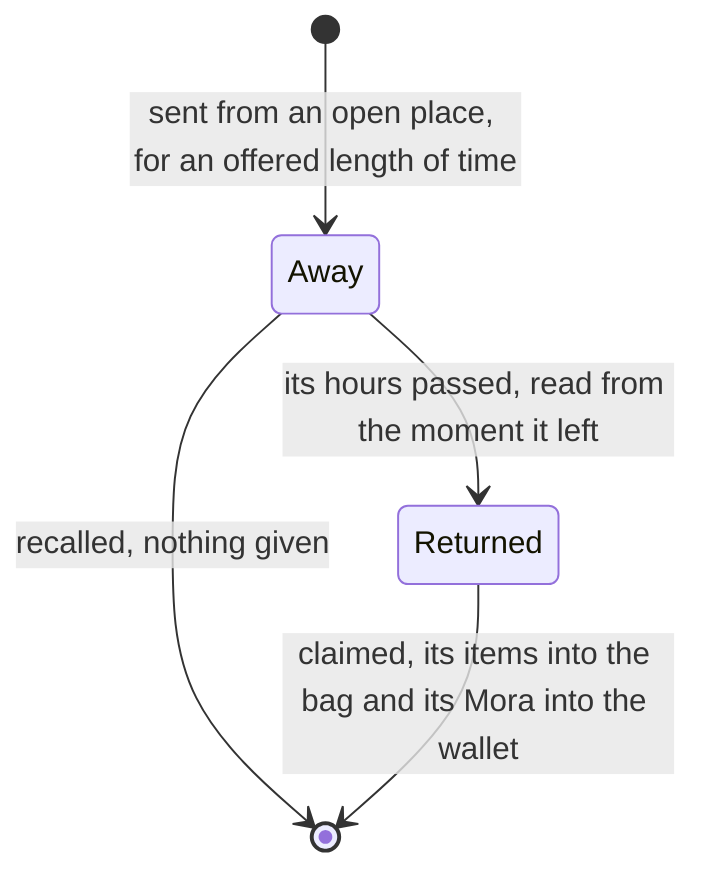

# Expeditions

The game sends characters out to gather while the player is away. Here the rules are pure services in `genshin-world`: a send, its return read from the moment it left, a claim that takes the rolled items into the bag and Mora into the wallet, and a recall that forfeits the reward. Mondstadt's places come from the game's expedition table in a generated slice, imported on demand, and the limit by rank from a small data file. This page is what is built of [expeditions](/docs/proposals/genshin/expeditions). Katheryne's talk that opens the screen, the other nations' places and the expedition bonus and talents are not built, so no player can send a character from the game yet.

## How it works

## Decisions

- **Sent for an offered length.** `sendExpedition` takes a character to a place for one of its durations, 4, 8, 12 or 20 hours. It refuses the Traveler, a character who is down, a character already away, a place that is closed, and a send past the limit. Expeditions open at Adventure Rank 14, the rank the wiki gives, which is also the lowest place's rank.
- **Two at first, one more at 26, 31 and 36.** `computeExpeditionLimit` starts at two and adds each rank's `expeditionLimitAdd` from the player level table once the rank is reached, so the limit is two to rank 25, three from 26, four from 31 and five from 36.
- **A place opens by its conditions.** `checkIsExpeditionPlaceOpen` needs the place's Adventure Rank reached, its statue resonated with where it names one, and its quest finished where it names one. The statue is named by its scene point: `computeUnlockedStatuePointIds` maps each unlocked landmark to its point through `LandmarkIdStatuePointIdMap`, which holds Windrise's statue as point 4, the only statue the region data holds.
- **Returned from the moment it left.** `checkIsExpeditionReturned` moves the moment a send left on by its hours, so an expedition finishes while the page is closed, as the game's timer does. It returns at exactly that moment, not a nanosecond before.
- **The reward is the place's preview.** A duration's reward is its reward preview's items, each with a count drawn from its least to its most by the caller's random source, as the wish pull takes its source. The game's reward ids for expeditions, 205010100 and its kin, are in no table the dump holds, so the preview is read as the reward. Mora (item 202) goes to the wallet, every other item to the bag.
- **A claim the bag cannot take whole is refused.** `claimExpedition` returns undefined where an item would overflow, and the expedition stays out, so no part of a reward is lost. The bag's full hint is the inventory's.
- **A recall forfeits the reward.** `recallExpedition` takes the character off the list and gives nothing, which is also what a claim does to the list.
- **Real time, kept with the player's progress.** An expedition is held as its character, place, hours and the moment it left, like the wallet's Original Resin moment. Nothing persists the world's progress yet, so the list lasts for the session.
- **Settled calls from the data.** The table's `rankLevel` is zero for the expedition materials, the game's unstarred items, so an item's rarity may be zero. The quest a place names, 39604 for Stormterror's Lair, has no finished record to read, so a place that names one stays closed until quests keep one. The expedition's materials are game text keys in all fifteen languages, so their names read through `GameTextKey` as every other item's do.

## Data

- **Read from the game's tables:** `ExpeditionDataExcelConfigData` for each place's nation, its rank and statue and quest conditions, and its durations and reward previews; `RewardPreviewExcelConfigData` for the items and their counts; and `PlayerLevelExcelConfigData` for each rank's `expeditionLimitAdd`. The three expedition tables and the reward preview table are fetched from the community's dump into the game's text directory, which the dump lacked, and not committed.
- **Written by** `pnpm -C scripts genshin:assets expeditions`, which writes Mondstadt's places as `packages/genshin-world/src/generated/expeditions/mondstadt.json` and the limit's ranks as `packages/genshin-world/src/data/expeditions/limits.json`. `pnpm -C scripts genshin:assets items` writes the expedition materials into the items data beside the drops'.
- **Not read by this page:** `ExpeditionPathExcelConfigData` names the Adventurers' Guild's expedition missions, each with its team's elements, and `ExpeditionBonusExcelConfigData` gives a chance of a bonus by the sent character's level. Neither is a place to send a character, and neither's effect is in the tables read.

## Not built yet

- **Katheryne and the screen.** No talk sends a character and no expedition screen is drawn, so the rules have no caller in the game. The screen's layout is a parity matter once Katheryne's branch is placed.
- **The other nations' places.** Only Mondstadt's places are written. A nation's places join when its statues are in the region data with their scene points.
- **Statues beyond Windrise's.** The places that name points 7 and 29 stay closed until those statues are in the region data.
- **The bonus and the talents.** The bonus's payload is not in the tables read, and the characters' expedition talents wait on the character kits' passives.

## Key files

| File                                                                              | Role                                                                  |
| :-------------------------------------------------------------------------------- | :-------------------------------------------------------------------- |
| `packages/genshin-world/src/models/expedition/Expedition.ts`                      | A character out: its place, its hours and the moment it left          |
| `packages/genshin-world/src/models/expedition/ExpeditionPlace.ts`                 | A place: its rank, statue point, quest and durations with their items |
| `packages/genshin-world/src/services/expedition/sendExpedition.ts`                | The rules a send is refused by                                        |
| `packages/genshin-world/src/services/expedition/claimExpedition.ts`               | A claim: the rolled items into the bag, the Mora into the wallet      |
| `packages/genshin-world/src/services/expedition/recallExpedition.ts`              | A recall, forfeiting the reward                                       |
| `packages/genshin-world/src/services/expedition/checkIsExpeditionPlaceOpen.ts`    | A place open by its rank, statue and quest                            |
| `packages/genshin-world/src/services/expedition/computeExpeditionLimit.ts`        | The most expeditions out at once at a rank                            |
| `packages/genshin-world/src/services/statue/computeUnlockedStatuePointIds.ts`     | The scene points of the statues unlocked, the points a place names    |
| `packages/genshin-world/src/services/expedition/readMondstadtExpeditionPlaces.ts` | Mondstadt's slice, imported on demand and checked on arrival          |
| `scripts/src/services/genshinAssets/expeditions/writeMondstadtExpeditions.ts`     | The writer of the places slice from the dump                          |

## Notes

- **The statue map is one entry.** `LandmarkIdStatuePointIdMap` names Windrise's statue alone, since the component map holds its scene point and no other statue's point is in the region data. Each further statue adds its entry with its point.
- **The limit's ranks are read off the table.** The three ranks that raise it are the game's; the base of two is the wiki's, as the proposal settles.

## Sources

- [Expedition](https://genshin-impact.fandom.com/wiki/Expedition), Genshin Impact Wiki: the unlock at rank 14 through Katheryne, any character but the Traveler for 4, 8, 12 or 20 hours, still usable while away, places opened by their statues, the timer running offline, recall forfeiting the reward, and two at once rising with rank.
- [AnimeGameData](https://gitlab.com/Dimbreath/AnimeGameData), the community's per-patch dump: the expedition tables, the reward previews and the player level table's expedition limit.
