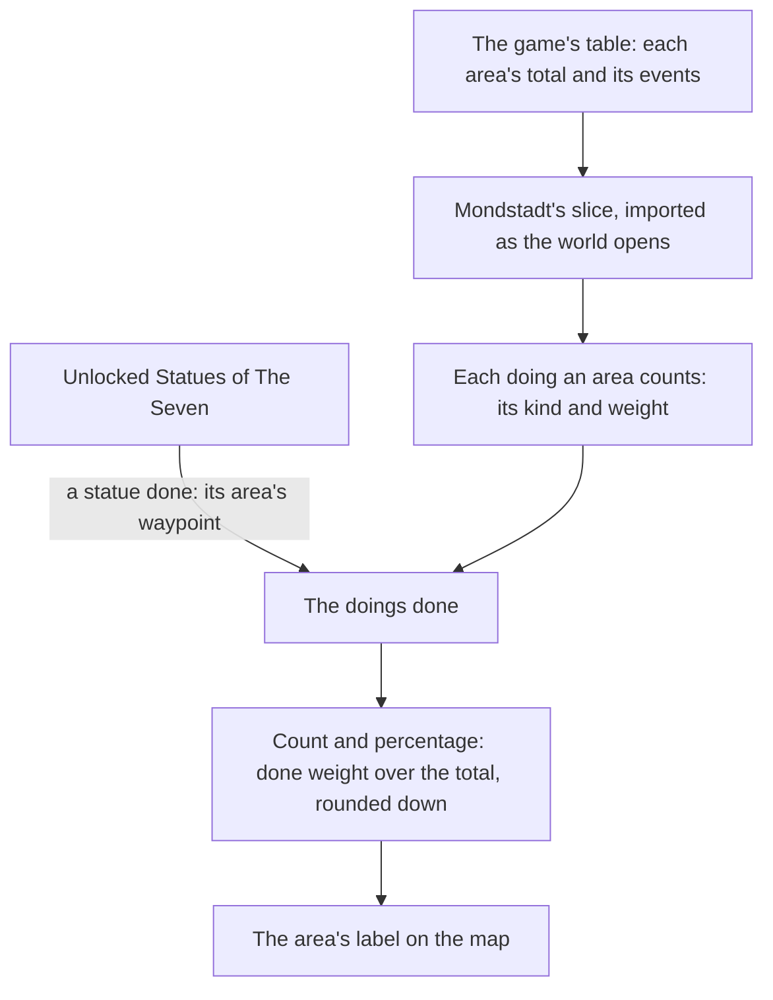

# Exploration progress

In the game the map shows how much of each area a player has explored, as a percentage. This page is what is built of [exploration progress](/docs/proposals/genshin/exploration-progress): the game's table gives Mondstadt's four level-one areas their totals and the events each counts, and the map's label for an area shows its count and its percentage once a statue in it is unlocked. Windrise is a town of Galesong Hill, so Galesong Hill is the first area counted. Only its statue's waypoint is done so far, since chests and camps have no record in the world yet, and the percentage's scale waits on a recording.

## How it works

- **Read from the table, Mondstadt first.** `pnpm -C scripts genshin:assets exploration` writes `packages/genshin-world/src/generated/exploration/mondstadt.json` from the dump's `ExploreAreaTotalExpExcelConfigData` and `WorldAreaExploreEventConfigData`. The slice holds, for each of the four level-one areas Mondstadt holds (Starfell Valley, Galesong Hill, Windwail Highland and Brightcrown Mountains), its total and its counted doings. It is imported on demand as the world opens and checked against its schema as it arrives.
- **Three kinds are counted.** A camp (`EXPLORE_EVENT_CLEAR_GROUP_MONSTER`), a chest (`EXPLORE_EVENT_OPEN_CHEST`) and a waypoint (`EXPLORE_EVENT_UNLOCK_POINT`). The table also lists gathered items (`EXPLORE_EVENT_ITEM_ADD`), which are the ingredients picked up from plants and ores, and a force entered (`EXPLORE_EVENT_ENTER_FORCE`). Neither is one of the kinds the progress is read from, so both are left out. Whether a picked ingredient counts is one of the questions the recording settles.
- **A statue done is its area's waypoint done.** `computeExploredDoingIds` names an area's waypoint done once a Statue of The Seven in that area is unlocked. Each Mondstadt area holds one waypoint event, which is its statue's, so a statue completes exactly one doing. Chests and camps are never done yet, since the world keeps no record of opening or clearing them.
- **The label shows the count and the percentage.** Each area's label is drawn once a landmark in it is unlocked, and under its name the label now shows the done doings over the counted ones and the percentage. `computeExplorationProgress` takes the done weight as a share of the area's total and rounds it down, so an area reads 100 only with all of its weight done.
- **Counted once.** The done doings are a set of ids, so a doing adds its weight a single time however it is reached.
- **The scale is provisional.** The table gives every counted doing a weight of ten, and Galesong Hill's counted doings at ten each sum to nearly twice its total. So the table's weights cannot be shares of the total as read, and the percentage is marked provisional until a recording of the map's steps settles it.

## Key files

| File                                                                               | Role                                                           |
| :--------------------------------------------------------------------------------- | :------------------------------------------------------------- |
| `packages/genshin-world/src/services/exploration/computeExplorationProgress.ts`    | An area's count and percentage, the done weight over its total |
| `packages/genshin-world/src/services/exploration/computeExploredDoingIds.ts`       | The doings an area's unlocked statue has done                  |
| `packages/genshin-world/src/services/exploration/readMondstadtExplorationAreas.ts` | Imports the Mondstadt slice and checks it against its schema   |
| `packages/genshin-world/src/composables/useExplorationAreas.ts`                    | Reads the slice as the world opens, logging a slice that fails |
| `packages/genshin-world/src/components/Map/Overlay/Index.vue`                      | Shows each filled area's count and percentage under its name   |
| `packages/genshin-world/src/models/exploration/ExplorationArea.ts`                 | An area's total and the doings its progress counts             |
| `scripts/src/services/genshinAssets/exploration/writeMondstadtExplorationAreas.ts` | Writes the Mondstadt slice from the dump                       |
| `scripts/src/services/genshinAssets/exploration/ExploreEventKindMap.ts`            | The event types the progress counts, each as its kind          |
| `scripts/src/services/genshinAssets/exploration/ExploreAreaCatalogueIdMap.ts`      | Each level-one area the world holds, by its catalogue area     |

## Notes

- **Windrise's area is Galesong Hill.** The game counts exploration per level-one area. Windrise is a level-two area of Galesong Hill, and the statue that stands at Windrise is Galesong Hill's, so unlocking it completes Galesong Hill's waypoint.
- **Not yet.** Chests, camps, Oculi and puzzles are not recorded as done, so an area's count holds only its statue until they are. The Reputation thresholds wait on Reputation being kept, as the [proposal](/docs/proposals/genshin/exploration-progress) records.
- **Provisional measures.** The label's type size and its line's place below the name are provisional until a recording of the map shows them at the game's own size.

## Sources

- [AnimeGameData](https://github.com/DimbreathBot/AnimeGameData), the community's per-patch dump: the explore total and event tables, read as the references folder's copies and never committed.
