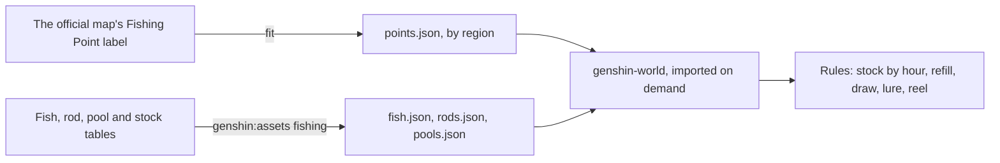
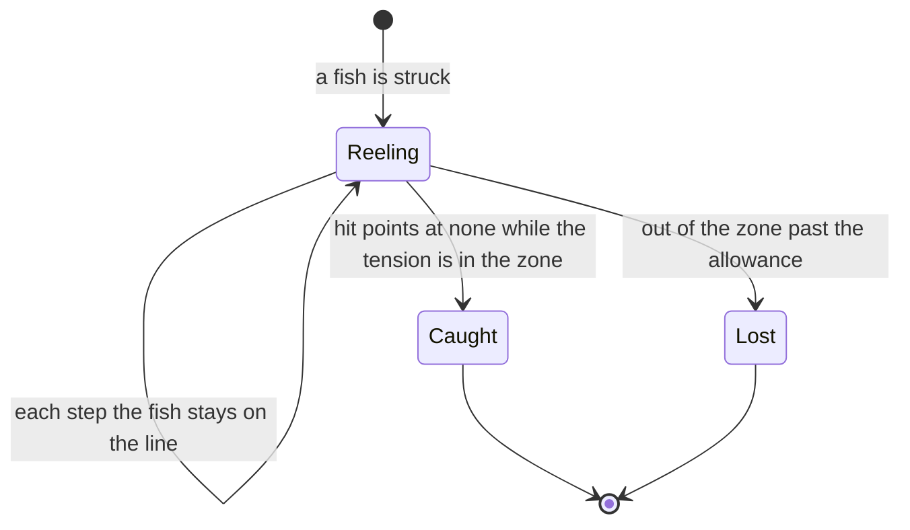

# Fishing

The fishing points stand where the official map places them, each region's pools and the fish they draw from are the game's own tables, and the rules of a cast are pure functions over them: a stock's day and night, its refill, a weighted draw of a fish, a lure's reaction and a reel's tension against its zone. This is the first half of the [fishing](/docs/proposals/genshin/fishing) proposal. Nothing is cast yet: no bait, no bite timing, no fish's skills, no screen, no prompt and no bag item.

## How it works

The reel is the one state machine built so far, its phase a `FishingPhase` the screen will read:

## The read

`pnpm -C scripts genshin:assets fishing` writes four slices into the world's generated folder, each imported on demand and checked against its shape as it arrives:

- **Points.** The official map's Fishing Point label, placed by the fit that already carries the statues and waypoints into the game's coordinates ([spawned places](/docs/genshin/spawned-places)), filed by region.
- **Fish and rods.** Every fish's hit points, attract and flee ranges, bite timeout, feeler range, moving zone and item, and every rod's base attack, multiplier, accuracy and maximum, read by the table's own names.
- **Pools.** Each region's fishing pools, filed by the game's city id, each stock on a pool's list resolved to its table row with the fish weights kept in the table's order. A stock the table does not hold is an error, never a pool missing it.

The fish, stock, pool and rod tables are not in the community dump the repository reads, so the seven the fishing reads were fetched from the AnimeGameData repository into the dump's folder, never committed.

## The rules

- **Day and night.** A pool's day stock is drawn from six o'clock to eighteen on the game's clock, which runs in `Asia/Shanghai` as the world's daily resets do, and its night stock otherwise. A stock held at every hour is drawn at any time (`pickFishingStock`).
- **Seventy-two hours.** An emptied stock is back in full seventy-two hours on, the day's and the night's kept apart by their own emptying (`checkIsFishingStockRefilled`).
- **A draw.** A roll in one unit picks a fish by its share of the stock's total weight, and a stock weighing nothing draws none (`drawFishingWeight`).
- **A lure.** A fish inside its flee range flees whatever the bait. A fish turns toward the bait it takes within its attract range, and every other lure is ignored (`computeFishReaction`).
- **The reel.** The tension rises while the reel is held and falls while it is not, at one rate, clamped to the line's range. Inside the zone the rod's attack wears the fish's hit points down, and the fish is caught at none. Outside it the allowance runs out, and the line breaks past it (`stepFishingReel`).

## Provisional

- **The reel's tension rate and its allowance** (`REEL_TENSION_RATE`, `REEL_LOST_OUT_OF_ZONE_SECONDS`) are not in the tables. A recording of the minigame sets them, listed on the [roadmap](/docs/genshin/roadmap)'s Recordings owed list.

## Key files

| File                                                                         | Role                                                          |
| :--------------------------------------------------------------------------- | :------------------------------------------------------------ |
| `scripts/src/services/genshinAssets/fishing/writeFishingPoints.ts`           | The official map's fishing points, fitted and filed by region |
| `scripts/src/services/genshinAssets/fishing/writeFishingTables.ts`           | The fish, rods and each region's pools as the world's slices  |
| `scripts/src/services/genshinAssets/fishing/toFishingPool.ts`                | A pool's stocks resolved to their table rows                  |
| `packages/genshin-world/src/services/fishing/pickFishingStock.ts`            | The stock a pool draws from at an hour of the game's day      |
| `packages/genshin-world/src/services/fishing/checkIsFishingStockRefilled.ts` | Whether an emptied stock is back in full                      |
| `packages/genshin-world/src/services/fishing/drawFishingWeight.ts`           | The fish a stock draws for a roll                             |
| `packages/genshin-world/src/services/fishing/computeFishReaction.ts`         | A fish's answer to a lure within its reach                    |
| `packages/genshin-world/src/services/fishing/stepFishingReel.ts`             | The reel's tension, hit points and allowance after a step     |

## Sources

- [Fishing](https://genshin-impact.fandom.com/wiki/Fishing), Genshin Impact Wiki: the day and night stocks, the seventy-two hour refill and the bite.
- [Teyvat Interactive Map](https://act.hoyolab.com/ys/app/interactive-map/index.html), HoYoLAB: the Fishing Point label whose points the fit places.
- [AnimeGameData](https://github.com/DimbreathBot/AnimeGameData), the community's per-patch dump: the fish, pool, stock and rod tables read here.
