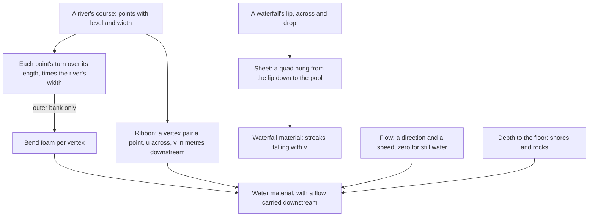

# Flowing water

The [water](/docs/genshin/water) is one still surface at each region's level, and a river is not: it runs one way and falls with its valley. The water's material now takes a flow, and two shapes take it further, a river's ribbon along its course and a waterfall's sheet down a cliff. Still water has no flow, so the sea and lakes draw exactly as before.

## How it works

- **The flow carries the ripples and foam.** The water material samples its ripple and foam noise at the point minus the flow's direction times its speed and time, so the pattern moves downstream. A flow of zero leaves the still water's sampling where it was.
- **A river is a ribbon.** Its surface is two vertices a point across the course, each at the point's level and half its width to either side of the course's direction. Across, u runs bank to bank; down the course, v counts metres from the head, so a texture reads downstream.
- **Foam gathers on a bend's outer bank.** The ribbon writes a bend foam value per vertex (`RIVER_BEND_FOAM_ATTRIBUTE`): at each point of the course, the angle the course turns through over the length it turns along, times the river's width, so a bend as tight as a few widths is full foam and a gentle one a trace. Only the outer bank's vertex takes it, and it fades across the ribbon to none on the inner bank. The water material takes the value as an input and gathers foam where it or the shore's shallowness is larger, so a bend foams as a shore does, while rocks keep gathering theirs through the water's depth. Still water passes none.
- **A waterfall is a sheet.** One quad from the lip's two ends straight down by its drop. Its material streaks the foam colour along the width and lets each streak fall with v, opaque on a streak and clear between.

## Scope

**Built:** the flow on the water material, the river ribbon and its bend foam, the waterfall sheet and its streak material. Still water passes a zero flow in the [world's water](/docs/genshin/water) component.

**Not yet:** where rivers and waterfalls stand in each region, which needs the game's own water surfaces and falls, and the mist and foam pool at a waterfall's foot. Both are the [flowing water](/docs/proposals/genshin/flowing-water) proposal.

## Key files

| File                                                           | Role                                                                          |
| :------------------------------------------------------------- | :---------------------------------------------------------------------------- |
| `packages/genshin-engine/src/nodes/createWaterMaterial.ts`     | The water material, which takes a flow and a bend foam that gather its foam   |
| `packages/genshin-engine/src/water/createWaterFlowUniforms.ts` | The still water's flow, zero                                                  |
| `packages/genshin-engine/src/water/createRiverGeometry.ts`     | The river ribbon along a course, with its bends' foam on their outer bank     |
| `packages/genshin-engine/src/water/constants.ts`               | The bend foam's attribute and how tight a bend gathers full foam, provisional |
| `packages/genshin-engine/src/water/createWaterfallGeometry.ts` | The waterfall sheet hung from its lip                                         |
| `packages/genshin-engine/src/nodes/createWaterfallMaterial.ts` | The waterfall's streaks falling down its sheet                                |
| `packages/genshin-engine/src/models/water/RiverCoursePoint.ts` | A point along a river's course                                                |
| `packages/genshin-engine/src/models/water/WaterfallSheet.ts`   | A waterfall's lip, width and drop                                             |
| `packages/genshin-world/src/components/World/Water/Index.vue`  | The region's still water, passing it the zero flow                            |

## Notes

- **The bend's foam is per vertex, not read from depth.** A depth-only bend would need the floor to rise under the outer bank, which the fitted ground does not hold where the game's own river bed does not, so the course itself carries it: two values a point, which a ribbon already spends nothing else on.
- **How tight a bend gathers full foam is provisional** (`BEND_FOAM_FULL_RADIUS_WIDTHS`), fitted to a recording of a bending river once the game's courses are placed.
