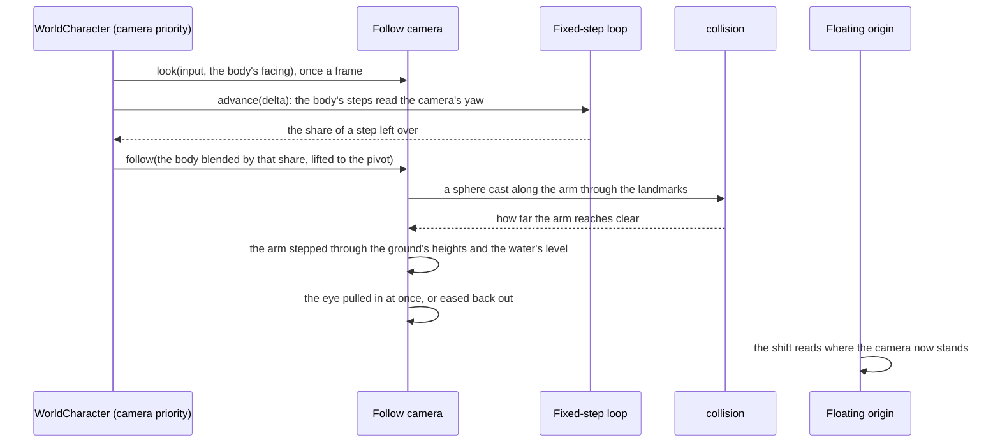

# Follow camera

In the game the camera stays behind the character and orbits a point above it. The player turns it freely and zooms it in and out, and the ground or a wall pulls it in toward the character rather than hiding the character behind them. The world's camera does the same: `genshin-engine`'s `createFollowCamera` orbits the [character controller](/docs/genshin/character-controller)'s body, and the world's `WorldCharacter` runs it.

## The orbit

- **A pivot at a share of the body's height.** The eye stands on an arm out from a point above the body's feet, at the share of the body's height where the game's screen centre falls on its characters, along the camera's yaw and pitch, and looks back along it at the pivot, so the camera's quaternion is its yaw and pitch alone. A taller body's pivot stands higher, as the game raises its look by body type.
- **The look turns it once a frame.** The pointer, while locked, and the right stick turn the yaw and tilt the pitch, clamped a degree short of looking straight up or down as the game clamps its own, each scaled by its sensitivity setting over the middle of the game's range. The wheel's notches zoom it within the game's nearest and furthest distance. The steps of that frame read the yaw it turned to, so a move stays relative to where the player is looking.
- **Reset puts it behind the body.** The middle mouse button or a pad's right stick press, the game's reset, swings it level behind the way the body faces at its default distance from the settings, as a jump from the [map](/docs/genshin/map) does on landing.
- **It follows the body between steps.** The body moves in fixed steps and the view once a frame, so the pivot is the body's place blended between its last two steps by how far the frame has come into the next, which the fixed-step loop gives as its share of a step left over. Without the blend a body stepping at a fixed rate stutters against the display's own rate.

## Pulled in

The arm is cleared each frame before the eye is placed. A sphere of the camera's clearance is cast from the pivot along the arm through the landmarks' octrees ([character controller](/docs/genshin/character-controller)), and the arm is then stepped through the terrain's own height function and the water's level, exact for a height field, until a step stands within the clearance of either. The eye stands at the shorter reach. It is pulled in at once, so nothing ever stands between it and the character, and eases back out at a steady pace once the way clears.

## The pointer and photo mode

A click on the world locks the pointer, as the game hides its cursor in play, and Left Alt lets it go to show the cursor, as the game's Show Cursor does; a lock let go that way does not open the Paimon menu, which a lock lost to `Escape` does ([screens](/docs/genshin/screens)). The next click takes the pointer again.

Photo mode, chosen from the Paimon menu, holds the body where it stands and keeps the follow camera on it as an orbit: the look turns the view round the body and the wheel zooms it, within the same range and pitch limits as the follow camera. That range is shared until the game's photo mode range is solved ([follow camera proposal](/docs/proposals/genshin/follow-camera)). The world's clock runs on as the game's does in photo mode. Leaving photo mode gives the view back to the follow camera where the orbit left it, the body still standing where it did. Under the tuning panel photo mode hands the view to the [free camera](/docs/genshin/free-camera) instead.

## The numbers

The camera's numbers are in `packages/genshin-engine/src/camera/constants.ts`, each from the most exact source the game has for it:

- **The game's own data** for the field of view, the pitch's limits and the wheel's nearest and furthest distances. The field of view is the one the game sets its world camera to. The limits and the distances are the game's camera profile, a ScriptableObject holding a config for each of its camera modules and one global config, which `pnpm -C scripts genshin:assets camera` exports from the install and prints word by word: the global config's elevation limits, its nearest zoom radius and its furthest radius on foot. The Settings screen's default distance spans as much as the profile's setting adjustment does and tops out at that furthest radius, so the setting is read in metres of the arm.
- **Recordings** for the pivot: the share of a standing character's height at which the screen's centre falls, read off frames of two bodies, a tall female's under a near-level camera and a medium male's under cameras looking down, whose foreshortening is allowed for. The readings are kept in the character's reference (`packages/genshin-world/src/components/World/Character/Camera.reference.ts`).
- **Provisional**, until a recording of the camera in play measures them: a notch's zoom and the ease back out. The camera's sensitivities and default distance are read from `FOLLOW_CAMERA_DEFAULT_SETTINGS` at the game's defaults, provisional until the Settings screen holds them; its pitch following a slope waits on the [menu screens](/docs/proposals/genshin/menu-screens)' Settings.

## Decisions

- **The game's data over a solve.** Each number the game's camera profile holds is read from it rather than solved off recordings, since the profile is exact where a solve carries its landmarks' noise. Its fields carry the names an older build's code metadata gives them, laid over the raw words as [game data formats](/docs/genshin/game-data-formats) sets out, and a later build that moves the config makes the reader throw rather than name the wrong words.
- **The pivot is a share of the body's height, not a height.** The recordings measure where the screen's centre falls on a character as a share of that character's height, and the game raises its look by body type, so each body's pivot follows its own capsule.
- **What the profile holds is modelled only once it is seen in play.** The radius the profile adds at the steepest elevation waits for a recording to show the arm lengthening as the camera looks down ([follow camera proposal](/docs/proposals/genshin/follow-camera)), the combat camera's pull comes with combat, and the recentering the game ships switched off is not modelled.

## Key files

| File                                                                        | Its role                                                                       |
| :-------------------------------------------------------------------------- | :----------------------------------------------------------------------------- |
| `packages/genshin-engine/src/camera/createFollowCamera.ts`                  | the orbit: look, zoom, reset, and the eye pulled in along the arm              |
| `packages/genshin-engine/src/camera/constants.ts`                           | the camera's numbers, the game's and the provisional, and its default settings |
| `packages/genshin-engine/src/models/camera/FollowCameraSettings.ts`         | the settings the camera reads: its sensitivities and default distance          |
| `packages/genshin-engine/src/collision/createLandmarkCollider.ts`           | the sphere cast along the arm                                                  |
| `packages/genshin-engine/src/simulation/createFixedStepLoop.ts`             | how far into the next step a frame has come                                    |
| `packages/genshin-world/src/components/World/Character/Index.vue`           | runs the camera each frame on the blended body's pivot, and locks the pointer  |
| `packages/genshin-world/src/components/World/Character/Camera.reference.ts` | every investigation of the camera's numbers, and what is open                  |
| `packages/genshin-world/src/components/World/Session/Index.vue`             | shows the cursor on Left Alt, and holds the orbit on in photo mode             |
| `scripts/src/services/genshinAssets/camera/readCameraProfile.ts`            | the game's camera profile exported from the install and read                   |
| `scripts/src/services/genshinAssets/camera/constants.ts`                    | the global config's words, each named as the 2022 dummy scripts name it        |

## Sources

- [Settings](https://genshin-impact.fandom.com/wiki/Settings), Genshin Impact Wiki: the camera's sensitivity, its default distance from 4.5 to 6.0 restored after a zoom, combat or a teleport, and the pitch that follows slopes.
- [Controls](https://genshin-impact.fandom.com/wiki/Controls), Genshin Impact Wiki: the camera turned by the mouse and the right stick, its reset, and Show Cursor on Left Alt.
- [Photo Mode](https://genshin-impact.fandom.com/wiki/Photo_Mode), Genshin Impact Wiki: photo mode reached from the Paimon menu.
- [Time](https://genshin-impact.fandom.com/wiki/Time), Genshin Impact Wiki: the clock running in photo mode.
- [Fix your timestep!](https://gafferongames.com/post/fix_your_timestep/), Glenn Fiedler: the shown state as a blend of the two latest steps, weighted by what the accumulator has left over.
- [WorldReverse](https://github.com/fengjixuchui/WorldReverse/tree/main/Assets/DummyScripts/Assembly-CSharp), fengjixuchui: the camera profile's classes, its global config's and each module config's fields in declaration order, and the numbers of its camera modules.
- [genshin-utility](https://github.com/lanylow/genshin-utility/blob/main/src/library/src/hooks/hooks.cpp), lanylow: a field-of-view tool that takes the game's own call setting 45 as its world camera's.
