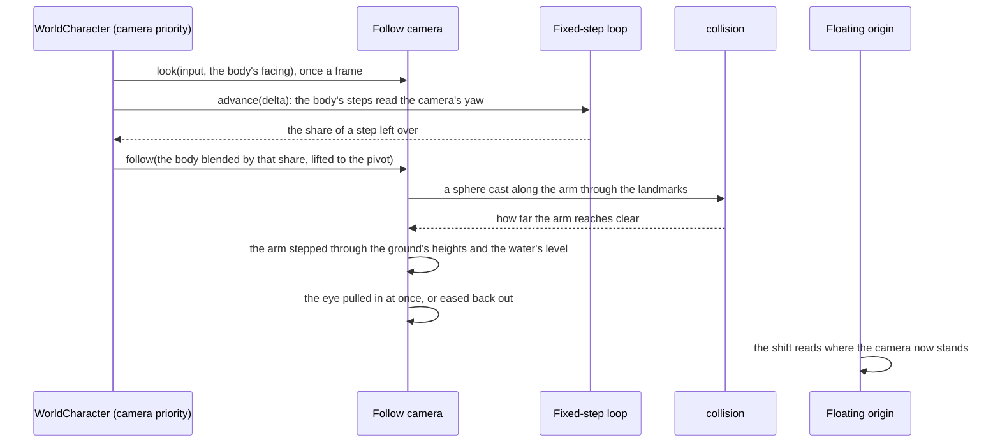

# Follow camera

In the game the camera stays behind the character and orbits a point above it. The player turns it freely and zooms it in and out, and the ground or a wall pulls it in toward the character rather than hiding the character behind them. The world's camera does the same: `genshin-engine`'s `createFollowCamera` orbits the [character controller](/docs/genshin/character-controller)'s body, and the world's `WorldCharacter` runs it.

## The orbit

- **A pivot above the body.** The eye stands on an arm out from a point above the body's feet, along the camera's yaw and pitch, and looks back along it at the pivot, so the camera's quaternion is its yaw and pitch alone.
- **The look turns it once a frame.** The pointer, while locked, and the right stick turn the yaw and tilt the pitch, clamped short of looking straight up or down. The wheel's notches zoom it within its nearest and furthest distance. The steps of that frame read the yaw it turned to, so a move stays relative to where the player is looking.
- **Reset puts it behind the body.** The middle mouse button or a pad's right stick press, the game's reset, swings it level behind the way the body faces at its default distance, as a jump from the [map](/docs/genshin/map) does on landing.
- **It follows the body between steps.** The body moves in fixed steps and the view once a frame, so the pivot is the body's place blended between its last two steps by how far the frame has come into the next, which the fixed-step loop gives as its share of a step left over. Without the blend a body stepping at a fixed rate stutters against the display's own rate.

## Pulled in

The arm is cleared each frame before the eye is placed. A sphere of the camera's clearance is cast from the pivot along the arm through the landmarks' octrees ([character controller](/docs/genshin/character-controller)), and the arm is then stepped through the terrain's own height function and the water's level, exact for a height field, until a step stands within the clearance of either. The eye stands at the shorter reach. It is pulled in at once, so nothing ever stands between it and the character, and eases back out at a steady pace once the way clears.

## The pointer and photo mode

A click on the world locks the pointer, as the game hides its cursor in play, and Left Alt lets it go to show the cursor, as the game's Show Cursor does; a lock let go that way does not open the Paimon menu, which a lock lost to `Escape` does ([screens](/docs/genshin/screens)). The next click takes the pointer again.

Photo mode, chosen from the Paimon menu, holds the body where it stands and keeps the follow camera on it as an orbit: the look turns the view round the body and the wheel zooms it, within the same range and pitch limits as the follow camera. That range is shared until the game's photo mode range is solved ([follow camera proposal](/docs/proposals/genshin/follow-camera)). The world's clock runs on as the game's does in photo mode. Leaving photo mode gives the view back to the follow camera where the orbit left it, the body still standing where it did. Under the tuning panel photo mode hands the view to the [free camera](/docs/genshin/free-camera) instead.

## The numbers

The pivot's height, the field of view, the pitch's limits, the default, nearest and furthest distances, a notch's zoom and the ease back out are provisional, in `packages/genshin-engine/src/camera/constants.ts`, until recordings of the game's camera in play solve them. The settings the game offers for this camera, its sensitivity, its default distance and its pitch following a slope, wait on the [menu screens](/docs/proposals/genshin/menu-screens)' Settings.

## Key files

| File                                                              | Its role                                                              |
| :---------------------------------------------------------------- | :-------------------------------------------------------------------- |
| `packages/genshin-engine/src/camera/createFollowCamera.ts`        | the orbit: look, zoom, reset, and the eye pulled in along the arm     |
| `packages/genshin-engine/src/camera/constants.ts`                 | the camera's provisional numbers                                      |
| `packages/genshin-engine/src/collision/createLandmarkCollider.ts` | the sphere cast along the arm                                         |
| `packages/genshin-engine/src/simulation/createFixedStepLoop.ts`   | how far into the next step a frame has come                           |
| `packages/genshin-world/src/components/World/Character/Index.vue` | runs the camera each frame on the blended body, and locks the pointer |
| `packages/genshin-world/src/components/World/Session/Index.vue`   | shows the cursor on Left Alt, and holds the orbit on in photo mode    |

## Sources

- [Settings](https://genshin-impact.fandom.com/wiki/Settings), Genshin Impact Wiki: the camera's sensitivity, its default distance from 4.5 to 6.0 restored after a zoom, combat or a teleport, and the pitch that follows slopes.
- [Controls](https://genshin-impact.fandom.com/wiki/Controls), Genshin Impact Wiki: the camera turned by the mouse and the right stick, its reset, and Show Cursor on Left Alt.
- [Photo Mode](https://genshin-impact.fandom.com/wiki/Photo_Mode), Genshin Impact Wiki: photo mode reached from the Paimon menu.
- [Time](https://genshin-impact.fandom.com/wiki/Time), Genshin Impact Wiki: the clock running in photo mode.
- [Fix your timestep!](https://gafferongames.com/post/fix_your_timestep/), Glenn Fiedler: the shown state as a blend of the two latest steps, weighted by what the accumulator has left over.
