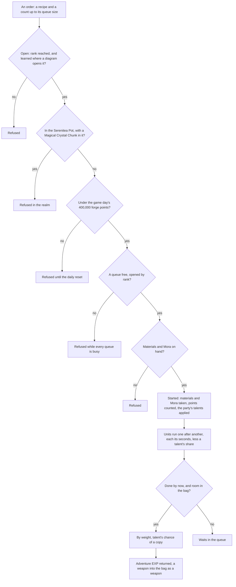

# Forging

The blacksmith's rules are over the game's own forge table: which recipes a player has open, how many queues they may run, what an order costs and when its units finish, what a unit yields, and how many forge points a game day may hold. This page is the build of the [forging](/docs/proposals/genshin/forging) proposal, covering its recipes, queues by rank, real-time orders, the daily cap, the weapons from billets, the drop-table Mystic, the forging talents and the Serenitea Pot's refusal. The blacksmith's place and screen stay in the proposal.

## How it works

## The recipes

`pnpm -C scripts genshin:assets forging` writes one slice, the blacksmith's recipes, from the game's forge table `ForgeExcelConfigData`, with each recipe's diagrams read off the material table's uses. Each recipe's results come from its own row, or for a row with no fixed result from the forge random table `ForgeRandomExcelConfigData`, which the writer reads alongside it. The repository's master matched the dump's combine table byte for byte, so the two share a revision.

- **Enhancement ores.** The Normal, Fine and Mystic Enhancement Ores, each with its ingredients, its Mora, its seconds per item, the most one queue holds and its forge points. Ten Normal Enhancement Ores take thirty seconds and fifty Mora.
- **The Mystic Enhancement Ore.** Three Magical Crystal Chunks and ten Original Resin, five seconds and one at a time, with no forge points, so it counts nothing toward the day's cap. Each unit yields one of two results at equal weight, six Mystic Enhancement Ores or one hundred Adventure EXP.
- **Four-star weapons.** The swords, claymores, polearms, catalysts and bows, each forged from its region's billet with ores, one unit at a time, each yielding its weapon. Each is open from the start or once its diagram is learned.
- **Left out.** The widget rows, the gadgets' own recipes, which the [gadgets](/docs/proposals/genshin/gadgets) proposal owns.

## The rules

- **Open.** Recipes open as the [crafting](/docs/genshin/crafting) page sets out. Using a diagram takes it from the bag and records the recipe as learned.
- **Queues by rank.** One queue opens at first, a second at rank five, a third at ten and a fourth at fifteen, as the forge update table holds them. Splitting one recipe across queues forges it in parallel: each queue holds one order, of up to the recipe's queue size.
- **Orders.** An order takes its materials and Mora when it is started, every unit's at once, and starts at once in a free queue. Original Resin is paid from the wallet as [crafting](/docs/genshin/crafting) pays it, so the Mystic's ten are never taken from the bag. Its units then run one after another, each taking its seconds. Finished units go to the bag as [cooking](/docs/genshin/cooking) describes, and a unit the bag has no room for waits in its queue. A queue whose order is fully collected is free again.
- **Results.** A unit's result is drawn by the weight each of its recipe's results holds. A recipe with one result always yields it. Adventure EXP is a virtual item, so the collection returns it rather than putting it in the bag. A weapon recipe's result is a weapon, which the bag takes as a weapon is granted elsewhere: one entry of its own at level 1, filed in the weapons tab, with no rank of its own since the tab sorts it by level and quality.
- **Real time, at any blacksmith.** A queue is kept with when its order began and the seconds each unit takes, so it finishes on time whether or not the forge is open, and the forge is one state: what is forged is collected at any blacksmith. The [save](/docs/genshin/save-data) does not hold the queues, so a reload empties them.
- **A daily cap.** An order's forge points count toward the game day's 400,000 when it is started, Normal, Fine and Mystic together. An order that would pass the cap is refused until the game day turns at four in the morning in the game's time zone, and the day's points restart with it. A weapon counts none.
- **Forging talents.** The characters in the party give the blacksmith their talents, for the forge type each names. Venti's and Bennett's apply to the enhancement ores, Diluc's, Zhongli's and Ganyu's to the claymore, polearm and bow:
  - **Reduce time.** Venti: an enhancement ore's unit takes a fifth less time. Read when the order starts.
  - **Extra result.** Bennett: each enhancement ore unit has a one-in-five chance to yield an extra copy of its result. Read when the unit is collected.
  - **Refund ore.** Diluc, Zhongli and Ganyu: each weapon of their type refunds fifteen per cent of the ores its units take, the ores being the forge's own, Normal to Mystic inputs. Refunded when the order starts, and a refund the bag has no room for is lost.
- **The Serenitea Pot's refusal.** In the Serenitea Pot's realm, a recipe that takes a Magical Crystal Chunk is refused, and it is forged anywhere else. The realm is not built, so the refusal waits on it.
- **Refusal words.** The three enhancement ores' refusals are the game's own lines, kept in `genshin-text` under one key for each ore, for the screen to show once it is built.

## Key files

| File                                                                              | Role                                                                  |
| :-------------------------------------------------------------------------------- | :-------------------------------------------------------------------- |
| `scripts/src/services/genshinAssets/forging/writeForgingRecipes.ts`               | The recipes slice written from the forge table and its random table   |
| `scripts/src/services/genshinAssets/forging/toForgeRecipe.ts`                     | One forge row as a recipe, or left out                                |
| `scripts/src/services/genshinAssets/forging/toForgeResults.ts`                    | A row's results: its fixed result, or the random table its drop names |
| `scripts/src/services/genshinAssets/forging/constants.ts`                         | The drop id that names each random table                              |
| `scripts/src/services/genshinAssets/items/readUnlockItemIdMap.ts`                 | Each recipe's diagrams, read off the material table's uses            |
| `scripts/src/services/genshinAssets/items/writeItems.ts`                          | The forge's and the drops' items written into the items slice         |
| `packages/genshin-world/src/models/forging/ForgeProgress.ts`                      | The learned recipes, the queues' orders and the day's forge points    |
| `packages/genshin-world/src/models/forging/ForgeResult.ts`                        | One result a unit yields, its count and its weight                    |
| `packages/genshin-world/src/models/forging/ForgeTalent.ts`                        | A forging talent: its kind, its forge type and its ratio              |
| `packages/genshin-world/src/services/forging/constants.ts`                        | The daily cap, the queue ranks, the talents by character              |
| `packages/genshin-world/src/services/forging/computeForgeTalents.ts`              | The talents the party's characters give                               |
| `packages/genshin-world/src/services/forging/startForge.ts`                       | An order started in a free queue, its materials, Mora and talents     |
| `packages/genshin-world/src/services/forging/refundForgeOres.ts`                  | The ores a weapon's refund talent gives back into the bag             |
| `packages/genshin-world/src/services/forging/collectForgeOrder.ts`                | Each finished unit's result taken in, the rest waiting                |
| `packages/genshin-world/src/services/forging/drawForgeResult.ts`                  | One unit's result drawn by weight                                     |
| `packages/genshin-world/src/services/forging/checkIsForgeRecipeRefusedInRealm.ts` | Whether the Serenitea Pot refuses a recipe                            |
| `packages/genshin-world/src/services/forging/checkIsForgeDailyCapReached.ts`      | Whether an order would pass the game day's forge points               |
| `packages/genshin-world/src/services/forging/computeForgeQueueCount.ts`           | The queues an Adventure Rank opens                                    |
| `packages/genshin-world/src/services/forging/learnForgeRecipe.ts`                 | A recipe learned from a diagram in the bag                            |
| `packages/genshin-world/src/generated/forging/recipes.json`                       | The blacksmith's recipes, a few dozen of them                         |
| `packages/genshin-world/src/services/inventory/constants.ts`                      | The wallet's item ids, each currency's among them                     |
| `packages/genshin-text/src/models/GameTextKey.ts`                                 | The enhancement ores' refusal words                                   |

## Notes

- **The blacksmith's place is not on the map.** The official map has no blacksmith label, so the forge's place is the Mondstadt scene's own NPC rather than a spawned place. It waits on the region's placements and on the screen. Every blacksmith is one forge, so the rules need no place.
- **The screen is not built.** Nothing shows the forge yet, and the refusal words wait under their keys for it.
- **The cap's moment is read, not seen.** The cap counts an order's points when the order is started, and a refused order spends nothing. Whether the game counts a queued order at its start or as its units are collected is a recording owed on the roadmap.
- **The talents' parameters are read as the game's own.** Each talent's table row holds a first parameter, a second and a third. The first is the forge type a talent applies to, one for the enhancement ores and the weapon's type for the refund talents, read off the same field as the claymore, polearm and bow types (5, 7 and 4). The second is the chance in ten thousandths for the extra result, two thousand, and the ratio for the others. A refund's chance of ten thousand is certain, so it is applied each time.
- **The Mystic's drop id names no table in the dump.** The row's drop id, 208001500, is in neither the dump nor the repository's other tables, so the writer maps it to the forge random table whose Mystic Enhancement Ore count is the row's own, six, which is the table 20001. The split between the two results is the table's weights. A game check of that split is not owed; it is read off the table.
- **The Adventure EXP outcome is returned, not granted.** The collection returns the EXP a unit yields, and the Adventure Rank that takes it is not called yet.
- **The forge's items are in the items slice.** The bag takes a material result by its item definition, so `pnpm -C scripts genshin:assets items` writes every item a recipe takes or yields, the enhancement ores, the Mystic ore, the Magical Crystal Chunk and the weapons' billets and ores among them, into the items slice beside the drop and expedition items. A weapon is no item: it is in the weapon table and reaches the bag as a weapon, which the save reads back from that table as it loads, so a forged weapon is still a weapon after a reload ([inventory](/docs/genshin/inventory)).
- **Names of the forge's items are the name-text chunks'.** The sixteen billets and ores the weapons need name their text ids, which the game text has no key for, so `genshin:text names` writes them into the name-text chunks like the other names the world cites. A weapon's name is the same chunk's, read by its weapon's text id, and the bag reads a material's name the same way, so every item of the forge is named by its text id.
- **The wallet's currencies are no items.** Mora, Primogems, the Genesis Crystal, the Fates and Stardust, Masterless Stella Fortuna and Original Resin are held by the wallet, and Adventure EXP is returned by the collection. The items writer leaves each of their ids out, so a result or a drop naming one is a wallet grant.
- **The enhancement ores are materials of their own type.** Their table type is the weapon exp stone, which the bag files among its Materials.

## Sources

- [AnimeGameData](https://github.com/DimbreathBot/AnimeGameData), the community's per-patch dump: `ForgeExcelConfigData` for the recipes and their forge points, "ForgeUpdateExcelConfigData" for the queues by rank, `ForgeRandomExcelConfigData` for each drop's random table, and `MaterialExcelConfigData`, whose `ITEM_USE_UNLOCK_FORGE` uses name the recipes each diagram opens.
- `ProudSkillExcelConfigData` for the five forging talents' effects, and `AvatarSkillDepotExcelConfigData` for the depot each character's talent is in: Venti's and Bennett's in the talents list, Diluc's, Zhongli's and Ganyu's in the inherent proud skill list.
- The English text map in the dump, by the three forge refusal lines' text ids, which name the day's cap and its reset.
- [Forging](https://genshin-impact.fandom.com/wiki/Forging), Genshin Impact Wiki: the cap and the reset. That page was unreachable from this build, so its claims wait on a source.
