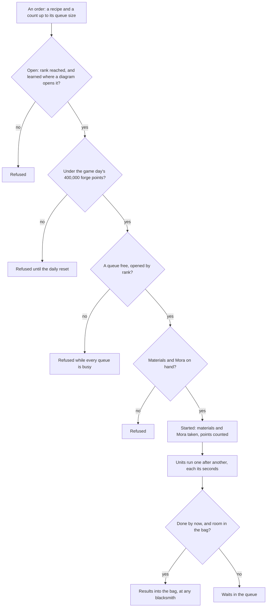

# Forging

The blacksmith's rules are over the game's own forge table: which recipes a player has open, how many queues they may run, what an order costs and when its units finish, and how many forge points a game day may hold. This page is the first build of the [forging](/docs/proposals/genshin/forging) proposal, covering its recipes, queues by rank, real-time orders, the daily cap, and weapons from billets with their diagrams. The blacksmith's place and screen, the forging talents, the Serenitea Pot's refusal and the one recipe a drop table draws stay in the proposal.

## How it works

## The recipes

`pnpm -C scripts genshin:assets forging` writes one slice, the blacksmith's recipes, from the game's forge table `ForgeExcelConfigData`, with each recipe's diagrams read off the material table's uses. The forge table is not in the community dump the scripts read, so it is fetched from the AnimeGameData repository into the dump and never committed. The repository's master matched the dump's combine table byte for byte, so the two share a revision.

- **Enhancement ores.** The Normal, Fine and Mystic Enhancement Ores, each with its ingredients, its Mora, its seconds per item, the most one queue holds and its forge points. Ten Normal Enhancement Ores take thirty seconds and fifty Mora.
- **Four-star weapons.** The swords, claymores, polearms, catalysts and bows, each forged from its region's billet with ores, one unit at a time. Each is open from the start or once its diagram is learned.
- **Left out.** The widget rows, the gadgets' own recipes, which the [gadgets](/docs/proposals/genshin/gadgets) proposal owns. Also a result a drop table draws, the Mystic Enhancement Ore from Magical Crystal Chunks and Original Resin, whose forge points are zero in the table, so it would count nothing either way.

## The rules

- **Open.** A recipe is offered once the player's Adventure Rank reaches its rank, and, for a recipe a diagram opens, once it is learned. Using a diagram takes it from the bag and records the recipe as learned.
- **Queues by rank.** One queue opens at first, a second at rank five, a third at ten and a fourth at fifteen, as the forge update table holds them. Splitting one recipe across queues forges it in parallel: each queue holds one order, of up to the recipe's queue size.
- **Orders.** An order takes its materials and Mora when it is started, every unit's at once, and starts at once in a free queue. Its units then run one after another, each taking its seconds. The units done by a moment are taken into the bag together, and a unit whose results the bag has no room for waits in its queue. A queue whose order is fully collected is free again.
- **Real time, at any blacksmith.** A queue is kept with when its order began, so it finishes while the page is closed, and the forge is one state: what is forged is collected at any blacksmith.
- **A daily cap.** An order's forge points count toward the game day's 400,000 when it is started, Normal, Fine and Mystic together. An order that would pass the cap is refused until the game day turns at four in the morning in the game's time zone, and the day's points restart with it. A weapon counts none.
- **Refusal words.** The three enhancement ores' refusals are the game's own lines, kept in `genshin-text` under one key for each ore, for the screen to show once it is built.

## Key files

| File                                                                         | Role                                                               |
| :--------------------------------------------------------------------------- | :----------------------------------------------------------------- |
| `scripts/src/services/genshinAssets/forging/writeForgingRecipes.ts`          | The recipes slice written from the forge table                     |
| `scripts/src/services/genshinAssets/forging/toForgeRecipe.ts`                | One forge row as a recipe, or left out                             |
| `scripts/src/services/genshinAssets/items/readUnlockItemIdMap.ts`            | Each recipe's diagrams, read off the material table's uses         |
| `packages/genshin-world/src/models/forging/ForgeProgress.ts`                 | The learned recipes, the queues' orders and the day's forge points |
| `packages/genshin-world/src/services/forging/startForge.ts`                  | An order started in a free queue, its materials and Mora taken     |
| `packages/genshin-world/src/services/forging/collectForgeOrder.ts`           | The units done by a moment taken into the bag, the rest queued     |
| `packages/genshin-world/src/services/forging/checkIsForgeDailyCapReached.ts` | Whether an order would pass the game day's forge points            |
| `packages/genshin-world/src/services/forging/computeForgeQueueCount.ts`      | The queues an Adventure Rank opens                                 |
| `packages/genshin-world/src/services/forging/learnForgeRecipe.ts`            | A recipe learned from a diagram in the bag                         |
| `packages/genshin-world/src/generated/forging/recipes.json`                  | The blacksmith's recipes, a few dozen of them                      |
| `packages/genshin-text/src/models/GameTextKey.ts`                            | The three enhancement ores' refusal words                          |

## Notes

- **The blacksmith's place is not on the map.** The official map has no blacksmith label, so the forge's place is the Mondstadt scene's own NPC rather than a spawned place. It waits on the region's placements and on the screen. Every blacksmith is one forge, so the rules need no place.
- **The screen is not built.** Nothing shows the forge yet, and the refusal words wait under their keys for it.
- **The cap's moment is read, not seen.** The cap counts an order's points when the order is started, and a refused order spends nothing. Whether the game counts a queued order at its start or as its units are collected is a recording owed on the roadmap.
- **Forging talents are not built.** The wiki's forging page was not reachable from this build, so the list of which characters' talents give a bonus, and how much, has no source yet.
- **The Serenitea Pot's refusal is not built.** The pot refuses Magical Crystal Chunks, but the one recipe that takes them is the drop-table Mystic left out above, so the rule has no recipe to refuse until that table is read ([Serenitea Pot](/docs/proposals/genshin/serenitea-pot)).
- **Nothing here is a measured constant.** The queue ranks, the cap and the reset hour are the game's own, read from the table or the wiki's stated rule, so no provisional constant or compute-queue item is owed.

## Sources

- [AnimeGameData](https://github.com/DimbreathBot/AnimeGameData), the community's per-patch dump: `ForgeExcelConfigData` for the recipes and their forge points, `ForgeUpdateExcelConfigData` for the queues by rank, and `MaterialExcelConfigData`, whose `ITEM_USE_UNLOCK_FORGE` uses name the recipes each diagram opens.
- The English text map in the dump, by the three forge refusal lines' text ids, which name the day's cap and its reset.
- [Forging](https://genshin-impact.fandom.com/wiki/Forging), Genshin Impact Wiki: the cap, the reset and the talents. The page was not reachable from this build, so the claims it would back wait on a source.
