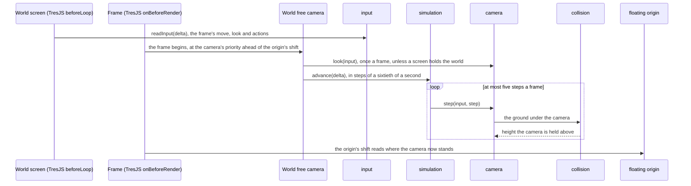

# Free camera

Photo mode's camera today is the free camera, the developer's flight: the player flies it over Windrise and beyond, while the character holds where it stood. Photo mode is proposed to orbit the character within the game's range instead, and the free camera then stays as a developer tool behind the tuning panel ([follow camera](/docs/proposals/genshin/follow-camera)). In play the [follow camera](/docs/genshin/follow-camera) stands behind the [character](/docs/genshin/character-controller); choosing photo mode from the Paimon menu mounts the free camera, which flies from wherever the follow camera left the view, and leaving it unmounts it again. The camera is built from three engine modules, `input`, `simulation` and `camera`, and reads the ground through `collision`, all in `genshin-engine` and knowing no place by name. The world screen wires them to its own origin and its own height function.

The order is the reason for the priority. The floating origin reads the camera to decide whether to shift the world back under it, and the terrain and grass read the camera for their tiles, so both must see where it has been moved to. The free camera registers its frame callback at `CAMERA_FRAME_PRIORITY`, ahead of TresJS's default the origin runs at, so it runs first though it mounts after the scene.

## The controls

- **Keyboard**: `W` and `S` move forward and back over the ground, `A` and `D` move left and right, `Space` rises and `Shift` falls. A pair held against each other cancels.
- **Mouse**: a click on the canvas locks the pointer, and while it is locked the pointer turns the look.
- **Gamepad**: the first connected gamepad's left stick moves over the ground, and its right stick turns the look at a rate of 2.5 radians a second. Both have a deadzone at the stick's centre.
- **Touch**: on a touch screen, a stick under the left thumb moves, a drag on the right half looks and a button rises, through the same input ([touch controls](/docs/genshin/touch-controls)).

The camera's motion is per second, so a key held for the same time moves it the same distance at any frame rate. The look is not: the mouse turns it by a fixed angle for each pixel the pointer moves, and only the gamepad's right stick turns it per second. The world screen reads the input once a frame, ahead of every frame callback, and hands the camera the state it read: its look turns the camera once, before the frame's steps, and the steps of that frame all use its move, so no pointer movement is lost or repeated at any frame rate. While a screen holds the world ([screens](/docs/genshin/screens)), the camera neither looks nor steps. Losing focus clears the keys held, since their releases never reach the page. The input's listeners and the canvas's click are released when the component holding them unmounts, so a remount does not stack them.

## The motion

A move goes along the view on the ground, and straight up or down. Its speed grows with the camera's height above the ground, so a crossing takes seconds and a slow pass over grass stays slow; the speed's base and its growth live in `packages/genshin-engine/src/camera/constants.ts`. The look turns the yaw and tilts the pitch, which is clamped short of straight up or down so the view never flips.

The camera is never held under the ground or the water's surface: after each step its height is raised to the higher of the ground's height at its place and the water's level, plus a clearance, which the same constants file holds.

## The ground

`collision` answers the ground's height and normal at a point from the height function the terrain is built from. The world screen passes it `getWorldHeight` read at the scene's origin plus the camera's own place, on the main thread, so the answer is the one the terrain draws, never a read back from a worker's tile. The normal is read from the same function's slopes across a tenth of a metre. The sample object is reused by every query, so a frame reads the ground allocating nothing.

## Key files

| File                                                               | Its role                                                                                    |
| :----------------------------------------------------------------- | :------------------------------------------------------------------------------------------ |
| `packages/genshin-engine/src/input/createInput.ts`                 | keys, locked pointer and the gamepad's sticks, read once a frame; a blur releases every key |
| `packages/genshin-engine/src/simulation/createFixedStepLoop.ts`    | runs whole steps from an accumulator, at most five a frame                                  |
| `packages/genshin-engine/src/camera/createFreeCamera.ts`           | the flight: look, move by height, and the clamp above the ground                            |
| `packages/genshin-engine/src/collision/createGroundQuery.ts`       | the ground's height and normal at a point, and the water's level                            |
| `packages/genshin-world/src/components/World/FreeCamera/Index.vue` | the world's wiring: the loop run before the origin's shift, on the scene's ground           |
| `packages/genshin-world/src/components/World/Screen/Index.vue`     | reads the input once a frame, owns the origin and mounts the camera in photo mode           |
| `packages/genshin-world/src/services/constants.ts`                 | the fixed step's length, and the priority a camera runs at                                  |

## Notes

- **Photo mode flies anywhere for now.** The game's photo mode keeps its camera within a range of the character, and this one does not until the orbit within that range is built, as the [follow camera](/docs/proposals/genshin/follow-camera)'s proposal sets out.

## Sources

- [Fix your timestep!](https://gafferongames.com/post/fix_your_timestep/), Glenn Fiedler: simulation in fixed steps from an accumulator, which the simulation module follows.
