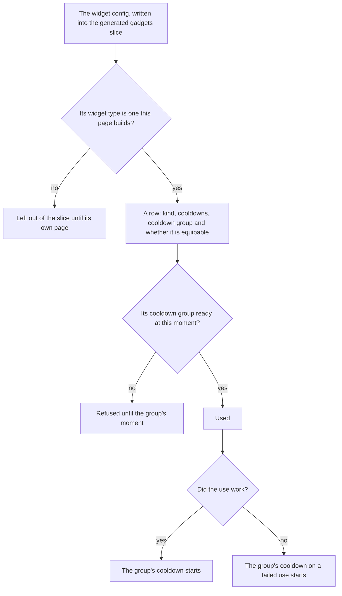

# Gadgets

The game's tools are the widget config's entries: the Wind Catcher, the Treasure Compasses, the gather point finders and the devices, each a kind with its own cooldowns. This page is the first part of the [gadgets](/docs/proposals/genshin/gadgets) proposal, its data and its cooldowns. `Z` is already bound to the quick-use gadget ([controls](/docs/genshin/controls)), but nothing is equipped to it and nothing is used yet: the bag's items do not yet include the widget material type, so a gadget has no item to equip.

## How it works

## The kinds

The config's widget type is the game's own kind, and a gadget is built as one of four kinds. Each kind is one widget type or a few that act alike.

| Kind              | Widget types                                                    | What the config spawns                                                       |
| :---------------- | :-------------------------------------------------------------- | :--------------------------------------------------------------------------- |
| Collector         | `ConfigWidgetClientCollector`                                   | a wind field that absorbs wind seeds                                         |
| Detector          | `ConfigWidgetClientDetector`, `ConfigWidgetTreasureMapDetector` | the treasure boxes of Mondstadt, Liyue and Dragonspine, and a Seelie crystal |
| GatherPointFinder | `ConfigWidgetOneoffGatherPointDetector`                         | the success and failure crystals of its gather point types                   |
| Device            | `ConfigWidgetGadgetBuilder`, `ConfigWidgetMiracleRing`          | a Seelie, a balloon widget and a miracle ring                                |

The rest of the config's widgets, the cameras, the avatar attachments, the water sprite, the ability groups and the toys, are not among the four kinds and are left out of the slice until a page names them. The camera widgets wait on the [free camera](/docs/genshin/free-camera) page.

## Cooldowns

- **Each cooldown is a whole number of seconds from the config.** A gadget's cooldown is its `coolDown`, and its cooldown on a failed use its `coolDownOnFail`. A field the config omits reads as zero, so a collector has no cooldown on a failed use.
- **A group is shared.** A gadget with a cooldown group shares its cooldown with every gadget of that group, and a gadget with none shares with no other, so it is kept under its own id. The game's groups are small numbers and the ids are not, so the two never meet.
- **A cooldown is read, not ticked.** The group is kept as the moment it is ready again, and a gadget is ready once `now` has reached it. A pause changes nothing in it, so a cooldown started before a menu runs on while the menu is open, as the game's do.

## Key files

| File                                                                  | Role                                                               |
| :-------------------------------------------------------------------- | :----------------------------------------------------------------- |
| `packages/genshin-world/src/models/gadget/GadgetKind.ts`              | The four kinds the widget types are built as                       |
| `packages/genshin-world/src/models/gadget/GadgetRow.ts`               | A gadget's row, checked against its schema as the slice is read    |
| `packages/genshin-world/src/models/gadget/CooldownGroupReadyAtMap.ts` | The moment each cooldown group is ready again                      |
| `packages/genshin-world/src/services/gadget/checkIsGadgetReady.ts`    | Whether a gadget's group is ready at a moment                      |
| `packages/genshin-world/src/services/gadget/startGadgetCooldown.ts`   | Starts a group's cooldown after a use that works or one that fails |
| `packages/genshin-world/src/services/gadget/getCooldownGroup.ts`      | A gadget's group, its own id when the config gives none            |
| `packages/genshin-world/src/services/gadget/readGadgetRows.ts`        | Reads the slice on demand                                          |
| `packages/genshin-world/src/generated/gadgets/gadgets.json`           | The slice of the gadgets the config builds                         |
| `scripts/src/services/genshinAssets/gadgets/toGadgetRows.ts`          | Each config widget of a built type as a row                        |
| `scripts/src/services/genshinAssets/gadgets/writeGadgetRows.ts`       | Writes the slice from the widget config                            |
| `scripts/src/services/genshinAssets/commands/gadgetsCommand.ts`       | `genshin:assets gadgets`                                           |

## Sources

- [AnimeGameData](https://github.com/DimbreathBot/AnimeGameData), the community's per-patch dump: `BinOutput/Widget/ConfigWidget.json`, the widget config with each widget's type, cooldowns and cooldown group, and `ExcelBinOutput/GadgetExcelConfigData.json`, which names each spawned gadget. Both are read from the dump outside the repository and nothing from them is committed.
- [Gadget](https://genshin-impact.fandom.com/wiki/Gadget), Genshin Impact Wiki: the gadgets as the bag's tab, and the cooldowns that run while the world is paused.
