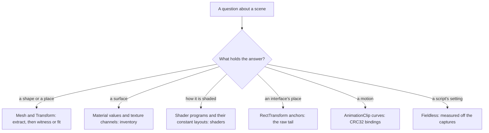
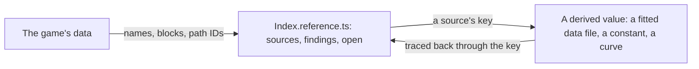

# Game data formats

The game's files are references, read locally and never shipped ([derived assets](/docs/genshin/derived-assets)). This page is what each kind of data holds and how it is read, as decoded while deriving the login scene. Every entry names the tool that reads it, so a later session reads the data rather than rediscovering the format. What each component's data is, block by block, is its reference, beside it (below).

## Which kind of data answers what

## Formats

### Shaders

- **Each variant's program is a plain DXBC container** inside the shader's raw export (`--types Shader --export_type Raw`), found by its magic and its own stated size (`readDxbcPrograms`). Windows' `d3dcompiler_47` disassembles it (`disassembleDxbcDirectory`). Every variant is also compiled for DirectX 12 as DXIL, which that disassembler cannot read; its DirectX 11 twin says the same.
- **A shader is exported nameless**, as `Shader #<path ID>` in the asset map. The property names it declares lead its raw export and tell it apart (`readShaderPropertyNames`).
- **A constant buffer's layout is a run of records beside the programs.** A record is its name's length, its name padded to four bytes, then six 32-bit fields: an index, its rows, its columns, a flag, its array length, and last its byte offset. The offset comes last: read as the field before the name, it puts two parameters in one register. Every variant carries its own layout, listing only the parameters it reads, so a program is matched to the layout whose parameters share no byte, name every register it reads and end within the buffer it declares (`readShaderConstantLayouts`, `annotateProgramConstants`). A name's length is read from its own field, since a name ending on a four-byte boundary runs into the next field's bytes when one of them is a word character.
- **Some shaders do not parse in AnimeStudio**, among them the login stone's. Their raw export is refused too, so their programs cannot be read; their material's property names still say what they compute.

### Materials and textures

- **A material's export is its shader's path ID, its texture slots by path ID and its floats and colours by name** (`readMaterialValues`). A texture slot's path ID names its texture through the asset index.
- **The environment's mask texture is `SMBE`:** smoothness in red, metalness in green, blue empty, emission in alpha where the material enables it. The diffuse is albedo and nearly neutral, so a surface's warmth is its light.
- **Grading tables are textures** (`Stages_*_LUT`), but which one a scene uses is set in its post-processing profile, which is fieldless.

### Placements and renderers

- **A Transform's dump is its local position, rotation and scale with its father and children by path ID**; its GameObject is found through the GameObject's first component. How placements compose, and what the dumps lose, is on the [derived assets](/docs/genshin/derived-assets) page.
- **A MeshRenderer names its materials by path ID**, references into other files with no name, one a submesh; an OBJ export writes each submesh as a group suffixed with its index.
- **A root's own parent can sit in a block not read.** Such a root is dumped at the origin though the game places it elsewhere, as the login's walkway is: its true place is solved from something it must meet (the door it ends at), never assumed.

### Interface

- **A `RectTransform` exports with its `Transform` fields alone**, but its raw export's last 40 bytes are its anchor minimum, anchor maximum, anchored position, size and pivot, two floats each, and its raw and JSON files share their numbering, so the two join into a full layout record.
- **The interface's canvas is 1600 by 900**, drawn 1.2 times at 1080 high: the server bar's top sits 128 plus half its 64 units up, which at 1.2 is the 192 pixels measured on the 1080 high recording.
- **A layout group's children read zero**, since the group, a script, places them at run time; their spacing is measured off the recordings, and their anchoring is still their parent's.

### Animation clips

- **A Mecanim clip keeps its curves in three parts**, streamed, dense and constant, numbered in that order across the clip's bindings, a Transform's position, rotation or scale taking one curve a component.
- **A streamed clip is a run of frames**, each a float time and a key count, then per key a curve index and four cubic coefficients, a segment's value `((a·t + b)·t + c)·t + d` in the time since its key. The first frame's time is the lowest float and the last's infinity.
- **A binding names its object and its property by CRC32**: its path is the hash of the object's path under the animator, and its attribute the hash of the property's name. `m_Alpha` (a CanvasGroup's), `m_IsActive`, `m_Color.a`, `m_AnchoredPosition.x`, `m_SizeDelta.x` and `m_SizeDelta.y` are the interface's; a Transform's are 1 for position, 2 rotation, 3 scale and 4 its Euler angles.

### Scripts

- **A MonoBehaviour exports without its fields**, since the blocks carry no type data: the login scene's "EnviroSky", "LoginSceneEnviro", "MonoLoginScene" and its post-processing profile among them. What they hold is measured off the captures, over what the other data gives exactly.

## References beside each component

Every component derived from the game's data, in `genshin-ui` or `genshin-world`, has an `Index.reference.ts` beside its `Index.vue`, as it has its fixture and its browser tests: a `ComponentReference` (`genshin-ui`'s model) of every piece of the game's data it is derived from, every search run over it with what it found, and what is still open. It is metadata only, the game's names, blocks, path IDs and what each is for, never a value, a vertex or a pixel.

- **Every derivation cites its source.** A derived value names the key of the source it is taken from, in its data file or beside its constant, so any value traces back to the piece of the game's data it came from and that piece can be opened again.
- **A search's result is recorded where it was run**, dead ends included, in the component's findings, so no session runs it twice.
- **What is still unknown is its open list**, which the next session starts from.

## Shortcuts

The things that each cost a search to find, to reach for first:

- **Find a scene's parts by what its renderers draw**, not by name, then add the exact names to its component's pattern ([derived assets](/docs/genshin/derived-assets), "Finding what a scene draws").
- **Find a screen's interface by its buttons' names**: GameObjects are not in the asset index, so a block is found through an indexed asset beside them (a clip such as `Ani_LoginMainPage_*`), then its RectTransforms and GameObjects are dumped.
- **Look for an exact source before measuring**: a shader's program over a guessed model, a clip's curve over a timed recording, a RectTransform's anchor over a measured position. Measure only what is fieldless.
- **Match a camera on the towers' sides, never on all edges**: a reference's clouds are most of its edges ([parity](/docs/genshin/parity), `solve-camera`).
- **Suspect an arrangement before a camera**: when no pose fits, a root dumped at the origin is the first cause.
- **Keep a long solve's page apart**: a second checkout's parity page (`GENSHIN_PARITY_PORT`) takes edits while the first holds a solve.

## Key files

| File                                                              | Role                                                      |
| :---------------------------------------------------------------- | :-------------------------------------------------------- |
| `scripts/src/services/genshinAssets/readDxbcPrograms.ts`          | A shader's compiled programs carved out of its raw export |
| `scripts/src/services/genshinAssets/readShaderConstantLayouts.ts` | A shader's constant buffer layouts                        |
| `scripts/src/services/genshinAssets/annotateProgramConstants.ts`  | A program headed by what its registers hold               |
| `scripts/src/services/genshinAssets/readMaterialValues.ts`        | A material's values, textures and shader                  |
| `scripts/src/services/genshinAssets/readSceneLayout.ts`           | Transforms, meshes and the materials each renderer draws  |
| `scripts/src/services/genshinAssets/writeComponentInventory.ts`   | Everything a component's export holds, as a report        |
