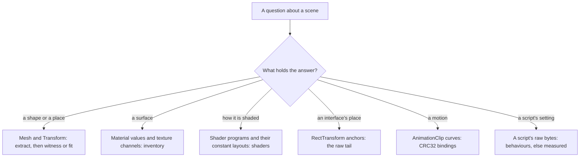
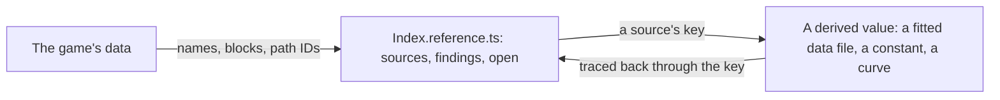

# Game data formats

The game's files are references, read locally and never shipped ([derived assets](/docs/genshin/derived-assets)). This page is what each kind of data holds and how it is read, as decoded while deriving the login scene. Every entry names the tool that reads it, so a later session reads the data rather than rediscovering the format. What each component's data is, block by block, is its reference, beside it (below).

## Which kind of data answers what

## Formats

### Shaders

- **Each variant's program is a plain DXBC container** inside the shader's raw export (`--types Shader:Export --export_type Raw`), found by its magic and its own stated size (`readDxbcPrograms`). Windows' `d3dcompiler_47` disassembles it (`disassembleDxbcDirectory`). Every variant is also compiled for DirectX 12 as DXIL, which that disassembler cannot read; its DirectX 11 twin says the same.
- **A shader is exported nameless**, as `Shader #<path ID>` in the asset map. The property names it declares lead its raw export and tell it apart (`readShaderPropertyNames`), and its own name (`Hidden/Internal-DeferredShading`, `miHoYo/Scene/Login Base`) is a string of the same export, which names it without the parser.
- **A constant buffer's layout is a run of records beside the programs.** A record is its name's length, its name padded to four bytes, then six 32-bit fields: an index, its rows, its columns, a flag, its array length, and last its byte offset. The offset comes last: read as the field before the name, it puts two parameters in one register. Every variant carries its own layout, listing only the parameters it reads, so a program is matched to the layout whose parameters share no byte, name every register it reads and end within the buffer it declares (`readShaderConstantLayouts`, `annotateProgramConstants`). A name's length is read from its own field, since a name ending on a four-byte boundary runs into the next field's bytes when one of them is a word character.
- **Some shaders do not parse in AnimeStudio**, among them the login stone's (`miHoYo/Scene/Login Base`) and the cloud layer's. A type filter with no suffix parses every object before exporting it, and drops one it refuses even from a raw export; the `:Export` suffix writes the objects' bytes unparsed, and their programs read like any other's.
- **A scene's stone shader writes the G-buffer and lights nothing.** Its light is the deferred pass's, `Hidden/Internal-DeferredShading` in the block `DEFERRED_SHADING_BLOCK` names, which `shaders` reads beside every component's own; a material value is only right once the pass that reads its G-buffer channel is.

### Materials and textures

- **A material's export is its shader's path ID, its texture slots by path ID and its floats and colours by name** (`readMaterialValues`). A texture slot's path ID names its texture through the asset index.
- **The environment's mask texture is `SMBE`:** smoothness in red, metalness in green, blue empty, emission in alpha where the material enables it. The diffuse is albedo and nearly neutral, so a surface's warmth is its light.
- **Grading tables are textures** (`Stages_*_LUT`), but which one a scene uses is set in its post-processing profile, which is fieldless.

### Placements and renderers

- **A Transform's dump is its local position, rotation and scale with its father and children by path ID**; its GameObject is found through the GameObject's first component. How placements compose, and what the dumps lose, is on the [derived assets](/docs/genshin/derived-assets) page.
- **A MeshRenderer names its materials by file index and path ID**, references into other files with no name, one a submesh, resolved through the CAB map; an OBJ export writes each submesh as a group suffixed with its index.
- **A root's own parent can sit in a block not read.** Such a root is dumped at the origin though the game places it elsewhere, as the login's walkway is: its true place is solved from something it must meet (the door it ends at), never assumed.

### Interface

- **A `RectTransform` exports with its `Transform` fields alone**, but its raw export's last 40 bytes are its anchor minimum, anchor maximum, anchored position, size and pivot, two floats each, and its raw and JSON files share their numbering, so the two join into a full layout record.
- **The interface's canvas is 1600 by 900**, drawn 1.2 times at 1080 high: the server bar's top sits 128 plus half its 64 units up, which at 1.2 is the 192 pixels measured on the 1080 high recording.
- **A layout group's children read zero**, since the group, a script, places them at run time; their spacing is measured off the recordings, and their anchoring is still their parent's.

### Animation clips

- **A Mecanim clip keeps its curves in three parts**, streamed, dense and constant, numbered in that order across the clip's bindings, a Transform's position, rotation or scale taking one curve a component.
- **A streamed clip is a run of frames**, each a float time and a key count, then per key a curve index and four cubic coefficients, a segment's value `((a·t + b)·t + c)·t + d` in the time since its key. The first frame's time is the lowest float and the last's infinity.
- **A binding names its object and its property by CRC32**: its path is the hash of the object's path under the animator, and its attribute the hash of the property's name. `m_Alpha` (a CanvasGroup's), `m_IsActive`, `m_Color.a`, `m_AnchoredPosition.x`, `m_SizeDelta.x` and `m_SizeDelta.y` are the interface's; a Transform's are 1 for position, 2 rotation, 3 scale and 4 its Euler angles.

### Scripts

- **A MonoBehaviour's JSON export has no fields**, since the blocks carry no type data: the login scene's "EnviroSky", "LoginSceneEnviro", "MonoLoginScene" and its post-processing profile among them. Its raw export keeps them, serialized in declaration order and aligned to four bytes, after a header of its game object's pointer, its enabled flag, its script's pointer and its name (`scanSerializedFields`).
- **A field is read by its shape**: a pointer is a file index and a 64-bit path ID that the layout or the asset index holds in the file it resolves to; a curve is a count, keyframes of seven words (time, value, two slopes, a weighted mode, two weights) and three wrap words; a gradient is eight colours, eight colour and eight alpha times as sixteen-bit shares, a mode and the counts in use; an array is a count and that many records of one of those shapes; a colour is four floats in a colour's range; anything else is a scalar. A reading is a candidate until a scene's use of it is checked on the captures, and a test on its offset then holds it. What no shape names is measured off the captures, over what the other data gives exactly.

### Text

- **The client's text is hash-named "MiHoYoBinData"**, most of it in one block, in a binary layout the community decodes afresh each patch. So the repository reads the decoded dump the community publishes per patch — text maps from hash to string per language, and the tables naming which hash an interface string or a voice-over line is — rather than the blocks ([game text](/docs/genshin/game-text)).
- **The welcome is the account kit's.** The welcome card's greeting comes from HoYoverse's account kit, whose string tables sit in its own bundle beside the game (`MiHoYoSDKRes`) rather than in the dump ([game text](/docs/genshin/game-text)); everything else the opening says, the health notice, the login status lines and the door's prompt among it, is in the text map.

## References beside each component

Every component derived from the game's data, in `genshin-interface` or `genshin-world`, has an `Index.reference.ts` beside its `Index.vue`, as it has its fixture and its browser tests: a `ComponentReference` (`genshin-interface`'s model) of every piece of the game's data it is derived from, every search run over it with what it found, and what is still open. It is metadata only, the game's names, blocks, path IDs and what each is for, never a value, a vertex or a pixel.

- **Every derivation cites its source.** A derived value names the key of the source it is taken from, in its data file or beside its constant, so any value traces back to the piece of the game's data it came from and that piece can be opened again.
- **A search's result is recorded where it was run**, dead ends included, in the component's findings, so no session runs it twice.
- **What is still unknown is its open list**, which the next session starts from.

## Shortcuts

The things that each cost a search to find, to reach for first:

- **Find a scene's parts from its roots**, never by name: `extract` follows every pointer they reach by file and path ID, and a name pattern holds only what no pointer reaches ([derived assets](/docs/genshin/derived-assets), "Following a scene's pointers").
- **Find a screen's interface by its buttons' names**: GameObjects are not in the asset index, so a block is found through an indexed asset beside them (a clip such as `Ani_LoginMainPage_*`), then its RectTransforms and GameObjects are dumped.
- **Export raw objects unparsed** (`<Type>:Export`, `ANIMESTUDIO_UNPARSED_SUFFIX`): a raw export needs none of the parser's fields, and the parser refuses objects the game reads, so an object missing from a raw export is a parse failure in AnimeStudio's log, never an object the block lacks.
- **Look for an exact source before measuring**: a shader's program over a guessed model, a clip's curve over a timed recording, a RectTransform's anchor over a measured position. Measure only what is fieldless.
- **Solve a camera from landmarks, then refine it on its families' silhouettes, never on all edges**: a reference's clouds are most of its edges, and the part target draws none ([parity](/docs/genshin/parity), `pose`).
- **Suspect an arrangement before a camera**: when no pose fits, a root dumped at the origin is the first cause.
- **Keep a long solve's page apart**: a second checkout's parity page (`GENSHIN_PARITY_PORT`) takes edits while the first holds a solve.

### Audio

- **The audio is Audiokinetic Wwise's, in packages.** `AudioAssets` holds Wwise packages (`.pck`, an `AKPK` header stating its own size), each a table of sound banks and one of streamed sounds, every entry's offset counted in blocks of its own size (`parseAudioPackageHeader`). The `Banks` packages hold the banks, and the `Music` packages the music's sounds, named only by their ids.
- **A bank's music is its hierarchy chunk's objects.** Of a bank's chunks (`BKHD`, `DIDX`, `DATA`, `HIRC`), the hierarchy is a count of objects, each a type byte, a size and an id (`readSoundBankMusicObjects`). A track lists its sources and the clip of each it plays, where it starts and what is trimmed from each end; a segment, its tracks, its length and its cues; a playlist, its segments and a tree of items saying the order, how each group plays and how often it loops (`parseMusicHierarchy`, bank version 134).
- **A node's own properties vary in length**, with what is set on it, so a container's children are found as the first count followed by that many ids of the kind it holds, and a playlist's tree is read back from the end of its bytes, where it always sits.
- **A sound is Wwise's own Vorbis**, which vgmstream decodes, pinned and checked as FFmpeg is (`resolveVgmstream`). Decoded, the music packages run to tens of gigabytes, so a sound is decoded only when a step reads it, and a match keeps only its pitch classes.
- **Which sound a recording plays is measured**, since a sound has no name: `genshin:assets music` matches a recording's pitch classes against every sound's ([derived assets](/docs/genshin/derived-assets)). What plays it, and when, is then exact, from the hierarchy.

## Key files

| File                                                                       | Role                                                      |
| :------------------------------------------------------------------------- | :-------------------------------------------------------- |
| `scripts/src/services/genshinAssets/readDxbcPrograms.ts`                   | A shader's compiled programs carved out of its raw export |
| `scripts/src/services/genshinAssets/readShaderConstantLayouts.ts`          | A shader's constant buffer layouts                        |
| `scripts/src/services/genshinAssets/materials/annotateProgramConstants.ts` | A program headed by what its registers hold               |
| `scripts/src/services/genshinAssets/shared/readMaterialValues.ts`          | A material's values, textures and shader                  |
| `scripts/src/services/genshinAssets/shared/readSceneLayout.ts`             | Transforms, meshes and the materials each renderer draws  |
| `scripts/src/services/genshinAssets/materials/writeComponentInventory.ts`  | Everything a component's export holds, as a report        |
| `scripts/src/services/genshinAssets/music/parseAudioPackageHeader.ts`      | A Wwise package's banks and sounds                        |
| `scripts/src/services/genshinAssets/music/parseMusicHierarchy.ts`          | The banks' tracks, segments and playlists                 |

## Sources

- [Script serialization](https://docs.unity3d.com/Manual/script-serialization.html), Unity Manual: which fields are serialized and in what order, which the scanner's shapes rest on.
