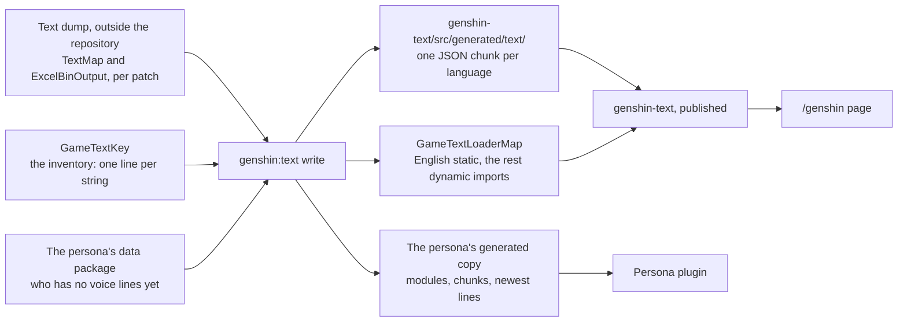
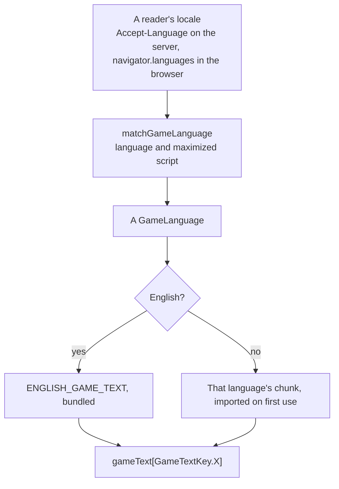

# Game text

The game already says most of what a recreation of it needs to say, in fifteen languages, and says it better than a translation of ours would. `genshin-text` is where those words live in the repository: the game's languages, a way to pick one for a reader, and every string of the game's that a consumer shows, looked up by the id the game itself files it under.

Nothing here is translated by hand. A string the game has is referenced, never written; a string it does not have is a consumer's own words, in a consumer's own localization (the persona plugin's modules, for instance) and not in this package.

## How it works

- **The source is a text dump outside the repository.** `GENSHIN_TEXT_DIRECTORY`, by default `text` under the parity directory, holds the game's text maps and the tables that point into them, laid out as the community dumps them each patch (`TextMap/TextMap<code>.json`, the medium maps beside them, and `ExcelBinOutput/`). It is a reference like every other the [derived assets](/docs/genshin/derived-assets) read, never committed. The installed client holds the same text as hash-named binary entries a dump decodes each patch, so the repository reads the decoded form.
- **The account kit's strings are the second source.** What the game shows as the player signs in, before it has loaded its text map, comes from HoYoverse's account kit, whose own table per language sits in its resource bundle beside the game (`MiHoYoSDKRes`). The first `write` that needs it exports the tables into the dump with AnimeStudio, refusing while the game runs, and reads them as references like the text map (`readSdkText`). The welcome card's greeting is the one key read there, its `%s` the player's name, placed where each language puts it.
- **`GameTextKey` is the inventory.** Each member's value is the game's own id for its string: the name the game's manual text map files an interface string under (`INFORMATION_AVATAR_BIRTHDAY`), the raw text hash where it names the string nothing, or the account kit's own key (`tips_enter_game`) for a string the kit shows, so a consumer cannot tell which source a string came from. Referencing a new string is one line there; the generator has no list of its own.
- **`pnpm -C scripts genshin:text find "<pattern>"` finds the id.** It searches the English text and prints each match's id beside it, named ids first, since an interface string is what a key is usually after.
- **`pnpm -C scripts genshin:text write` writes everything.** Every key in every language becomes one JSON chunk per language, and the loader map names them. A key a language's map lacks takes English's text there and the run says so, since a dump that lost a string is the dump's fault rather than a reason to ship none. Its output is never formatted, so a format pass over the tree leaves alone what it wrote.

### Looking a string up

A consumer resolves a language once, loads its chunk once, and indexes the result by key — a lookup is `gameText[GameTextKey.Loading]`, with nothing between the key and its string. English is the one chunk bundled with the package, as the text every other language shows until its own arrives, and each other language is a dynamic import of a chunk of its own, so a page downloads only the language it shows.

`matchGameLanguage` takes a reader's preference list, most preferred first, and returns the first game language that shares a tag's language and, once both are maximized through `Intl.Locale`, its script: `zh-TW` and `zh-HK` read Traditional Chinese and `zh-CN` Simplified, while `pt-BR` and `en-GB` take the one Portuguese and English the game ships. A tag that is not well formed is skipped rather than thrown on, since a header is anyone's to write, and English is the answer when nothing matches. `getAcceptLanguageTags` turns a header into that list by its quality weights.

### The /genshin page

The page resolves the reader's language on the server from the request's `Accept-Language` and hands the resolved language and its chunk to the client in the payload (`useGameText`), so the page hydrates in the language it rendered in. It hands the chunk to the opening as its `gameText` prop, a required one on every screen of the opening that shows a word, so the health notice, the login title, the account label and the status lines read in that language, and a screen a host forgets to give it fails to compile rather than falling back to English. The opening's container carries the language's tag, and its screen-reader status, read while the opening plays, is the game's own "Loading..." and "Ready" in that language.

### The persona plugin

The plugin is installed alone by a stranger's frozen `npm ci`, and every release of a sibling it depended on would move a range that lockfile would then disagree with ([persona plugin](/docs/infra/claude-interface/persona-plugin)). So `write` also copies the modules the plugin runs — the language enum, the tag map, the display name and the matcher of a typed name, the loader map and its chunks — into `src/generated/genshinText/`, re-aiming the package's `#src/` alias at the copy, and a test holds the copy byte for byte to what the source would produce. Beside the copy it writes, for every character the plugin's data package has no voice-over lines for yet, their lines in every language as one chunk per language, the source the plugin's spinner reads before a dependency bump carries them.

## Notes

- **The game's own words ship; nothing else of the game's does.** A string referenced here is text the game shows, carried as text, the way a recreation quotes the screen it recreates — no image, model, sound or file of the game's rides along with it, which [derived assets](/docs/genshin/derived-assets) keeps to.
- **Every word of the opening is the game's.** The text map carries what the opening shows before the client loads its data, the door's prompt worded per platform with the PC's form kept, and the account kit carries the welcome; only the server's name stays as recorded, since the game takes it from the server list it is sent.
- **A word per gender is filled once, for one twin.** Some languages spell the Traveler with a word per gender (`{M#…}` and `{F#…}`); `fillLinePlaceholders` keeps one twin's, which the persona fills from the twin it speaks as and the login screen from `LOGIN_TRAVELER_GENDER`.
- **The opening's English is the current build's.** The text map is the current client's, so the health notice reads its current wording rather than the older English recording's the notice's layout was measured against.
- **A non-Latin language falls back past the game's face.** HYWenHei and Signika are the faces the [interface library](/docs/genshin/interface-library) sets text in, and neither covers Chinese, Japanese, Korean or Thai, which a browser then draws in a system face. The visual suites and parity scoring compare the English client only.
- **The app's own interface is not translated.** What is the app's rather than the game's stays English, as the [internationalization](/docs/architecture/deferred/i18n) decision has it; this package translates only what the game itself says.

## Key files

| File                                                          | Role                                                                                  |
| :------------------------------------------------------------ | :------------------------------------------------------------------------------------ |
| `packages/genshin-text/src/models/GameLanguage.ts`            | The game's fifteen languages, spelt as the community data package spells them         |
| `packages/genshin-text/src/models/GameTextKey.ts`             | Every referenced string by the game's own text id: the inventory the generator reads  |
| `packages/genshin-text/src/services/GameLanguageTagMap.ts`    | The BCP-47 tag of each language, which `Intl` needs                                   |
| `packages/genshin-text/src/services/matchGameLanguage.ts`     | A reader's preference list to the nearest game language, English otherwise            |
| `packages/genshin-text/src/services/getAcceptLanguageTags.ts` | An `Accept-Language` header as tags, most preferred first                             |
| `packages/genshin-text/src/generated/GameTextLoaderMap.ts`    | English bundled, every other language a chunk imported on first use                   |
| `scripts/src/services/genshinText/writeGameText.ts`           | The generator: every key, every language, the persona's copy and its newest lines     |
| `scripts/src/services/genshinText/findGameText.ts`            | The ids of every English string a pattern matches                                     |
| `scripts/src/services/genshinText/readSdkText.ts`             | One language's account kit strings, exported from the installed game when first read  |
| `scripts/src/services/genshinText/getPlainGameText.ts`        | A text map string as the game shows it on a PC: markup, furigana and escapes resolved |
| `scripts/src/services/genshinText/getPersonaModuleSource.ts`  | A module of the package as the persona runs it, under the persona's own alias         |
| `apps/web/app/composables/genshin/useGameText.ts`             | The reader's language resolved on the server and its chunk handed over in the payload |

## Sources

- [AnimeGameData](https://gitlab.com/Dimbreath/AnimeGameData), the community's per-patch dump of the game's data: the layout the text dump directory follows — `TextMap/`, the medium maps, and `ExcelBinOutput/ManualTextMapConfigData.json` and `FettersExcelConfigData.json`, the tables naming interface strings and characters' voice-over lines.
