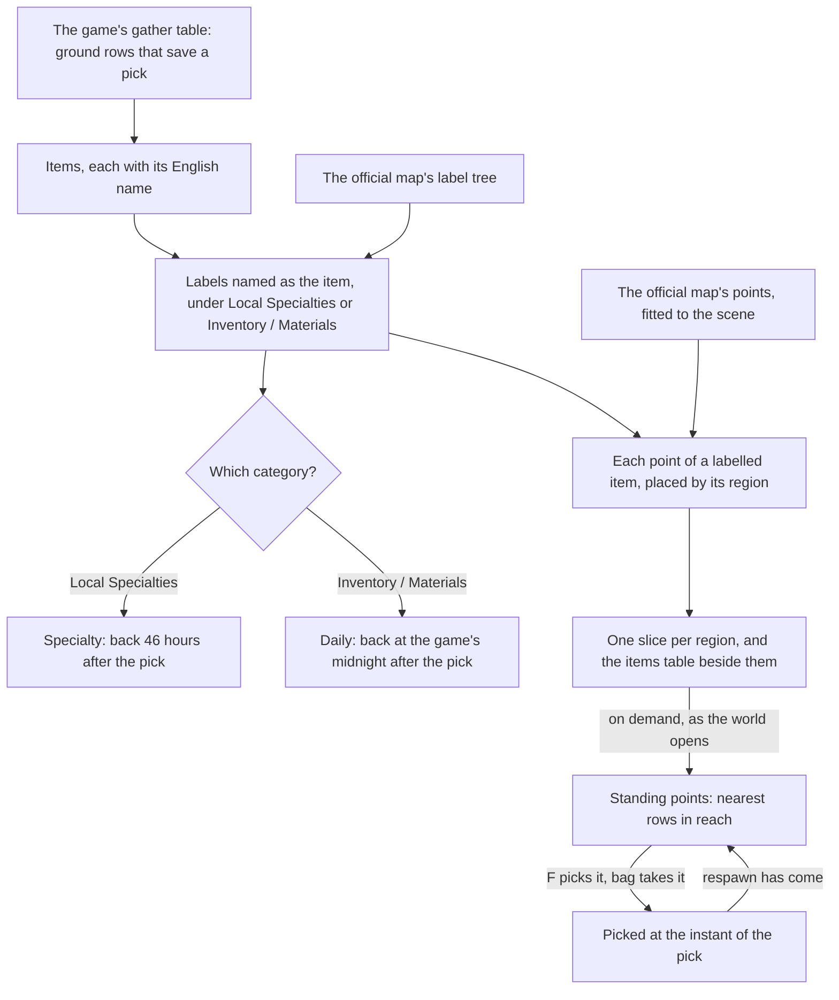

# Gathering

The plants and specialties of the open world are the gathering points the [proposal](/docs/proposals/genshin/gathering) describes: a point stands where the official map marks its item, and F picks it into the bag. This page is the first build of that proposal, covering the points of the two categories that are picked, Local Specialties and Inventory / Materials. Ores, which are struck until they break, mining outcrops and investigation spots are not built yet and stay in the proposal.

## How it works

## The read

`pnpm -C scripts genshin:assets gathering` writes the slices. It reads three tables from the game text dump, the gather table and the material table in `ExcelBinOutput/` and the English text map, and the official map's label tree and fitted points from the references folder. The gather table, which the dump lacked, is fetched from the community's AnimeGameData repository into the dump and never committed.

- **A row is picked off the ground.** A gather row counts when it sits on the ground and saves its pick. The rows that save nothing belong to other pages, such as fishing, animals and events, and are not points here.
- **An item is named as its label.** The item's English name is matched to the label of the same name the official map files under Local Specialties or Inventory / Materials. Ores are left out until they are struck, and Special Items, which holds the Oculi, is left to the statues' page.
- **Each point is the fit's.** Every point of a labelled item is carried into the game's coordinates by the [spawned places](/docs/genshin/spawned-places) fit, its kind the item's id, and its region from its map area. Points on layers under the ground are left out, as the places' writer already does.

## The respawn

The gather table's refresh ids do not name a policy in the dump. The ground rows that carry a refresh name ids the policy table lacks, and the rest carry none, so the policy cannot be read off the row. The category settles it instead, as the wiki gives each:

- **A local specialty comes back 46 hours after it is picked**, the wiki's own figure for specialties.
- **A cooking ingredient comes back at the game's midnight that follows the pick.** The wiki says the common overworld ingredients spawn at 0:00 server time each day, and a picked point is read as back at the next such midnight. The game's time zone is UTC+8, as the [Original Resin](/docs/genshin/original-resin) page reads it.

A point is kept as picked with the instant of the pick, and stands again once its respawn has come. Nothing runs while the page is closed: each look at the clock compares the instant with its respawn, and the page's clock looks once a minute while it is open.

## The pick

F on a gathering point's row picks one of its item into the bag, through the same `addInventoryItem` a drop uses. The point is kept as picked only when the bag takes the item, so a full bag leaves it standing. The picked points are kept for the page's life only, as the drops are.

## Key files

| File                                                                             | Role                                                           |
| :------------------------------------------------------------------------------- | :------------------------------------------------------------- |
| `scripts/src/services/genshinAssets/gathering/readGatheringItems.ts`             | The items the gather table picks, matched to their map labels  |
| `scripts/src/services/genshinAssets/gathering/writeGatheringPlaces.ts`           | Each region's points written as a slice, and the items table   |
| `scripts/src/services/genshinAssets/gathering/constants.ts`                      | The categories, their respawns and the generated folder        |
| `packages/genshin-world/src/services/gathering/computeGatheringRespawn.ts`       | The instant a picked point is back                             |
| `packages/genshin-world/src/services/gathering/checkIsGatheringPlaceStanding.ts` | Whether a point stands at an instant                           |
| `packages/genshin-world/src/composables/useGatheringPoints.ts`                   | Mondstadt's points and items, read as the world opens          |
| `packages/genshin-world/src/services/inventory/toItemDefinition.ts`              | An item's definition from its materials row, shared with drops |
| `packages/genshin-world/src/components/World/Screen/Index.vue`                   | Rows for the standing points, and a pick into the bag          |
| `packages/genshin-world/src/generated/gathering/`                                | The per-region slices and the items table                      |

## Notes

- **Four cooking ingredients and one specialty are left out.** Apple, Starshroom, Bulle Fruit and Candlecap Mushroom are typed as a notice-restoring material the world's material type does not name yet, and Rukkhashava Mushrooms has its map label in the singular. Each is one line to add when its type or name lands.
- **The stand-ins are the drops' stand-ins, and they cap at 64.** The world draws each PickUp row as a sphere up to the stand-in capacity, in list order, so most of Mondstadt's roughly two thousand points are not drawn yet. Prompts still come from every standing point in reach. A distance cull of the stand-ins is the open part.
- **The respawns are the wiki's, not measured.** The 46 hours is the wiki's figure, and the midnight is the wiki's reading of the daily spawn. Both wait on a recording of a point picked and watched (see the [roadmap](/docs/genshin/roadmap)).

## Sources

- [Local Specialty](https://genshin-impact.fandom.com/wiki/Local_Specialty), Genshin Impact Wiki: a harvested specialty respawns after 46 hours.
- [Reset](https://genshin-impact.fandom.com/wiki/Reset), Genshin Impact Wiki: the daily reset at 04:00 server time, and the overworld Iron Chunk and common cooking ingredients spawning at 0:00 server time, four hours before it.
- [AnimeGameData](https://github.com/DimbreathBot/AnimeGameData), the community's per-patch dump: `GatherExcelConfigData` and `MaterialExcelConfigData`, the tables the items and their ground rows are read from.
- [Teyvat Interactive Map](https://act.hoyolab.com/ys/app/interactive-map/index.html), HoYoLAB: the official map's labels and points that the places are fitted from.
